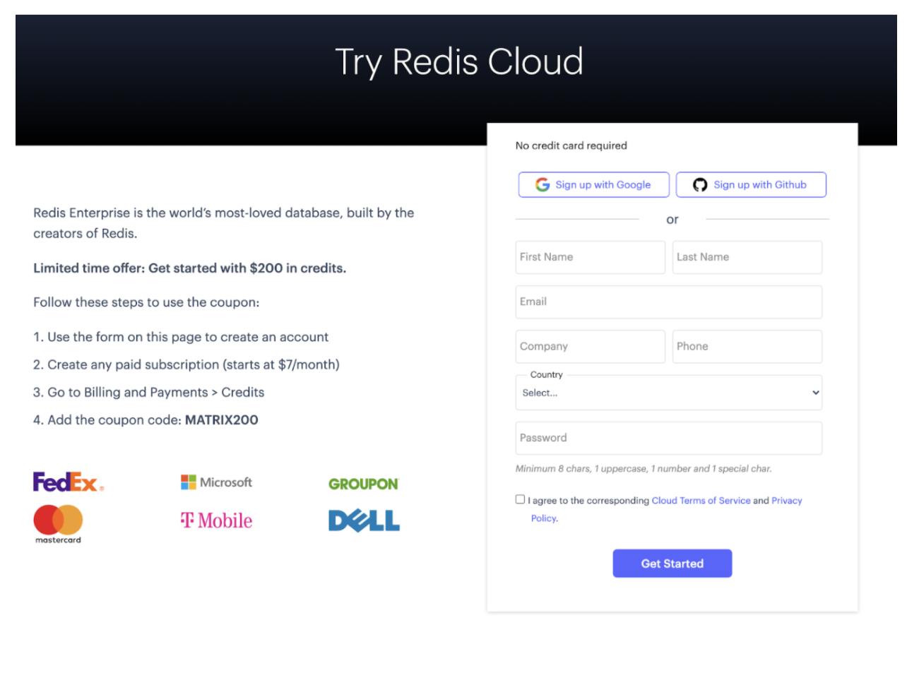

An interactive analytics dashboard serves several purposes. They allow you to share data and provide you with all those vital information to make game-changing decisions at a faster pace. Building a real-time dynamic dashboard using a traditional relational database might require a complex set of queries. By using a NoSQL database like Redis, you can build a powerful interactive and dynamic dashboard with a small number of Redis commands. 

Let’s take a look at how this was achieved. 


- What will you build?
- What will you need?
- Getting started
- How does it work?
- How data is stored
- Navigating the application


### What will you build?

You’ll build an analytics dashboard app that uses Redis Bitmap written in NodeJS (JavaScript) and then deploy it to AWS

Ready to get started? Ok, let’s dive straight in.


### What will you need?

- [NodeJS](https://developer.redis.com/develop/node): used as an open-source, cross-platform, backend JavaScript runtime environment that executes Javascript code outside a web browser.
- [Redis Enterprise Cloud](https://developer.redis.com/create/rediscloud): used as a real-time database, cache, and message broker.i
- [NPM](https://www.npmjs.com/): used as a package manager. It allows you to build node apps.

### Getting Started

### Prepare the environment

- Install Node - v12.19.0
- Install NPM - v6.14.8


### Step 1. Sign up for a Free Redis Enterprise Cloud Account

[Follow this tutorial](https://developer.redis.com/create/aws/redis-on-aws) to sign up for a free Redis Enterprise Cloud account.



Choose AWS as a Cloud vendor while creating your new subscription. At the end of the database creation process, you will get a Redis Enterprise CLoud database endpoint and password. You can save it for later use.


### Step 2. Clone the repository

  ```bash
   git clone https://github.com/redis-developer/basic-analytics-dashboard-redis-bitmaps-nodejs
  ```


### Step 3. Set up a backend environment


First we will be settin up environmental variables

Go to /server folder (cd ./server) and then execute the below command:

  ```bash
   cp .env.example .env
  ```

Open .env file and add Redis Enterprise Cloud Database Endpoint URL, port and password as shown below:

```

PORT=3000

# Host and a port. Can be with `redis://` or without.
# Host and a port encoded in redis uri take precedence over other environment variable.
# preferable
REDIS_ENDPOINT_URI=redis://redis-XXXX.c212.ap-south-1-1.ec2.cloud.redislabs.com:15564

# Or you can set it here (ie. for docker development)
REDIS_HOST=redis-XXXX.c212.ap-south-1-1.ec2.cloud.redislabs.com
REDIS_PORT=XXXX

# You can set password here
REDIS_PASSWORD=reXXX

COMPOSE_PROJECT_NAME=redis-analytics-bitmaps
```


### Step 4. Install dependencies

  ```bash
   npm install
  ```


### Step 5. Run the backend

  ```bash
   npm run dev
  ```

### Step 6. Set up the frontend environment

Go to /client folder (cd ./client) and then:

  ```bash
   cp .env.example .env
  ```

Add the exact URL path and port number of your choice for VUE_APP_API_URL parameter as shown below:

```
VUE_APP_API_URL=http://localhost:3000
```


### Step 7.  Install dependencies

  ```bash
   npm install
  ```

### Step 8. Run the frontend

  ```bash
   npm run serve
  ```


### How does it work?

#### How the data is stored:

The event data is stored in various keys and data types which is discussed below:

##### For each of time spans:

- year: like 2021
- month: like 2021-03 (means March of 2021)
- day: like 2021-03-03 (means 3rd March of 2021)
- weekOfMonth: like 2021-03/4 (means 4th week of March 2021)
- anytime

##### For each of scopes:

- source
- action
- source + action
- action + page
- userId + action
- global

##### For each of data types/types:

- count (Integer stored as String)
- bitmap
- set

It generates key like: 


  ```bash
   rab:{type}[:custom:{customName}][:user:{userId}][:source:{source}][:action:{action}][:page:{page}]:timeSpan:{timeSpan}
  ```

where values in [] are optional.

For each generated key like ```rab:count:*```, data is stored like: ```INCR {key}```

##### Example:

  ```bash
   INCR rab:count:action:addToCart:timeSpan:2015-12/3
  ```

For each generated key like: ```rab:set:*```, data is stored like: 


  ```bash
   SADD {key} {userId}
  ```

##### Example:

  ```bash
   SADD rab:set:action:addToCart:timeSpan:2015-12/3 8
  ```
- For each generated key like ```rab:bitmap:*```, data is stored like: 

  ```bash
   SETBIT {key} {userId} 1
  ```

##### Example:

  ```bash
   SETBIT rab:bitmap:action:addToCart:timeSpan:2015-12/3 8 1
  ```
### Cohort data

- We store users who register and then bought some products (action order matters).
- For each buy action in December we check if user performed register action before (register counter must be greater than zero).
- If so, we set user bit to 1

##### Example 

 ```
   SETBIT rab:bitmap:custom:cohort-buy:timeSpan:{timeSpan} {userId} 1
 ```
- Example - User Id 2 bought 2 products on 2015-12-17. It won't be stored.
- Example -  User Id 10 bought 1 product on 2015-12-17 and registered on 2015-12-16. 
So, it will be stored like: 

 ```bash
  SETBIT rab:bitmap:custom:cohort-buy:timeSpan:2015-12 10 1
 ````

- We assume that user cannot buy without register.

#### Retention data

- Retention means users who bought on two different dates
- For each buy action we check if user bought more products anytime than bought on particular day (current purchase not included).
- If so, we add user id to set like: 

   ```bash
    SADD rab:set:custom:retention-buy:timeSpan:{timeSpan} {userId}
   ```

- Example -  User Id 5 bought 3 products on 2015-12-15. His retention won't be stored (products bought on particular day: 2, products bought anytime: 0).
- Example - User Id 3 bought 1 product on 2015-12-15 and before - 1 product on 2015-12-13. His retention will be stored (products bought on particular day: 0, products bought anytime: 1) like: 

 ```bash
  SADD rab:set:custom:retention-buy:timeSpan:2015-12
 ```
### How the data is accessed:

#### Total Traffic:

##### December: 

  ```bash
    BITCOUNT rab:bitmap:custom:global:timeSpan:2015-12```
  ```

##### X week of December: 

   ```bash
     BITCOUNT rab:bitmap:custom:global:timeSpan:2015-12/{X}
   ```
##### Example:

  ```bash
   BITCOUNT rab:bitmap:custom:global:timeSpan:2015-12/3
  ````

#### Traffic per Page ({page} is one of: homepage, product1, product2, product3):

  
##### December: 

  ```bash
   BITCOUNT rab:bitmap:action:visit:page:{page}:timeSpan:2015-12
  ```

##### Example:

  ```bash
   BITCOUNT rab:bitmap:action:visit:page:homepage:timeSpan:2015-12
  ```

#####   X week of December: 

   ```bash
    BITCOUNT rab:bitmap:action:visit:page:{page}:timeSpan:2015-12/{X}
   ```

##### Example:

  ```bash
   BITCOUNT rab:bitmap:action:visit:page:product1:timeSpan:2015-12/2
  ```

#### Traffic per Source ({source} is one of: google, Facebook, email, direct, referral, none):

##### December: 

   ```bash
    BITCOUNT rab:bitmap:source:{source}:timeSpan:2015-12
   ```

##### Example:

  ```bash
   BITCOUNT rab:bitmap:source:referral:timeSpan:2015-12
  ```

#####  X week of December: 

    ```bash
     BITCOUNT rab:bitmap:source:{source}:timeSpan:2015-12/{X}
    ```
##### Example:

  ```bash
   BITCOUNT rab:bitmap:source:google:timeSpan:2015-12/1
  ```

##### Trend traffic ({page} is one of: homepage, product1, product2, product3):

#####  December: 

From 

   ```bash
    BITCOUNT rab:bitmap:action:visit:{page}:timeSpan:2015-12-01
   ``` 

to 

   ```bash
    BITCOUNT rab:bitmap:action:visit:{page}:timeSpan:2015-12-31
   ``` 

- 1 Week of December: Similar as above, but from 2015-12-01 to 2015-12-07
- 2 Week of December: Similar as above, but from 2015-12-08 to 2015-12-14
- 3 Week of December: Similar as above, but from 2015-12-15 to 2015-12-21
- 4 Week of December: Similar as above, but from 2015-12-22 to 2015-12-28
- 5 Week of December: Similar as above, but from 2015-12-29 to 2015-12-31

##### Example:

   ```bash
    BITCOUNT rab:bitmap:action:visit:homepage:timeSpan:2015-12-29 => BITCOUNT rab:bitmap:action:visit:homepage:timeSpan:2015-12-30 => BITCOUNT rab:bitmap:action:visit:homepage:timeSpan:2015-12-31
   ```

####  Total products bought:

##### December: 

   ```bash
    GET rab:count:action:buy:timeSpan:2015-12
   ```
#####  X week of December: 

   ```bash
    GET rab:count:action:buy:timeSpan:2015-12/{X}
   ```
##### Example:

  ```bash
   GET rab:count:action:buy:timeSpan:2015-12/1
  ```
####  Total products added to cart:

##### December: 

  ```bash
   GET rab:count:action:addToCart:timeSpan:2015-12
  ````

##### X week of December:
    
   ```bash
    GET rab:count:action:addToCart:timeSpan:2015-12/{X}
   ```

##### Example:

  ```bash
   GET rab:count:action:addToCart:timeSpan:2015-12/1
  ```

##### Shares of products bought ({productPage} for product1, product2, product3):

#### December: 

  ```bash
   GET rab:count:action:buy:page:{productPage}:timeSpan:2015-12
  ```
##### Example:

  ```bash
   GET rab:count:action:buy:page:product3:timeSpan:2015-12
  ```

##### X week of December: 

    ```bash
     GET rab:count:action:buy:page:{productPage}:timeSpan:2015-12/{X}
    ```
##### Example:

  ```bash
   GET rab:count:action:buy:page:product1:timeSpan:2015-12/2
  ```

#### Customer and Cohort Analysis

- People who registered: BITCOUNT rab:bitmap:action:register:timeSpan:2015-12
- People who register then bought (order matters): BITCOUNT rab:bitmap:custom:cohort-buy:timeSpan:2015-12
- Dropoff: (People who register then bought / People who register) * 100 [%]
- Customers who bought only specified product ({productPage} is one of: product1, product2, product3): 

  ```bash
   SMEMBERS rab:set:action:buy:page:{productPage}:timeSpan:2015-12
  ```

##### Example:

  ```bash
   SMEMBERS rab:set:action:buy:page:product2:timeSpan:2015-12
  ```

####  Customers who bought Product1 and Product2: 

   ```
    SINTER rab:set:action:buy:page:product1:timeSpan:anytime rab:set:action:buy:page:product2:timeSpan:anytime
   ```

#### Customer Retention (customers who bought on the different dates): 

   ```bash
    SMEMBERS rab:set:custom:retention-buy:timeSpan:anytime
   ```

### References

- [Project Source Code](https://github.com/redis-developer/basic-analytics-dashboard-redis-bitmaps-nodejs)
- [Use cases of Bitmaps](https://redis.io/topics/data-types-intro)
- [How to Build a Slack Bot to Retrieve Lost Files Using AWS S3 and RediSearch](/create/aws/slackbot)
- [How to Deploy and Manage Redis Database on AWS Using Terraform](/create/aws/terraform)
