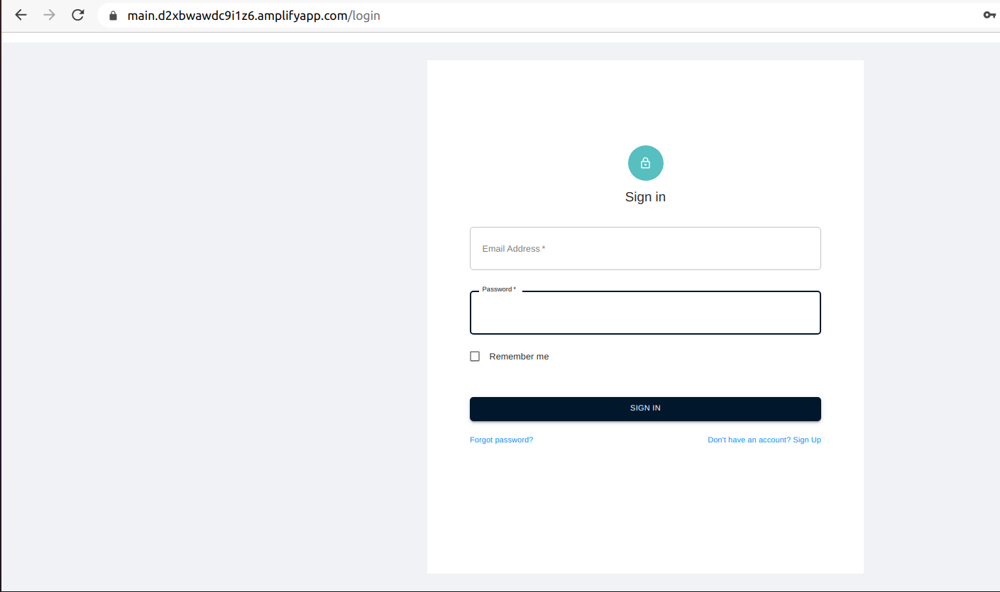
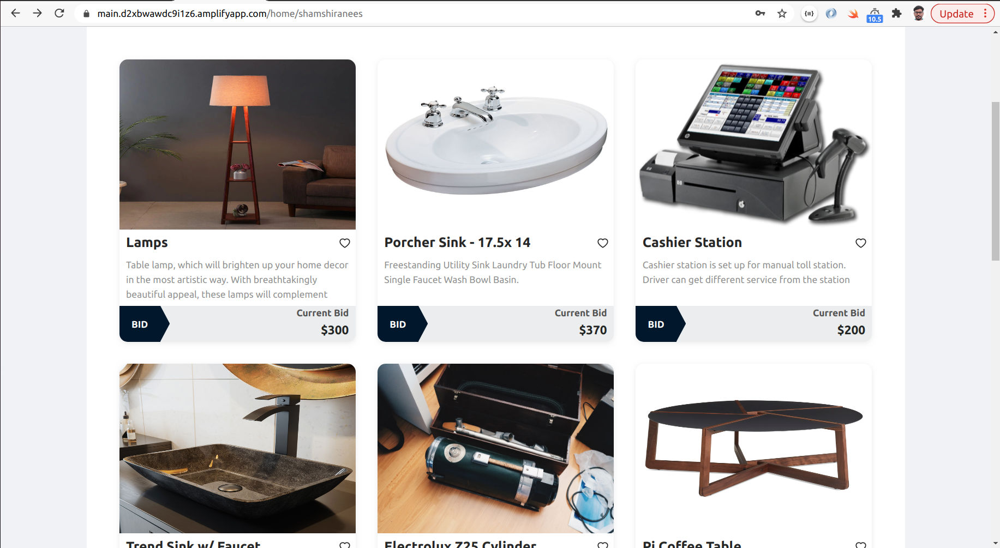
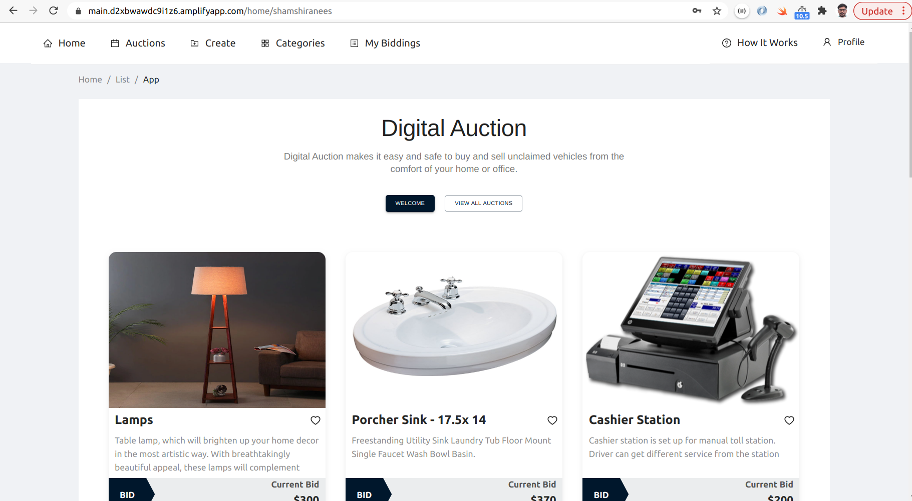
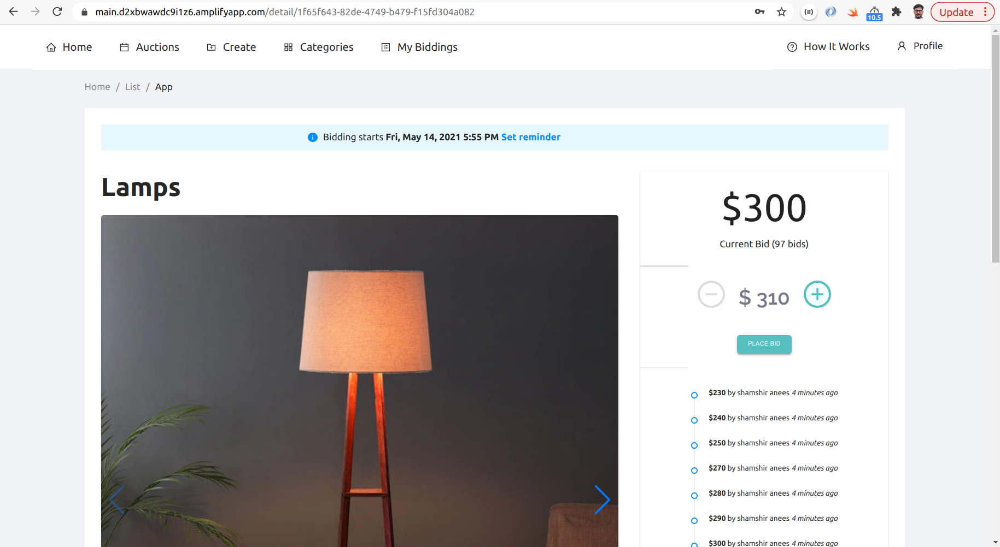
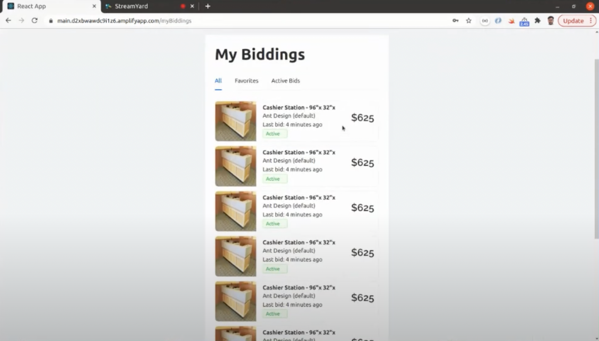

import Authors from '@site/src/theme/Authors';

<Authors frontMatter={frontMatter} />

Digital technology has propelled us forward to an exciting new era and has transformed almost every aspect of life. We’re more interconnected than ever as communication has become instant. Working from home has now become the norm, helping us pivot to a new way of working during the pandemic. And our ability to reduce carbon emissions by attending work-related events online has meant that we’ve taken greater strides to combat global warming. Continuing this trend is [Shamshir Anees and his team](https://github.com/shamshiranees), who have created an application that can host digital auctions. By using Redis, data transmission between components was carried out with maximum efficiency, providing users with real-time bidding updates on the dashboard.

Let’s take a look at how this was achieved. We’d also like to point out that we have a diverse range of exciting applications for you to check out on the [Redis Launchpad](https://launchpad.redis.com).

- What will you build?
- What will you need?
- Architecture
- How does it work?
- Getting started
- How data is stored
- Navigating the application

### What will you build?

You’ll build an application that will allow users to attend and take part in digital auctions. The application will allow users to create an account, put in bids, and even set up their own auction. Below we’ll uncover the required components, their functionality, and how to deploy them within this architecture.

Ready to get started? Ok, let’s dive straight in.

### What will you need?

- [NodeJS](https://developer.redis.com/develop/node): used as an open-source, cross-platform, backend JavaScript runtime environment that executes Javascript code outside a web browser.
- [Amazon Cognito](https://aws.amazon.com/cognito/): used to securely manage and synchronize app data for users on mobile.
- [Redis Enterprise Cloud](https://developer.redis.com/create/rediscloud): used as a real-time database, cache, and message broker.
- [RedisJSON](https://developer.redis.com/howtos/redisjson/getting-started): used to store, update and fetch JSON values from Redis.
- [Socket.IO](https://socket.io/): used as a library that provides real-time, bi-directional, and event-based communication between the browser and the server.
- [AWS Lambda](https://aws.amazon.com/lambda/): used as a serverless compute service that runs your code in response events and manages the underlying compute service automatically for you.
- [Amazon SNS/Amazon SES](https://aws.amazon.com/sns/): a fully managed messaging service for both application-to-application (A2A) and application-to-person (A2P) communication.

### Architecture


### How does it work?

#### All auctions

NodeJS connects to the Redis Enterprise Cloud database.

The frontend then communicates with the NodeJS backend through API calls.

`GET : /api/auctions` fetches all the keys from Auctions Hash.

NodeJS uses the Redis module to work with Redis Enterprise Cloud. The Redis client is then created using the Redis credentials and hmget(). This is the equivalent of the HMSET command that’s used to push data to the Redis database.

#### Each auction

`GET : /api/auctions/{auctionId}` fetches each auction item by id.

NodeJS uses the Redis module to work with Redis Cloud. The Redis client is then created using the Redis credentials and hmget(). This is the equivalent of the HMSET command that’s used to push data to the Redis database.

All bidding data of an auction item

`GET : /api/bidding/{auctionId}`

NodeJS uses the Redis module to work with Redis Cloud. The Redis client is then created using the Redis credentials and hmget(). This is the equivalent of the HMSET command that’s used to push data to the Redis database.

#### Profile settings

`GET : /api/settings`

NodeJS uses the Redis module to work with Redis Cloud. The Redis client is then created using the Redis credentials and hmget(). This is the equivalent of the HMSET command that’s used to push data to the Redis database.

#### User info

`GET : /api/users/{email}`

NodeJS uses the Redis module to work with Redis Cloud. The Redis client is then created using the Redis credentials and hmget(). This is the equivalent of the HMSET command that’s used to push data to the Redis database.

### Getting started

### Prerequisites

- [NodeJS](https://nodejs.org/en/)
- [NPM](https://www.npmjs.com/)

### Step 1. Sign up for a Free Redis Enterprise Cloud Account

[Follow this tutorial](https://developer.redis.com/create/aws/redis-on-aws) to sign up for a free Redis Enterprise Cloud account.


Choose AWS as a Cloud vendor while creating your new subscription. At the end of the database creation process, you will get a Redis Enterprise CLoud database endpoint and password. You can save it for later use.


### Step 2: Clone the backend GitHub repository

```
https://github.com/redis-developer/NR-digital-auction-backend
```

### Step 3. Install the package dependencies

The 'npm install' is a npm cli-command that does the predefined thing i.e install dependencies specified inside package.json

```
npm install
```

### Step 4. Setting up environment variables

```
export REDIS_END_POINT=XXXX
export REDIS_PASSWORD=XXX
export REDIS_PORT=XXX
```

### Step 5. Building the application

```
npm run build
```

### Step 6. Starting the application

```
npm start
```

### Step 7. Cloning the Frontend GITHUB repository

```
git clone https://github.com/redis-developer/NR-digital-auction-frontend
```

### Step 8. Building the application

```
npm run build
```

### Step 9. Starting the application

```
npm start
```

### Step 10. Accessing the application


### Step 11. Signing up to the application


### Step 12. Sign-in



### Step 13. Accessing the dashboard


### Step 14. Listing the auction item



### Step 15. Accessing the bidding page


### How data is stored

The Redis Enterprise Cloud Database with RedisJSON module is what you’ll use to install the data.

### Auctions

- Type - Redis Hash.
- Used for storing auctions data.
- UUID generated from the backend (NodeJS) serves as the key
- JSON data which represents the Auction object and includes the following keys
  - auctionId
  - auctionItemName
  - description
  - lotNo
  - quantity
  - buyersPremium
  - itemUnit
  - minBidAmount
  - bidIncrement
  - startDateTime
  - endDateTime
  - images
  - currentBid
- NodeJS connects to the Redis Cloud database. The Frontend communicates with the NodeJS backend through API calls.
- POST : /api/auctions.
- The request body has JSON data to be inserted into the database.
- NodeJS uses the Redis module to work with Redis Cloud. The Redis client is created. using the Redis credentials and hmset(). This is the equivalent of the HMSET command that’s used to push data to the Redis database.

### Biddings

- Type - Redis Hash
- Used for storing the bids placed on each auction item
- NodeJS connects to the Redis Cloud database. The Frontend communicates with the NodeJS backend through API calls.
- POST : `/api/bidding`
- The request body has JSON data to be inserted into the database.
- AuctionId from request body serves as the key
- JSON data which includes keys:

  - currentBid
  - currentBidTime
  - currentBidEndTime, and
  - biddings array (id, auctionId, userId, username, bidAmount, bidTime)

- The bidding array has all of the bids placed for a particular auction item.
- Based on the current BidEndTime and BidTime, the auction end date is extended based on the Dynamic closing concept.
- Current dynamic closing logic - If a new bid is placed within the last 5 minutes of the auction end time, the end time is extended by 1 hour.
- This will be configurable in the SaaS solution.
- NodeJS uses the Redis module to work with Redis Cloud. The Redis client is created using the Redis credentials and hmset(). This is the equivalent of the HMSET command that’s used to push data to the Redis database.

### Profile Settings

- Type - string
- JSON data which includes keys - serves as a value
- NodeJS connects to the Redis Cloud database. The frontend communicates with the NodeJS backend through API calls.
- POST : `/api/settings`
- The request body has JSON data to be inserted into the database.
- NodeJS uses the Redis module to work with Redis Cloud. The Redis client is created using the Redis credentials and hmset(). This is the equivalent of the HMSET command that’s used to push data to the Redis database.

### Users

- Type - Redis Hash
- Used for storing user details
- NodeJS connects to the Redis Cloud database. The Frontend communicates with the NodeJS backend through API calls.
- POST : `/api/users`
- The request body has JSON data to be inserted into the database
- The email id serves as the key
- The JSON data which includes keys - serves as a value
- NodeJS uses the Redis module to work with Redis Cloud. The Redis client is created using the Redis credentials and hmset(). This is the equivalent of the HMSET command that’s used to push data to the Redis database.

### Navigating the application

### Creating an account

When you go onto the Digital Auction’s homepage, you’ll come across a range of items that are to be auctioned (see below). Click on the ‘Welcome’ button to create an account.



You’ll then be taken to the sign-up page. Enter your details and click ‘sign-up.’ Once you’ve completed the sign-up form, you’ll receive a confirmation email to activate your account.

### Placing a bid

Go to the homepage to have access to view all of the items and their auction details. All of the data here is being populated by RedisJSON and Redis Cloud. Scroll through the page and click on the item that you want to place a bid for.


When you click on an item, you’ll see the details for the bidding process at the top of the page. You’ll also have the option to set a reminder by receiving an email of whenever the bidding process of this item begins.

On the right-hand side of the image, you’ll see the highest bid that’s been placed for this item. Below is a list of previous bids made by different users which are updated in real-time.

Click on the ‘Place Bid’ button to make a bid.

To access the meta-data information or view more images of the item, simply scroll down the page (see below).



### Viewing your Bidding History

Click on ‘My biddings’ at the top of the navigation bar to view your bidding history (see below).


### Viewing upcoming auctions

Click on ‘Auctions’ at the top of the navigation bar to view all upcoming auctions.



### Conclusion: Leveraging Redis and AWS to Empower Auctioneers with Real-time Data

Digital technology has had a ripple effect across all aspects of modern life. The ability to complete important tasks online instead of in-person has revolutionized the way we live, helping us to reduce carbon emissions, save time from traveling and have instant access to reams worth of data that we never had before.

However, the success of such events hinges on a database’s ability to transmit data in real-time. Any blips in transmission would create a disconnect between users and the auction, impeding auctioneers’ reactions to bids. This would only result in frustration, disengagement, and a complete divorce of users from the application.

But thanks to Redis, the components that made up the architecture system became vastly more interconnected so data was able to be sent, processed, and received in real-time. Achieving this paves the way for a smooth bidding process where users can interact with events in real-time without interruptions, ultimately enhancing the functionality of the app.

[NR-Digital-Auction](https://launchpad.redis.com/?id=project%3ANR-digital-auction-frontend) is a fantastic example of how innovations can be brought to life by using Redis. Everyday programmers are experimenting with Redis to build applications that are impacting everyday life from around the world and you can too!

So what can you build with Redis? For more inspiration, you can head over to the [Redis Launchpad](https://launchpad.redis.com/) to access an exciting range of applications. If you're ready to get started building, quickly spin up a free database [Redis Enterprise](https://redis.com/try-free/).
