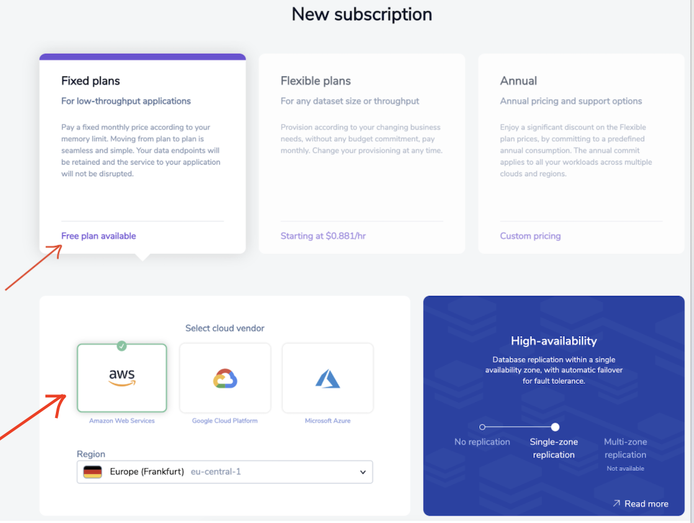

import Authors from '@theme/Authors';

<Authors frontMatter={frontMatter} />

Redis Enterprise Cloud on AWS is a fully Managed Redis Enterprise as a service. Designed for modern distributed applications, Redis Enterprise Cloud on AWS is known for its high performance, infinite scalability and true high availability.

Follow the below steps to setup Redis Enterprise Cloud hosted over AWS Cloud:

### Step 1. Create free cloud account

Create your free <a href="https://redis.com/try-free/" target="_blank" rel="noopener">Redis Enterprise Cloud account</a>. Once you click on “Get Started”, you will receive an email with a link to activate your account and complete your signup process.

:::tip
For a limited time, use **TIGER200** to get **$200** credits on Redis Enterprise Cloud and try all the advanced capabilities!

:tada: [Click here to sign up](https://redis.com/try-free)

:::

### Step 2. Create Your subscription

Next, you will have to create Redis Enterprise Cloud subscription. In the Redis Enterprise Cloud menu, click "Create your Subscription".

### Step 3. Select the right Subscription Plan

Select "Fixed Plan" for low throughout application as for now.

### Step 4. Select cloud vendor

For the cloud provider, select your preferred cloud (for demo purpose)

### Step 5. Click "Create Subscription"

Finally, click on "Create Subscription" button.

You can now verify the subscription as shown below:

### Step 6. Create database

Click "Create Database". Enter database name and your preferred module.

### Step 7. Launch database

Click "Activate" and wait for few seconds till it gets activated. Once fully activated, you will see the database endpoints as shown below:

### Next Steps

- [Connecting to the database using RedisInsight](/explore/redisinsight/)
- [How to list & search Movies database using Redisearch](/howtos/moviesdatabase/getting-started/)

##

  

