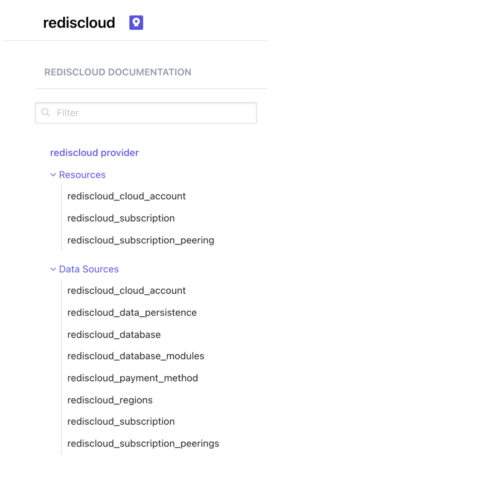
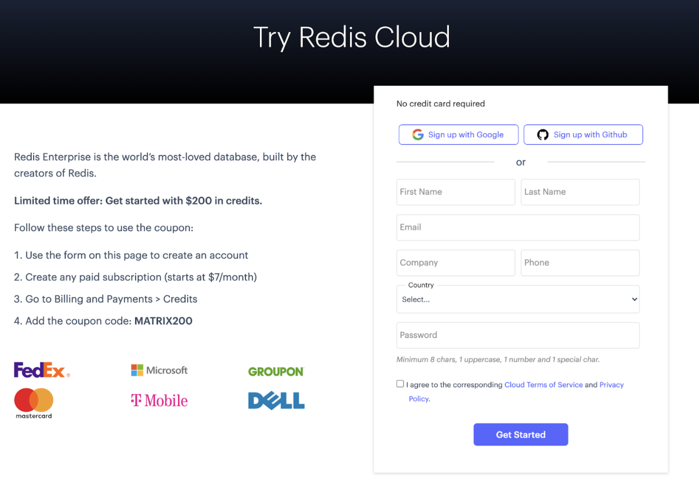
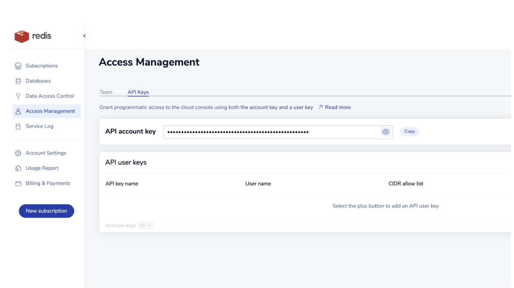

import Authors from '@theme/Authors';

<Authors frontMatter={frontMatter} />


Development teams today are embracing more and more DevOps principles, such as continuous integration and continuous delivery (CI/CD). Therefore, the need to manage infrastructure-as-code (IaC) has become an essential capability for any cloud service. IaC tools allow you to manage infrastructure with configuration files rather than through a graphical user interface. IaC allows you to build, change, and manage your infrastructure in a safe, consistent, and repeatable way by defining resource configurations that you can version, reuse, and share.
A leading tool in the IaC is HashiCorp Terraform, which supports the major cloud providers and services with its providers and modules cloud infrastructure automation ecosystem for provisioning, compliance, and management of any cloud, infrastructure, and service.

### What is Terraform?

Terraform is an open source IaC software tool that provides a consistent CLI workflow to manage hundreds of cloud services. Terraform codifies cloud APIs into declarative configuration files, which can then be shared amongst team members, treated as code, edited, reviewed, and versioned. It enables you to safely and predictably create, change, and improve infrastructure.

### Capabilities of Terraform

- Terraform is not just a configuration management tool. It also focuses on the higher-level abstraction of the data center and associated services, while allowing you to use configuration management tools on individual systems.
- It supports multiple cloud providers, such as AWS, GCP, Azure, DigitalOcean, etc.
- It provides a single unified syntax, instead of requiring operators to use independent and non-interoperable tools for each platform and service.
- Manages both existing service providers and custom in-house solutions.
- Terraform is easily portable to any other provider.
- Provides immutable infrastructure where configuration changes smoothly.
- Supports client-only architecture, so no need for additional configuration management on a server.
- Terraform is very flexible, using a plugin-based model to support providers and provisioners, giving it the ability to support almost any service that exposes APIs.
- It is not intended to give low-level programmatic access to providers, but instead provides a high-level syntax for describing how cloud resources and services should be created, provisioned, and combined.
- It provides a simple, unified syntax, allowing almost any resource to be managed without learning new tooling.

### The HashiCorp Terraform Redis Enterprise Cloud provider

Redis has developed a Terraform provider for Redis Enterprise Cloud. The HashiCorp Terraform Redis Enterprise Cloud provider allows customers to deploy and manage Redis Enterprise Cloud subscriptions, databases, and network peering easily as code, on any cloud provider. It is a plugin for Terraform that allows Redis Enterprise Cloud Flexible customers to manage the full life cycle of their subscriptions and related Redis databases.
The Redis Enterprise Cloud provider is used to interact with the resources supported by Redis Enterprise Cloud. The provider needs to be configured with the proper credentials before it can be used. Use the navigation to the left to read about the available provider resources and data sources.



Before we jump into the implementation, let us take a moment to better understand the Terraform configuration. A Terraform configuration is a complete document in the Terraform language that tells Terraform how to manage a given collection of infrastructure. A configuration can consist of multiple files and directories. Terraform is broken down into three main components:

- Providers
- Data sources
- Resources

### Providers

A provider is the first resource that will need to be defined in any project under the Terraform configuration file. The provider gives you access to the API you will be interacting with to create resources. Once the provider has been configured and authenticated, a vast amount of resources are now available to be created. Terraform has more than 100+ cloud providers it serves.
A provider defines resources and data for a particular infrastructure, such as AWS. As shown below, the terraform block {} contains terraform settings, including the required providers Terraform will use to provision your infrastructure (for example, rediscloud provider).

```
 terraform {
 required_providers {
  rediscloud = {
    source = "RedisLabs/rediscloud"
    version = "0.2.2"
  }
 }
 }
```

The provider {} block configures the specific provider. In the below example, it is AWS.

```
 cloud_provider {

   provider = "AWS"
   cloud_account_id = 1
   region {
     region = "us-east-1"
     networking_deployment_cidr = "10.0.0.0/24"
     preferred_availability_zones = ["us-east-1a"]
   }
 }
```

### Resources

Resources are the most important element in the Terraform language. This is where you describe the piece of infrastructure to be created, and this can range from a compute instance to defining specific permissions and much more.

As shown below, the resource {} block is used to define components of your infrastructure. A resource might be a physical or virtual component, such as EC2, or it could be a logical component, such as a Heroku application.

```
 resource "random_password" "passwords" {
 count = 2
 length = 20
 upper = true
 lower = true
 number = true
}
```

The resource {} block has two strings before the block: resource types and resource names. The prefix of the type maps to the name of the provider. For example, the resource type “random_password” and the resource name “passwords” form a unique identifier of the resource. Terraform uses this ID to identify the resource.

### Data sources

Data sources allow Terraform to use information defined outside of Terraform, defined by another separate Terraform configuration, or modified by functions. Each provider may offer data sources alongside its set of resource types. A data source is accessed via a special kind of resource known as a data resource, declared using a data block.

```
 data "rediscloud_payment_method" "card" {
 card_type = "Visa"
 last_four_numbers = "XXXX"
 }
```

A data block requests that Terraform read from a given data source ("rediscloud_payment_method") and export the result under the given local name ("card"). The name is used to refer to this resource from elsewhere in the same Terraform module, but has no significance outside of the scope of a module.
Within the block body (between { and }) are query constraints defined by the data source. Most arguments in this section depend on the data source, and indeed in this example card_type and last_four_numbers are all arguments defined specifically for the rediscloud_payment_method data source.

### Configure Redis Enterprise Cloud programmatic access

In order to set up authentication with the Redis Enterprise Cloud provider, a programmatic API key must be generated for Redis Enterprise Cloud. The Redis Enterprise Cloud documentation contains the most up-to-date instructions for creating and managing your key(s) and IP access.

:::note

Flexible and Annual Redis Enterprise Cloud subscriptions can leverage a RESTful API that permits operations against a variety of resources, including servers, services, and related infrastructure. The REST API is not supported for Fixed or Free subscriptions.

:::

```
 provider "rediscloud" { } # Example resource configuration
 resource "rediscloud_subscription" "example" { # ... }
```

### Prerequisites:

- Install Terraform on MacOS.
- Create a free Redis Enterprise Cloud account.
- Create your first subscription.
- Enable API

### Step 1: Install Terraform on MacOS

Use Homebrew to install Terraform on MacOS as shown below:

```
 brew install terraform
```

### Step 2: Sign up for a free Redis Enterprise Cloud account

[Follow this tutorial](https://developer.redis.com/create/aws/redis-on-aws) to sign up for free Redis Enterprise Cloud account.



### Step 3: Enable Redis Enterprise Cloud API

If you have a Flexible (or Annual) Redis Enterprise Cloud subscription, you can use a REST API to manage your subscription programmatically. The Redis Cloud REST API is available only to Flexible or Annual subscriptions. It is not supported for Fixed or Free subscriptions.

For security reasons, the Redis Cloud API is disabled by default. To enable the API:
Sign in to your Redis Cloud subscription as an account owner.
From the menu, choose Access Management.

When the Access Management screen appears, select the API Keys tab.


If a Copy button appears to the right of the API account key, the API is enabled. This button copies the account key to the clipboard.

If you see an Enable API button, select it to enable the API and generate your API account key.

To authenticate REST API calls, you need to combine the API account key with an API user key to make API calls.



### Step 4: Create a main.tf file

It’s time to create an empty “main.tf” file and start adding the provider, resource and data sources as shown below:

```
 terraform {
 required_providers {
   rediscloud = {
     source = "RedisLabs/rediscloud"
     version = "0.2.2"
   }
  }
 }
# Provide your credit card details
data "rediscloud_payment_method" "card" {
card_type = "Visa"
last_four_numbers = "XXXX"
}
# Generates a random password for the database
resource "random_password" "passwords" {
count = 2
length = 20
upper = true
lower = true
number = true
special = false
}
resource "rediscloud_subscription" "rahul-test-terraform" {
name = "rahul-test-terraform"
payment_method_id = data.rediscloud_payment_method.card.id
memory_storage = "ram"
cloud_provider {

  provider = "AWS"
  cloud_account_id = 1
  region {
    region = "us-east-1"
    networking_deployment_cidr = "10.0.0.0/24"
    preferred_availability_zones = ["us-east-1a"]
  }
}
database {
  name = "db-json"
  protocol = "redis"
  memory_limit_in_gb = 1
  replication = true
  data_persistence = "aof-every-1-second"
  module {
      name = "RedisJSON"
  }
  throughput_measurement_by = "operations-per-second"
  throughput_measurement_value = 10000
  password = random_password.passwords[1].result
}
}
```

### Step 5: Create an execution plan

The Terraform plan command creates an execution plan, which lets you preview the changes that Terraform plans to make to your infrastructure. By default, when Terraform creates a plan, it reads the current state of any already existing remote objects to make sure that Terraform state is up to date. It then compares the current configuration to the prior state and then proposes a set of change actions that should make the remote object match the configuration.

```
 % terraform plan


Terraform used the selected providers to generate the following execution plan. Resource actions are indicated with the following symbols:
 + create

Terraform will perform the following actions:

 # random_password.passwords[0] will be created
 + resource "random_password" "passwords" {
   + id     = (known after apply)
   + length   = 20
   + lower    = true
   + min_lower  = 0
   + min_numeric = 0
   + min_special = 0
   + min_upper  = 0
   + number   = true
   + result   = (sensitive value)
   + special   = false
   + upper    = true
  }

 # random_password.passwords[1] will be created
 + resource "random_password" "passwords" {
   + id     = (known after apply)
   + length   = 20
   + lower    = true
   + min_lower  = 0
   + min_numeric = 0
   + min_special = 0
   + min_upper  = 0
   + number   = true
   + result   = (sensitive value)
   + special   = false
   + upper    = true
  }

 # rediscloud_subscription.rahul-test-terraform will be created
 + resource "rediscloud_subscription" "rahul-test-terraform" {
   + id              = (known after apply)
   + memory_storage        = "ram"
   + name             = "rahul-test-terraform"
   + payment_method_id       = "XXXX"
   + persistent_storage_encryption = true

   + cloud_provider {
     + cloud_account_id = "1"
     + provider     = "AWS"

     + region {
       + multiple_availability_zones = false
       + networking_deployment_cidr  = "10.0.0.0/24"
       + networks           = (known after apply)
       + preferred_availability_zones = [
         + "us-east-1a",
        ]
       + region            = "us-east-1"
      }
    }

   + database {
     # At least one attribute in this block is (or was) sensitive,
     # so its contents will not be displayed.
    }
  }

Plan: 3 to add, 0 to change, 0 to destroy.

───────────────────────────────────────────────────────────────────────────────────────────────────────────────────────────────────────────────────────────────────────────────────────────────────────────────────

Note: You didn't use the -out option to save this plan, so Terraform can't guarantee to take exactly these actions if you run "terraform apply" now.
```

### Step 6: Execute the action

The Terraform apply command executes the actions proposed in a Terraform plan.

```
 terraform apply


Terraform used the selected providers to generate the following execution plan. Resource actions are indicated with the following symbols:
 + create

Terraform will perform the following actions:

 # random_password.passwords[0] will be created
 + resource "random_password" "passwords" {
   + id     = (known after apply)
   + length   = 20
   + lower    = true
   + min_lower  = 0
   + min_numeric = 0
   + min_special = 0
   + min_upper  = 0
   + number   = true
   + result   = (sensitive value)
   + special   = false
   + upper    = true
  }

 # random_password.passwords[1] will be created
 + resource "random_password" "passwords" {
   + id     = (known after apply)
   + length   = 20
   + lower    = true
   + min_lower  = 0
   + min_numeric = 0
   + min_special = 0
   + min_upper  = 0
   + number   = true
   + result   = (sensitive value)
   + special   = false
   + upper    = true
  }

 # rediscloud_subscription.rahul-test-terraform will be created
 + resource "rediscloud_subscription" "rahul-test-terraform" {
   + id              = (known after apply)
   + memory_storage        = "ram"
   + name             = "rahul-test-terraform"
   + payment_method_id       = "XXXX"
   + persistent_storage_encryption = true

   + cloud_provider {
     + cloud_account_id = "1"
     + provider     = "AWS"

     + region {
       + multiple_availability_zones = false
       + networking_deployment_cidr  = "10.0.0.0/24"
       + networks           = (known after apply)
       + preferred_availability_zones = [
         + "us-east-1a",
        ]
       + region            = "us-east-1"
      }
    }

   + database {
     # At least one attribute in this block is (or was) sensitive,
     # so its contents will not be displayed.
    }
  }

Plan: 3 to add, 0 to change, 0 to destroy.

Do you want to perform these actions?
 Terraform will perform the actions described above.
 Only 'yes' will be accepted to approve.

 Enter a value: yes

random_password.passwords[0]: Creating...
random_password.passwords[1]: Creating...
random_password.passwords[1]: Creation complete after 0s [id=none]
random_password.passwords[0]: Creation complete after 0s [id=none]
rediscloud_subscription.rahul-test-terraform: Creating...
rediscloud_subscription.rahul-test-terraform: Still creating... [10s elapsed]
rediscloud_subscription.rahul-test-terraform: Still creating... [20s elapsed]
rediscloud_subscription.rahul-test-terraform: Creation complete after 8m32s [id=1649277]

Apply complete! Resources: 3 added, 0 changed, 0 destroyed.
```

### Step 7: Verify the database

You can now verify the new database created under Subscription named “db-json.”

Deploy a Redis Database with Redis JSON modules on AWS using Terraform:

```
terraform {
required_providers {
  rediscloud = {
    source = "RedisLabs/rediscloud"
    version = "0.2.2"
  }
}
}
# Provide your credit card details
data "rediscloud_payment_method" "card" {
card_type = "Visa"
last_four_numbers = "XXXX"
}
# Generates a random password for the database
resource "random_password" "passwords" {
count = 2
length = 20
upper = true
lower = true
number = true
special = false
}
resource "rediscloud_subscription" "rahul-test-terraform" {
name = "rahul-test-terraform"
payment_method_id = data.rediscloud_payment_method.card.id
memory_storage = "ram"
cloud_provider {

  provider = "AWS"
  cloud_account_id = 1
  region {
    region = "us-east-1"
    networking_deployment_cidr = "10.0.0.0/24"
    preferred_availability_zones = ["us-east-1a"]
  }
}
database {
  name = "db-json"
  protocol = "redis"
  memory_limit_in_gb = 1
  replication = true
  data_persistence = "aof-every-1-second"
  module {
      name = "RedisJSON"
  }
  throughput_measurement_by = "operations-per-second"
  throughput_measurement_value = 10000
  password = random_password.passwords[1].result
}
}
```

### Step 8: Cleanup

The Terraform destroy command is a convenient way to destroy all remote objects managed by a particular Terraform configuration. While you will typically not want to destroy long-lived objects in a production environment, Terraform is sometimes used to manage ephemeral infrastructure for development purposes, in which case you can use terraform destroy’ to conveniently clean up all of those temporary objects once you are finished with your work.

```
% terraform destroy
random_password.passwords[0]: Refreshing state... [id=none]
random_password.passwords[1]: Refreshing state... [id=none]
rediscloud_subscription.rahul-test-terraform: Refreshing state... [id=1649277]

Terraform used the selected providers to generate the following execution plan. Resource actions are indicated with the following symbols:
  - destroy

Terraform will perform the following actions:

  # random_password.passwords[0] will be destroyed
  - resource "random_password" "passwords" {
      - id          = "none" -> null
      - length      = 20 -> null
      - lower       = true -> null
      - min_lower   = 0 -> null
      - min_numeric = 0 -> null
      - min_special = 0 -> null
      - min_upper   = 0 -> null
      - number      = true -> null
      - result      = (sensitive value)
      - special     = false -> null
      - upper       = true -> null
    }

  # random_password.passwords[1] will be destroyed
  - resource "random_password" "passwords" {
      - id          = "none" -> null
      - length      = 20 -> null
      - lower       = true -> null
      - min_lower   = 0 -> null
      - min_numeric = 0 -> null
      - min_special = 0 -> null
      - min_upper   = 0 -> null
      - number      = true -> null
      - result      = (sensitive value)
      - special     = false -> null
      - upper       = true -> null
    }

  # rediscloud_subscription.rahul-test-terraform will be destroyed
  - resource "rediscloud_subscription" "rahul-test-terraform" {
      - id                            = "1649277" -> null
      - memory_storage                = "ram" -> null
      - name                          = "rahul-test-terraform" -> null
      - payment_method_id             = "XXXX" -> null
      - persistent_storage_encryption = true -> null

      - cloud_provider {
          - cloud_account_id = "1" -> null
          - provider         = "AWS" -> null

          - region {
              - multiple_availability_zones  = false -> null
              - networking_deployment_cidr   = "10.0.0.0/24" -> null
              - networks                     = [
                  - {
                      - networking_deployment_cidr = "10.0.0.0/24"
                      - networking_subnet_id       = "subnet-0055e8e3ee3ea796e"
                      - networking_vpc_id          = ""
                    },
                ] -> null
              - preferred_availability_zones = [
                  - "us-east-1a",
                ] -> null
              - region                       = "us-east-1" -> null
            }
        }

      - database {
          # At least one attribute in this block is (or was) sensitive,
          # so its contents will not be displayed.
        }
    }

Plan: 0 to add, 0 to change, 3 to destroy.

Do you really want to destroy all resources?
  Terraform will destroy all your managed infrastructure, as shown above.
  There is no undo. Only 'yes' will be accepted to confirm.

  Enter a value: yes

rediscloud_subscription.rahul-test-terraform: Destroying... [id=1649277]
…
rediscloud_subscription.rahul-test-terraform: Destruction complete after 1m34s
random_password.passwords[0]: Destroying... [id=none]
random_password.passwords[1]: Destroying... [id=none]
random_password.passwords[0]: Destruction complete after 0s
random_password.passwords[1]: Destruction complete after 0s

Destroy complete! Resources: 3 destroyed.
```

### Further References:

- [Provision and Manage Redis Enterprise Cloud Anywhere with HashiCorp Terraform](https://redis.com/blog/provision-manage-redis-enterprise-cloud-hashicorp-terraform/)
- [The HashiCorp Terraform Redis Enterprise Cloud provider](https://registry.terraform.io/providers/RedisLabs/rediscloud/latest)
- [Azure Cache for Redis Enterprise using Terraform](https://developer.redis.com/create/azure/terraform-simple)
- [Azure Cache for Redis Enterprise using Terraform with Private Link](https://developer.redis.com/create/azure/terraform-private-endpoint)
