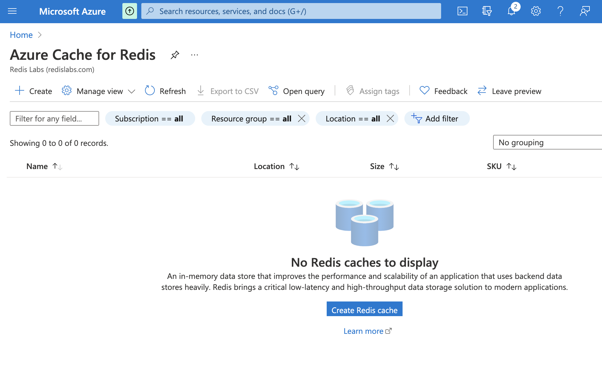

Redis is an open source, in-memory, key-value data store most commonly used as a primary database, cache, message broker, and queue. Redis cache delivers sub-millisecond response times, enabling fast and powerful real-time applications in industries such as gaming, fintech, ad-tech, social media, healthcare, and IoT. Developers love Redis due to its speed, simplicity and performance.

The Azure cloud platform has more than 200+ products and cloud services designed to help you bring new solutions to life-to solve today's challenges and create the future. Azure services help you to build, run, and manage applications across multiple clouds, on-premises, and at the edge, with the tools and frameworks of your choice.


Azure Cache for Redis is a native fully-managed service on Microsoft Azure. Azure Cache for Redis offers both the Redis open-source (OSS Redis) and a commercial product from Redis (Redis Enterprise) as a managed service. It provides secure and dedicated Redis server instances and full Redis API compatibility. The service is operated by Microsoft, hosted on Azure, and accessible to any application within or outside of Microsoft Azure. 

Azure Cache for Redis dashboard uses Azure Monitor to provide several options for monitoring your cache instances.[Learn more](https://docs.microsoft.com/en-us/azure/azure-monitor/insights/redis-cache-insights-overview)
Use Azure Monitor to:

- View metrics
- Pin metrics charts to the Startboard
- Customize the date and time range of monitoring charts
- Add and remove metrics from the charts
- Set alerts when certain conditions are met

### Step 1. Getting Started 


Search for "azure redis cache " in the search dashboard and launch  [Azure Cache for Redis Enterprise](https://portal.azure.com)


 


### Step 2: Setup & Subscribe


### Step 3: Configuring New Redis Cache Instance


### Step 4: Connecting to Redis database

You can directly connect to the Redis cache instances using the redis client command(redis-cli) as shown:

```
sudo redis-cli -h demos.redis.cache.windows.net -p 6379
demos.redis.cache.windows.net:6379>
```
Please note that you can have multiple clients connected to Redis database at the same time. You should be able to perform CRUD operations with Redis keys. The above Redis client command might require password if you have setup authentication in your Redis configuration file. If a Redis password is not set, then it will perform the default connection to Redis server. You can insert data to Redis using SET and then fetch it back with the GET command. You can even run redis info command to get the full statistics of the Redis server(for example, memory usage, redis server load etc).
### Resources

<div class="text--center">
<iframe width="760" height="415" src="https://www.youtube.com/embed/t6XQHsKFMKQ" title="YouTube video player" frameborder="0" allow="accelerometer; autoplay; clipboard-write; encrypted-media; gyroscope; picture-in-picture" allowfullscreen></iframe>
</div>


### Next Step

- [Getting Started with .Net and Redis](/develop/dotnet/)
- [Best Practices for Azure Cache for Redis](https://docs.microsoft.com/en-in/azure/azure-cache-for-redis/cache-best-practices)
- [Quickstart: Use Azure Cache for Redis in .NET Framework](https://docs.microsoft.com/en-us/azure/azure-cache-for-redis/cache-dotnet-how-to-use-azure-redis-cache)

##

<div>
<a href="https://launchpad.redis.com" target="_blank" rel="noopener" className="link"> </a>
</div>
