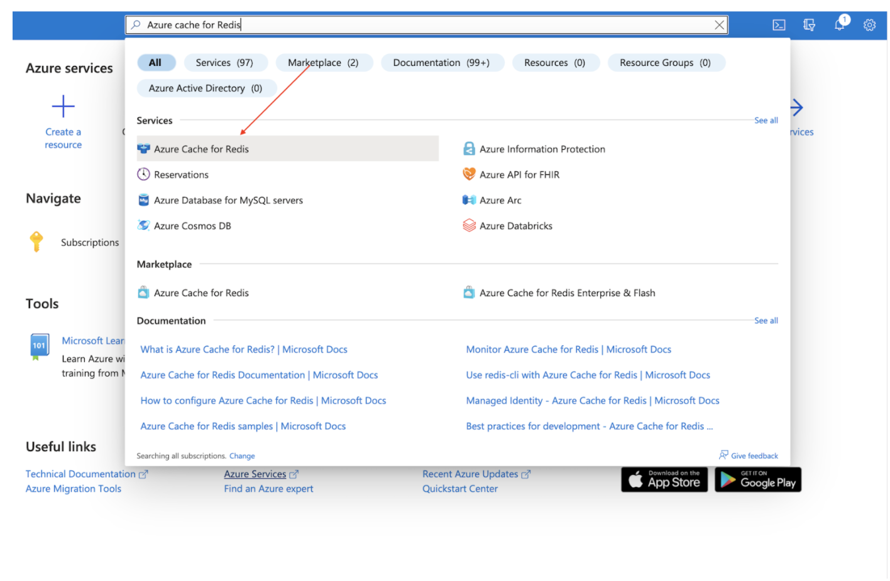
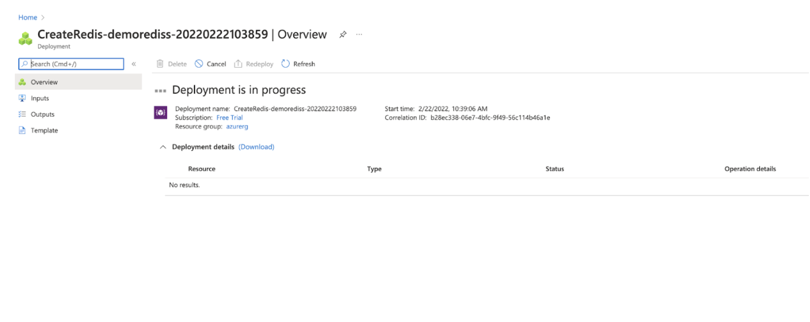
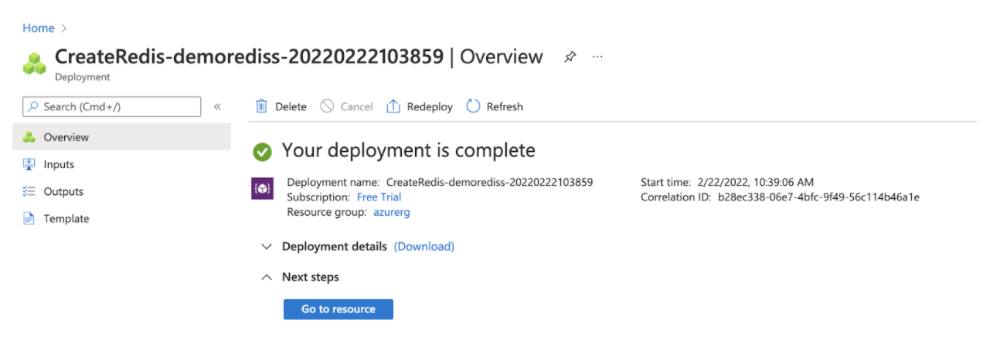
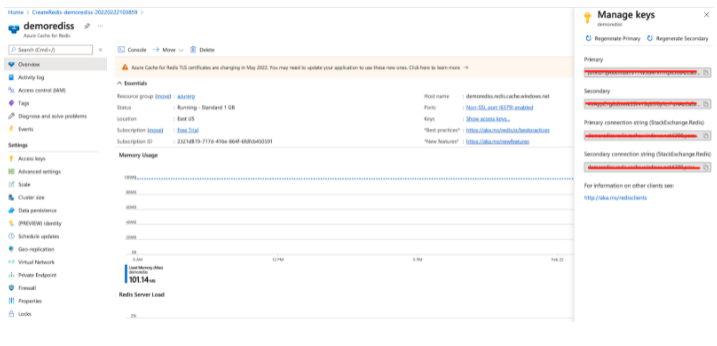
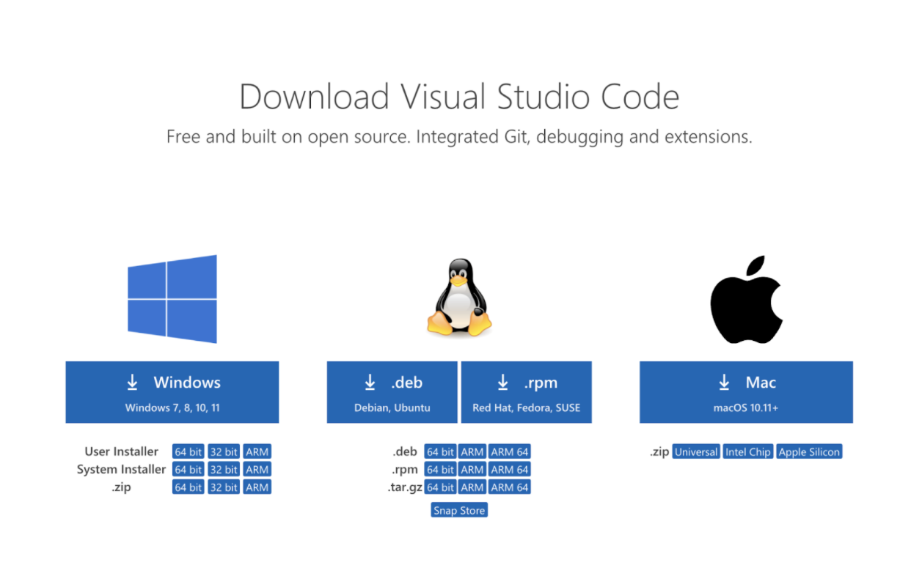
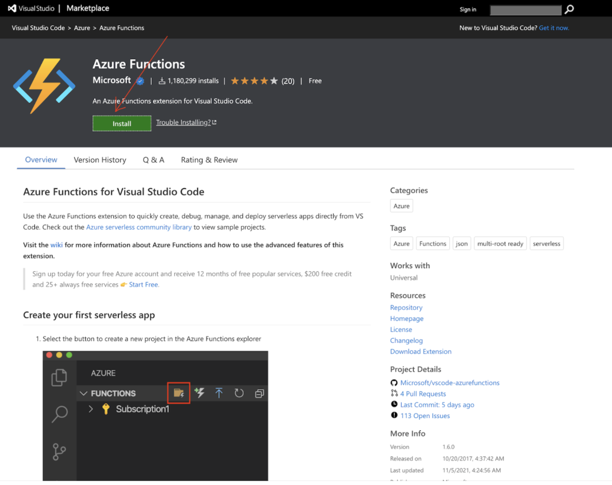
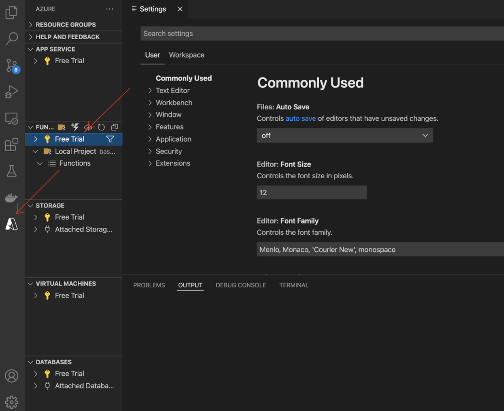
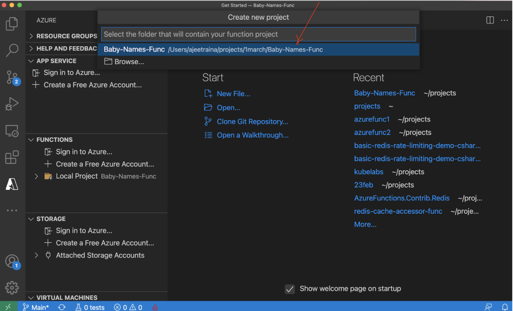
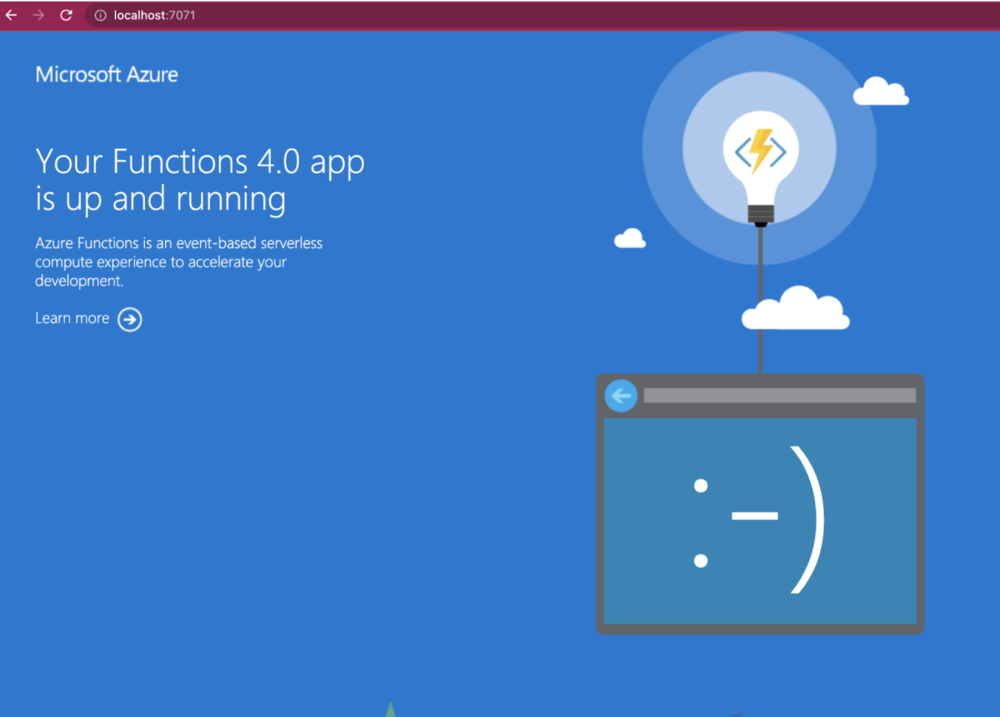
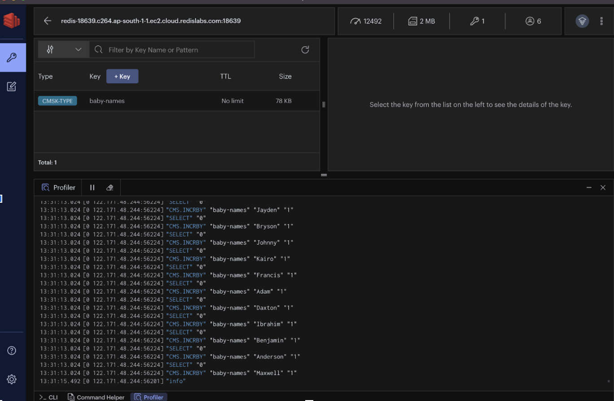

[Azure Functions](https://azure.microsoft.com/en-in/services/functions/) is an event-based, serverless compute platform offered by [Microsoft](https://azure.microsoft.com/en-in/blog/microsoft-named-a-leader-in-forrester-wave-functionasaservice-platforms/) to accelerate and simplify serverless application development. It allows developers to write less code, build and debug locally without additional setup, and deploy and operate at scale in the cloud.

### How it works

[Azure Functions](https://github.com/Azure/Azure-Functions) allows you to implement your system's logic into readily available blocks of code. These code blocks are called "functions." [An Azure function's execution is triggered](https://docs.microsoft.com/en-us/learn/modules/execute-azure-function-with-triggers/) when an event is fired. Whenever demand for execution increases, more and more resources are allocated automatically to the service, and when requests fall, all extra resources and application instances drop off automatically. In short, as a developer, you can now focus on the pieces of code that matter most to you, and Azure Functions handles the rest.

Azure Functions [provides as many or as few compute resources as needed](https://docs.microsoft.com/en-us/azure/azure-functions/functions-scale) to meet your application's demand. Providing compute resources on-demand is the essence of [serverless computing](https://azure.microsoft.com/solutions/serverless/) in Azure Functions.

### Benefits of Microsoft Azure Functions

- Azure Functions provides automated and flexible scaling.
- It allows you to build, debug, deploy, and monitor with integrated tools and built-in DevOps capabilities.
- It [supports a variety of programming languages](https://docs.microsoft.com/en-in/azure/azure-functions/supported-languages#languages-in-runtime-1x-and-2x) such as C#, Java, JavaScript, Python, and PowerShell.
- It allows you to use Functions extensions on Visual Studio and Visual Studio Code for faster and more efficient development on your local system.
- With Azure Functions you can set up CI/CD with Azure Pipelines.
- It’s a great solution for processing bulk data, integrating systems, working with IoT, and building simple APIs and microservices.
- It’s used to break monolithic architectures into loosely coupled functions.
- It allows you to [deploy Functions to Kubernetes](https://docs.microsoft.com/en-us/azure/azure-functions/functions-kubernetes-keda).

In this tutorial, you will learn how to get started with Azure Functions and Redis.

### Getting started

- Step 1. Log in to Microsoft Azure Portal
- Step 2. Set up Azure Cache for Redis
- Step 3. Configure Keys for Redis Cache
- Step 4. Verify if Redis database is reachable remotely
- Step 5. Install Homebrew on Mac
- Step 6. Install Visual Studio Code
- Step 7. Install the Azure Functions Core Tools
- Step 8. Install the Azure Functions extension for Visual Studio Code
- Step 9. Connect Azure Function to Azure account
- Step 10. Clone the project repository
- Step 11. Trigger the function
- Step 12. Verify the Azure Functions app is working properly
- Step 13. Seed the Redis database
- Step 14. Run query using RedisInsight

### Step 1. Log in to Microsoft Azure Portal

Create an Azure account with an active subscription by clicking this link: [Create an account for free](https://azure.microsoft.com/free/).


### Step 2. Set up “Azure Cache for Redis”

Type "Azure Cache for Redis" in the search section and select the service:



Under "New Redis Cache" window, create a new resource group, select your preferred location and cache type:


Once you are done with the entries, click "Review + Create" button.



Wait for few seconds to let deployment process to complete.



Once the deployment is complete, you will be provided with the deployment name, subscription details and resource group.


### Step 3. Configure Keys for Redis Cache

You will need keys to log in to the Redis database.
Click "Overview" option in the left sidebar to see the Primary key and save it for future reference.



### Step 4. Verify if Redis database is accessible

```
redis-cli -h demorediss.redis.cache.windows.net -p 6379
demorediss.redis.cache.windows.net:6379> info modules
NOAUTH Authentication required.
demorediss.redis.cache.windows.net:6379> auth jsn9IdFXXXXXXXXXXXXXsAzCaDzLh6s=
OK
demorediss.redis.cache.windows.net:6379> get a1
"100"

```

### Step 5. Install Homebrew on Mac

Install the Homebrew package manager by running this script:

```
/bin/bash -c "$(curl -fsSL https://raw.githubusercontent.com/Homebrew/install/HEAD/install.sh)"
```

### Step 6. Install Visual Studio Code

Visual Studio Code is a lightweight but powerful source code editor that runs on your desktop and is available for Windows, macOS, and Linux. It comes with built-in support for JavaScript, TypeScript, and Node.js, and has a rich ecosystem of extensions for other languages (such as C++, C#, Java, Python, PHP, Go) and runtimes (such as .NET and Unity). Begin your journey with VS Code with these [introductory videos](https://code.visualstudio.com/docs/introvideos/overview).



### Step 7. Install the Azure Functions Core Tools

```
brew tap azure/functions
brew install azure-functions-core-tools@4
# if upgrading on a machine that has 2.x or 3.x installed:
brew link --overwrite azure-functions-core-tools@4
```

### Step 8. Install the Azure Functions extension for Visual Studio Code

Use the Azure Functions extension to quickly create, debug, manage, and deploy serverless apps directly from VS Code.



### Step 9. Connect Azure Function to Azure account



### Step 10. Clone the project repository

For this tutorial, we will be using a baby names counter app built using C#.
To get started, we will first clone the repository:

```
git clone https://github.com/redis-developer/Baby-Names-Func


```

Add “Azure Cache for Redis” endpoint URL details in the `local-settings.json` file as shown below:

```
{
  "IsEncrypted": false,
  "Values": {
    "FUNCTIONS_WORKER_RUNTIME": "dotnet"
    "redisCacheConnectionString": "demorediss.redis.cache.windows.net"


  }
}
```

Open the project with Visual Studio Code by running the following command:

```
cd Baby-Names-Func
code .
```

This will open VS Code. The function will automatically load into the plugin.


### Step 11. Trigger the function

Press F5 to automatically execute the function.


If you want to manually select the repository, choose .NET framework, etc., and then click “Create new project.”



You will find the following output under VS Code screen:

```
     1>Done Building Project "/Users/ajeetraina/projects/Baby-Names-Func/RedisFunctions.csproj" (Clean target(s)).

Terminal will be reused by tasks, press any key to close it.

> Executing task: dotnet build /property:GenerateFullPaths=true /consoleloggerparameters:NoSummary <

Microsoft (R) Build Engine version 17.0.0+c9eb9dd64 for .NET
Copyright (C) Microsoft Corporation. All rights reserved.

  Determining projects to restore...
  All projects are up-to-date for restore.
  RedisFunctions -> /Users/ajeetraina/projects/Baby-Names-Func/bin/Debug/net6.0/RedisFunctions.dll

Terminal will be reused by tasks, press any key to close it.

> Executing task: func host start <


Azure Functions Core Tools
Core Tools Version:       4.0.3971 Commit hash: d0775d487c93ebd49e9c1166d5c3c01f3c76eaaf  (64-bit)
Function Runtime Version: 4.0.1.16815

[2022-03-01T07:51:01.383Z] Found /Users/ajeetraina/projects/Baby-Names-Func/RedisFunctions.csproj. Using for user secrets file configuration.

Functions:

        CountBabyNames: [GET,POST] http://localhost:7071/api/getCount

        IncrementBabyName: [GET,POST] http://localhost:7071/api/increment

For detailed output, run func with --verbose flag.


```

### Step 12. Verify the Azure functions app is working properly



### Step 13. Seed the Redis database

Now, let us seed BabyNames data into the Redis database.

```
git clone https://github.com/slorello89/Seed-Baby-Names
```

If you connect to the Redis database and run the `MONITOR` command, you should see the data being inserted into the database as shown below:

```
1646061655.966050 [0 122.171.48.244:60531] "CMS.INCRBY" "baby-names" "Rowen" "1"
1646061655.966050 [0 122.171.48.244:60531] "SELECT" "0"
1646061655.966050 [0 122.171.48.244:60531] "CMS.INCRBY" "baby-names" "Titus" "1"
1646061655.966050 [0 122.171.48.244:60531] "SELECT" "0"
1646061655.966050 [0 122.171.48.244:60531] "CMS.INCRBY" "baby-names" "Braxton" "1"
1646061655.966050 [0 122.171.48.244:60531] "SELECT" "0"
1646061655.966050 [0 122.171.48.244:60531] "CMS.INCRBY" "baby-names" "Alexander" "1"
1646061655.966050 [0 122.171.48.244:60531] "SELECT" "0"
1646061655.966050 [0 122.171.48.244:60531] "CMS.INCRBY" "baby-names" "Finnegan" "1"
1646061655.966050 [0 122.171.48.244:60531] "SELECT" "0"
1646061655.966050 [0 122.171.48.244:60531] "CMS.INCRBY" "baby-names" "Nasir" "1"
1646061655.966050 [0 122.171.48.244:60531] "SELECT" "0"
1646061655.966050 [0 122.171.48.244:60531] "CMS.INCRBY" "baby-names" "Fabian" "1"
1646061655.966050 [0 122.171.48.244:60531] "SELECT" "0"
1646061655.966050 [0 122.171.48.244:60531] "CMS.INCRBY" "baby-names" "Alexander" "1"
1646061655.966050 [0 122.171.48.244:60531] "SELECT" "0"
1646061655.966050 [0 122.171.48.244:60531] "CMS.INCRBY" "baby-names" "Emilio" "1"
1646061655.966050 [0 122.171.48.244:60531] "SELECT" "0"
1646061655.966050 [0 122.171.48.244:60531] "CMS.INCRBY" "baby-names" "Dax" "1"
1646061655.966050 [0 122.171.48.244:60531] "SELECT" "0"
1646061655.966050 [0 122.171.48.244:60531] "CMS.INCRBY" "baby-names" "Johnny" "1"
1646061655.966050 [0 122.171.48.244:60531] "SELECT" "0"
1646061655.966050 [0 122.171.48.244:60531] "CMS.INCRBY" "baby-names" "Mario" "1"
1646061655.966050 [0 122.171.48.244:60531] "SELECT" "0"
1646061655.966050 [0 122.171.48.244:60531] "CMS.INCRBY" "baby-names" "Lennox" "1"

```

### Step 14. Run query using RedisInsight

[Follow this link to set up RedisInsight](https://developer.redis.com/explore/redisinsightv2/getting-started) on your local system and get connected to the Redis database. Once connected, you should be able to run the following queries:



```
> CMS.INFO baby-names
1) width
2) (integer) 1000
3) depth
4) (integer) 10
5) count
6) (integer) 100000

> CMS.QUERY baby-names Johnny
1) 109
```

### Additional references:

- [Introduction to Azure Functions](https://azure.microsoft.com/en-in/services/functions/)
- [Fully Managed Redis Enterprise for Azure](https://redis.com/cloud-partners/microsoft-azure/)
- [Azure Cache for Redis Enterprise & Flash](https://azuremarketplace.microsoft.com/en-us/marketplace/apps/garantiadata.redis_enterprise_1sp_public_preview?ocid=redisga_redis_cloudpartner_cta1)
