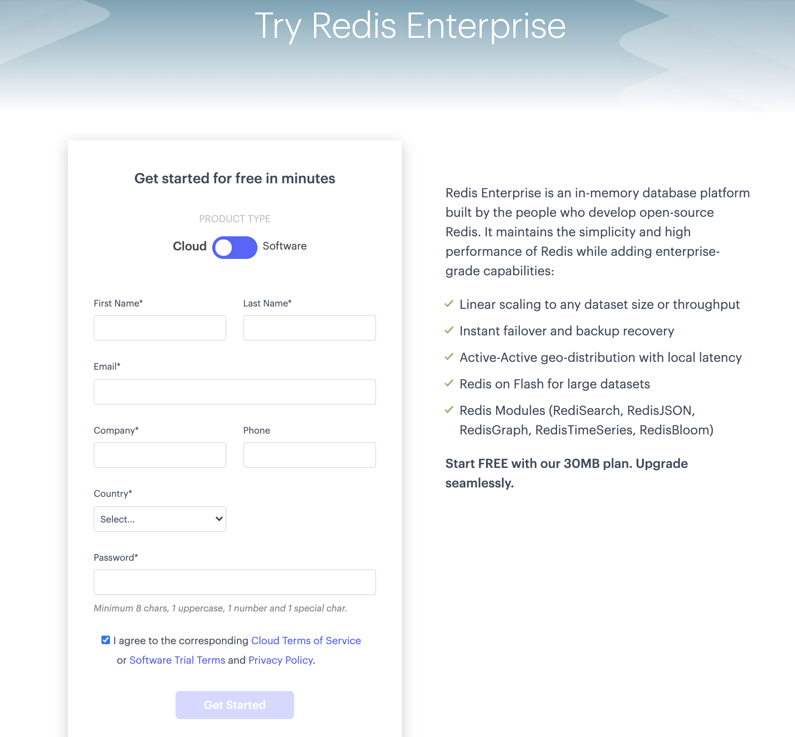
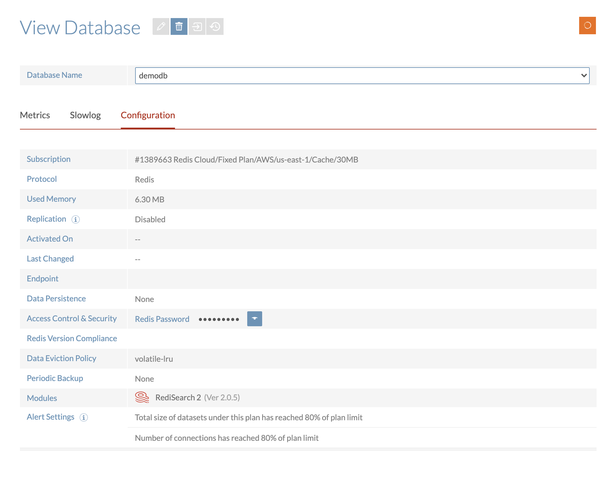

Redis Cloud on AWS is fully managed Redis as a service. Designed for modern distributed applications, Redis Cloud on AWS is known for its high performance, infinite scalability and true high availability.

Follow the below steps to setup Redis Cloud hosted over AWS Cloud:

### Step 1. Getting Started

Follow this [link](https://redis.com/try-free/) to register.

### Step 2. Choose AWS Cloud

For the cloud provider, select Amazon AWS and choose Free plan.

### Step 3. Create database

### Step 4. Click "Activate"

