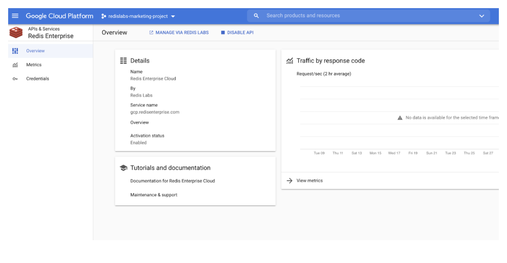
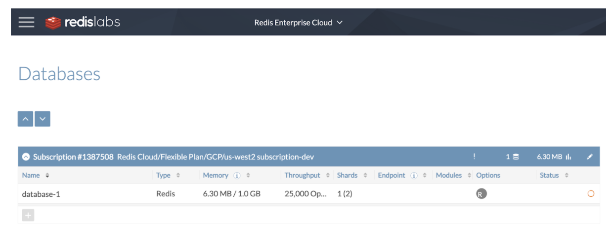
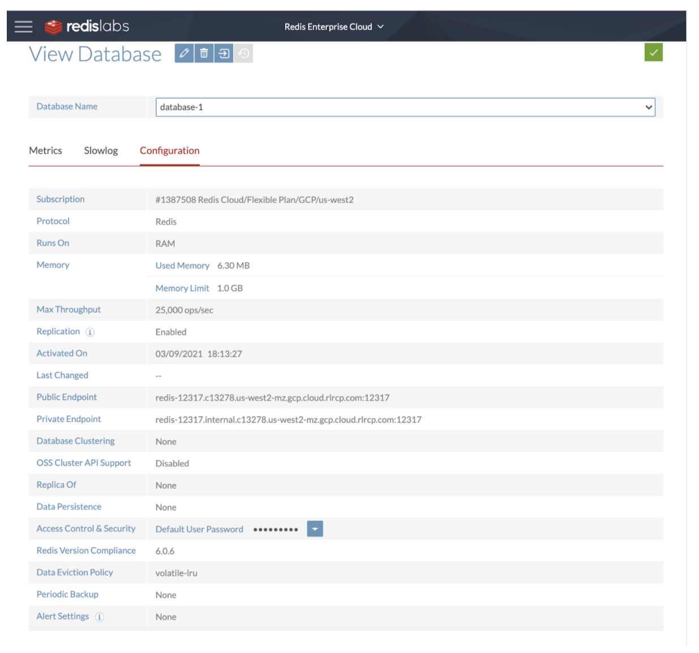

Redis Enterprise Cloud delivers fully managed Redis Enterprise as a Service. It offers all the capabilities of Redis Enterprise while taking care of all the operational aspects associated with operating Redis in the most efficient manner on Google Cloud Platform. Redis Enterprise Cloud is built on a complete serverless concept, so users don’t need to deal with nodes and clusters

### Step 1. Getting Started

Launch [Redis Enterprise Cloud page](https://console.cloud.google.com/apis/library/gcp.redisenterprise.com?pli=1) on Google Cloud Platform

### Step 2. Click "Manage via Redis Labs"

### Step 3. Create Subscription

### Step 4. Specify the database name

### Step 5. Enter sizing details

### Step 6: Review & Create

### Step 7. Verify the details

### Step 8. Finalising the setup

### Next Steps

- [Connecting to the database using RedisInsight](/explore/redisinsight/)
- [How to list & search Movies database using Redisearch](/howtos/redisjson/shoppingcart/)
