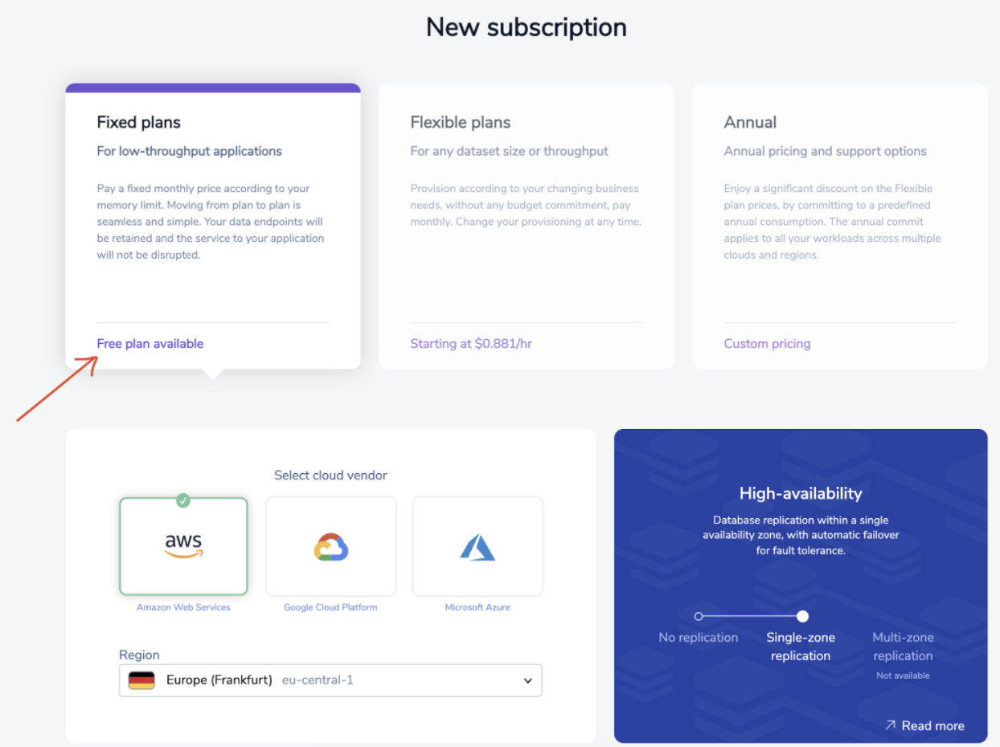

Redis Enterprise Cloud is a fully managed cloud service by Redis. Built for modern distributed applications, Redis Enterprise Cloud enables you to run any query, simple or complex, at sub-millisecond performance at virtually infinite scale without worrying about operational complexity or service availability. With modern probabilistic data structures and extensible data models, including Search, JSON, Graph, and Time Series, you can rely on Redis as your data-platform for all your real-time needs.

### Step 1. Create free cloud account

Create your free <a href="https://redis.com/try-free/" target="_blank" rel="noopener">Redis Enterprise Cloud account</a>. Once you click on “Get Started”, you will receive an email with a link to activate your account and complete your signup process.

### Step 2. Create Your subscription

Next, you will have to create  Redis Enterprise Cloud subscription. In the Redis Enterprise Cloud menu, click "Create your Subscription". 

### Step 3. Select the right Subscription Plan

Select "Fixed Plan" for low throughout application as for now.

### Step 4.  Select cloud vendor
 
For the cloud provider, select your preferred cloud (for demo purpose)

### Step 5. Click "Create Subscription"

Finally, click on "Create Subscription" button.

You can now verify the subscription as shown below:

### Step 6. Create database

Click "Create Database". Enter database name and your preferred module.

### Step 7. Launch database

Click "Activate" and wait for few seconds till it gets activated. Once fully activated, you will see the database endpoints as shown below:

### Next Steps

- [Connecting to the database using RedisInsight](/explore/redisinsight/)
- [How to list & search Movies database using Redisearch](/howtos/moviesdatabase/getting-started/)

##

