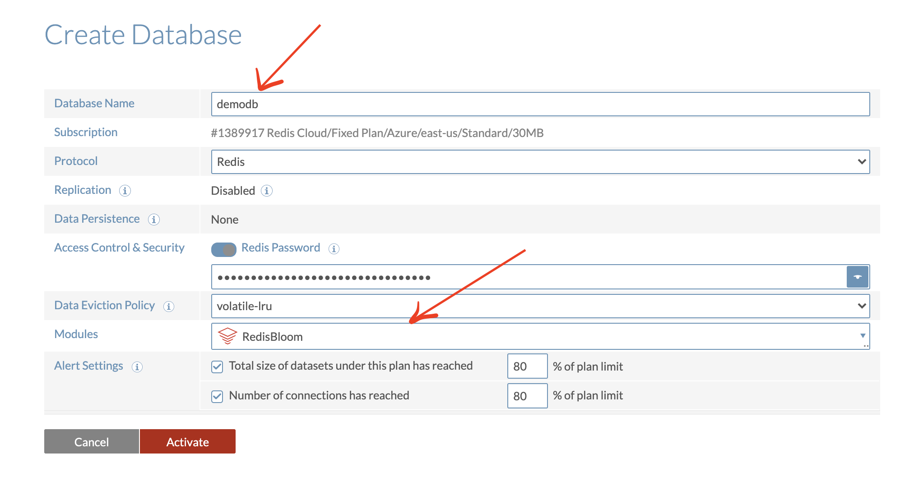

Redis Enterprise Cloud is a fully managed cloud service by Redis Labs.Built for modern distributed applications, Redis Enterprise Cloud enables you to run any query, simple or complex, at sub-millisecond performance at virtually infinite scale without worrying about operational complexity or service availability. With modern probabilistic data structures and extensible data models, including Search, JSON, Graph, and Time Series, you can rely on Redis as your data-platform for all your real-time needs.

### Step 1. Create free cloud account
Create your free <a href="https://redislabs.com/try-free/" target="_blank" rel="noopener">Redis Enterprise Cloud account</a>. Once you click on “Get Started”, you will receive an email with a link to activate your account and complete your signup process.

### Step 2. Add subscription
Next, you will have to add  Redis Enterprise Cloud subscription. In the Redis Enterprise Cloud menu, click Subscriptions. At the bottom of the page, click the “+” sign.

### Step 3.  Select cloud provider
For the cloud provider, select Microsoft Azure and Fixed Size Plan(for demo purpose)

### Step 4. Create database
Click Create. After you create a subscription, you can create a database:

### Step 5. Launch database
Click "Activate" and wait for few seconds till it gets activated. Once fully activated, you will see the database endpoints as shown below:

### Next Step

- [Connecting to the database using RedisInsight](/explore/redisinsight/)
- [How to list & search Movies database using Redisearch](/howtos/moviesdatabase/getting-started/)

