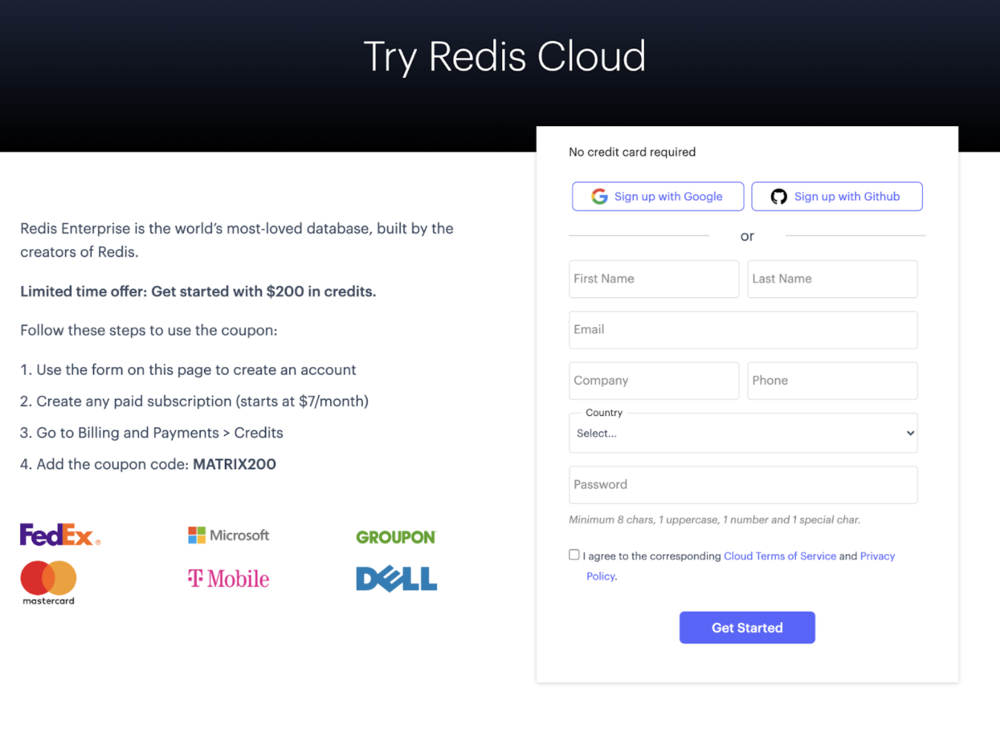
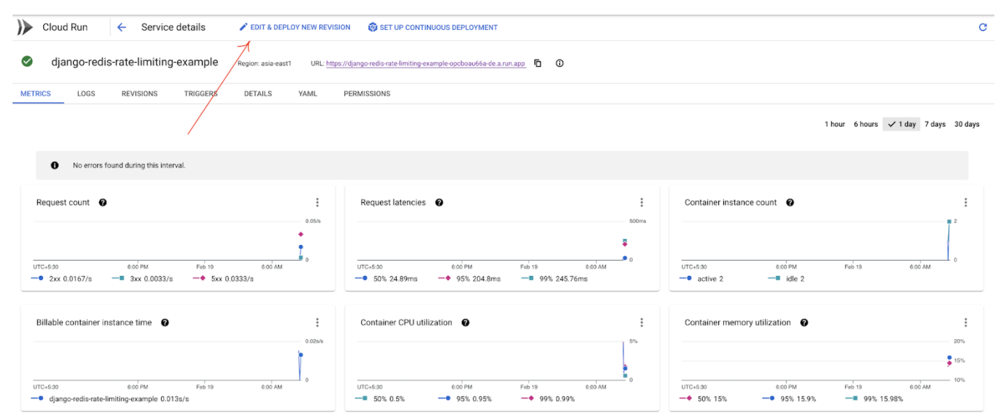
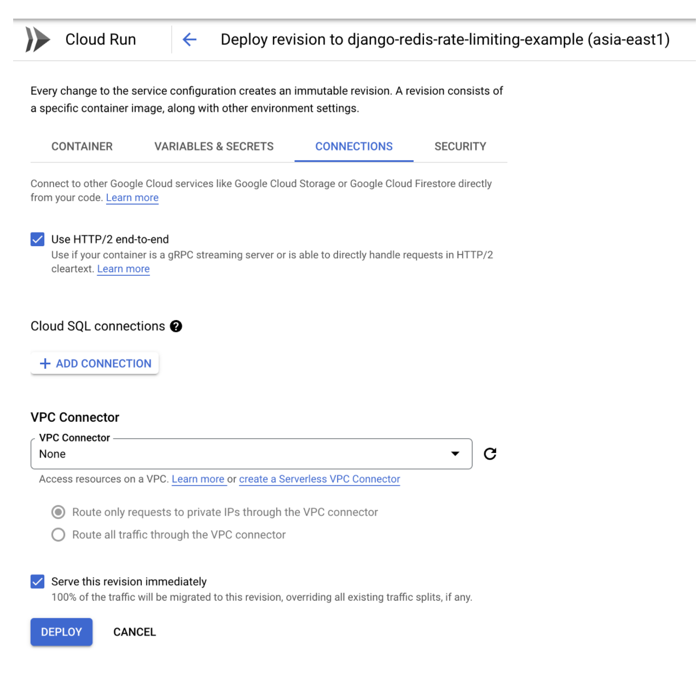
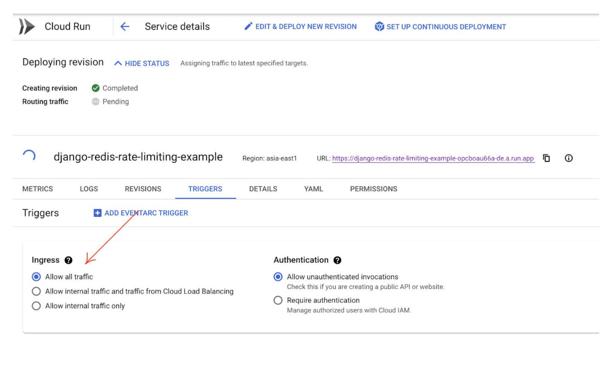

If you’re looking for a solution that lets you go from container to URL within seconds, check out Google Cloud Run. [Cloud Run](https://cloud.google.com/run) is Google’s fully managed compute platform for running stateless, HTTP-driven containers. By using a single command (“[gcloud run deploy”](https://cloud.google.com/sdk/gcloud/reference/run/deploy)) you can convert a container image to a fully managed web application and run it in a production environment with auto-scalability, high availability, and security.

[Google Cloud Run](https://cloud.google.com/run/docs) allows you to deploy and scale serverless HTTP containers without worrying about provisioning servers, scaling servers up and down to meet demands, or overpaying by consuming more resources than necessary. It makes container deployment much easier. It is good for developing software in cloud applications, hence delivering web apps, [APIs](https://cloud.google.com/run/docs/reference/rest), background jobs, etc.

Cloud Run is [powered and built on Knative](https://cloud.google.com/knative). Knative is an open source community project which adds components for deploying, running, and managing serverless, cloud-native applications to Kubernetes. It allows you to easily run your containers either in your [https://cloud.google.com/kubernetes-engine](https://cloud.google.com/kubernetes-engine/) (GKE) cluster with Cloud Run on GKE or fully managed with Cloud Run. Cloud Run helps developers focus on writing high-value code, regardless of where their organizations are on the path to the cloud. 


### Compelling features of Google Cloud Run


- Cloud Run provides you with the option to write your code in your preferred programming languages such as [NodeJS](https://github.com/GoogleCloudPlatform/nodejs-docs-samples/blob/master/run/helloworld/), [Python](https://github.com/GoogleCloudPlatform/python-docs-samples/blob/master/run/), [Go](https://github.com/GoogleCloudPlatform/golang-samples/tree/master/run/), and [Java](https://github.com/GoogleCloudPlatform/java-docs-samples/tree/master/run/).
- Cloud Run provides you a better ROI as you get charged only for the resources used.
- Cloud Run offers a[ longer request timeout duration of up to 60 minutes](https://cloud.google.com/run/docs/configuring/request-timeout).
- Cloud Run is configured to [send multiple concurrent requests on each container instance. ](https://cloud.google.com/run/docs/configuring/concurrency)This is helpful to improve latency and reduce costs if you’re expecting large volumes.
- Cloud Run lets you [create microservice-based applications that are scalable and extensible](https://cloud.google.com/blog/products/serverless/build-event-driven-applications-in-cloud-run).

In this tutorial, you will learn how to deploy a simple Redis rate limiting application to Google Cloud Run in just 5 minutes.

### Table of Contents


* Step 1. Set up a free Redis Enterprise Cloud account
* Step 2. Install Google Cloud CLI
* Step 3. Authenticate your GCP account
* Step 4. Enable Google Services
* Step 5. Deploy to Google Cloud Run from source
* Step 6. Verify if service is listed
* Step 7. Set up environment variables
* Step 8. Access your app

### Step 1. Set up a free Redis Enterprise Cloud account

Visit [developer.redis.com/create/rediscloud/](https://developer.redis.com/create/rediscloud/) and create [a free Redis Enterprise Cloud account](https://redis.com/try-free/). Once you complete the signup tutorial, you will be provided with the database endpoint URL, port and password. Save these for future reference.





### Step 2. Install Google Cloud CLI

Run the following command to install Google Cloud CLI Core Libraries and dependencies:


```
brew install --cask google-cloud-sdk

```


### Step 3. Authenticate your GCP account

To deploy your app you must first download, install, and initialize the [gcloud CLI](https://cloud.google.com/sdk/docs). 

Download and install gcloud SDK via [https://cloud.google.com/sdk/docs](https://cloud.google.com/sdk/docs)


```
gcloud auth login
```


Allow Google Cloud SDK access to your Google Account:


### Step 4. Enable Google Services


```
gcloud services enable \
  artifactregistry.googleapis.com \
  cloudbuild.googleapis.com \
  run.googleapis.com
Operation "operations/acat.p2-406459833831-88327c08-1fe9-4d9a-a6b9-db8c8b007863" finished successfully.


```


### Step 5 . Deploy to Google Cloud Run from source

Deploying from source automatically builds a container image from source code and deploys it.


```
gcloud run deploy
Deploying from source. To deploy a container use [--image]. See https://cloud.google.com/run/docs/deploying-source-code for more details.
Source code location (/Users/ajeetraina/projects/googlecloud/basic-rate-limiting-demo-python/google-cloud-run):
Next time, use `gcloud run deploy --source .` to deploy the current directory.

Service name (google-cloud-run):
Please specify a region:
 [1] asia-east1
 [2] asia-east2
 [3] asia-northeast1
 [4] asia-northeast2
 [5] asia-northeast3
 [6] asia-south1
 [7] asia-south2
 [8] asia-southeast1
 [9] asia-southeast2
 [10] australia-southeast1
 [11] australia-southeast2
 [12] europe-central2
 [13] europe-north1
 [14] europe-west1
 [15] europe-west2
 [16] europe-west3
 [17] europe-west4
 [18] europe-west6
 [19] northamerica-northeast1
 [20] northamerica-northeast2
 [21] southamerica-east1
 [22] southamerica-west1
 [23] us-central1
 [24] us-east1
 [25] us-east4
 [26] us-west1
 [27] us-west2
 [28] us-west3
 [29] us-west4
 [30] cancel
Please enter your numeric choice:  1

To make this the default region, run `gcloud config set run/region asia-east1`.

Deploying from source requires an Artifact Registry Docker repository to store built containers. A repository named
[cloud-run-source-deploy] in region [asia-east1] will be created.

Do you want to continue (Y/n)?  Y

This command is equivalent to running `gcloud builds submit --tag [IMAGE] /Users/ajeetraina/projects/googlecloud/basic-rate-limiting-demo-python/google-cloud-run` and `gcloud run deploy google-cloud-run --image [IMAGE]`

Allow unauthenticated invocations to [google-cloud-run] (y/N)?  y

Building using Dockerfile and deploying container to Cloud Run service [google-cloud-run] in project [redislabs-marketing-project] region [asia-east1]
⠼ Building and deploying new service... Uploading sources.
  ✓ Creating Container Repository...
  ✓ Uploading sources...
  . Building Container...
  . Creating Revision...
  . Routing traffic...
  . Setting IAM Policy…

Please enter your numeric choice:  1

To make this the default region, run `gcloud config set run/region asia-east1`.

Allow unauthenticated invocations to [django-redis-rate-limiting-example] (y/N)?  y

Deploying container to Cloud Run service [django-redis-rate-limiting-example] in project [redislabs-marketing-project] region [asia-east1]
✓ Deploying new service... Done.
  ✓ Creating Revision... Revision deployment finished. Waiting for health check to begin.
  ✓ Routing traffic...
  ✓ Setting IAM Policy...
Done.
Service [django-redis-rate-limiting-example] revision [django-redis-rate-limiting-example-00001-mog] has been deployed and is serving 100 percent of traffic.
Service URL: https://django-redis-rate-limiting-example-opcboau66a-de.a.run.app


```


### Step 6. Verify if the service is listed under Cloud Run dashboard





#### Verifying the service via terminal UI


```
$ gcloud run services describe django-redis-rate-limiting-example

✔ Service django-redis-rate-limiting-example in region asia-east1

URL:     https://django-redis-rate-limiting-example-opcboau66a-de.a.run.app
Ingress: all
Traffic:
  100% LATEST (currently django-redis-rate-limiting-example-00001-mog)

Last updated on 2022-02-19T02:50:03.100357Z by ajeet.raina@redis.com:
  Revision django-redis-rate-limiting-example-00001-mog
  Image:           gcr.io/redislabs-marketing-project/django-redis-rate-limiting-example@sha256:95bf8d5705c4ab52d2c9ba07d7dcf0c651431d8d5d38ad8806487aaa8a8a870d at 95bf8d57...
  Port:            8080
  Memory:          512Mi
  CPU:             1000m
  Service account: 406459833831-compute@developer.gserviceaccount.com
  Concurrency:     80
  Max Instances:   100
  Timeout:         300s

```


### Step 7. Set up environment variables 


- Adding Redis URL to point to Redis Enterprise Cloud


- Enable HTTPS


-  Ensuring the VPC connector shows as “none”





- Allowing all traffic





### Step 8. Access your app

Open [https://django-redis-rate-limiting-example-opcboau66a-de.a.run.app/](https://django-redis-rate-limiting-example-opcboau66a-de.a.run.app/) and access your app.


This app allows you to choose the desired number of requests in each 10 second period. The app blocks connections from a client after surpassing a certain amount of requests (default: 10) in the time window (default: 10 sec). That will let the user know how many requests they have remaining before they run over the limit. On the tenth run, the server should return an HTTP status code of 429 (“Too Many Requests”).

### Additional references:


- [Google Cloud Run](https://cloud.google.com/run)
- [Features of Google Run](https://cloud.google.com/run#section-13)
- [Create Redis Database using Google Cloud](https://developer.redis.com/create/gcp)

