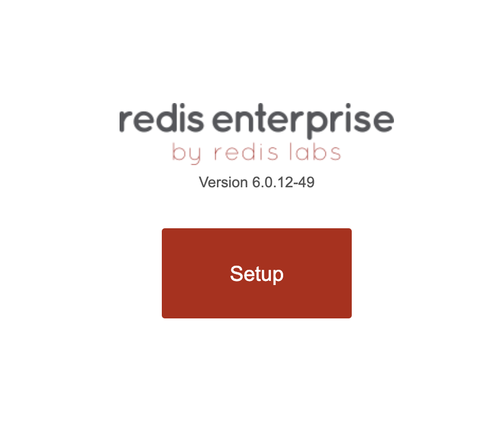
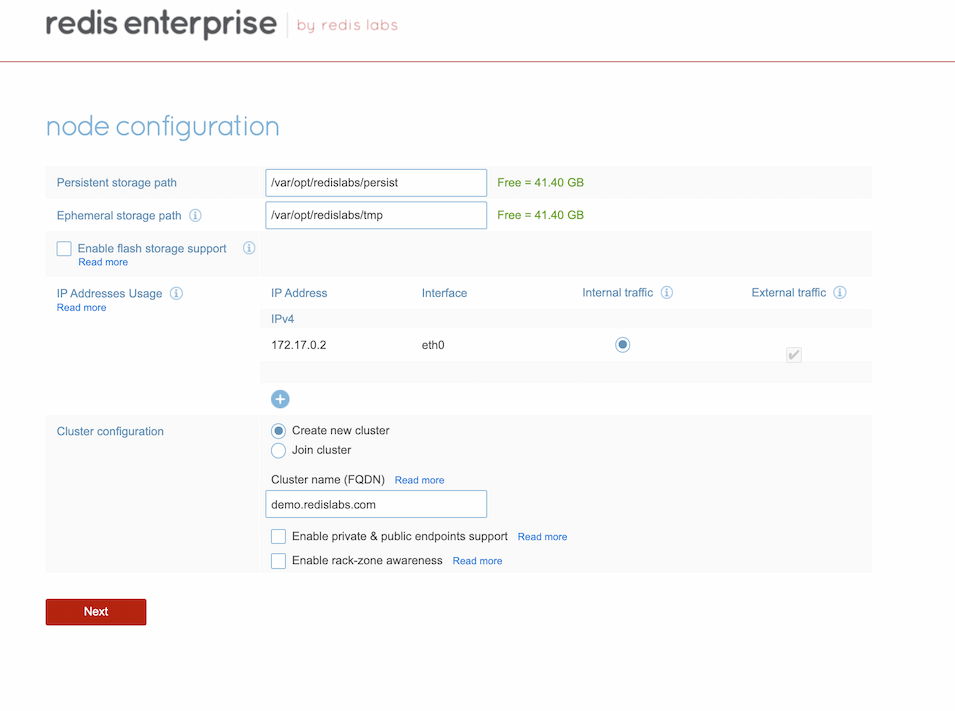
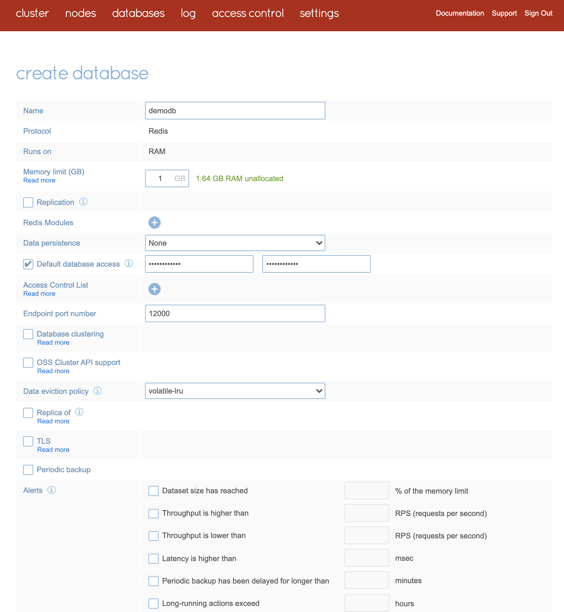

import Tabs from '@theme/Tabs';
import TabItem from '@theme/TabItem';
import useBaseUrl from '@docusaurus/useBaseUrl';
import RedisCard from '@site/src/theme/RedisCard';


<Tabs
  defaultValue="Redis Enterprise"
  values={[
    {label: 'Redis Enterprise', value: 'Redis Enterprise'},
    {label: 'Redis', value: 'Redis'},
  ]}>

  <TabItem value="Redis Enterprise" className="has-small-images">


### Pre-requisite

Ensure that Docker is installed in your system.

If you're new, refer https://docs.docker.com/docker-for-mac/install/ to install Docker on Mac. 


To pull and start the Redis Enterprise Software Docker container, run this docker run command in the terminal or command-line for your operating system.

Note: On Windows, make sure Docker is configured to run Linux-based containers.

```
docker run -d --cap-add sys_resource --name rp -p 8443:8443 -p 9443:9443 -p 12000:12000 redislabs/redis
```

In the web browser on the host machine, go to https://localhost:8443 to see the Redis Enterprise Software web console.

### Step 1: Click on “Setup”

Click Setup to start the node configuration steps.





### Step 2:  Enter your preferred FQDN 

In the Node Configuration settings, enter a cluster FQDN such as demo.redislabs.com. Then click Next button.



Enter your license key, if you have one. If not, click the Next button to use the trial version.

### Step 3: Enter the admin credentials

Enter an email and password for the admin account for the web console.


These credentials are also used for connections to the REST API. 
Click OK to confirm that you are aware of the replacement of the HTTPS SSL/TLS certificate on the node, and proceed through the browser warning.
 


### Step 4:  Create a Database:

Select “redis database” and the “single region” deployment, and click Next.


Enter a database name such as demodb and click Activate to create your database




You now have a Redis database!


### Step 5: Connecting using redis-cli 

After you create the Redis database, you are ready to store data in your database. redis-cli is a built-in simple command-line tool to interact with Redis database. Run redis-cli, located in the /opt/redislabs/bin directory, to connect to port 12000 and store and retrieve a key in database1

```
$ docker exec -it rp bash
redislabs@fd8dca50f905:/opt$
 /opt/redislabs/bin/redis-cli -p 12000
127.0.0.1:12000> auth <enter password>
OK
127.0.0.1:12000> set key1 123
OK
127.0.0.1:12000> get key1
"123"
```

</TabItem>
<TabItem value="Redis">


### Pre-requisite

Ensure that Docker is installed in your system. Follow https://docs.docker.com/engine/install/ if you haven’t installed yet.

### Step 1: Run the Redis container

Execute the following command to run Redis container in the background in a “detached” mode.

```
$ docker run --name myredis -d redis
```

where,
myredis is the name of Docker container
-d represent running Redis in a background in a “detached” mode.
redis is the name of Docker Image that it fetches from Docker Hub.

### Step 2: Verify if Redis container is running or not:

```
$ docker ps
CONTAINER ID   IMAGE     COMMAND                  CREATED         STATUS         PORTS      NAMES
241f2411637e   redis     "docker-entrypoint.s…"   2 minutes ago   Up 2 minutes   6379/tcp   myredis
```

### Step 3: Connect to your database

The below CLI uses the first three alphanumeric character of Container ID  and opens up "sh" shell of Redis Docker container:

```
$ docker exec -it 241 sh
# redis-cli
```

### Step 4: Testing Redis container

Execute the below command to test the Redis server:

```
127.0.0.1:6379>ping
PONG
```

Please note: By default, Redis has 0-15 indexes for databases, you can change that number databases NUMBER in redis.conf.

### Step 5: Running Redis container with Persistent Storage

In order to enable persistence,  you have to pass the "appendonly" option as "yes" as shown in the below example:

```
$ docker run --name some-redis -d redis redis-server --appendonly yes
```

If persistence is enabled, data is stored in the VOLUME /data, which can be used with --volumes-from some-volume-container or -v /docker/host/dir:/data 

 
</TabItem>
  
</Tabs>

### Next Step

- [Connect to Redis database using RedisInsight](/explore/redisinsight/)
- [Connect to Redis database using Redis datasource for Grafana](/explore/redisdatasource/)
