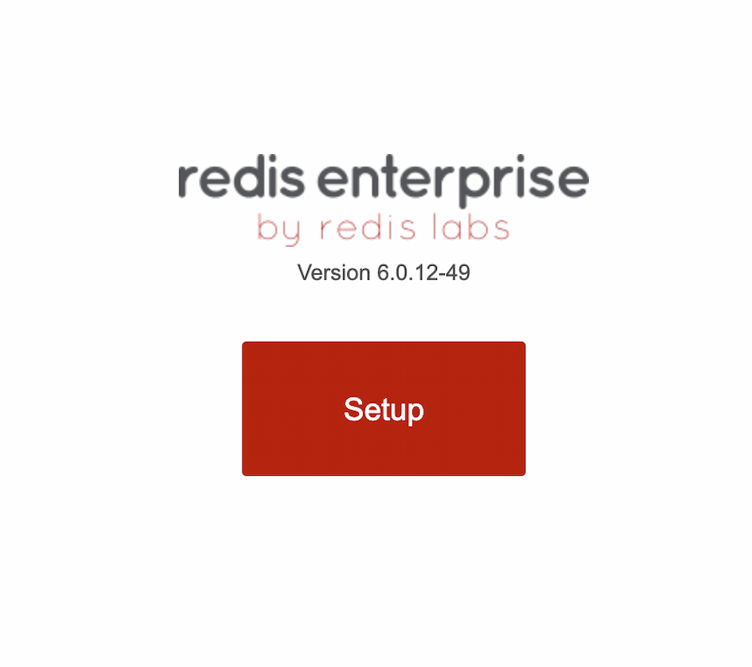
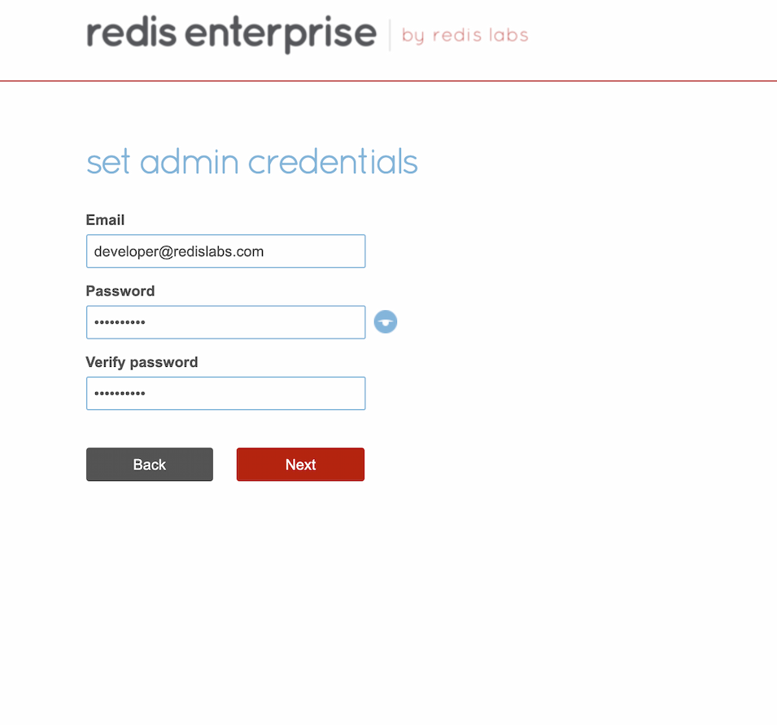

import Tabs from '@theme/Tabs';
import TabItem from '@theme/TabItem';
import Authors from '@site/src/theme/Authors';

<Authors frontMatter={frontMatter} />

<Tabs
  defaultValue="Redis Enterprise"
  values={[
    {label: 'Redis Enterprise', value: 'Redis Enterprise'},
    {label: 'Redis', value: 'Redis'},
  ]}>

  <TabItem value="Redis Enterprise" className="has-small-images">

### Pre-requisite

Ensure that Docker is installed in your system.

If you're new, refer https://docs.docker.com/docker-for-mac/install/ to install Docker on Mac.

To pull and start the Redis Enterprise Software Docker container, run this docker run command in the terminal or command-line for your operating system.

Note: On Windows, make sure Docker is configured to run Linux-based containers.

```
docker run -d --cap-add sys_resource --name rp -p 8443:8443 -p 9443:9443 -p 12000:12000 redislabs/redis
```

In the web browser on the host machine, go to https://localhost:8443 to see the Redis Enterprise Software web console.

### Step 1: Click on “Setup”

Click Setup to start the node configuration steps.



### Step 2: Enter your preferred FQDN

In the Node Configuration settings, enter a cluster FQDN such as demo.redis.com. Then click Next button.


Enter your license key, if you have one. If not, click the Next button to use the trial version.

### Step 3: Enter the admin credentials

Enter an email and password for the admin account for the web console.



These credentials are also used for connections to the REST API.
Click OK to confirm that you are aware of the replacement of the HTTPS SSL/TLS certificate on the node, and proceed through the browser warning.

### Step 4: Create a Database:

Select “redis database” and the “single region” deployment, and click Next.


Enter a database name such as demodb and click Activate to create your database


You now have a Redis database!

### Step 5: Connecting using redis-cli

After you create the Redis database, you are ready to store data in your database. redis-cli is a built-in simple command-line tool to interact with Redis database. Run redis-cli, located in the /opt/redislabs/bin directory, to connect to port 12000 and store and retrieve a key in database1

```
$ docker exec -it rp bash
redislabs@fd8dca50f905:/opt$
 /opt/redislabs/bin/redis-cli -p 12000
127.0.0.1:12000> auth <enter password>
OK
127.0.0.1:12000> set key1 123
OK
127.0.0.1:12000> get key1
"123"
```

</TabItem>
<TabItem value="Redis">

### Pre-requisite

Ensure that Docker is installed in your system. Follow https://docs.docker.com/engine/install/ if you haven’t installed yet.

You can run Redis Stack using a Docker container. There are two types of Docker images available in Docker Hub.

- The `redis/redis-stack` Docker image contains both Redis Stack server and RedisInsight. This container is recommended for local development because you can use RedisInsight to visualize your data.

- The `redis/redis-stack-server` provides Redis Stack but excludes RedisInsight. This container is best for production deployment.

### Getting started

To start Redis Stack server using the redis-stack image, run the following command in your terminal:

```bash
 docker run -d --name redis-stack -p 6379:6379 -p 8001:8001 redis/redis-stack:latest
```

You can use `redis-cli` to connect to the server, just as you connect to any Redis instance.
If you don’t have redis-cli installed locally, you can run it from the Docker container:

```bash
 docker exec -it redis-stack redis-cli
```

:::info TIP
The `docker run` command above also exposes RedisInsight on port 8001. You can use RedisInsight by pointing your browser to http://localhost:8001.
:::

To persist your Redis data to a local path, specify -v to configure a local volume. This command stores all data in the local directory local-data:

```bash
 docker run -v /local-data/:/data redis/redis-stack:latest
```

If you want to expose Redis Stack server or RedisInsight on a different port, update the left hand of portion of the `-p` argument. This command exposes Redis Stack server on port 10001 and RedisInsight on port 13333:

```bash
 docker run -p 10001:6379 -p 13333:8001 redis/redis-stack:latest
```

By default, the Redis Stack Docker containers use internal configuration files for Redis. To start Redis with local a configuration file, you can use the -v volume options:

```bash
 docker run -v `pwd`/local-redis-stack.conf:/redis-stack.conf -p 6379:6379 -p 8001:8001 redis/redis-stack:latest
```

To pass in arbitrary configuration changes, you can set any of these environment variables:

- `REDIS_ARGS`: extra arguments for Redis
- `REDISEARCH_ARGS`: arguments for RediSearch
- `REDISJSON_ARGS`: arguments for RedisJSON
- `REDISGRAPH_ARGS`: arguments for RedisGraph
- `REDISTIMESERIES_ARGS`: arguments for RedisTimeSeries
- `REDISBLOOM_ARGS`: arguments for RedisBloom

For example, here’s how to use the `REDIS_ARGS` environment variable to pass the `requirepass` directive to Redis:

```
 docker run -e REDIS_ARGS="--requirepass redis-stack" redis/redis-stack:latest
```

</TabItem>

</Tabs>

### Next Steps

- [Connect to Redis database using RedisInsight](/explore/redisinsightv2/)
- [Connect to Redis database using Redis datasource for Grafana](/explore/redisdatasource/)

##

<div>
  <a
    href="https://launchpad.redis.com"
    target="_blank"
    rel="noopener"
    className="link">
    
  </a>
</div>
