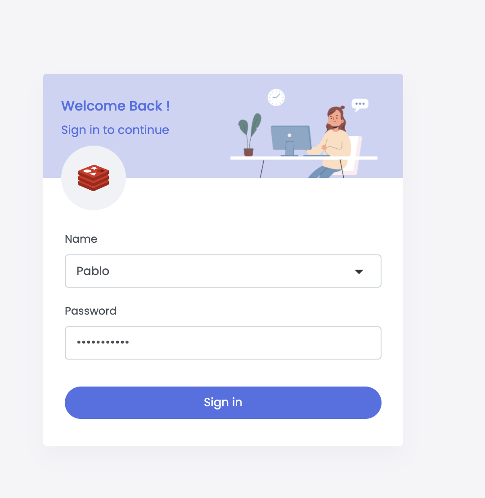

import RedisCard from '@site/src/theme/RedisCard';


Heroku is a PaaS (platform as a service) for building and running software applications in the cloud. Heroku today supports programming languages such as Java, Python, Ruby, Node.js and Go. Heroku manages your app portfolio in a straightforward Dashboard or with a CLI. Heroku's horizontally scalable, share-nothing architecture is designed for building services in today's world of containerized applications. 

Here are few popular terminologies used in Heroku:

- Dynos: The Heroku Platform uses the container model to run and scale all Heroku apps. The containers used at Heroku are called “dynos". Dynos are isolated, virtualized Linux containers that are designed to execute code based on a user-specified command.
- Buildpack: It is a config script for the build automation process, describing how a container image should be created.
- Add-ons: These are tools and services for extending a Heroku application's functionality, such as data storage and processing, monitoring, or analytics.
- Heroku CLI: It is a tool for building and running Heroku apps from within the terminal. (Docker, too, uses its own CLI for working with the platform.)
- Git: It is a popular version control system for tracking changes to a software's source code. Heroku makes it easy to manage your app deployments with git, and has built-in integrations with the GitHub hosting platform for git repositories.

Heroku recognizes an app as being written in Go by the existence of a `go.mod` file in the root directory. Heroku also supports govendor, godep & GB, but this tutorial focuses only on Go modules. Here's a quickstart guide to deploy Go apps on Heroku using Redis. We will be deploying a sample Chat application written in Go.

### Step 1. Create a Redis Enterprise Cloud Database

Create your free Redis Enterprise Cloud account by visiting [this link](https://redis.com/try-free).


[Follow this link to create a Redis Enterprise Cloud](/create/rediscloud) subscription and database as shown below:


The database endpoint URL is unique so will be different in your case. Save it for future reference.


### Step 2. Create a Heroku account

If you are using Heroku for the first time, create your new Heroku account [through this link](https://signup.heroku.com/login).


### Step 3. Install the Heroku CLI on your system

   ```macos
    brew install heroku
   ```

### Step 4. Login to Heroku

   ```bash
    heroku login
    heroku: Press any key to open up the browser to login or q to exit:
    Opening browser to https://cli-auth.heroku.com/auth/cli/browser/XXXXXXXXXXA
    Logging in... done
    Logged in as your_email_address
   ```

### Step 5. Connect your application to Redis Enterprise Cloud

For this demonstration, we will be using a [Sample Redis Chat app](https://github.com/redis-developer/basic-redis-chat-demo-go).

#### Clone the repository

   ```bash
    git clone https://github.com/redis-developer/basic-redis-chat-demo-go
   ```


Run the commands below to get a functioning Git repository that contains a simple application as well as a `app.json` file.


```
heroku create
Creating app... done, ⬢ stark-island-03510
https://stark-island-03510.herokuapp.com/ | https://git.heroku.com/stark-island-03510.git
```


### Step 6. Setting up Environment Variables

Go to the Heroku dashboard, click "Settings" and set the following parameters under Config Vars:

- SERVER_ADDRESS=:5555
- CLIENT_LOCATION=/api/public
- REDIS_HOST=
- REDIS_PASSWORD=


You now have a functioning Git repository that contains a simple application as well as a `app.json` file.


### Step 7. Deploy your code


```
$ git push heroku
```

Wait for few seconds and you will see the messages below:

```
remote: 
remote: Verifying deploy... done.
To https://git.heroku.com/stark-island-03510
 * [new branch]      master -> master
```

### Step 8. Accessing the application


Open `https://stark-island-03510.herokuapp.com/` to access your application on the browser.
Please note that the Web URL is unique, hence it will be different in your case.



### How does it work?


The chat server works as a basic REST API which involves managing sessions and handling the user state in the chat rooms (besides the WebSocket/real-time part).
When the server starts, the initialization step occurs. At first, a new Redis connection is established and it's checked whether it's needed to load the demo data.

#### Initialization

For simplicity, a key with total_users value is checked: if it does not exist, we fill the Redis database with initial data. EXISTS total_users (checks if the key exists)
The demo data initialization is handled in multiple steps:

#### Creating of demo users

We create a new user id: INCR total_users. Then we set a user ID lookup key by user name: e.g. 

```
SET username:nick user:1
```

And finally, the rest of the data is written to the hash set: 

Example:

 ```bash
   HSET user:1 username "nick" password "bcrypt_hashed_password".
 ```

Additionally, each user is added to the default "General" room. 
For handling rooms for each user, we have a set that holds the room ids. Here's an example command of how to add the room: 

 ```bash
  SADD user:1:rooms "0"
 ```

Populate private messages between users. At first, private rooms are created: if a private room needs to be established, for each user a room id: room:1:2 is generated, where numbers correspond to the user ids in ascending order.

E.g. Create a private room between 2 users: 
 
 ```bash
  SADD user:1:rooms 1:2 and SADD user:2:rooms 1:2
 ```

Then we add messages to this room by writing to a sorted set: 

 ```bash
  ZADD room:1:2 1615480369 "{'from': 1, 'date': 1615480369, 'message': 'Hello', 'roomId': '1:2'}"
 ```
We use a stringified JSON for keeping the message structure and simplify the implementation details for this demo-app.

Populate the "General" room with messages. Messages are added to the sorted set with id of the "General" room: room:0

#### Pub/sub

After initialization, a pub/sub subscription is created: SUBSCRIBE MESSAGES. At the same time, each server instance will run a listener on a message on this channel to receive real-time updates.

Again, for simplicity, each message is serialized to JSON, which we parse and then handle in the same manner, as WebSocket messages.

Pub/sub allows connecting multiple servers written in different platforms without taking into consideration the implementation detail of each server.

#### Real-time chat and session handling

When a WebSocket/real-time server is instantiated, which listens for the next events:

- Connection. A new user is connected. At this point, a user ID is captured and saved to the session (which is cached in Redis). Note, that session caching is language/library-specific and it's used here purely for persistence and maintaining the state between server reloads.

A global set with online_users key is used for keeping the online state for each user. So on a new connection, a user ID is written to that set:

 ```bash
  SADD online_users 1
 ```

Here we  have added user with id 1 to the set online_users

After that, a message is broadcasted to the clients to notify them that a new user is joined the chat.

- Disconnect. It works similarly to the connection event, except we need to remove the user for online_users set and notify the clients: SREM online_users 1 (makes user with id 1 offline).

- Message. A user sends a message, and it needs to be broadcasted to the other clients. The pub/sub allows us also to broadcast this message to all server instances which are connected to this Redis:

 ```
  PUBLISH message "{'serverId': 4132, 'type':'message', 'data': {'from': 1, 'date': 1615480369, 'message': 'Hello', 'roomId': '1:2'}}"
 ```

Note we send additional data related to the type of the message and the server id. Server id is used to discard the messages by the server instance which sends them since it is connected to the same MESSAGES channel.

The type field of the serialized JSON corresponds to the real-time method we use for real-time communication (connect/disconnect/message).

The data is method-specific information. In the example above it's related to the new message.

### How the data is stored?

Redis is used mainly as a database to keep the user/messages data and for sending messages between connected servers.

The real-time functionality is handled by Socket.IO for server-client messaging. Additionally each server instance subscribes to the MESSAGES channel of pub/sub and dispatches messages once they arrive. Note that, the server transports pub/sub messages with a separate event stream (handled by Server Sent Events), this is due to the need of running pub/sub message loop apart from socket.io signals.

The chat data is stored in various keys and various data types.
User data is stored in a hash set where each user entry contains the next values:
- username: unique user name;
- password: hashed password

- Additionally a set of rooms is associated with user
- Rooms are sorted sets which contains messages where score is the timestamp for each message
- Each room has a name associated with it
- Online set is global for all users is used for keeping track on which user is online.
- User hash set is accessed by key user:{userId}. The data for it stored with HSET key field data. User id is calculated by incrementing the total_users key (INCR total_users)

- Username is stored as a separate key (username:{username}) which returns the userId for quicker access and stored with SET username:{username} {userId}.

- Rooms which user belongs too are stored at user:{userId}:rooms as a set of room ids. A room is added by SADD user:{userId}:rooms {roomId} command.

- Messages are stored at room:{roomId} key in a sorted set (as mentioned above). They are added with ZADD room:{roomId} {timestamp} {message} command. Message is serialized to an app-specific JSON string.

### How the data is accessed?

Get User HGETALL user:{id}. 

 ```bash
  HGETALL user:2
 ```

where we get data for the user with id: 2.

- Online users: `SMEMBERS online_users`. This will return ids of users who are online

- Get the ids of rooms that a user is in: `SMEMBERS user:{id}:rooms`. 
Example: 

 ```
  SMEMBERS user:2:rooms
 ```

This will return IDs of rooms for the user whose ID is 2

- Get a list of messages: `ZREVRANGE room:{roomId} {offset_start} {offset_end}`. 
Example: 

 ```
  ZREVRANGE room:1:2 0 50
 ```
This returns 50 messages with 0 offsets for the private room between users with IDs 1 and 2.


### Next Steps

- [Connecting to the database using RedisInsight](/explore/redisinsight/)
- [Accessing Go-based apps over Redis LaunchPad](https://launchpad.redis.com/)
- [Deploy Java apps on Heroku using Redis](/create/heroku/herokujava)
- [Deploy NodeJS apps on Heroku using Redis](/create/heroku/herokujava)
