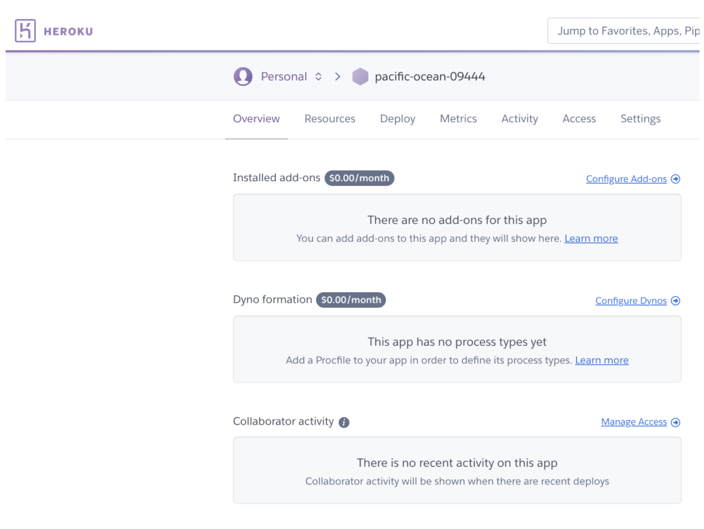

Rate limiting is a mechanism that many developers may have to deal with at some point in their life. It’s useful for a variety of purposes like sharing access to limited resources or limiting the number of requests made to an API endpoint and responding with a 429 status code. Building a rate limiter with Redis is easy because of two commands [INCR](https://redis.io/commands/incr) and [EXPIRE](https://redis.io/commands/expire). The basic concept is that you want to limit requests to a particular service in a given time period. Let’s say we have a service that has users identified by an API key. This service states that it is limited to 20 requests in any given minute.

In this tutorial, we will see how to deploy Rate Limiting using Redis and Go.
### Step 1. Create a Redis Enterprise Cloud Database

Create your free Redis Enterprise Cloud account. [Follow this link to create Redis Enterprise Cloud](https://developer.redis.com/create/rediscloud) subscription and database as shown below:


Save the database endpoint URL and password for future reference.


### Step 2. Create a Heroku account

If you are using Heroku for the first time, create your new Heroku account [through this link](https://signup.heroku.com/login)


### Step 3. Install Heroku CLI on your system

```bash
 brew install heroku
```


### Step 4. Login to Heroku

```bash
 heroku login
```


### Step 5. Connect your application to Redis Enterprise Cloud

For this demonstration, we will be using a Simple Rate Limiting application using Go


#### Clone the repository

 ```bash
  git clone https://github.com/basic-redis-rate-limiting-demo-go-lang
 ```


```bash
 heroku create

 Creating app... done, ⬢ powerful-fortress-83061

 https://powerful-fortress-83061.herokuapp.com/ | https://git.heroku.com/powerful-fortress-83061.git
```





### Step 6. Setting up Environmental variable

Go to Heroku dashboard, click "Settings" and set REDIS_HOST, REDIS_PORT and REDIS_PASSWORD under the Config Vars. Refer to Step 1 for the reference.


You now have a functioning Git repository that contains a simple application as well as a package.json file, which is used by Node’s dependency manager.


### Step 7. Deploy your code

Heroku generates a random name (in this case [powerful-fortress-83061](https://powerful-fortress-83061.herokuapp.com/)) for your app, or you can pass a parameter to specify your own app name. Now deploy your code:

```bash
 git push heroku
```
```bash
 Enumerating objects: 171, done.
 Counting objects: 100% (171/171), done.
 Delta compression using up to 12 threads
 Compressing objects: 100% (86/86), done.
 Writing objects: 100% (171/171), 5.65 MiB | 2.18 MiB/s, done.
 Total 171 (delta 74), reused 171 (delta 74), pack-reused 0
 remote: Compressing source files... done.
 remote: Building source:
 remote: **       **
 remote: **       Installed the following binaries:**
 remote: **       		./bin/basic-redis-rate-limiting-demo-go-lang**
 remote: **       **
 remote: **       Created a Procfile with the following entries:**
 remote: **       		web: bin/basic-redis-rate-limiting-demo-go-lang**
 remote: **       **
 remote: **       If these entries look incomplete or incorrect please create a Procfile with the required entries.**
 remote: **       See https://devcenter.heroku.com/articles/procfile for more details about Procfiles**
 remote: **       **
 remote: -----> Discovering process types
 remote:        Procfile declares types -> web
 remote: 
 remote: -----> Compressing...
 remote:        Done: 9.6M
 remote: -----> Launching...
 remote:        Released v7
 remote:        https://powerful-fortress-83061.herokuapp.com/ deployed to Heroku
 remote: 
 remote: Verifying deploy... done.
To https://git.heroku.com/powerful-fortress-83061.git

 * [new branch]      master -> master

If your app doesn point to the right repository, you can manually add it:

```bash
 heroku git:remote -a powerful-fortress-83061
```


### Step 8. Accessing the application

Open [https://powerful-fortress-83061.herokuapp.com/](https://powerful-fortress-83061.herokuapp.com/) to see your application.


## How it works

This app will block connections from a client after surpassing certain amount of requests (default: 10) per time period (default: 10 sec). The application returns the following headers in response to each request. The values of these headers tell the user how many requests they have remaining before they reach the limit. On the 10th run the server should return an HTTP status code of **429 Too Many Requests**

### Cookies

User identification based on cookies, on first request user will receive a cookie if it not exists
`CookieName: user-limiter`
`CookieValue: md5(<current time>)`
`<current time>` - request time in a format: `2006-01-02 15:04:05.999999999 -0700 MST`

### Redis Commands

- Read requests for user by `user-limiter` cookie: `GET requests.<USER_IDENTIFIER>` - get `USER_IDENTIFIER` from request cookie
  - E.g `GET requests.0cbc6611f5540bd0809a388dc95a615b`
- Set request counter with expired 10 sec if not exist in `requests.<USER_IDENTIFIER>`: `SETEX requests.<USER_IDENTIFIER> 10 0`
  - E.g `SETEX requests.0cbc6611f5540bd0809a388dc95a615b 10 0`
- Increment requests counter for each of user request: `INC requests.<USER_IDENTIFIER>`
  - E.g `INC requests.0cbc6611f5540bd0809a388dc95a615b`
- Get requests number for user: `GET requests.<USER_IDENTIFIER>`
  - E.g `GET requests.0cbc6611f5540bd0809a388dc95a615b`

### Code for rate limiting

```Go
func (c Controller) AcceptedRequest(user string, limit int) (int, bool) {
	key := c.key(user)

	if _, err := c.r.Get(key); err == redis.Nil {
		err := c.r.Set(key, "0", time.Second * time.Duration(limit))
		if err != nil {
			log.Println(err)
			return 0, false
		}
	}

	if err := c.r.Inc(key); err != nil {
		log.Println(err)
		return 0, false
	}

	requests, err := c.r.Get(key)
	if err != nil {
		log.Println(err)
		return 0,false
	}
	requestsNum, err := strconv.Atoi(requests)
	if err != nil {
		log.Println(err)
		return 0, false
	}

	if requestsNum > limit {
		return requestsNum, false
	}

	return requestsNum, true
 }
```

Where `c` corresponds to the active controller and `c.r` is a Redis client.

### Response

#### Status codes

- `200 - OK` - responded `PONG`
- `406 - Not Acceptable` - could not read cookie from request, returned when cookies are not allowed on the client side
- `429 - Too Many Requests` - user send more than 10 requests / 10sec

#### Headers

- `X-RateLimit-Limit: 10` - allowed number of limits per 10sec
- `X-RateLimit-Remaining: 9` - number of left request in 10sec window

### Available commands

- [SETEX](https://redis.io/commands/setex) 
- [GET](https://redis.io/commands/get)
- [DEL](https://redis.io/commands/del) 
- [INCR](https://redis.io/commands/incr)

### References

- [Deploy a Java app on Heroku using Redis](http://localhost:3000/create/heroku/herokujava)
- [Deploy a NodeJS app on Heroku using Redis](http://localhost:3000/create/heroku/herokunodejs)
- [Deploy a Python app on Heroku using Redis](http://localhost:3000/create/heroku/herokupython)
