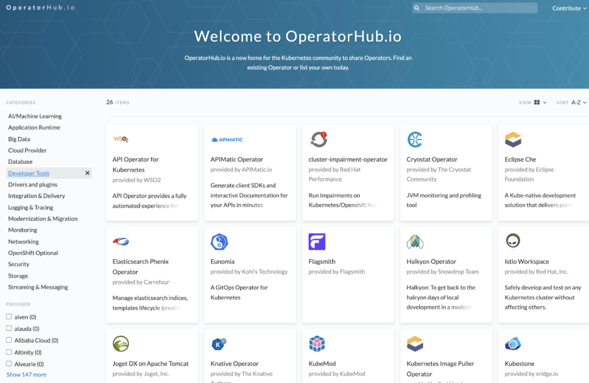
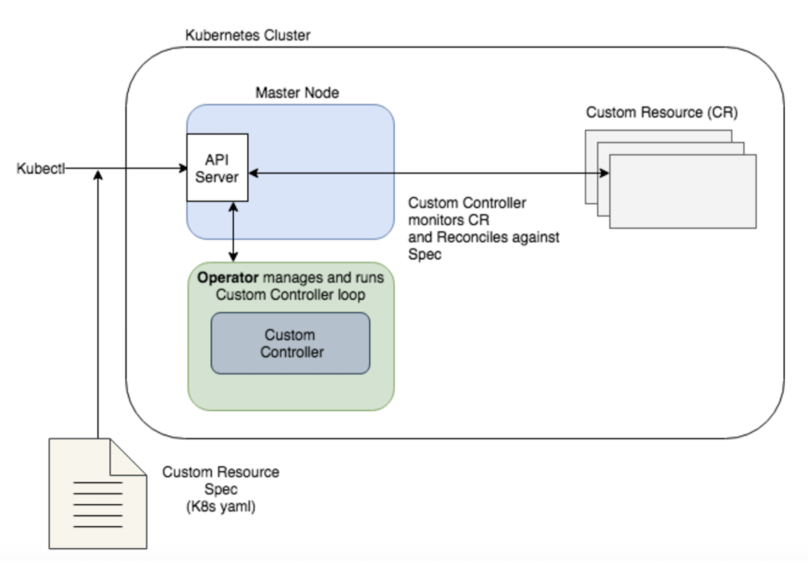

import Tabs from '@theme/Tabs';
import TabItem from '@theme/TabItem';
import useBaseUrl from '@docusaurus/useBaseUrl';
import RedisCard from '@site/src/theme/RedisCard';


[Kubernetes](https://kubernetes.io/) is popular due to its capability to deploy new apps at a faster pace. Thanks to “Infrastructure as data '' (specifically, YAML), today you can express all your Kubernetes  resources such as [Pods](https://kubernetes.io/docs/concepts/workloads/pods/), [Deployments](https://kubernetes.io/docs/concepts/workloads/controllers/deployment/), [Services](https://kubernetes.io/docs/concepts/services-networking/service/), [Volumes](https://kubernetes.io/docs/concepts/storage/volumes/), etc., in a YAML file. These default objects make it much easier for DevOps and SRE engineers to fully express their workloads without the need to learn how to write code in a programming language like Python, Java, or Ruby. 

Kubernetes is designed for automation. Out of the box, you get lots of built-in automation from the core of Kubernetes. It can speed up your development process by making easy, automated deployments, updates (rolling update), and by managing your apps and services with almost zero downtime. However,  Kubernetes can’t automate the process natively for stateful application. For example, say you have a stateful workload, such as a database application, running on several nodes. If a majority of nodes go down, you’ll need to reload the database from a specific snapshot following specific steps. Using existing default objects, types, and controllers in Kubernetes, this would be impossible to achieve. 

Think of scaling nodes up, or upgrading to a new version, or disaster recovery for your stateful application — these kinds of operations often need very specific steps, and typically require manual intervention. Kubernetes cannot know all about every stateful, complex, clustered application. Kubernetes, on its own, does not know the configuration values for, say, a Redis database cluster, with its arranged memberships and stateful, persistent storage. Additionally, scaling stateful applications in Kubernetes is not an easy task and requires manual intervention.

### Stateful Vs Stateless Application

Let’s try to understand the difference between [stateful](https://kubernetes.io/docs/tutorials/stateful-application/)  versus [stateless](https://kubernetes.io/docs/tutorials/stateless-application/) application with a simple example. Consider a Kubernetes cluster running a simple web application (without any operator). The YAML file below allows you to create two replicas of NGINX (a stateless application).


```
 apiVersion: apps/v1
 kind: Deployment
 metadata:
   name: nginx-deployment
   namespace: web
 spec:
   selector:
     matchLabels:
       app: nginx
   replicas: 2
   template:
     metadata:
       labels:
         app: nginx
     spec:
       containers:
       - name: nginx
         image: nginx:1.14.2
         ports:
         - containerPort: 80

```


In the example above, a Deployment object named nginx-deployment is created under a namespace “web,” indicated by the .metadata.name field. It creates two replicated Pods, indicated by the .spec.replicas field. The .spec.selector field defines how the Deployment finds which Pods to manage. In this case, you select a label that is defined in the Pod template (app: nginx). The template field contains the following subfields: the Pods are labeled app: nginx using the .metadata.labels field and the Pod template's specification indicates that the Pods run one container, nginx, which runs the nginx Docker Hub image at version 1.14.2. Finally, it creates one container and names it nginx.

Run the below command to create the Deployment resource:


```
kubectl create -f nginx-dep.yaml
```


Let us verify if the Deployment was created successfully by running the following command:


```
 kubectl get deployments
 NAME               READY   UP-TO-DATE   AVAILABLE   AGE
 nginx-deployment   2/2     2            2           63s
```


The example above shows the name of the Deployment in the namespace. It also displays how many replicas of the application are available to your users. You can also see that the number of desired replicas that have been updated to achieve the desired state is 2. 


You can run the “kubectl describe” command to get detailed information of deployment resources. Show details of a specific resource or group of resources


```
 kubectl describe deploy
 Name:                   nginx-deployment
 Namespace:              default
 CreationTimestamp:      Mon, 30 Dec 2019 07:10:33 +0000
 Labels:                 <none>
 Annotations:            deployment.kubernetes.io/revision: 1
 Selector:               app=nginx
 Replicas:               2 desired | 2 updated | 2 total | 0 available | 2 unavailable
 StrategyType:           RollingUpdate
 MinReadySeconds:        0
 RollingUpdateStrategy:  25% max unavailable, 25% max surge
 Pod Template:
   Labels:  app=nginx
   Containers:
    nginx:
     Image:        nginx:1.7.9
     Port:         80/TCP
     Host Port:    0/TCP
     Environment:  <none>
     Mounts:       <none>
   Volumes:        <none>
 Conditions:
   Type           Status  Reason
   ----           ------  ------
   Available      False   MinimumReplicasUnavailable
   Progressing    True    ReplicaSetUpdated
 OldReplicaSets:  <none>
 NewReplicaSet:   nginx-deployment-6dd86d77d (2/2 replicas created)
 Events:
   Type    Reason             Age   From                   Message
   ----    ------             ----  ----                   -------
   Normal  ScalingReplicaSet  90s   deployment-controller  Scaled up replica set nginx-deployment-6dd86d77d to 2
```


A Deployment is responsible for keeping a set of Pods running, but it’s equally important to expose an interface to these Pods so that the other external processes can access it. That’s where the Service resource comes in. The Service resource lets you expose an application running in Pods to be reachable from outside your cluster. Let us create Service resource definition as shown below:


```yaml
 apiVersion: v1
 kind: Service
 metadata:
   name: nginx-service
 spec:
   selector:
     app: nginx
   ports:
     - port: 80
       targetPort: 80
   type: LoadBalancer

```


The above YAML specification creates a new Service object named "nginx-service," which targets TCP port 80 on any Pod with the `app=nginx` label.


```
 kubectl get svc -n web             
 NAME            TYPE           CLUSTER-IP       EXTERNAL-IP   PORT(S)        AGE
 nginx-service   LoadBalancer   10.107.174.108   localhost     80:31596/TCP   46s

```


Let’s scale the Deployment to 4 replicas. We are going to use the kubectl scale command, followed by the deployment type, name, and desired number of instances. The output is similar to this:


```
kubectl scale deployments/nginx-deployment --replicas=4
deployment.extensions/nginx-deployment scaled
```


The change was applied, and we have 4 instances of the application available. Next, let’s check if the number of Pods changed. There should now be 4 Pods running in the cluster (as shown in the diagram below)


 ```bash
  kubectl get deployments
  NAME               READY   UP-TO-DATE   AVAILABLE   AGE
  nginx-deployment   4/4     4            4           4m
```


There are 4 Pods, with different IP addresses. The change was registered in the Deployment events log.


```
 kubectl get pods -o wide
 NAME                               READY   STATUS    RESTARTS   AGE     IP           NODE             NOMINATED NODE   READINESS GATES
 nginx-deployment-6dd86d77d-b4v7k   1/1     Running   0          4m32s   10.1.0.237   docker-desktop   none             none
 nginx-deployment-6dd86d77d-bnc5m   1/1     Running   0          4m32s   10.1.0.236   docker-desktop   none             none
 nginx-deployment-6dd86d77d-bs6jr   1/1     Running   0          86s     10.1.0.239   docker-desktop   none             none
 nginx-deployment-6dd86d77d-wbdzv   1/1     Running   0          86s     10.1.0.238   docker-desktop   none             none

```


Deleting one of the web server Pods triggers work in the control plane to restore the desired state of four replicas. Kubernetes starts a new Pod to replace the deleted one. In this excerpt, the replacement Pod shows a STATUS of ContainerCreating:


 ```bash
  kubectl delete pod nginx-deployment-6dd86d77d-b4v7k
 ```


You will notice that the Nginx static web server is interchangeable with any other replica, or with a new Pod that replaces one of the replicas. It doesn’t store data or maintain state in any way. Kubernetes doesn’t need to make any special arrangements to replace a failed Pod, or to scale the application by adding or removing replicas of the server. Now you might be thinking, what if you want to store the state of the application? Great question. 

### Scaling stateful application is hard

Scaling stateless applications in Kubernetes is easy but it’s not the same case for stateful applications. Stateful applications require manual intervention. Bringing Pods up and down is not that simple. Each Node has an identity and some data attached to it. Removing a Pod means losing its data and disrupting the system.


Consider a Kubernetes cluster with 6 worker Nodes hosting a Nginx web application connected to a persistent volume as shown above. Here is the snippet of StatefulSets YAML file:


```

apiVersion: apps/v1
kind: StatefulSet
metadata:
  name: web
spec:
  serviceName: "nginx"
  replicas: 2
  selector:
    matchLabels:
      app: nginx
  template:
    metadata:
      labels:
        app: nginx
    spec:
      containers:
      - name: nginx
        image: nginx:1.14.2
        ports:
        - containerPort: 80
          name: web
        volumeMounts:
        - name: www
          mountPath: /usr/share/nginx/html
  volumeClaimTemplates:
  - metadata:
      name: www
    spec:
      accessModes: [ "ReadWriteOnce" ]
      resources:
        requests:
          storage: 1Gi

```


Kubernetes makes physical storage devices available to your cluster in the form of objects called [Persistent Volumes](https://kubernetes.io/docs/concepts/storage/persistent-volumes/). Each of these Persistent Volumes is consumed by a Kubernetes Pod by issuing a [PersistentVolumeClaim](https://kubernetes.io/docs/concepts/storage/persistent-volumes/#claims-as-volumes) object, also known as PVC. A PVC object lets Pods use storage from Persistent Volumes. Imagine a scenario in which we want to downscale a cluster from 5 Nodes to 3 Nodes. Suddenly removing 2 Nodes at once is a potentially destructive operation. This might lead to the loss of all copies of the data. A better way to handle Node removal would be to first migrate data from the Node to be removed to other Nodes in the system before performing the actual Pod deletion. It is important to note that the StatefulSet controller is necessarily generic and cannot possibly know about every possible way to manage data migration and replication. In practice, however, StatefulSets are rarely enough to handle complex, distributed stateful workload systems in production environments. 

**Now the question is, how to solve this problem? **Enter Operators. Operators were developed to handle the sophisticated, stateful applications that the default Kubernetes controllers aren’t able to handle. While Kubernetes controllers like [StatefulSets](https://kubernetes.io/docs/concepts/workloads/controllers/statefulset/) are ideal for deploying, maintaining, and scaling simple stateless applications, they are not equipped to handle access to stateful resources, or to upgrade, resize, and backup of more elaborate clustered applications such as databases. A Kubernetes Operator fills in the gaps between the capabilities and automation provided by Kubernetes and how your software uses Kubernetes for automation of tasks relevant to your software.

An Operator is basically an application-specific controller that can help you manage a Kubernetes application. It is a way to package, run, and maintain a Kubernetes application. It is designed to extend the capabilities of Kubernetes, and also simplify application management. This is especially useful for stateful applications, which include persistent storage and other elements external to the application, and may require extra work to manage and maintain. 

### Functions of Kubernetes Operator

A Kubernetes Operator uses the Kubernetes API to create, configure, and manage instances of complex stateful applications on behalf of a Kubernetes user. There is a public repository called [OperatorHub.io](https://operatorhub.io) that is designed to be the public registry for finding Kubernetes Operator backend services. With Operator Hub, developers can easily create an application based on an operator without going through the complexity of crafting an operator from scratch.



Below are a few examples of popular Kubernetes Operators and their functions and capabilities.

#### Kubernetes Operators:


* Helps you deploy an application on demand (for example, [Argo CD operator (Helm](https://operatorhub.io/operator/argocd-operator-helm) is a declarative, GitOps continuous delivery tool for Kubernetes that helps with easy installation and configuration on demand)
* Helps you install applications with the required configurations and number of application instances
* Allows you to take and restore backups of the application state (for example, [Velero operator ](https://github.com/vmware-tanzu/velero) manages disaster recovery, backup, and restoration of cluster components such as pv, pvc, deployments, etc., to aid in disaster recovery)
* IHandles the upgrades of the application code plus the changes, such as database schema (for example, [Flux ](https://fluxcd.io/) is a continuous delivery solution for Kubernetes that allows automating updates to configuration when there is new code to deploy)
* Can manage a cluster of database servers (for example, [MariaDB operator](https://operatorhub.io/operator/mariadb-operator-app) creates MariaDB server and database easily by defining simple custom resource)
* Can install a database cluster of a declared software version and number of members
* Scale applications in or out
* Continues to monitor its application as it runs (for example, [Prometheus Operator ](https://operatorhub.io/operator/prometheus) simplifies the deployment and configuration of Prometheus, Alertmanager, and related monitoring components)
* Initiate upgrades, automated backups, and failure recovery, simulating failure in all or part of your cluster to test its resilience
* Allows you to publish a service to the applications that don’t support Kubernetes APIs to discover them

### How does Operator work?


Operators work by extending the Kubernetes control plane and API. Operators allows you to define a Custom Controller that watches your application and performs custom tasks based on its state. The application you want to watch is usually defined in Kubernetes as a new object: a [Custom Resource](https://kubernetes.io/docs/concepts/extend-kubernetes/api-extension/custom-resources/) (CR) that has its own YAML spec and object type that is well understood by the API server. That way, you can define any specific criteria in the custom spec to watch out for, and reconcile the instance when it doesn’t match the spec. The way an Operator’s controller reconciles against a spec is very similar to native Kubernetes controllers, though it is using mostly custom components.

### What is Redis Enterprise Operator?

<iframe width="760" height="415" src="https://www.youtube.com/embed/VjQZScpBj-I" title="YouTube video player" frameborder="0" allow="accelerometer; autoplay; clipboard-write; encrypted-media; gyroscope; picture-in-picture" allowfullscreen></iframe>


Redis has created an [Operator](https://docs.redis.com/6.0/platforms/kubernetes/concepts/operator/) that deploys and manages the lifecycle of a Redis Enterprise Cluster. [The Redis Enterprise Operator](https://operatorhub.io/operator/redis-enterprise) is the fastest, most efficient way to deploy and maintain a Redis Enterprise cluster in Kubernetes. The Operator creates, configures, and manages Redis Enterprise deployments from a single Kubernetes control plane. This means that you can manage Redis Enterprise instances on Kubernetes just by creating native objects, such as a Deployment, ReplicaSet, StatefulSet, etc. Operators allow full control over the Redis Enterprise cluster lifecycle.

The Redis Enterprise Operator acts as a [custom controller](https://kubernetes.io/docs/concepts/extend-kubernetes/api-extension/custom-resources/#custom-controllers) for the custom resource Redis Enterprise Cluster, or “REC”, which is defined through Kubernetes CRD ([customer resource definition](https://kubernetes.io/docs/concepts/extend-kubernetes/api-extension/custom-resources/#custom-resources)) and deployed with a YAML file.The Redis Enterprise Operator functions as the logic “glue” between the Kubernetes infrastructure and the Redis Enterprise cluster.

### How does the Redis Enterprise Operator work?





The Redis Enterprise Operator supports two Custom Resource Definitions (CRDs):


* **Redis Enterprise Cluster **(REC): An API to create Redis Enterprise clusters. Note that only one cluster is supported per Operator deployment.
* **Redis Enterprise Database **(REDB): An API to create Redis databases running on the Redis Enterprise cluster. Note that the Redis Enterprise Operator is namespaced. High-level architecture and overview of the solution can be found [HERE](https://docs.redislabs.com/latest/platforms/kubernetes/).

This is how it works:


1. First, the Redis Enterprise cluster custom resource (“CR” for short) is read and validated by the operator for a cluster specification.
1. Secondly, cluster StatefulSet, service rigger, cluster admin secrets, RS/UI services are created.
2. A Redis Enterprise Database CR is read and validated by the operator.
3. The database is created on the cluster and the database access credentials are stored in a Kubernetes secret object. 
4. The service rigger discovers the new database and configures the Kubernetes service for the database.
5. An application workload uses the database secret and service for access to data.

### Example of Operator automation

Consider the YAML file below:


```
apiVersion: app.redislabs.com/v1
kind: RedisEnterpriseCluster
metadata:
  name: rec
spec:
  # Add fields here
  nodes: 3

```


If you change the number of nodes to 5, the Operator talks to StatefulSets, and changes the number of replicas from 3 to 5. Once that happens, Kubernetes will take over and bootstrap new Nodes one at a time, deploying Pods accordingly. As each becomes ready, the new Nodes join the cluster and become available to Redis Enterprise master Nodes.


```
apiVersion: app.redislabs.com/v1
kind: RedisEnterpriseDatabase
metadata:
  name: redis-enterprise-database
spec:
  redisEnterpriseCluster:
    name: redis-enterprise
    Memory: 2G

```


 In order to create a database, the Operator discovers the resources, talks to the cluster RestAPI, and then it creates the database. The server talks to the API and discovers it. The DB creates a Redis database service endpoint for that database and that will be available. 

In the next tutorial, you will learn how to get started with the Redis Enterprise Kubernetes Operator from scratch, including how to perform non-trivial tasks such as backup, restore, horizontal scaling, and much more. Stay tuned!

### References


* [Create Redis database on Google Kubernetes Engine](/create/kubernetes/)
* [Redis Enterprise Software on Kubernetes architecture ](https://docs.redis.com/latest/kubernetes/deployment/quick-start/)
* [Deploy Redis Enterprise Software on Kubernetes](https://docs.redis.com/latest/kubernetes/deployment/quick-start/)
