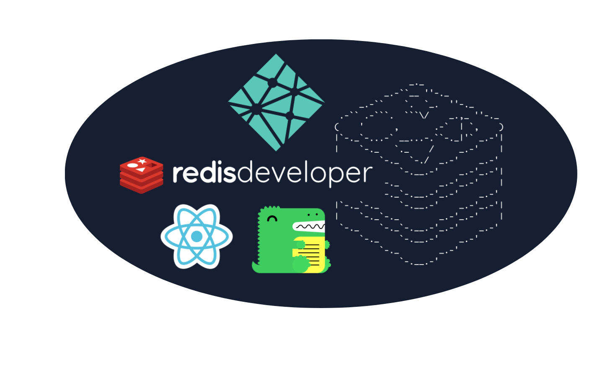
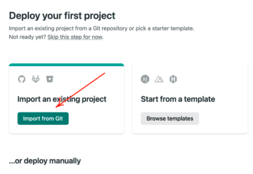
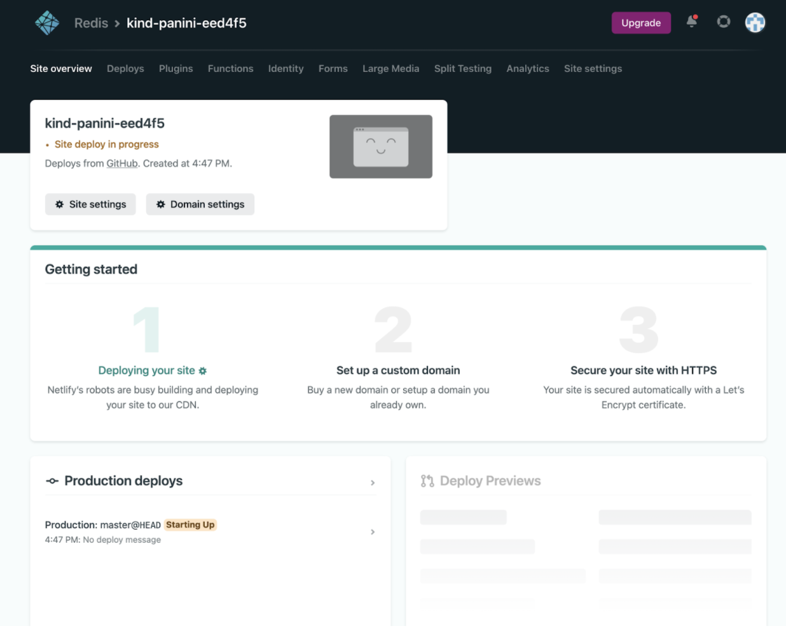
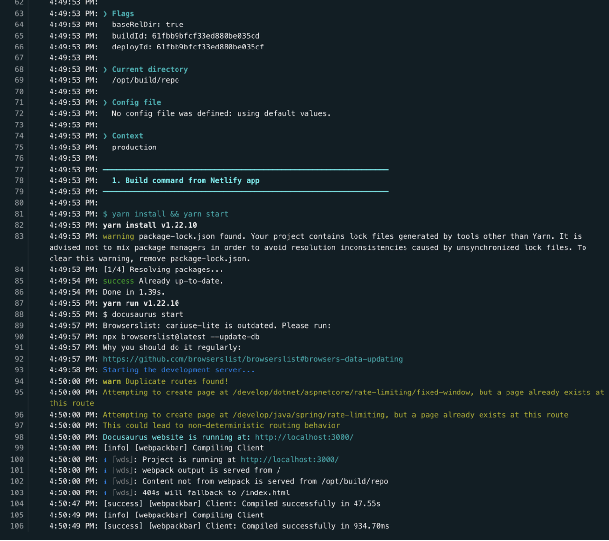

import RedisCard from '@site/src/theme/RedisCard';


Millions of developers use Netlify to instantly build, deploy and scale their modern web applications. The platform comes with the first class-support for every popular framework like JAMstack, React, VueJS, NextJS, Gatsby, AngularJS, Nuxt, Eleventy, Svelte, Hugo, Astro and so on.





The Netlify platform allows developers to build and deploy their site to the global network (CDN) from Git. It delivers out-of-the-box continous integration and continuous deployment. Developers love Netlify because it allows them to focus on building and deploying apps by abstracting all the maintenance work away from them. Features like free SSL, Custom Domain, deploy previews, functions and workflows etc makes Netlify the most comprehensive platform for web projects.

<div class="row">
 <div class="col">
     <RedisCard
        title="How to get started with Netlify"
        description="Learn how to deploy and host a Next.js app using Netlify "
        page="/create/netlify/getting-started-with-netlify"
        />
 </div>
</div>


[In the last tutorial](/create/netlify/getting-started-with-netlify), we leveraged [Netlify CLI](https://docs.netlify.com/cli/get-started/) to build a simple Next.js application built using TailwindCSS and Redis.
In this tutorial, you will see how to deploy a Docusaurus site to Netlify Dashboard UI in 5 minutes.
 
Let's get started..

### Table of Contents

- Step 1. Sign-in for a new Netlify Account
- Step 2. Connect Netlify to a Git Provider
- Step 3. Import the GitHub repository to your GitHub account
- Step 4. Provide Netlify access to your GitHub repository
- Step 5. Configure site settings for Netlify
- Step 6. Deploy your site
- Step 7. Visit your new Docusaurus site on Netlify


### Step 1. Sign-in for a new Netlify Account

Visit [https://app.netlify.com/](https://app.netlify.com/) and sign up for a Netlify account.


### Step 2. Connect your Netlify to Git Provider

Netlify provides you to sign-in using various ways - GitHub, GitLab, Bitbucket, Email and SSO.
For this demo we'll use GitHub. Sign into GitHub to connect it to Netlify.

It will ask you for two-factor authentication.


### Step 3. Import the project files to your GitHub account

Once you connect your Netlify account to GitHub, you can start collaborating with your other team members.
Before we do that, let's push a sample Docusaurus site to our GitHub repository. You can use a generic Docusaurus site if you want. The Redis Developer Hub is built on Docusaurus, so we are using it instead.



### Step 4. Allow Netlify to access the GitHub repository

Next, Netlify will allow you to import an existing project from a GitHub repository as shown below:


### Step 5. Configure site settings for Netlify 

There are two essential settings that need to be configured.
First, change the URL under `docusaurus.config.js` to any other random URL as shown below:

```javascript title="docusaurus.config.js"
....
module.exports = {
  title: 'Redis Developer Hub',
  tagline: 'The Home of Redis Developers',
  url: 'https://docusaurus-2.netlify.app',
  baseUrl: '/',
  onBrokenLinks: 'throw',
...
...
```

Secondly, you will need to add a build command as shown below:


### Step 6. Deploy your site

Click "Deploys" on the top navigation, you will see an option "Trigger Deploy" on the right-side.
Choose "Deploy site". If you are performing it for the second time, then choose "Clear cache and deploy site" option.




Monitor the "Deploy Log" carefully to see if any error messages appear in the log.


You should now be able to see your Docusaurus site hosted on port 3000.


### Step 7. Visit your new Docusaurus site on Netlify

Go to "Sites" on the top navigation menu and click on the latest preview build.


You will able to see that Netlify uploads site assets to a content delivery network and makes your site available.


### References

- [Netlify Build - A Modern CI-CD Infrastructure for Frontend Teams](https://www.netlify.com/products/build/)
- [Netlify Functions](https://www.netlify.com/products/functions/)
- [Netlify Edge](https://www.netlify.com/products/edge/)
- [Netlify WorkFlow](https://www.netlify.com/products/workflow/)
- [Netlify Analytics](https://www.netlify.com/products/analytics/)
