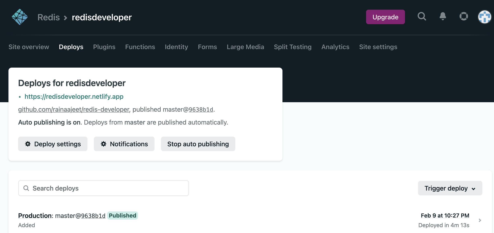

import RedisCard from '@site/src/theme/RedisCard';

Netlify is a popular static site hosting serverless platform. It is a popular way to build, deploy, and scale modern web applications in a much more scalable and secure way.  

Netlify helps developers to launch websites and campaigns in minutes with no fuss. Netlify is built primarily for JAMstack sites, which unify JavaScript and APIs to allow applications that are well suited for both developers and content editors.


### Features of Netlify

- It delivers out-of-the-box continuous integration.
- The platform allows continuous deployment through its support for Git repository deployment.
- It allows developers to focus on building and deploying apps by abstracting all the maintenance work away from the developers.
- The platform provides free SSL, CDN, and continuous integration.
- It has built-in DNS management & SSL certificates.

### How Netlify works?


1. The developer writes code and stores it in a version control repository (e.g. GitHub).
2. When a new change is merged into the main branch of the repository, a webhook notifies Netlify to deploy a new site.
3. Netlify pulls the latest version of the app from the repository and runs a build command to generate the static site files
4. Netlify then uses Plugins and internal code to make adjustments to your site, pre-render all of your pages in static HTML and improves it further
/
5. Once the build process gets completed, Netlify takes the static assets and pushes them to its global CDN for fast delivery.

In this tutorial, you will see how to deploy a simple Redis caching app built with Next.js and TailwindCSS to Netlify in 5 minutes.


### Table of Contents

- Step 1. Setup a Free Redis Enterprise Cloud Account
- Step 2. Install Netlify CLI
- Step 3. Clone the GitHub repository
- Step 4. Login to Netlify via CLI
- Step 5. Configure Continuous Deployment
- Step 6. Pushing the changes to GitHub
- Step 7. Open the Netlify Admin URL
- Step 8. Add Environment Variable 
- Step 9. Trigger the deployment
- Step 10. Accessing the app

### Step 1. Setup a free Redis Enterprise Cloud account

Visit [https://developer.redis.com/create/rediscloud/](https://developer.redis.com/create/rediscloud/) and create a free Redis Enterprise Cloud account. Enable the “RediSearch” module while you create the Redis Enterprise Cloud database. Once you complete the tutorial, you will be provided with the database Endpoint URL and password. Save it for future reference.

:::tip TIP
For a limited time, use **TIGER200** to get **$200** credits on Redis Enterprise Cloud and try all the advanced capabilities!

:tada: [Click here to sign up](https://redis.com/try-free)

:::


### Step 2. Install Netlify CLI

Netlify’s command line interface (CLI) lets you configure continuous deployment directly from the command line. Run the below command to install Netlify CLI on your local laptop:


```bash

npm install netlify-cli -g
```

Verify if Netlify is installed or not by running the below command:

```bash
 netlify version
 netlify-cli/8.15.3 darwin-x64 node-v14.17.3
```

### Step 3. Clone the repository

```bash
 git clone https://github.com/redis-developer/nextjs-redis-netlify
```


### Step 4. Login to Netlify via CLI

To authenticate and obtain an access token using the command line, run the following command to login to your Netlify account:


 ```bash
  netlify login
 ```
This will open a browser window, asking you to log in with Netlify and grant access to Netlify CLI.
Once you authenticate, it will ask you to close the window and display the below results:

<details><summary markdown="span"><strong>Result</strong></summary>

```
  Already logged in via netlify config on your machine

  Run netlify status for account details

  To see all available commands run: netlify help
```
</details>


### Step 5. Configure continuous deployent 

The ```netlify init``` command allows you to configure continuous deployment for a new or existing site. 
It will also allow you to create netlify.toml file if it doesn't exists.

```
netlify init  
```


<details><summary markdown="span"><strong>Result</strong></summary>

```
netlify init  
? What would you like to do? +  Create & configure a new site
? Team: Redis
Choose a unique site name (e.g. super-cool-site-by-redisdeveloper.netlify.app) or leave it blank for a random name. You can update the site name later.
? Site name (optional): undefined

Site Created

Admin URL: https://app.netlify.com/sites/super-cool-site-by-redisdeveloper
URL:       https://super-cool-site-by-redisdeveloper.netlify.app
Site ID:   a70bcfb7-b7b1-4fdd-be8b-5eb3b5dbd404

Linked to super-cool-site-by-redis-developer in /Users/redisdeveloper/projects/netlify/basic-caching-demo-nodejs/.netlify/state.json
? Your build command (hugo build/yarn run build/etc): yarn start
? Directory to deploy (blank for current dir): dist
? Netlify functions folder: functions
Adding deploy key to repository...
Deploy key added!

Creating Netlify GitHub Notification Hooks...
Netlify Notification Hooks configured!

Success! Netlify CI/CD Configured!

This site is now configured to automatically deploy from github branches & pull requests

Next steps:

  git push       Push to your git repository to trigger new site builds
  netlify open   Open the Netlify admin URL of your site
```
</details>

The above step creates a ```netlify.toml``` file with the following content

```javacript title="netlify.toml"
 [build]
  command = "npm run build"
  publish = ".next"

[[plugins]]
  package = "@netlify/plugin-nextjs"

```


### Step 6. Pushing the changes to GitHub

As instructed by Netlify, run the below commands to push the latest changes to GitHub:

```
git add .
git commit -m “Pushing the latest changes”
git push
```

### Step 7. Open the Netlify Admin URL

```bash
 netlify open --admin
```

### Step 8. Add Environment Variable for Redis Enterprise Cloud


### Step 9. Trigger the deployment

Click "Trigger deploy" to deploy the site




## Step 10. Accessing the app

Click on the deploy URL and you should be able to access the app as shown:


### Try it Yourself

[](https://app.netlify.com/start/deploy?repository=https://github.com/redis-developer/nextjs-redis-netlify)

### References

- [Redis Caching app using Next.js, TailwindCSS and Redis](https://github.com/redis-developer/nextjs-redis-netlify)
- [Introduction to Netlify](https://www.netlify.com/)
- [Netlify Functions](https://www.netlify.com/products/functions/)
- [Overview of JAMstack](https://www.netlify.com/jamstack/)

