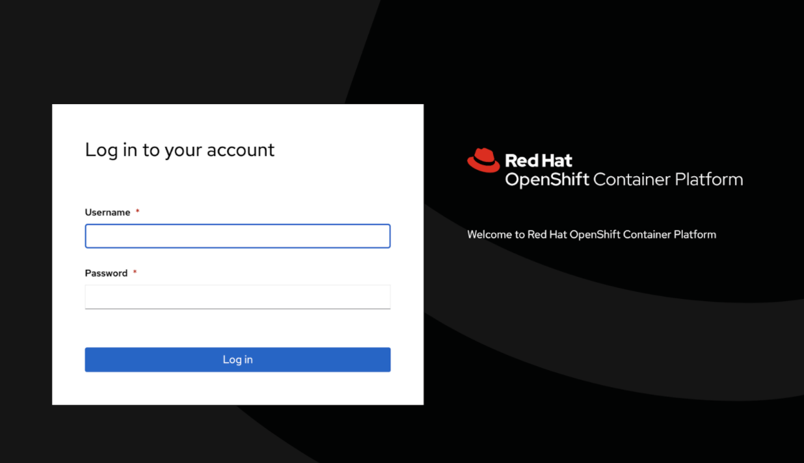
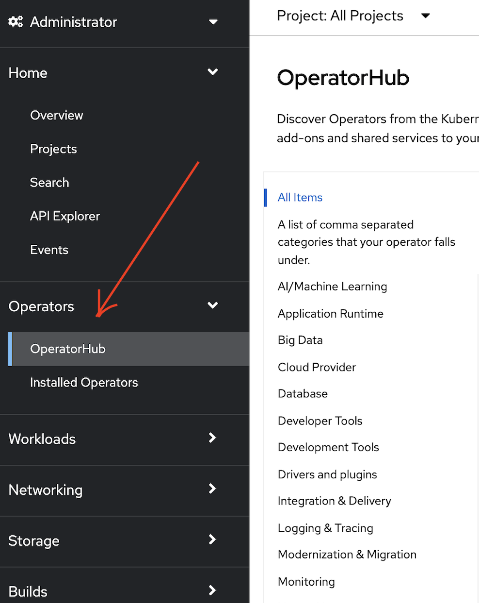
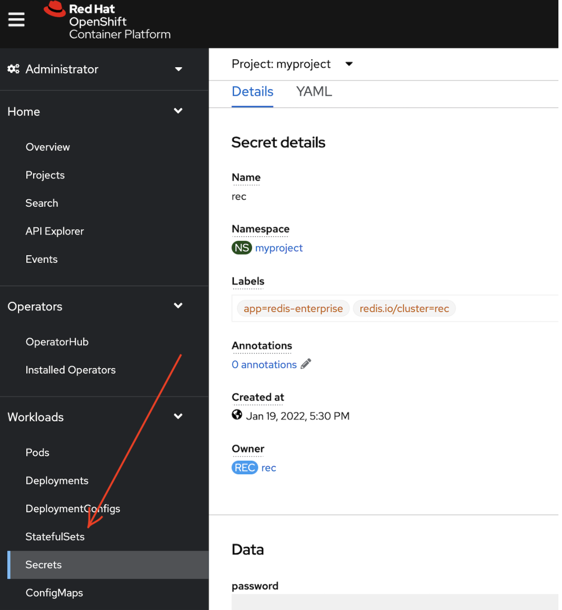
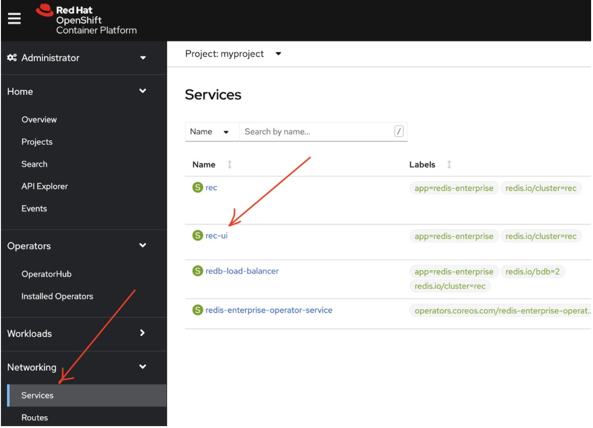
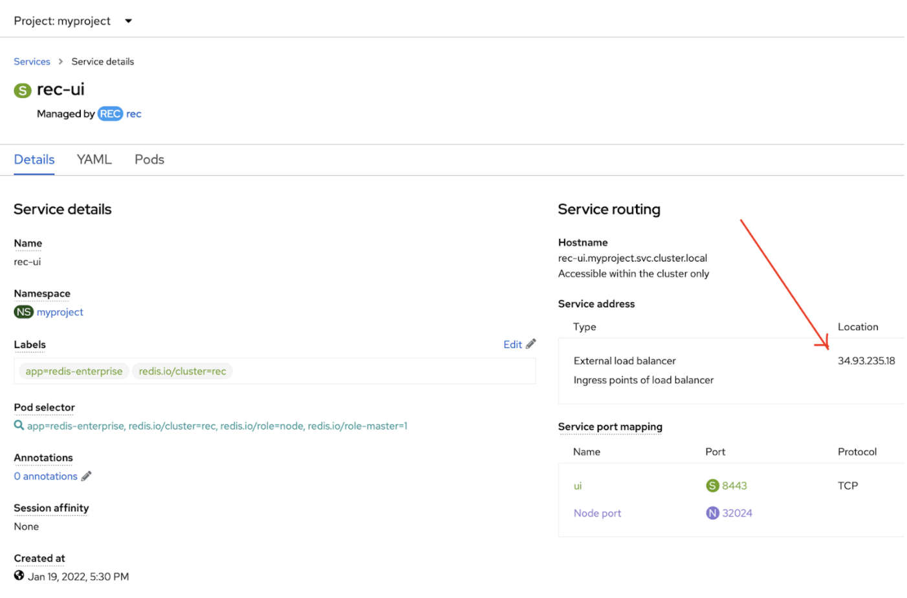
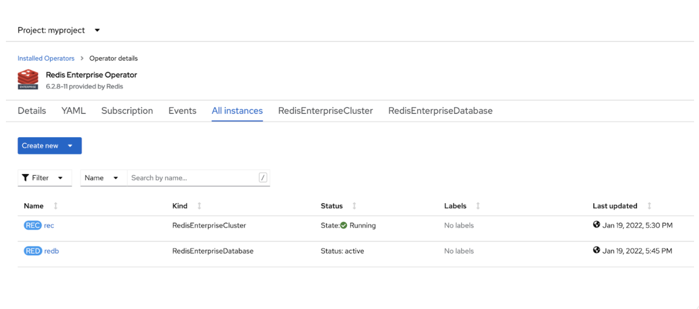
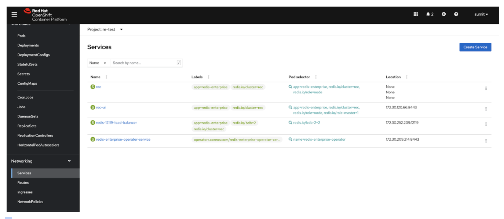

Deploying and managing containerised applications is not easy. With the rise of microservice architecture, it becomes cumbersome to deploy containers across multiple environments. Given that containers can be spun up in seconds and that too in a higher volume compared to VMs, managing across multiple platforms can be extremely challenging. OpenShift (kubernetes) comes to the rescue. Kubernetes is designed and built from the ground up to deploy and manage containerized applications across hundreds of compute nodes. Red Hat OpenShift is a leading enterprise kubernetes platform that enables a cloud-like experience everywhere it’s deployed, no matter if it’s in the cloud, on-premise or at the edge.

### What is OpenShift?

[Red Hat OpenShift](https://www.redhat.com/en/technologies/cloud-computing/openshift) gives you the ability to choose where you build, deploy, and run applications through a consistent experience. Red Hat OpenShift’s full-stack automated operations and self-service provisioning for developers lets teams work together more efficiently to move ideas from development to production. 

[Red Hat OpenShift focused on developer experience](https://www.redhat.com/en/technologies/cloud-computing/openshift/developers) and application security that's platform agnostic. OpenShift helps you develop and deploy applications to one or more hosts. These can be public facing web applications, or backend applications, including micro services or databases. Applications can be implemented in any programming language you choose. The only requirement is that the application can run within a container.  

[OpenShift Container Platform(OCP)](https://www.redhat.com/en/technologies/cloud-computing/openshift/container-platform) is a set of modular components and services built on top of Red Hat Enterprise Linux, and Kubernetes. OpenShift adds capabilities such as remote management, multitenancy, increased security, application life-cycle management and self-service interfaces for developers.

Red Hat OpenShift is built on Kubernetes and extends the open source platform in several ways to make it suitable for enterprise operations teams: 
- Automated installation and operations for platform updates on the container host, the Kubernetes cluster, and application services
- A consistent Kubernetes platform portable across different infrastructures and clouds 
- Built-in cluster and application monitoring using Prometheus and Grafana dashboards 
- Centralized policy management and enforcement across clusters 
- Built-in security checks for the entire container stack throughout the application life cycle 


### Supported Technologies

OpenShift is fully pluggable and works with a wide range of technologies some of them are Languages Runtimes like .NET, Java, Node.js, PHP, Python, Ruby, GoLang and Perl. Databases such as MariaDB, MongoDB, MySQL, PostgreSQL, and Redis. Red Hat and IBM Application Services which includes application runtimes, agile integration, business process automation technologies and other enterprise software solutions are available as containers which are managed by Operators in OpenShift. Also, OpenShift is certified with and supports 100+ independent software vendors including Redis Enterprise. 

### What is OperatorHub?

OperatorHub is the web console interface in OpenShift Container Platform that cluster administrators use to discover, install and manage Operators. In a few clicks, users can subscribe to the software they like via operators and make it available to software developers and platform administrators across cluster or isolated namespace environments using Operator Lifecycle Manager (OLM).

In this tutorial, you will learn how to deploy Redis Enterprise Cluster and Database on OpenShift using Redis Enterprise Kubernetes Operator.

### Pre-requisites:

To follow this guide, you should have an OpenShift cluster with 3 or more worker nodes. There are multiple ways to provision an OpenShift cluster, [you can follow the installation guide](https://docs.openshift.com/container-platform/4.9/installing/index.html) based on your preferred infrastructure or cloud provider. Redis Enterprise Operator currently supports OpenShift 3.11 and OpenShift 4.x. [Visit this page](https://docs.redis.com/latest/kubernetes/reference/supported_k8s_distributions/) to find all the supported Kubernetes distributions. 

In this guide we are using a self-managed OpenShift  Cluster on Google Cloud Platform.


### Step 1. Login to Red Hat Openshift Container Platform(OCP) 

You can login to OCP via CLI and user with cluster-admin role.


```
$ oc login
Authentication required for https://api.sumit.openshift.demo.redislabs.com:6443 (openshift)
Username: 
Password: 
Login successful.
```

You have access to 68 projects, the list has been suppressed. You can list all projects with 'oc projects'.

### Step 2. Verify the status of nodes

All the nodes should be in “Ready” status. 


```
$ oc get nodes
NAME                                 STATUS   ROLES          AGE    VERSION
demoopenshift-9x5xq-infra-b-h28tc    Ready    infra,worker   86m    v1.22.3+e790d7f
demoopenshift-9x5xq-infra-b-wrfgg    Ready    infra,worker   85m    v1.22.3+e790d7f
demoopenshift-9x5xq-master-0         Ready    master         103m   v1.22.3+e790d7f
demoopenshift-9x5xq-master-1         Ready    master         103m   v1.22.3+e790d7f
demoopenshift-9x5xq-master-2         Ready    master         103m   v1.22.3+e790d7f
demoopenshift-9x5xq-worker-b-6jwx2   Ready    worker         97m    v1.22.3+e790d7f
demoopenshift-9x5xq-worker-b-9pxhd   Ready    worker         95m    v1.22.3+e790d7f
```


### Step 3. Create a New Project 

Redis Enterprise can only be deployed in an user’s custom project. Hence, let us create a new project.


```
$ oc new-project myproject 
Now using project "myproject" on server "https://api.sumit.openshift.demo.redislabs.com:6443".

You can add applications to this project with the 'new-app' command. For example, try:

    oc new-app ruby~https://github.com/sclorg/ruby-ex.git

to build a new example application in Ruby. Or use kubectl to deploy a simple Kubernetes application:

    kubectl create deployment hello-node --image=gcr.io/hello-minikube-zero-install/hello-node
```


### Step 4. Clone the Redis Enterprise on Kubernetes Github repository


```
$ git clone https://github.com/RedisLabs/redis-enterprise-k8s-docs
$ cd redis-enteprise-k8s-docs/
```

### Step 5. Apply the SCC configuration


The scc [(Security Context Constraint)](https://docs.openshift.com/container-platform/4.8/authentication/managing-security-context-constraints.html) yaml defines security context constraints for the cluster for our project. This is composed of custom security settings and strategies that will provide access to the Redis Enterprise Operator and Cluster Pods to run on OpenShift.  We strongly recommend that you not change anything in this yaml file.

```
kind: SecurityContextConstraints
apiVersion: security.openshift.io/v1
metadata:
  name: redis-enterprise-scc
allowPrivilegedContainer: false
allowedCapabilities:
  - SYS_RESOURCE
runAsUser:
  type: MustRunAs
  uid: 1001
FSGroup:
  type: MustRunAs
  ranges: 1001,1001
seLinuxContext:
  type: RunAsAny
```

Apply the configuration to a resource by filename “scc.yaml” which is available in “openshift” folder as shown below:


```
 $  oc apply -f scc.yaml          
 securitycontextconstraints.security.openshift.io/redis-enterprise-scc configured
```

### Step 6. Provide the operator permissions for Redis Enterprise Operator and Cluster pods 

```
 $ oc adm policy add-scc-to-user redis-enterprise-scc system:serviceaccount:myproject:redis-enterprise-operator
 $ oc adm policy add-scc-to-user redis-enterprise-scc system:serviceaccount:myproject:rec
```

 
### Step 7. Deploy Redis Enterprise Operator 

If you want to perform this operation via UI, follow the below steps:

Login to OpenShift console with admin privileges.



Click on “OperatorHub” under Operators section.




This will open up a list of operators with various categories. Search for “Redis” and click “Redis Enterprise” without “Marketplace” tag to proceed further.


Click “Install” to start the installation process and then select the required channel, namespace and approval strategy in the next screen.


Wait till the installation gets completed.


Click on “Events” to see the streaming events to troubleshoot or check the progress of installation.


Step 8. Create Redis Enterprise Cluster


Once Redis Enterprise Operator is installed, we will create a Redis Enterprise Cluster instance using RedisEnterpriseCluster (REC) custom resource.

RedisEnterpriseCluster is the Schema for the redisenterpriseclusters API. From the installed Redis EnterpriseOperator, Click on “Create Redis Enterprise Cluster'' and click on “YAML” section and paste below sample yaml file:


```
apiVersion: app.redislabs.com/v1
kind: RedisEnterpriseCluster
metadata:
  name: rec
  namespace: myproject
spec:
  redisEnterpriseNodeResources:
    limits:
      cpu: 4000m
      memory: 4Gi
    requests:
      cpu: 4000m
      memory: 4Gi
  persistentSpec:
    enabled: true
    storageClassName: standard
  redisEnterpriseImageSpec:
    imagePullPolicy: IfNotPresent
    repository: redislabs/redis
    versionTag: 6.2.8-64.rhel7-openshift
  servicesRiggerSpec:
    databaseServiceType: load_balancer
    serviceNaming: redis-port
  nodes: 3
  uiServiceType: LoadBalancer
  username: demo@redis.com
```

For configuring any additional parameters for the Redis Enterprise Cluster custom resource, [visit this page](https://github.com/RedisLabs/redis-enterprise-k8s-docs/blob/master/redis_enterprise_cluster_api.md).

Wait till the status shows “Succeeded” under Redis Enterprise Operator. 


### Step 9. Prerequisites to access Redis Enterprise Cluster Admin Console

To access the Redis Enterprise Cluster admin console, you will need credentials. Follow the below steps to get the credentials via “rec” secret resource:



Under the “Data” section, you can reveal username and password.

Next, Click on “Services” and choose “rec-ui” under the services list:



Click on “Services” and look out for External Load-balancer IP.




### Step 10. Access the Redis Enterprise Cluster Amdin Console

From web browser access the rec-ui external IP http://IP:8443 to access  the Redis Enterprise Cluster Admin Console.


To login into Redis Enterprise Cluster, use the credentials what we have extracted above. 
By now, you will be able to see 3 nodes of the Redis Enterprise cluster.


### Step 11. Create Redis Enterprise Database

RedisEnterpriseDatabase is the Schema for the redisenterprisedatabases API. To create REDB, navigate to Installed Operator > Redis Enterprise Operator > Redis Enterprise Database > Click “Create RedisEnterpriseDatabase” to start the creation process using REDB custom resource. You can click on “YAML” and paste below sample yaml file.

```
apiVersion: app.redislabs.com/v1alpha1
kind: RedisEnterpriseDatabase
metadata:
  name: redb
  namespace: myproject
spec:
  redisEnterpriseCluster:
    name: rec
  memorySize: 1GB
  tlsMode: enabled
```


For configuring any additional parameters for the Redis Enterprise Database custom resource, visit this page.
Once the REDB creation is done, you should see the status as “active”. 



Finally, navigate to Redis Enterprise Cluster admin console to verify Redis Enterprise database. 

Click on the newly created database and then click on configuration option to see the overall details: 


Navigate back to the OpenShift console and verify the service object created for the Redis Database.




Select “Routes” from left panel and create a new route object for this database service with below sample yaml file:


```
kind: Route
apiVersion: route.openshift.io/v1
metadata:
 name: redb
 labels:
   app: redis-enterprise
   redis.io/cluster: rec    
spec:
 host: redb-re-test.apps.sumit.openshift.demo.redislabs.com
 to:
   kind: Service
   name: redis-12119-load-balancer
   weight: 100
 port:
   targetPort: redis
 tls:
   termination: passthrough
   insecureEdgeTerminationPolicy: None
```


Note the Host name 'my-db-hostname' from the created route object.


Note the database password "my-db-password" from the database secret object with name “db-name-redb”.


Get the default CA certificate from the redis-enterprise-node container on any of the Redis Enterprise pods and paste the output in a file called “proxy_cert.pem”.

```
$ oc exec -it <pod-name> -c redis-enterprise-node -- cat \ /etc/opt/redislabs/proxy_cert.pem 
```


Run the following openssl command, substituting your own values for 'my-db-hostname'.

```
$  openssl s_client -connect <my-db-hostname>:443 -crlf \
 -CAfile ./proxy_cert.pem -servername <my-db-hostname>  
```


Authorize the database with the password and enter the ping command. If you are connected to the database, you will receive PONG back, as shown below:

```
...
... 
...
    Verify return code: 0 (ok)
 ---
 auth 'my-db-password'
 +OK 
 
 PING 
 +PONG  
```


You can use the code below to test your access with Python, substituting your own values for 'my-db-hostname' and 'file-path'.

```
 import redis
 try:
    r = redis.StrictRedis(    
    host='my-db-hostname',
    port=443,
    password='my-db-password',
    ssl=True,
    ssl_ca_certs='file-path')
    print (r.info())
 #test the connection
    print('Testing redis by setting a key and value..')
    r.set('hello', 'world')
    value = r.get('hello')
    print(value)
 except Exception as e:
    print (e) 
```


Your output should look something like this:

```
{'redis_version': '6.0.13', 'redis_git_sha1': 0, 'redis_git_dirty': 0, 'redis_build_id': 0, 'redis_mode': 'standalone', 'os': 'Linux 4.18.0-305.30.1.el8_4.x86_64 x86_64'
...
...
...

Testing redis by setting a key and value..
b'world'
 
```


In our next tutorial, we will learn how to deploy a sample Real-time chat application powered by Go and Redis on OpenShift Container Platform.


### References:

- [Deploy Redis Enterprise Software on Kubernetes with OpenShift](https://docs.redis.com/latest/kubernetes/deployment/openshift/)
- [Official OpenShift Documentation](https://docs.openshift.com/)
- [Install a Cluster quickly on GCP](https://docs.openshift.com/container-platform/4.7/installing/installing_gcp/installing-gcp-default.html)
- [Redis Enterprise on Kubernetes Github Repository](https://github.com/RedisLabs/redis-enterprise-k8s-docs)
