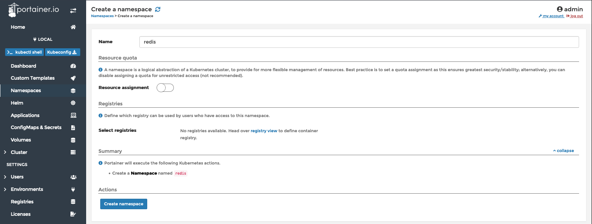
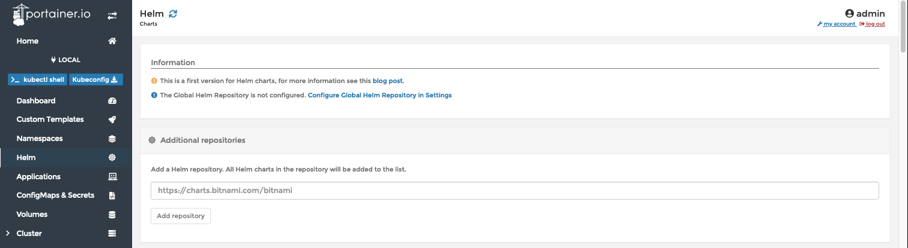
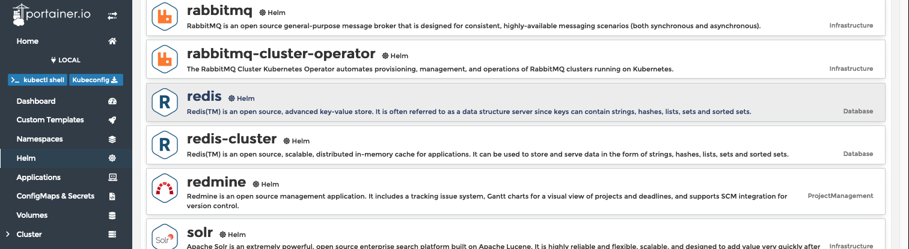
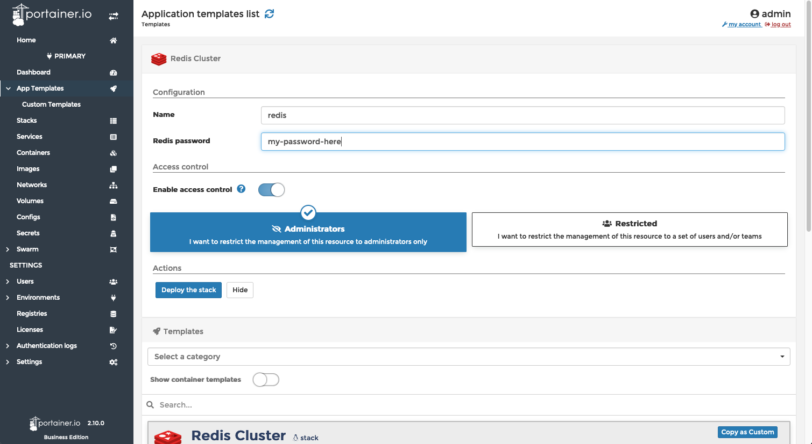
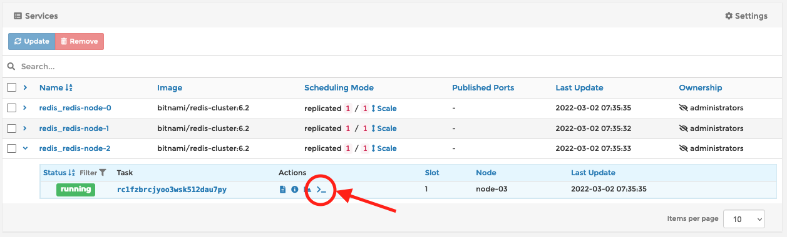
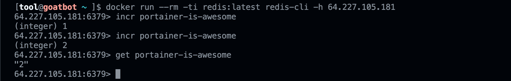

Redis is an in-memory data structure store, used as a distributed, in-memory key–value database, cache and message broker, with optional durability. Redis supports different kinds of abstract data structures, such as strings, lists, maps, sets, sorted sets, HyperLogLogs, bitmaps, streams, and spatial indices. [~Wikipedia](https://en.wikipedia.org/wiki/Redis)

You can’t travel far in the modern software world without finding that you need an in-memory data store. Today, the answer to “Which data store?” is often Redis. Also today, the answer to “How to Redis?” can be Portainer.

In this blog we'll take you through using Portainer to set up Redis in three common scenarios.

### Scenario 1: Kubernetes

Many organizations are either already using Kubernetes in some capacity or they are on a journey to adopt it, so let’s start there.

First, log into Portainer and select a Kubernetes environment to manage. Then, in the navigation menu on the left, click **"Namespaces"**, and then click the **"Add namespace with form"** button.

- Give the namespace a name, in the case “**redis**”.
- Turn off **"Resource assignment"** (only for the purpose of simplicity for this demo).
- Click the **“Create namespace”** button.

Now that we have a namespace for Redis to operate in, let’s install it.

In the navigation menu on the left, click **“Helm”**. If you haven’t already done so, add the Bitnami charts repository by typing https://charts.bitnami.com/bitnami into the **“Additional repositories”** form, and then click **“Add repository”**.

Once the Bitnami charts repository has been added, you should see a list of Charts on this page. Find **"Redis"** and click on it.

Note, you will see redis-cluster listed as an option. The redis-cluster Helm chart configures a six node cluster; three masters, and three slaves. The redis Helm chart we will use configures a much simpler three node cluster; one master, and two slaves. There are a number of other differences between these two Helm charts. For a complete list of differences, Bitnami has a good description [here](https://docs.bitnami.com/kubernetes/infrastructure/redis/get-started/compare-solutions/)

Next, scroll to the top of the page to configure Redis for deployment.

- Select **“redis”** in the Namespace dropdown.
- Enter **“redis”** for the Name.
- Click **“Show custom values”**. I am going to expose Redis via NodePort 31000. I picked port 31000 because I know that ports 31000-31010 are open to my cluster. To get this done I will set the **.service.type* to NodePort and the **.service.nodePorts.redis* to 31000. As you can see in the screenshot below, these can currently be found on lines 431 and 441 in the Helm chart.
- Click the **“Install”** button.

When it’s finished, you can head to the Applications page by clicking Applications in the navigation menu on the left. When Kubernetes is finished bringing up Redis, you will see the Status as **“Ready”**.

Note that what is deployed is a STATEFULSET application, which means it persists data. You can see the volumes which have been created (which use the default storage class of your system) by clicking **"Volumes"**.

See that each pod has its own copy/replica of the DB content, and note that it defaults to 8GB size. If you need to change this, then its line 409 in the values file of the HELM deployment.

And that’s it. The only thing left to do is test it. Before we do that, we’re going to take a short detour. There are two facts about the Helm chart install of Redis that you should know. First, Redis will come up requiring authentication to connect to it. Second, a random password was created during installation. To find it, in Portainer click on “ConfigMaps & Secrets” in the navigation menu on the left. Find the secret named **“redis”** and click on it. The password that you’ll need to authenticate with is the value of the *redis-password* key.

With that in hand, you can test that your Redis server is running. My typical rudimentary test of a Redis deployment is to connect to it with the redis-cli from my laptop and increment an arbitrary key. You’ll see that the client is connecting to our NodePort here and using the password we found in our Secrets.

In a shocking plot twist, this worked.

### Scenario 2: Docker Swarm

Long live Docker Swarm! There is still plenty of Swarm in the wild and Portainer is managing a lot of it. Let’s bring up Redis in Swarm.

For the purposes of this demo, we will use a Portainer App Template to deploy Redis, and this assumes you are using Portainer’s provided App Template Repo. You can check that under “Settings”.

Now that you know you are good to go,

- Click "App Templates" in the navigation menu on the left.
- Find and click on Redis Cluster

- Fill in the name, in this case **"redis"**.
- Provide a SECURE password for **Redis**.
- Click the **“Deploy the stack”** button.

You will be taken to the “Stacks list” page and will see the new stack named “redis”. Click on “redis” to see information about this stack. Like this:

To test, Expand one of the services that you see on the stack details page (above). Then click on the container’s “exec console” icon.

- Click on the “Connect” button to start the shell.

Once the console opens, the Redis deployment can be tested like so:
In case it’s difficult to see, the command used to connect to a redis node is `redis-cli -h redis-node-1 -c -a my-password-here --no-auth-warning`

### Scenario 3: Docker & Docker Swarm - Can I just have a container?

Sometimes I just want a Redis container, not a whole situation. Just a quick, unsophisticated Redis container. Here’s how to get that done in Portainer.

- Click **"App Templates"** in the navigation menu on the left.
- Toggle the **"Show container templates"** switch to on.

- Find and click on Redis.
- Give the application a name, in this case "redis".
- Click on “Show advanced options”.
- Set the port to map. In this example, the Docker **host**'s port 6379 is forwarded to the **container**'s port 6379, Redis’s default port for most communications.
- Click on the “Deploy the container” button.

That’s it. You can test in the same way as before.

Three different scenarios - Three easy Redis deployments using Portainer
