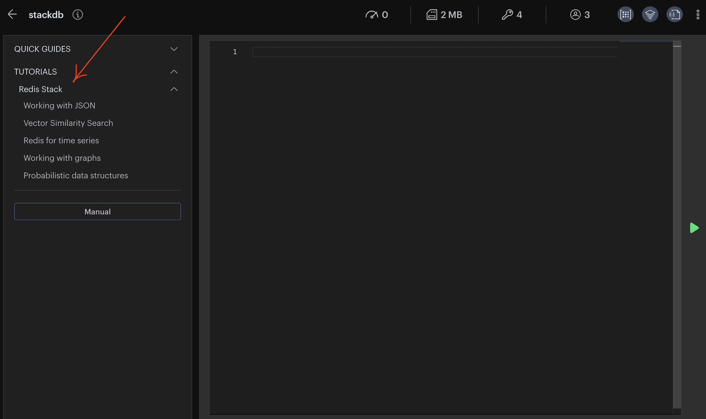

import RedisCard from '@site/src/theme/RedisCard';
import Tabs from '@theme/Tabs';
import TabItem from '@theme/TabItem';
import useBaseUrl from '@docusaurus/useBaseUrl';


Redis Stack is an extension of Redis that adds modern data models and processing engines to provide a complete developer experience.Redis Stack provides a simple and seamless way to access different data models such as full-text search, document store, graph, time series, and probabilistic data structures enabling developers to build any real-time data application. 


### Redis OSS Vs Redis Stack

In addition to all of the features of OSS Redis, Redis stack supports:

- Queryable JSON documents
- Full-text search
- Time series data (ingestion & querying)
- Graph data models with the Cypher query language
- Probabilistic data structures


### Redis Stack License

Redis Stack is made up of several components, licensed as follows:

- Redis Stack Server combines open source Redis with RediSearch, RedisJSON RedisGraph, RedisTimeSeries and RedisBloom is licensed under the Redis Source Available License (RSAL).
- RedisInsight is licensed under the Server Side Public License (SSPL).


### Which client libraries support Redis Stack?

Redis Stack supports various client libraries. The following core client libraries support Redis Stack:

- [Jedis](https://github.com/redis/jedis) >= 4.0
- [node-redis](https://github.com/redis/node-redis) >= 4.0
- [redis-py](https://github.com/redis/redis-py/) >= 4.0

The Redis OM client libraries let you use the document modeling, indexing, and querying capabilities of Redis Stack much like the way you’d use an ORM. The following Redis OM libraries support Redis Stack:

- [Redis OM .NET](https://github.com/redis/redis-om-dotnet)
- [Redis OM Node](https://github.com/redis/redis-om-node)
- [Redis OM Python](https://github.com/redis/redis-om-python)
- [Redis OM Spring](https://github.com/redis/redis-om-spring)


### Getting Started

<Tabs
  defaultValue="Redis Enterprise Cloud"
  values={[
    {label: 'Redis Enterprise Cloud', value: 'Redis Enterprise Cloud'},
    {label: 'Mac', value: 'Mac'},
    {label: 'Docker', value: 'Docker'},
  ]}>
  <TabItem value="Redis Enterprise Cloud">


####  Using Redis Enterprise Cloud

### Step 1. Create free cloud account

Create your free <a href="https://redis.com/try-free/" target="_blank" rel="noopener">Redis Enterprise Cloud account</a>. Once you click on “Get Started”, you will receive an email with a link to activate your account and complete your signup process.

:::info TIP
For a limited time, use **TIGER200** to get **$200** credits on Redis Enterprise Cloud and try all the advanced capabilities!

:tada: [Click here to sign up](https://redis.com/try-free)

:::

### Step 2. Create Your database

Choose your preferred cloud vendor. Select the region and then click "Let's start free" to create your free database automatically.

:::info TIP
If you want to create a custom database with your preferred name and type of redis,
click "Create a custom database" option shown in the image.
:::


### Step 3.  Verify the database details

You will be provided with Public endpoint URL and "Redis Stack" as the type of database with the list of modules that comes by default.


### Step 4. Install RedisInsight

RedisInsight is a visual tool that lets you do both GUI- and CLI-based interactions with your Redis database, and so much more when developing your Redis based application. It is a fully-featured pure Desktop GUI client that provides capabilities to design, develop and optimize your Redis application. It works with any cloud provider as long as you run it on a host with network access to your cloud-based Redis server. It makes it easy to discover cloud databases and configure connection details with a single click. It allows you to automatically add Redis Enterprise Software and Redis Enterprise Cloud databases.

You can install Redis Stack on your local system to get RedisInsight GUI tool up and running. Ensure that you have `brew` package installed in your Mac system.


 ```bash
  brew tap redis-stack/redis-stack
  brew install --cask redis-stack
 ```

 ```
  ==> Installing Cask redis-stack-redisinsight
  ==> Moving App 'RedisInsight-preview.app' to '/Applications/RedisInsight-preview.app'
  🍺  redis-stack-redisinsight was successfully installed!
  ==> Installing Cask redis-stack
  🍺  redis-stack was successfully installed!
 ```

Go to Applications and click "RedisInsight Preview" to bring up the Redis Desktop GUI tool.


### Step 5. Add Redis database 


### Step 6. Enter Redis Enterprise Cloud details

Add the Redis Enterprise cloud database endpoint, port and password. 


### Step 7. Verify the database under RedisInsight dashboard


### Step 8. Try Redis Stack tutorials

In this tutorial, we will go through an example of a bike shop. We will show the different capabilities of Redis Stack.

Choose "Redis Stack" in the left sidebar.



### Step 9. Store and Manage JSON

Let's examine the query for creating a single bike. Click "Create a bike" button:


It will display JSON.SET command with model, brand, price, type, specs and description details. The `bikes:1` is the name of Redis JSON key.

### Step 10. Accessing the part of stored JSON document 

Click "Get specific fileds" to access a part of stored JSON document as shown in the following diagram:


</TabItem>

<TabItem value="Mac">

To install Redis Stack on macOS, use Homebrew. Make sure that you have Homebrew installed before starting on the installation instructions below.


Follow the quick step to setup Redis Stack on your Mac:

### Step 1. Install Redis Stack using Homebrew

First, tap the Redis Stack Homebrew tap and then run `brew install` as shown below:

 ```bash
  brew tap redis-stack/redis-stack
  brew install --cask redis-stack
 ```

This will install all Redis and Redis Stack binaries. How you run these binaries depends on whether you already have Redis installed on your system.


 ```
  ==> Installing Cask redis-stack-redisinsight
  ==> Moving App 'RedisInsight-preview.app' to '/Applications/RedisInsight-preview.app'
  🍺  redis-stack-redisinsight was successfully installed!
  ==> Installing Cask redis-stack
  🍺  redis-stack was successfully installed!
 ```

:::info TIP

If this is the first time you’ve installed Redis on your system, then all Redis Stack binaries be installed and accessible from the `$PATH`. On M1 Macs, this assumes that `/opt/homebrew/bin` is in your path. On Intel-based Macs, /usr/local/bin should be in the $PATH.

To check this, run:

 ```bash
  echo $PATH
 ```


Then, confirm that the output contains /opt/homebrew/bin (M1 Mac) or /usr/local/bin (Intel Mac). If these directories are not in the output, see the “Existing Redis installation” instructions below.
:::

### Start Redis Stack Server

You can now start Redis Stack Server as follows:

 ```bash
  redis-stack-server
 ```


### Existing Redis installation

If you have an existing Redis installation on your system, then you’ll need to modify your `$PATH` to ensure that you’re using the latest Redis Stack binaries.

Open the file `~/.bashrc` or `~/zshrc` (depending on your shell), and add the following lines.


 ```bash
   export PATH=/usr/local/Caskroom/redis-stack-server/<VERSION>/bin:$PATH
 ```


Go to Applications and click "RedisInsight Preview" to bring up the Redis Desktop GUI tool.


### Step 2. Add Redis database


### Step 3. Enter Redis database details

Add the local Redis database endpoint and port.


### Step 5. Redis for time series


Redis Stack provides you with a native time series data structure. Let's see how a time series might be useful in our bike shop.

As we have multiple physical shops too, alongside our online shop, it could be helpful to have an overview of the sales volume. We will create one time series per shop tracking the total amount of all sales. In addition, we will mark the time series with the appropriate region label, east or west. This kind of representation will allow us to easily query bike sales performance per certain time periods, per shop, per region or across all shops.


Click "Guides" icon(just below the key) in the left sidebar and choose "Redis for the time series" for this demonstration. i


### Step 6. Create time series per shop


 ```bash
  TS.CREATE bike_sales_1 DUPLICATE_POLICY SUM LABELS region east compacted no
  TS.CREATE bike_sales_2 DUPLICATE_POLICY SUM LABELS region east compacted no
  TS.CREATE bike_sales_3 DUPLICATE_POLICY SUM LABELS region west compacted no
  TS.CREATE bike_sales_4 DUPLICATE_POLICY SUM LABELS region west compacted no
  TS.CREATE bike_sales_5 DUPLICATE_POLICY SUM LABELS region west compacted no
 ```
As shown in the following query, we make the shop id (1,2,3,4,5) a part of the time series name. You might also notice the DUPLICATE_POLICY SUM argument; this describes what should be done when two events in the same time series share the same timestamp: In this case, it would mean that two sales happened at exactly the same time, so the resulting value should be a sum of the two sales amounts.

Since the metrics are collected with a millisecond timestamp, we can compact our time series into sales per hour:


### Step 7. Running the query


### Step 8. Time series compaction

RedisTimeSeries supports downsampling with the following aggregations: avg, sum, min, max, range, count, first and last. If you want to keep all of your raw data points indefinitely, your data set grows linearly over time. However, if your use case allows you to have less fine-grained data further back in time, downsampling can be applied. This allows you to keep fewer historical data points by aggregating raw data for a given time window using a given aggregation function.

#### Example:


 ```
  TS.CREATERULE bike_sales_5 bike_sales_5_per_day AGGREGATION sum 86400000
 ```


</TabItem>


<TabItem value="Docker">

You can run Redis Stack using Docker container. There are two types of Docker images available in Docker Hub.

- The `redis/redis-stack` Docker image contains both Redis Stack server and RedisInsight. This container is recommended for local development because you can use RedisInsight to visualize your data.

- The `redis/redis-stack-server` provides Redis Stack but excludes RedisInsight. This container is best for production deployment.

### Getting started

To start Redis Stack server using the redis-stack image, run the following command in your terminal:

 ```bash
  docker run -d --name redis-stack -p 6379:6379 -p 8001:8001 redis/redis-stack:latest
 ````

You can use `redis-cli` to connect to the server, just as you connect to any Redis instance.
If you don’t have redis-cli installed locally, you can run it from the Docker container:

 ```bash
  docker exec -it redis-stack redis-cli
 ```

:::info TIP
The `docker run` command above also exposes RedisInsight on port 8001. You can use RedisInsight by pointing your browser to http://localhost:8001.
:::


To persist your Redis data to a local path, specify -v to configure a local volume. This command stores all data in the local directory local-data:

 ```bash
  docker run -v /local-data/:/data redis/redis-stack:latest
 ```

If you want to expose Redis Stack server or RedisInsight on a different port, update the left hand of portion of the -p argument. This command exposes Redis Stack server on port 10001 and RedisInsight on port 13333:

 ```bash
  docker run -p 10001:6379 -p 13333:8001 redis/redis-stack:latest
 ```

By default, the Redis Stack Docker containers use internal configuration files for Redis. To start Redis with local configuration file, you can use the -v volume options:

 ```bash
  docker run -v `pwd`/local-redis-stack.conf:/redis-stack.conf -p 6379:6379 -p 8001:8001 redis/redis-stack:latest
 ```

To pass in arbitrary configuration changes, you can set any of these environment variables:

- REDIS_ARGS: extra arguments for Redis
- REDISEARCH_ARGS: arguments for RediSearch
- REDISJSON_ARGS: arguments for RedisJSON
- REDISGRAPH_ARGS: arguments for RedisGraph
- REDISTIMESERIES_ARGS: arguments for RedisTimeSeries
- REDISBLOOM_ARGS: arguments for RedisBloom

For example, here’s how to use the REDIS_ARGS environment variable to pass the requirepass directive to Redis:

 ```
  docker run -e REDIS_ARGS="--requirepass redis-stack" redis/redis-stack:latest
 ```

Here’s how to set a retention policy for RedisTimeSeries:

 ```
  docker run -e REDISTIMESERIES_ARGS="RETENTION_POLICY=20" redis/redis-stack:latest
 ```

</TabItem>
</Tabs>

### Next Steps 

- [Perform Database Search and Analytics using the RediSearch Plugin in RedisInsight v2.0](/explore/redisinsightv2/redisearch)
- [Visualize Redis Database Keys using the RedisInsight Browser Tool](/explore/redisinsightv2/browser)
- [RedisInsight Profiler Tool - Analyze Your Redis Commands Using Redis Monitor Command](/explore/redisinsightv2/profiler)


