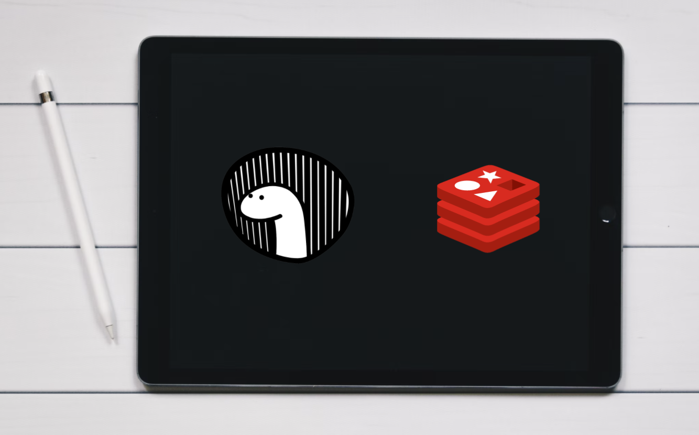
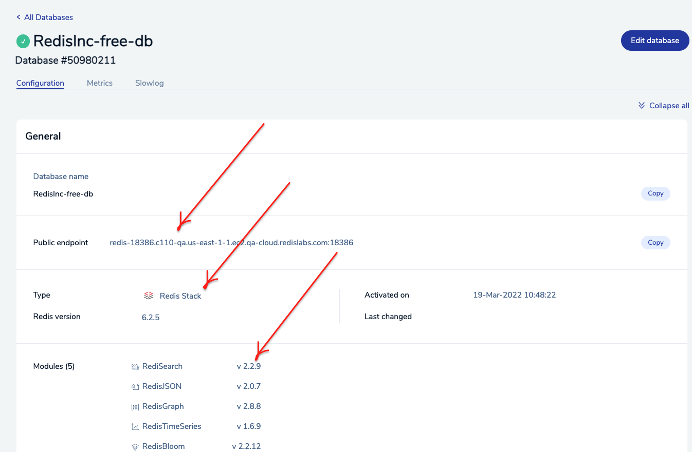

import Authors from '@site/src/theme/Authors';

<Authors frontMatter={frontMatter} />

[With over 80,000 stars and 670+ contributors](https://github.com/denoland/deno), Deno is a popular modern runtime for JavaScript and TypeScript. It is built on [V8](https://v8.dev/), an open-source JavaScript engine developed by the Chromium Project for Google Chrome and Chromium web browsers.



### Features of Deno

- Deno is secure by default. It executes code in a sandbox environment, disallowing runtime access to the underlying filesystem, environment variables and scripts.
- Deno supports both JavaScript and TypeScript out of the box.
- Deno ships as a single executable with no dependencies.
- Comes with built-in utilities such as a dependency inspector (deno info) and a code formatter (deno fmt).

### Getting Started

[deno.land/x](https://deno.land/x) is a hosting service for Deno scripts. It caches releases of open source modules stored on GitHub and serves them at one easy-to-remember domain. These modules contain small scripts that demonstrate use of Deno and its standard module.

The basic format of code URLs is

```
https://deno.land/x/IDENTIFIER@VERSION/FILE_PATH
```

#### Example:

```
https://deno.land/std@0.126.0/examples
```

In order to use Redis with Deno you will need a Deno Redis client. In the following sections, we will demonstrate the use of [an experimental implementation of a Redis client for Deno](https://deno.land/x/redis@v0.25.3).

### Step 1. Set up a free Redis Enterprise Cloud account

Visit [developer.redis.com/create/rediscloud/](/create/rediscloud/) and create [a free Redis Enterprise Cloud account](https://redis.com/try-free/). Once you complete this tutorial, you will be provided with the database endpoint URL and password. Save it for future reference.

:::info TIP
For a limited time, use **TIGER200** to get **$200** credits on Redis Enterprise Cloud and try all the advanced capabilities!

:tada: [Click here to sign up](https://redis.com/try-free)

:::



### Step 2. Get Deno

```
brew install deno
```

### Step 3. Verify if Deno is properly installed

```
deno -V
deno 1.19.0
```

### Step 4. Create an empty file with the following content

The following code creates a connection to Redis using Deno:

```javascript
import { connect } from 'https://deno.land/x/redis/mod.ts';
const redis = await connect({
  hostname: 'redis-18386.c110-qa.us-east-1-1.ec2.qa-cloud.redislabs.com',
  port: 18386,
  password: 'XXXX',
});
const ok = await redis.set('foo', 'bar');
const foo = await redis.get('foo');
```

Replace the values of hostname and port to match those of your Redis database, and add an extra password field if needed.

### Step 5. Executing the script

Deno can grab scripts from multiple sources. For example, you can provide a filename, a URL, or'-' to read the file from stdin.
You can run a JavaScript or TypeScript program by executing `deno run`.

```
deno run --allow-net redis.ts

```

When you run the script, the value of `foo` should be output. You can verify this by running the monitor command:

```
redis-15692.c264.ap-south-1-1.ec2.cloud.redislabs.com:15692> monitor
OK
1646536310.435577 [0 122.171.165.94:50193] "AUTH" "(redacted)"
1646536310.475578 [0 122.171.165.94:50193] "SET" "foo" "bar"
1646536310.511578 [0 122.171.165.94:50193] "GET" "foo"
```

### Additional references:

- [Getting Started with Deno Command Line Interface](https://deno.land/manual@v1.19.0/getting_started/command_line_interface)
- [Deno Releases Page](https://github.com/denoland/deno/releases)
- [Deno GitHub Repository](https://github.com/denoland/deno)
- [Deno Runtimes](https://deno.land/manual@v1.19.0/runtime)

<div>
  <a
    href="https://launchpad.redis.com"
    target="_blank"
    rel="noopener"
    className="link">

    

  </a>
</div>
