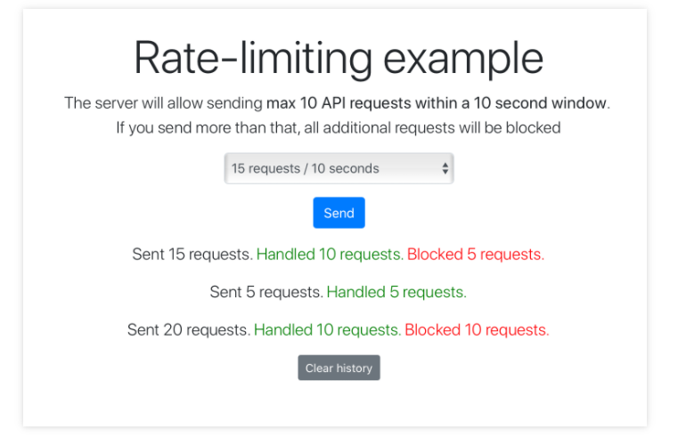
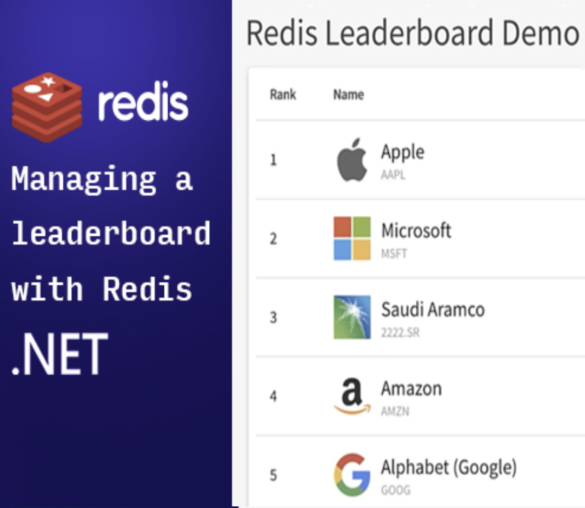
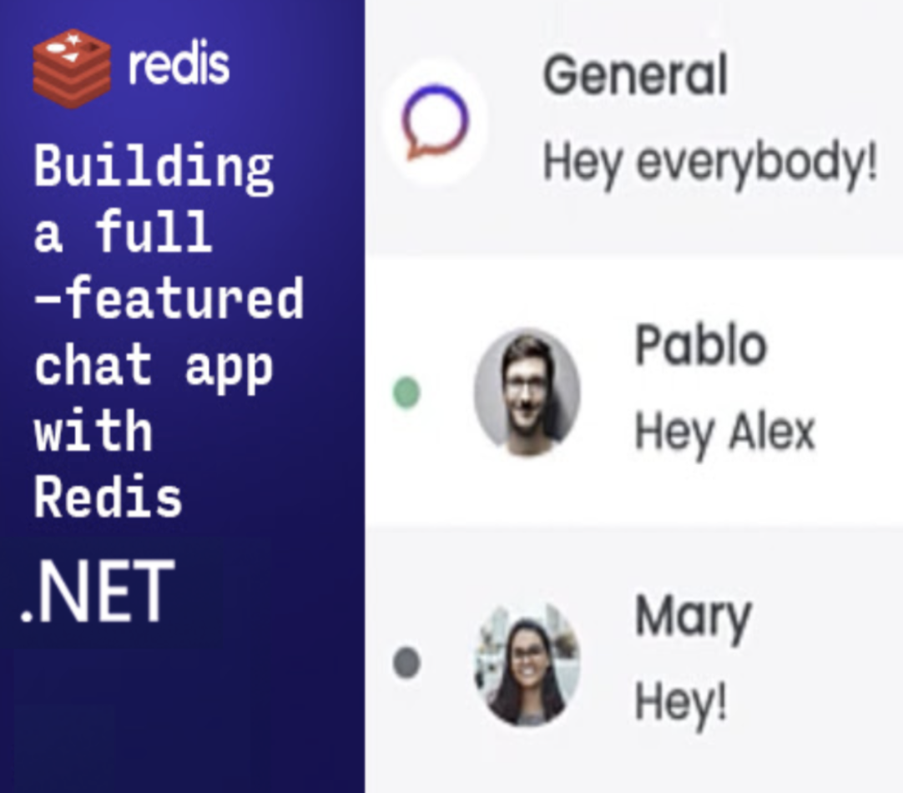

import Tabs from '@theme/Tabs';
import TabItem from '@theme/TabItem';
import useBaseUrl from '@docusaurus/useBaseUrl';
import RedisCard from '@site/src/theme/RedisCard';

## Getting Started

The .NET Community has built many [client libraries](https://redis.io/clients#c-sharp) to help handle requests to Redis Server. In this guide, we'll mostly be concerned with using the [StackExchange.Redis](https://github.com/StackExchange/StackExchange.Redis) client library. As the name implies the StackExchange client is developed by StackExchange for use on popular websites like [StackOverflow](https://stackoverflow.com/).

## Step 1. Install the Package

There are a few ways to Install the Package:

<Tabs
  defaultValue="cli"
  values={[
    {label: '.NET CLI', value: 'cli'},
    {label: 'PM Console', value: 'pmConsole'},
    {label: 'Package Reference', value: 'csproj'},
    {label: 'NuGet GUI', value: 'gui'}    
  ]}>
  <TabItem value="cli">

Run the following in the directory of the `csproj` file you want to add the package too.

  ```sh
    dotnet add package StackExchange.Redis
  ```

  </TabItem>
  <TabItem value="pmConsole">

  Run the following command from the Package Manager Console

  ```sh
  Install-Package StackExchange.Redis
  ```

  </TabItem>

  <TabItem value="csproj">

  You can also add the package directly to you `csproj` file with the following XML:

  ```XML
  <ItemGroup>    
    <PackageReference Include="StackExchange.Redis" Version="2.2.4" />
  </ItemGroup>
  ```
  
  </TabItem>

  <TabItem value="gui">

  If you're using Visual Studio, and you want to use the NuGet GUI just follow the steps outlined by [Microsoft](https://docs.microsoft.com/en-us/nuget/consume-packages/install-use-packages-visual-studio), and make sure to search for **StackExchange.Redis**
    
  </TabItem>
</Tabs>

## Step 2. Import the Required Namespace

```csharp
using StackExchange.Redis;
```

## Step 3. Initialize the ConnectionMultiplexer

The [ConnectionMultiplexer](https://stackexchange.github.io/StackExchange.Redis/Basics) is the main arbiter of the connection to Redis inside the CLR, your application should maintain a single instance of the ConnectionMultiplexer throughout its runtime. You can initialize the Multiplexer with either a connection string, or with a `ConfigurationOptions` object. A typical connection string is of the form: `HOST_NAME:PORT_NUMBER,password=PASSWORD` where `HOST_NAME` is the host name of your server (e.g. `localhost`), `PORT_NUMBER` is the port number Redis is listening on (e.g. `6379`) and `PASSWORD` is your redis server's password (e.g. `secret_password`).

```csharp
static readonly ConnectionMultiplexer _redis = ConnectionMultiplexer.Connect($"{HOST_NAME}:{PORT_NUMBER},password={PASSWORD}");
```

## Step 4. Grab Database Connection

Once we have a handle for the Multiplexer, we need get a connection to the database.

```csharp
var db = _redis.GetDatabase();
```

## Step 5. Use the connection

Now that you've retreived the connection to the database, all that's left is to use it. Here are some simple operations:

<Tabs
  defaultValue="ping"
  values={[
    {label: 'Ping the Database', 'value':'ping'},
    {label: 'Set and Get String', value: 'strings'},
    {label: 'List Operations', value: 'lists'},
    {label: 'Set Operations', value: 'sets'},
    {label: 'Hash Operations', value: 'hashes'}
  ]}>  

  <TabItem value='ping'>

  ```csharp
  db.Ping();
  ```

  </TabItem>

  <TabItem value='strings'>

  ### Set String

  ```csharp
  db.StringGetSet("foo","bar");
  ```

  ### Get String

  ```csharp
  Console.WriteLine(db.StringGet("foo"));
  ```

  </TabItem>

  <TabItem value="lists">

  ### Insert Into List

  ```csharp
  db.ListLeftPush("simple-list", 1);
  ```

  ### Pop Out of List

  ```csharp
  var result = db.ListRightPop("simple-list");
  Console.WriteLine(result);
  ```

  </TabItem>

  <TabItem value="sets">

  ### Insert Into Set

  ```csharp
  db.SetAdd("sample-set-1", new RedisValue[]{"apple", "banana", "tangerine", "kiwi"});
  db.SetAdd("sample-set-2", new RedisValue[]{"apple", "banana", "orange", "blueberries"});
  ```

  ### Set Union

  ```csharp
  var union = db.SetCombine(SetOperation.Union, "sample-set-1", "sample-set-2");
  Console.WriteLine(String.Join(", ", union));
  ```

  ### Set Intersection

  ```csharp
  var intersection = db.SetCombine(SetOperation.Intersect, "sample-set-1", "sample-set-2");
  Console.WriteLine(String.Join(", ", intersection));
  ```

  ### Set Difference 

  ```csharp
  var difference = db.SetCombine(SetOperation.Difference, "sample-set-1", "sample-set-2");
  Console.WriteLine(String.Join(", ",difference));
  ```

  </TabItem>

  <TabItem value="hashes">

  ### Add to Hash

  ```csharp
  db.HashSet("person:1", new HashEntry[]{new HashEntry("first-name","John"), new HashEntry("last-name","Smith")});
  ```

  ### Get Field From Hash

  ```csharp
  var firstName = db.HashGet("person:1", "first-name");
  Console.WriteLine(firstName);
  ```

  ### Get All Fields From Hash

  ```csharp
  var allFields = db.HashGetAll("person:1");
  Console.WriteLine(string.Join(", ",allFields));
  ```

  </TabItem>

</Tabs>

## Redis Launchpad

Redis Launchpad is like an “App Store” for Redis sample apps. You can easily find apps for your preferred frameworks and languages. 
Check out a few of these apps below, or [click here to access the complete list](https://launchpad.redis.com).

<div class="row text--center">

<div class="col ">
<div className="ri-container">

#### Rate Limiting App in .NET

[](https://launchpad.redis.com/?id=project%3Abasic-redis-rate-limiting-demo-csharp-dot-net)

</div>
</div>
<div class="col">
<div className="ri-container">

#### Leaderboard App in .NET

[](https://launchpad.redis.com/?id=project%3Abasic-redis-leaderboard-demo-dotnet)


</div>
</div>
</div>

<div class="row text--center">

<div class="col">
<div className="ri-container">

#### API Caching .NET

[](https://launchpad.redis.com/?id=project%3Abasic-caching-demo-csharpdotnet)

</div>
</div>

<div class="col">
<div className="ri-container">

#### Basic Chat App .NET

[](https://launchpad.redis.com/?id=project%3Abasic-redis-chat-app-demo-dotnet)

</div>
</div>

</div>

#### Additional Resources

- [Using C# with Redis](https://docs.redislabs.com/latest/rs/references/client_references/client_csharp/)
- [Using SSL and StackExchange.Redis](https://docs.redislabs.com/latest/rs/references/client_references/client_csharp/)


