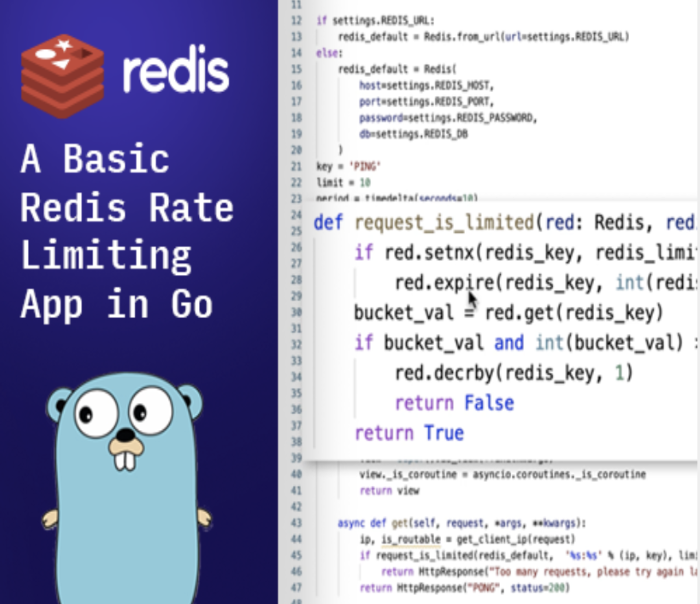

import Tabs from '@theme/Tabs';
import TabItem from '@theme/TabItem';
import useBaseUrl from '@docusaurus/useBaseUrl';
import RedisCard from '@site/src/theme/RedisCard';

Find tutorials, examples and technical articles that will help you to develop with Redis and Golang.

## Getting Started

Golang community has built many client libraries that you can find [here](https://redis.io/clients#go).
 For your first steps with Golang and Redis, this article will show how to use the recommended library: [redigo](https://github.com/gomodule/redigo).


 <Tabs
  defaultValue="redigo"
  values={[
    {label: 'Redigo', value: 'redigo'},
    {label: 'Go-Redis', value: 'go-redis'},
  ]}>
  <TabItem value="redigo">


The `redigo` library is located in the `https://github.com/gomodule/redigo` that you must import in your application.


#### Step 1. Import the `redigo` module

  ```bash
   go get github.com/gomodule/redigo/redis
  ```

  ```go
   import (
      "fmt"
      "context"
      "github.com/gomodule/redigo/redis"
   )
  ```

#### Step 2. Create a connection pool

  ```go
   func newPool() *redis.Pool {
       return &redis.Pool{
          MaxIdle: 80,
          MaxActive: 12000,
          Dial: func() (redis.Conn, error) {
                c, err := redis.Dial("tcp", ":6379")
                if err != nil {
                    panic(err.Error())
                }
                return c, err
            },
        }
    }
   ```    

#### Step 3. Write your application code

   ```go
    package main

    import (
        "fmt"

        "github.com/gomodule/redigo/redis"
    )

    var pool = newPool()

    func main() {

        client := pool.Get()
        defer client.Close()

        _, err := client.Do("SET", "mykey", "Hello from redigo!")
        if err != nil {
            panic(err)
        }

        value, err := client.Do("GET", "mykey")
        if err != nil {
            panic(err)
        }

        fmt.Printf("%s \n", value)

        _, err = client.Do("ZADD", "vehicles", 4, "car")
        if err != nil {
            panic(err)
        }
        _, err = client.Do("ZADD", "vehicles", 2, "bike")
        if err != nil {
            panic(err)
        }

        vehicles, err := client.Do("ZRANGE", "vehicles", 0, -1, "WITHSCORES")
        if err != nil {
            panic(err)
        }	
        fmt.Printf("%s \n", vehicles)

        
    }

    func newPool() *redis.Pool {
        return &redis.Pool{
            MaxIdle: 80,
            MaxActive: 12000,
            Dial: func() (redis.Conn, error) {
                c, err := redis.Dial("tcp", ":6379")
                if err != nil {
                    panic(err.Error())
                }
                return c, err
            },
        }
    }    
   ```

Find more information about Golang & Redis connections in the "[Redis Connect](https://github.com/redis-developer/redis-connect/tree/master/golang/redigo)".


  </TabItem>
<TabItem value="go-redis">

Go-redis is a type-safe, Redis client library for Go with support for features like Pub/Sub, sentinel, and pipelining.It is a Redis client able to support a Redis cluster and is designed to store and update slot info automatically with a cluster change. Below are the attractive features of Go-redis:
- Go-redis has pooling capabilities.(Pools allow you to safely handle go-routines, auto reconnect if any error occurs)
- It supports both standard, OSS cluster AIP, and Sentinel
- Comes with Auto reconnects / Auto-rediscovers cluster slots on error/migration
- Support instrumentations
- Allows for a custom dialer (this is useful for Enterprise)

The go-redis library is located in the https://github.com/go-redis/redis that you must import in your application.

#### Step 1. Run the Redis Docker container

```bash
 docker run -d -p 6379:6379 redislabs/redismod
```


#### Step 2. Initialise the Go Module

```bash
 go mod init github.com/my/repo
```

#### Step 3. Install redis/v8 

```bash
 go get github.com/go-redis/redis/v8
```

#### Step 4. Create a main.go file 

Let us create a main.go file and write the following code to check for your connection

```bash
 package main

import (
    "fmt"
    "github.com/go-redis/redis"
)

func main() {
    fmt.Println("Testing Go-Redis")

    client := redis.NewClient(&redis.Options{
        Addr: "localhost:6379",
        Password: "",
        DB: 0,
    })

    pong, err := client.Ping().Result()
    fmt.Println(pong, err)

 }
```

#### Step 5. Begin the compilation


```
 go run main.go
```

By now, the Go application should successfully connect to the Redis instance and  return a successful PONG response.


 </TabItem>


</Tabs>

###  Redis Launchpad

Redis Launchpad is like an “App Store” for Redis sample apps. You can easily find apps for your preferred frameworks and languages.
Below are few of these apps. [Click here to access the complete lists of apps](https://launchpad.redislabs.com)

<div class="row text--center">

<div class="col ">
<div className="ri-container">

#### Rate-Limiting app in Go




[Rate Limiting app](http://launchpad.redislabs.com/?id=project%3Abasic-redis-rate-limiting-demo-go-lang) built in Go
</div>
</div>

<div class="col">
<div className="ri-container">

#### Leaderboard app in Go


[How to implement leaderboard app](https://launchpad.redislabs.com/?id=project%3Abasic-redis-leaderboard-demo-python) in Go
</div>
</div>
</div>


### Technical Articles & Whitepapers

**[Redis and Golang: Designed to Improve Performance](https://redislabs.com/blog/redis-go-designed-improve-performance/)**

**[A High Performance Recommendation Engine with Redis and Go](https://redislabs.com/docs/ultra-fast-recommendations-engine-using-redis-go/)**


