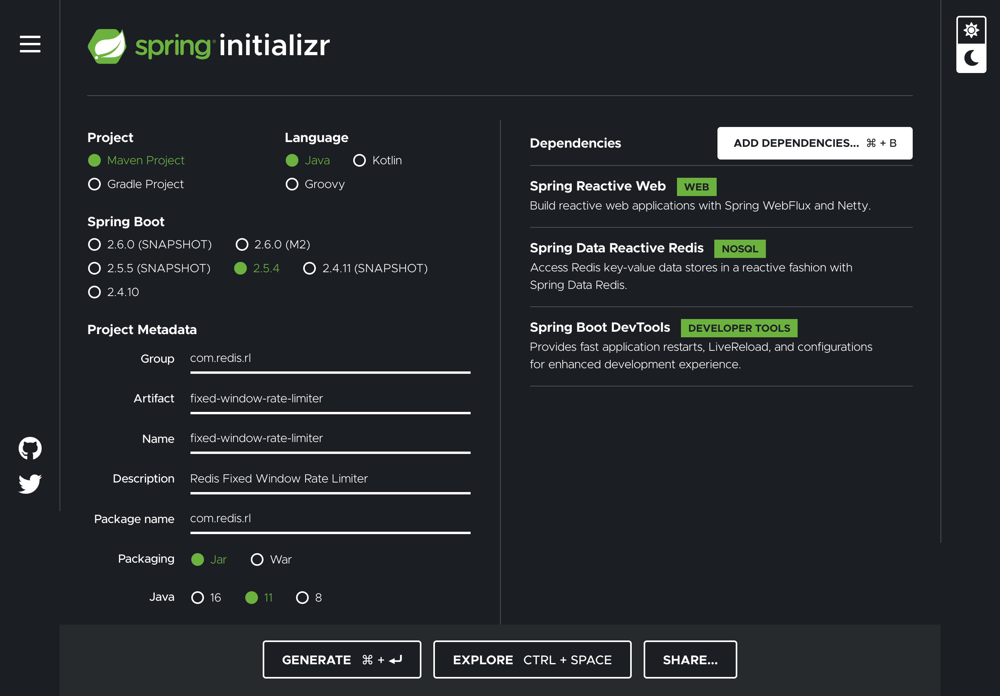

import Authors from '@theme/Authors';

<Authors frontMatter={frontMatter} />

## A basic Spring Web Flux App

Let's start by creating a simple Spring Boot application using the Spring Initializr:

1. In your browser, launch the [Spring Initilizr](https://start.spring.io)
2. Fill out the form using the following settings:

- Project: Maven Project
- Language: Java
- Spring Boot: 2.5.4
- Project Metadata:
  - Group: `com.redis.rl`
  - Artifact: `fixed-window-rate-limiter`
  - Name: `fixed-window-rate-limiter`
  - Description: Redis Fixed Window Rate Limiter
  - Package Name: `com.redis.rl`
  - Packaging: JAR
  - Java: 11
- Dependencies:
  - Spring Reactive Web
  - String Data Reactive
  - Spring Boot DevTools



Click on GENERATE and Initializr will generate the zip file for the project and prompt you to download it to your local machine.
Unzip the downloaded file (named `fixed-window-rate-limiter.zip`) in a suitable directory. For example on a Mac:

```bash
cd ~/my-directory
unzip ~/Downloads/fixed-window-rate-limiter.zip
```

Now, open the file `FixedWindowRateLimiterApplication.java` located under `fixed-window-rate-limiter/src/main/java/com/redis/rl/`:

```java
package com.redis.rl;

import org.springframework.boot.SpringApplication;
import org.springframework.boot.autoconfigure.SpringBootApplication;

@SpringBootApplication
public class FixedWindowRateLimiterApplication {

	public static void main(String[] args) {
		SpringApplication.run(FixedWindowRateLimiterApplication.class, args);
	}

}
```

And let's add the `@Bean` annotated method `routes()` to create the simplest of endpoints; a "ping" endpoint,
which replies with a text reponse "PONG":

```java
@Bean
RouterFunction<ServerResponse> routes() {
  return route() //
      .GET("/api/ping", r -> ok() //
          .contentType(TEXT_PLAIN) //
          .body(BodyInserters.fromValue("PONG")) //
      ).build();
}
```

You'll also need the following imports:

```java
import static org.springframework.web.reactive.function.server.RouterFunctions.route;
import static org.springframework.web.reactive.function.server.ServerResponse.ok;
import static org.springframework.http.MediaType.TEXT_PLAIN;

import org.springframework.context.annotation.Bean;
import org.springframework.web.reactive.function.server.RouterFunction;
import org.springframework.web.reactive.function.server.ServerResponse;
import org.springframework.web.reactive.function.BodyInserters;
```

Let's use curl to test the newly created endpoint:

```bash
/>curl http://localhost:8080/api/ping
PONG
```

## Spring WebFlux Filters

We'll implement our rate limiter as a Spring WebFlux Filter. A filter allows us to
intercept a request and modify the response. For our needs we'll use a [`HandlerFilterFunction`](https://docs.spring.io/spring-framework/docs/current/javadoc-api/org/springframework/web/reactive/function/server/HandlerFilterFunction.html);
which we can filter a `RouterFunction` such as our `routes()` endpoint.

We'll keep everything in one file to make the example easier to manage for our simple example. At the end of the file
`FixedWindowRateLimiterApplication.java` let's add a class called `RateLimiterHandlerFilterFunction` as shown:

```java
class RateLimiterHandlerFilterFunction implements HandlerFilterFunction<ServerResponse, ServerResponse> {

  @Override
  public Mono<ServerResponse> filter(ServerRequest request, HandlerFunction<ServerResponse> next) {
    // TODO Auto-generated method stub
    return null;
  }
}
```

The class implements the `filter` method, which currently returns `null`. Let's modify it to simply pass the
request throught.

```java
@Override
public Mono<ServerResponse> filter(ServerRequest request, HandlerFunction<ServerResponse> next) {
  return next.handle(request);
}
```

And also, let's apply it to our `routes` method:

```java
@Bean
RouterFunction<ServerResponse> routes() {
  return route() //
      .GET("/api/ping", r -> ok() //
          .contentType(TEXT_PLAIN) //
          .body(BodyInserters.fromValue("PONG")) //
      ).filter(new RateLimiterHandlerFilterFunction()).build();
}
```

Testing the endpoint with curl should still works as previously.

## Reactive Redis Template

Spring Data Redis provides a Reactive API which plays well with all the other reactive parts of the Spring framework.
In order to work with Redis we'll use the `ReactiveRedisTemplate`, the aptly named `reactiveRedisTemplate` method
configures a reactive template given a `ReactiveRedisConnectionFactory` (which will be injected by the framework).

The template is configured to use the work with String keys and Long values as shown by the usage of the `StringRedisSerializer`
and the `GenericToStringSerializer`.

The template offers a high-level abstraction for Redis interactions and we will later pass it to our rate limiter
filter to use Redis as our rate limiting back-end:

```java
@Bean
ReactiveRedisTemplate<String, Long> reactiveRedisTemplate(ReactiveRedisConnectionFactory factory) {
  JdkSerializationRedisSerializer jdkSerializationRedisSerializer = new JdkSerializationRedisSerializer();
  StringRedisSerializer stringRedisSerializer = StringRedisSerializer.UTF_8;
  GenericToStringSerializer<Long> longToStringSerializer = new GenericToStringSerializer<>(Long.class);
  ReactiveRedisTemplate<String, Long> template = new ReactiveRedisTemplate<>(factory,
      RedisSerializationContext.<String, Long>newSerializationContext(jdkSerializationRedisSerializer)
          .key(stringRedisSerializer).value(longToStringSerializer).build());
  return template;
}

@Autowired
private ReactiveRedisTemplate<String, Long> redisTemplate;
```

Below are the required imports added:

```java
import org.springframework.data.redis.connection.ReactiveRedisConnectionFactory;
import org.springframework.data.redis.core.ReactiveRedisTemplate;
import org.springframework.data.redis.serializer.GenericToStringSerializer;
import org.springframework.data.redis.serializer.JdkSerializationRedisSerializer;
import org.springframework.data.redis.serializer.RedisSerializationContext;
import org.springframework.data.redis.serializer.StringRedisSerializer;

import org.springframework.beans.factory.annotation.Autowired;
```

Next, let's modify the `RateLimiterHandlerFilterFunction` class to include the template and let's add a
constructor so that we can properly initialize it:

```java
class RateLimiterHandlerFilterFunction implements HandlerFilterFunction<ServerResponse, ServerResponse> {

  private ReactiveRedisTemplate<String, Long> redisTemplate;

  public RateLimiterHandlerFilterFunction(ReactiveRedisTemplate<String, Long> redisTemplate) {
    this.redisTemplate = redisTemplate;
  }
```

We also need to modify the `routes` method to include the `redisTemplate` in the call to the
`RateLimiterHandlerFilterFunction` constructor:

```java
@Bean
RouterFunction<ServerResponse> routes() {
  return route() //
      .GET("/api/ping", r -> ok() //
          .contentType(TEXT_PLAIN) //
          .body(BodyInserters.fromValue("PONG")) //
      ).filter(new RateLimiterHandlerFilterFunction(redisTemplate)).build();
}
```

## Identifying the Requester

As mentioned in the introduction to rate limiting, identifying the origin of the request is critical to
the efficacy of your rate limiting implementation. In this simple implementation we will focus on the
mechanics of rate limiting and do the simplest possible thing we can do to identify the requester.

The `filter` method in `RateLimiterHandlerFilterFunction` takes an instance of a `ServerRequest`, from
which we can obtain the IP address of the requester. Add private method `requestAddress` to the filter function
class:

```java
private String requestAddress(Optional<InetSocketAddress> maybeAddress) {
  return maybeAddress.isPresent() ? maybeAddress.get().getHostName() : "";
}
```

With the `requestAddress` in place we can build the key we'll use to check for the requesters' quota.
To compute the key we will concatenate the requester's address and the current minute of the hour. We'll
prefix the keys with `rl_` for "rate limiting":

```java
public Mono<ServerResponse> filter(ServerRequest request, HandlerFunction<ServerResponse> next) {
  int currentMinute = LocalTime.now().getMinute();
  String key = String.format("rl_%s:%s", requestAddress(request.remoteAddress()), currentMinute);
  System.out.println(">>>> key " + key);

  return next.handle(request);
}
```

Invoking the endpoint should show the key on the console like:

```bash
>>>> key rl_localhost:34
```

## Increment and Expire Key

Now we need to implement the logic to execute the `INCR` and an `EXPIRE` logic
outlined in [Fixed Window](/develop/java/spring/rate-limiting/fixed-window)
implementation using Spring Data Redis Reactive:

```bash
MULTI
INCR [user-api-key]:[current minute number]
EXPIRE [user-api-key]:[current minute number] 59
EXEC
```

The "Basic Rate Limiting" recipe calls for the use of a [Redis Transaction](https://redis.io/topics/transactions)
in which the commands are sent to the server, accumulated in serial way and executed
sequentially without any possible interruption by a request from another client.

Basically, we want the `INCR` and `EXPIRE` calls to update the requests-per-unit-of-time counter
to happen atomically or not at all. Given that [`a Reactive API and Redis Transactions (MULTI/EXEC) are not compatible paradigms`](https://stackoverflow.com/questions/56647972/how-do-i-use-transactions-in-spring-data-redis-reactive), which boils down to "you cannot listen to a command that is going to be executed in the future" in a chain of reactive commands
A "best possible" approach to achieve this behavior with a reactive API is by using the `ReactiveRedisTemplate` `execute` method which takes a
`ReactiveRedisCallback` guaranteing that at least the commands will run on the same Redis
connection, but, this is by no means a real "transaction":

```java
private Mono<ServerResponse> incrAndExpireKey(String key, ServerRequest request,
  HandlerFunction<ServerResponse> next) {
  return redisTemplate.execute(new ReactiveRedisCallback<List<Object>>() {
    @Override
    public Publisher<List<Object>> doInRedis(ReactiveRedisConnection connection) throws DataAccessException {
      ByteBuffer bbKey = ByteBuffer.wrap(key.getBytes());
      return Mono.zip( //
          connection.numberCommands().incr(bbKey), //
          connection.keyCommands().expire(bbKey, Duration.ofSeconds(59L)) //
      ).then(Mono.empty());
    }
  }).then(next.handle(request));
}
```

Let's break down what this monster of a reactive method:

1. The method returns an Asynchronous (0-1) Result, a `Mono` (a specialized `Publisher<T>` that emits at most one item in this case a `ServerResponse`)
2. The method takes the calculated rate limiting `key`, the original server `request` and `next` handler function
3. In the `doInRedis` method we turn the key into a `ByteBuffer` in order to use with `ReactiveRedisConnection` commands
4. The zip methods waits for all the sources to emit one element and combines these elements into an output value
   ,which we are ignoring since all we are after is sequential execution on the `INCR` and `EXPIRE` commands.
5. The method then returns a `Mono.empty()`
6. Finally handle the request.

## Completing the filter implementation

To complete the filter implementation, we'll add a constant for the cap on the number of request per minute, that can
be optionally loaded from the application's properties:

```java
@Value("${MAX_REQUESTS_PER_MINUTE}")
private static Long MAX_REQUESTS_PER_MINUTE = 20L;
```

Let's break down he final `filter` method implementation:

1. We use the Redis template `opsForValue()` to retrieve the value stored under the calculated key.
2. If the value..
   - Is greater than or equal to the max quota we deny the request with a 409 response.
   - Otherwise, call `incrementAndExpireKey`
3. - Is empty/key not found (first request on this window) we call `incrementAndExpireKey`

```java
public Mono<ServerResponse> filter(ServerRequest request, HandlerFunction<ServerResponse> next) {
  int currentMinute = LocalTime.now().getMinute();
  String key = String.format("rl_%s:%s", requestAddress(request.remoteAddress()), currentMinute);

  return redisTemplate //
      .opsForValue().get(key) //
      .flatMap( //
          value -> value >= MAX_REQUESTS_PER_MINUTE ? //
              ServerResponse.status(TOO_MANY_REQUESTS).build() : //
              incrAndExpireKey(key, request, next) //
      ).switchIfEmpty(incrAndExpireKey(key, request, next));
}
```

## Testing with curl

A simple way to test an API rate limiter is using [curl](https://curl.se) in a loop,
since we are testing a set number of requests per unit of time the curl loop below will
suffice:

```
for n in {1..22}; do echo $(curl -s -w " :: HTTP %{http_code}, %{size_download} bytes, %{time_total} s" -X GET http://localhost:8080/api/ping); sleep 0.5; done
```

We loop 22 times, the example code is set to 20 so 22 will allow us to see two 429 responses. The
curl flags used are as follows; first is `-s` that silences curl (makes it hide progress bar and errors), `-w` is the write out options in which we can pass a string with interpolated variables.
Then we sleep 1/2 second between cycles.

```bash
➜ for n in {1..22}; do echo $(curl -s -w " :: HTTP %{http_code}, %{size_download} bytes, %{time_total} s" -X GET http://localhost:8080/api/ping); sleep 0.5; done
PONG :: HTTP 200, 4 bytes, 0.393156 s
PONG :: HTTP 200, 4 bytes, 0.019530 s
PONG :: HTTP 200, 4 bytes, 0.023677 s
PONG :: HTTP 200, 4 bytes, 0.019922 s
PONG :: HTTP 200, 4 bytes, 0.025573 s
PONG :: HTTP 200, 4 bytes, 0.018916 s
PONG :: HTTP 200, 4 bytes, 0.019548 s
PONG :: HTTP 200, 4 bytes, 0.018335 s
PONG :: HTTP 200, 4 bytes, 0.010105 s
PONG :: HTTP 200, 4 bytes, 0.008416 s
PONG :: HTTP 200, 4 bytes, 0.009829 s
PONG :: HTTP 200, 4 bytes, 0.011766 s
PONG :: HTTP 200, 4 bytes, 0.010809 s
PONG :: HTTP 200, 4 bytes, 0.015483 s
PONG :: HTTP 200, 4 bytes, 0.009732 s
PONG :: HTTP 200, 4 bytes, 0.009970 s
PONG :: HTTP 200, 4 bytes, 0.008696 s
PONG :: HTTP 200, 4 bytes, 0.009176 s
PONG :: HTTP 200, 4 bytes, 0.009678 s
PONG :: HTTP 200, 4 bytes, 0.012497 s
:: HTTP 429, 0 bytes, 0.010071 s
:: HTTP 429, 0 bytes, 0.006625 s
```

If we run Redis in monitor mode, we should see the call to `GET` for a rejected
request, and the same plus calls to `INCR` and `EXPIRE` for an allowed request:

```
1630366639.188290 [0 172.17.0.1:65016] "GET" "rl_localhost:37"
1630366639.200956 [0 172.17.0.1:65016] "INCR" "rl_localhost:37"
1630366639.202372 [0 172.17.0.1:65016] "EXPIRE" "rl_localhost:37" "59"
...
1630366649.891110 [0 172.17.0.1:65016] "GET" "rl_localhost:37"
1630366650.417131 [0 172.17.0.1:65016] "GET" "rl_localhost:37"
```

You can find this example on the main branch at [https://github.com/redis-developer/fixed-window-rate-limiter](https://github.com/redis-developer/fixed-window-rate-limiter)
