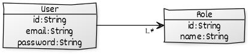

import Authors from '@site/src/theme/Authors';

<Authors frontMatter={frontMatter} />

### Objectives

To configure a `RedisTemplate `and learn how to access different operation bundles to read and write data to Redis from a Spring REST controller.

### Agenda

In this lesson, you will learn:

- How to use the `@RedisHash` annotation to map domain objects.
- How to use `@Id` to provide primary keys to your mapped objects.
- How to use `@Reference` to create referential associations between objects.
- How to create and use Redis Repositories to store domain objects.

If you get stuck:

- The progress made in this lesson is available on the redi2read github repository at https://github.com/redis-developer/redi2read/tree/course/milestone-3

### Users and roles

In many applications, whether web applications or RESTful web services, one of the first parts of the domain to be implemented is the user/roles sub-domain.
In Redi2Read, Users have one or more Roles, a typical one-to-many association.



### Enter @RedisHash

In this section, we will embark on the creation of the Redi2Read domain models. We will use Lombok to simplify our POJOs,
and using the Spring Data Redis `@RedisHash` and other Spring Data annotations, we will configure our models to be persisted in Redis.

##### Role Model

Let’s start by creating the simplest of our domain’s classes, the Role class under
the directory `src/main/java/com/redislabs/edu/redi2read/models`. Let’s name the file `Role.java`
with the following contents:

```java
package com.redislabs.edu.redi2read.models;

import lombok.Data;

@Data
public class Role {
  private String id;
  private String name;
}
```

We are starting with a class annotated using Lombok’s `@Data `annotation, which adds `@ToString`, `@EqualsAndHashCode`, `@Getter`/`@Setter`, and a `@RequiredArgsContructor`, giving us a fully formed Java POJO.
For the Spring Data Repositories to know how to map an instance of Role to a Redis Hash, we need to annotate the class with the @RedisHash annotation.

```java
package com.redislabs.edu.redi2read.models;

import org.springframework.data.annotation.Id;
import org.springframework.data.redis.core.RedisHash;

import lombok.Builder;
import lombok.Data;

@Data
@RedisHash
public class Role {
  @Id
  private String id;

  private String name;
}
```

@RedisHash can take as parameters a timeToLive of type Long, and a String value, which will override the default Redis key prefix (by default, the key prefix is the fully qualified name of the class plus a colon).

Within the class, most of the usual Spring Data annotations are supported. For Role, lets annotate the id field with the @Id annotation. Spring Data Redis will auto-generate and suitable id for the annotated type.

#### User Model

The User model will be used in a registration/signup method. To allow for server-side validation to be performed, we need to add a dependency to the Maven POM for the spring-boot-starter-validation library.

```xml
<dependency>
  <groupId>org.springframework.boot</groupId>
  <artifactId>spring-boot-starter-validation</artifactId>
</dependency>
```

Now we can create the User class with the following contents:
package com.redislabs.edu.redi2read.models;

```java
import java.util.HashSet;
import java.util.Set;

import javax.validation.constraints.Email;
import javax.validation.constraints.NotNull;
import javax.validation.constraints.Size;

import org.springframework.data.annotation.Id;
import org.springframework.data.annotation.Reference;
import org.springframework.data.annotation.Transient;
import org.springframework.data.redis.core.RedisHash;
import org.springframework.data.redis.core.index.Indexed;

import lombok.Data;
import lombok.EqualsAndHashCode;
import lombok.ToString;

@EqualsAndHashCode(onlyExplicitlyIncluded = true)
@ToString(onlyExplicitlyIncluded = true)
@Data
@RedisHash
public class User {
  @Id
  @ToString.Include
  private String id;

  @NotNull
  @Size(min = 2, max = 48)
  @ToString.Include
  private String name;

  @NotNull
  @Email
  @EqualsAndHashCode.Include
  @ToString.Include
  @Indexed
  private String email;

  @NotNull
  private String password;

  @Transient
  private String passwordConfirm;

  @Reference
  private Set<Role> roles = new HashSet<Role>();

  public void addRole(Role role) {
    roles.add(role);
  }
}
```

This class is a little more involved, so let’s break it down:

1. We have another POJO (`@Data`) whose instances can be persisted as Redis Hashes (`@RedisHash`)
2. The class is annotated to only add fields to equals/hashcode/toString that are explicitly annotations with `@EqualsHashCode.Include` and `@ToString.Include`
3. Once again, we have an auto-generated String Redis Hash key using `@Id`
4. We create a (secondary) index on the email field by annotating the property with `@Indexed`. We will learn more about secondary indexes in the next lesson.
5. Several `javax.validation.constraints `annotations are used to denote fields as being of type `@Email`, being `@NotNull`-able, and restricting their `@Size`
6. The passwordConfirm field, which will hold the traditional “password confirmation”, is marked as `@Transient` so that `@RedisHash` does not attempt to serialize it to the database
7. For the `User`’s roles, we have a `Set `of `Role` objects marked as `@References` which will cause them to be stored as the id of a given role in the Redis Hash backing a `User` instance.
8. Finally at the bottom, we add a utility method to add `Role`s to the `User`’s Role Set.

### Spring Repositories

Now that we have two models properly annotated, we need associated repositories to perform data operations on said models. A Spring Data Repository is similar to the DAO (Data Access Object) pattern
in that they both abstract operations against the underlying data storage. The difference is that repositories
further abstract the underlying storage mechanism by focusing on the management of a collection of objects,
while DAOs are more SQL/Table centric.

### Role Repository

Under the `src/main/java/com/redislabs/edu/redi2read/repositories` let's create the RoleRepository interface as follows:

```java
package com.redislabs.edu.redi2read.repositories;

import com.redislabs.edu.redi2read.models.Role;

import org.springframework.data.repository.CrudRepository;
import org.springframework.stereotype.Repository;

@Repository
public interface RoleRepository extends CrudRepository<Role, String> {
}
```

Our repository extends `CrudRepository` for the `Role` class with key of type `String`, it provides basic CRUD and finder operations.
Spring Data Redis repositories are highly performant; they avoid using reflection and byte-code generation and instead use programmatic
JDK proxies instances using Spring’s ProxyFactory API. See https://bit.ly/2PshxEI

### Testing the Role Repository

Let’s test the `RoleRepository` by using a `CommandLineRunner `implementation. A Spring `CommandLineRunner `is an interface that tells the Spring container
that the run method needs to be executed upon startup.
A Spring Boot application can have many `CommandLineRunner`s; to control the order of their execution, we can further annotate them with the `@Order` annotation.
Create the directory `src/main/java/com/redislabs/edu/redi2read/boot` and then add the `CreateRoles` class:

```java
package com.redislabs.edu.redi2read.boot;

import org.springframework.boot.CommandLineRunner;
import org.springframework.core.annotation.Order;
import org.springframework.stereotype.Component;

@Component
@Order(1)
public class CreateRoles implements CommandLineRunner {

 @Override
 public void run(String... args) throws Exception {
   System.out.println(">>> Hello from the CreateRoles CommandLineRunner...");
 }
}
```

Our `CreateRoles` class will run on each server start-up or on each live reload (since we are using Spring DevTools).
The `@Order` annotation takes a numeric value indicating the order of execution.
To test the command line runner we have a `System.out.println `in the run method that we can watch fly by on the console.

```
2021-04-02 14:32:58.374  INFO 41500 --- [  restartedMain] c.r.edu.redi2read.Redi2readApplication   : Started Redi2readApplication in 0.474 seconds (JVM running for 74714.143)
>>> Hello from the CreateRoles CommandLineRunner...
2021-04-02 14:32:58.375  INFO 41500 --- [  restartedMain] .ConditionEvaluationDeltaLoggingListener : Condition evaluation unchanged
```

Now that we know the `CreateRoles` component runs, let's complete it to work with the `RoleRepository`.

```java
package com.redislabs.edu.redi2read.boot;

import com.redislabs.edu.redi2read.models.Role;
import com.redislabs.edu.redi2read.repositories.RoleRepository;

import org.springframework.beans.factory.annotation.Autowired;
import org.springframework.boot.CommandLineRunner;
import org.springframework.core.annotation.Order;
import org.springframework.stereotype.Component;

import lombok.extern.slf4j.Slf4j;

@Component
@Order(1)
@Slf4j
public class CreateRoles implements CommandLineRunner {

  @Autowired
  private RoleRepository roleRepository;

  @Override
  public void run(String... args) throws Exception {
    if (roleRepository.count() == 0) {
      Role adminRole = Role.builder().name("admin").build();
      Role customerRole = Role.builder().name("customer").build();
      roleRepository.save(adminRole);
      roleRepository.save(customerRole);
      log.info(">>>> Created admin and customer roles...");
    }
  }
}
```

We begin by injecting an instance of `RoleRepository` using the `@Autowired` annotation. Since we don’t want the roles to be created on each restart of the server,
our logic will only execute when the `RoleRepository` has no `Role`s.
If there are no `Roles`, then we create the “admin” and “customer” roles using the Lombok builder. Then we save them to Redis using the `RoleRepository` save method.
To properly log a message we’ll use the `@Slf4j` (Simple Logging Facade for Java) annotation provided by Lombok, which creates a logger instance called log,
with the customary log level logging methods.
On server start we should now see, once, the output of our database seeding.

```bash
2021-04-02 19:28:25.367  INFO 94971 --- [  restartedMain] c.r.edu.redi2read.Redi2readApplication   : Started Redi2readApplication in 2.146 seconds (JVM running for 2.544)
2021-04-02 19:28:25.654  INFO 94971 --- [  restartedMain] c.r.edu.redi2read.boot.CreateRoles       : >>>> Created admin and customer roles...
```

Let’s use the Redis CLI to explore how the `Role`s were stored, let’s use the KEYS command passing the Role fully qualified class name and a wildcard. Resulting in:

```bash
127.0.0.1:6379> KEYS com.redislabs.edu.redi2read.models.Role*
1) "com.redislabs.edu.redi2read.models.Role:c4219654-0b79-4ee6-b928-cb75909c4464"
2) "com.redislabs.edu.redi2read.models.Role:9d383baf-35a0-4d20-8296-eedc4bea134a"
3) "com.redislabs.edu.redi2read.models.Role"
```

The first two values are `Hash`es, actual instances of the `Role` class. The string after the `:` is the primary key of the individual Role. Let’s inspect one of those hashes:

```bash
127.0.0.1:6379> TYPE "com.redislabs.edu.redi2read.models.Role:c4219654-0b79-4ee6-b928-cb75909c4464"
hash
127.0.0.1:6379> HGETALL "com.redislabs.edu.redi2read.models.Role:c4219654-0b79-4ee6-b928-cb75909c4464"
1) "_class"
2) "com.redislabs.edu.redi2read.models.Role"
3) "id"
4) "c4219654-0b79-4ee6-b928-cb75909c4464"
5) "name"
6) "admin"
```

Using the TYPE command returns, as expected that the value under the key is a Redis Hash. We use the HGETALL to “Get All” values in the Hash. The `_class` is a metadata field which demarks the class of the object stored in the Hash.
Now let’s inspect the third value in the KEYS list:

```bash
127.0.0.1:6379> TYPE "com.redislabs.edu.redi2read.models.Role"
set
127.0.0.1:6379> SMEMBERS "com.redislabs.edu.redi2read.models.Role"
1) "9d383baf-35a0-4d20-8296-eedc4bea134a"
2) "c4219654-0b79-4ee6-b928-cb75909c4464"
```

The Redis Set under the mapped class name is used to keep the primary keys maintained for a given class.
