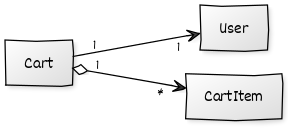

import useBaseUrl from '@docusaurus/useBaseUrl';

### Objectives

Add a JSON-backed domain model to Redi2Read using the RedisJSON Redis module.

### Agenda

In this lesson, you'll learn how to:

- Use JSON documents as extensions of your domain.
- Implement a custom Spring Repository to work with JSON documents.
- Implement the `CartController` using the JRedisJSON client library.
  If you get stuck:
- The progress made in this lesson is available on the redi2read github repository at https://github.com/redis-developer/redi2read/tree/course/milestone-6

### Carts and Cart Items

We will implement the `Cart` and `CartItem` models backed by a custom Spring Repository that uses the RedisJSON API via the JRedisJSON client library.

We will represent a user’s cart as a JSON document containing cart item subdocuments. As you can see in the class diagram, a `Cart` has zero or more `CartItems`, and it belongs to a `User`.



### RedisJSON

RedisJSON is a Redis module that lets you store, update, and fetch JSON values natively in Redis.
JSON can be a better fit for modeling complex data in Redis than Hashes because, unlike Hashes,
JSON values can contain nested arrays and objects.

### JRedisJSON

JRedisJSON (https://github.com/RedisJSON/JRedisJSON) is a Java client that provides access to RedisJSON's Redis API and provides Java serialization using Google’s GSON library.

#### Adding JRedisJSON as a Dependency

We will use a SNAPSHOT version of JRedisJSON to take advantage of more advanced JSON manipulation features recently introduced.
Add the snapshots-repo to your Maven POM:

```xml
<repositories>
  <repository>
    <id>snapshots-repo</id>
    <url>https://oss.sonatype.org/content/repositories/snapshots</url>
  </repository>
</repositories>

And then the JRedisJSON dependency to the dependencies block:
<dependency>
  <groupId>com.redislabs</groupId>
  <artifactId>jrejson</artifactId>
  <version>1.4.0-SNAPSHOT</version>
</dependency>
```

### The Models

#### The CartItem Model

We’ll start with the `CartItem `model. It holds information about a `Book` in the `Cart`; it stores the `Book` ISBN (id), price, and quantity added to the cart.
Add the file `src/main/java/com/redislabs/edu/redi2read/models/CartItem.java` with the following contents:

```java
package com.redislabs.edu.redi2read.models;

import lombok.Builder;
import lombok.Data;

@Data
@Builder
public class CartItem {
  private String isbn;
  private Double price;
  private Long quantity;
}
```

#### The Cart Model

The Cart model contains the ID of the owning User and a set of `CartItem`s. Utility methods exist to return the total number of items in the cart and the total cost.
Add the file `src/main/java/com/redislabs/edu/redi2read/models/Cart.java` with the following contents:

```java
package com.redislabs.edu.redi2read.models;

import java.util.Set;

import lombok.Builder;
import lombok.Data;
import lombok.Singular;

@Data
@Builder
public class Cart {
  private String id;
  private String userId;

  @Singular
  private Set<CartItem> cartItems;

  public Integer count() {
    return getCartItems().size();
  }

  public Double getTotal() {
    return cartItems //
        .stream() //
        .mapToDouble(ci -> ci.getPrice() * ci.getQuantity()) //
        .sum();
  }
}
```

### Purchased Books

After a user checks out, we need to keep track of the books the user now owns. To keep it simple,
we will add a `Set<Book>` to the `User` model annotated with the `@Reference` annotation.
We’ll also include a utility method that adds books to the user’s collection of books owned.
Make the changes below to the User model:

```java
// ...
@RedisHash
public class User {

  //...

 @Reference
 @JsonIdentityReference(alwaysAsId = true)
 private Set<Role> roles = new HashSet<Role>();

 public void addRole(Role role) {
   roles.add(role);
 }

 @Reference
 @JsonIdentityReference(alwaysAsId = true)
 private Set<Book> books = new HashSet<Book>();

 public void addBook(Book book) {
   books.add(book);
 }

}
```

The `@Reference` annotation works for our `Set`s in the context of Redis serialization, but you might have noticed that
the roles were being fully serialized into the resulting JSON payload by Jackson.
We will add the `@JsonIdentityReference `with the `alwaysAsId` parameter set to `true`, which, given the proper meta-information in the target classes (`Book` and `Role`), will make Jackson serialize collections of these objects as IDs.
The `@JsonIdentityInfo` annotation allows us to set a generator (`ObjectIdGenerator.PropertyGenerator`) using the `id` property to direct how the serialization will happen in the presence of the `@JsonIdentityReference` annotation.
Add the annotation to the `Book` model as shown:

```java
@Data
@EqualsAndHashCode(onlyExplicitlyIncluded = true)
@JsonIdentityInfo(
        generator = ObjectIdGenerators.PropertyGenerator.class,
        property = "id")
@RedisHash
public class Book {
//...
}
```

Similarly, we’ll add the `@JsonIdentityInfo` to the `Role` model:

```java
@Data
@Builder
@JsonIdentityInfo(
        generator = ObjectIdGenerators.PropertyGenerator.class,
        property = "id")
@RedisHash
public class Role {
//...
}
```

Now, when JSON serialization occurs in the REST controllers, the user collection will include the roles as JSON arrays of role IDs. The user collection will also include the newly added collection of books as an array of book IDs.

### The Cart Repository

RedisJSON is not yet seamlessly integrated with Spring, but that does not prevent us from using RedisJSON the “Spring Way”. We have provided an implementation of Spring’s CrudRepository so that we can implement our services and controllers.
Add the file src/main/java/com/redislabs/edu/redi2read/repositories/CartRepository.java with the following contents:

```java
package com.redislabs.edu.redi2read.repositories;

import java.util.List;
import java.util.Optional;
import java.util.UUID;
import java.util.stream.Collectors;
import java.util.stream.StreamSupport;

import com.redislabs.edu.redi2read.models.Cart;
import com.redislabs.modules.rejson.JReJSON;

import org.springframework.beans.factory.annotation.Autowired;
import org.springframework.data.redis.core.HashOperations;
import org.springframework.data.redis.core.RedisTemplate;
import org.springframework.data.redis.core.SetOperations;
import org.springframework.data.repository.CrudRepository;
import org.springframework.stereotype.Repository;

@Repository
public class CartRepository implements CrudRepository<Cart, String> {

  private JReJSON redisJson = new JReJSON();
  private final static String idPrefix = Cart.class.getName();

  @Autowired
  private RedisTemplate<String, String> template;

  private SetOperations<String, String> redisSets() {
    return template.opsForSet();
  }

  private HashOperations<String, String, String> redisHash() {
    return template.opsForHash();
  }

  @Override
  public <S extends Cart> S save(S cart) {
    // set cart id
    if (cart.getId() == null) {
      cart.setId(UUID.randomUUID().toString());
    }
    String key = getKey(cart);
    redisJson.set(key, cart);
    redisSets().add(idPrefix, key);
    redisHash().put("carts-by-user-id-idx", cart.getUserId().toString(), cart.getId().toString());

    return cart;
  }

  @Override
  public <S extends Cart> Iterable<S> saveAll(Iterable<S> carts) {
    return StreamSupport //
        .stream(carts.spliterator(), false) //
        .map(cart -> save(cart)) //
        .collect(Collectors.toList());
  }

  @Override
  public Optional<Cart> findById(String id) {
    Cart cart = redisJson.get(getKey(id), Cart.class);
    return Optional.ofNullable(cart);
  }

  @Override
  public boolean existsById(String id) {
    return template.hasKey(getKey(id));
  }

  @Override
  public Iterable<Cart> findAll() {
    String[] keys = redisSets().members(idPrefix).stream().toArray(String[]::new);
    return (Iterable<Cart>) redisJson.mget(Cart.class, keys);
  }

  @Override
  public Iterable<Cart> findAllById(Iterable<String> ids) {
    String[] keys = StreamSupport.stream(ids.spliterator(), false) //
      .map(id -> getKey(id)).toArray(String[]::new);
    return (Iterable<Cart>) redisJson.mget(Cart.class, keys);
  }

  @Override
  public long count() {
    return redisSets().size(idPrefix);
  }

  @Override
  public void deleteById(String id) {
    redisJson.del(getKey(id));
  }

  @Override
  public void delete(Cart cart) {
    deleteById(cart.getId());
  }

  @Override
  public void deleteAll(Iterable<? extends Cart> carts) {
    List<String> keys = StreamSupport //
        .stream(carts.spliterator(), false) //
        .map(cart -> idPrefix + cart.getId()) //
        .collect(Collectors.toList());
    redisSets().getOperations().delete(keys);
  }

  @Override
  public void deleteAll() {
    redisSets().getOperations().delete(redisSets().members(idPrefix));
  }

  public Optional<Cart> findByUserId(Long id) {
    String cartId = redisHash().get("carts-by-user-id-idx", id.toString());
    return (cartId != null) ? findById(cartId) : Optional.empty();
  }

  public static String getKey(Cart cart) {
    return String.format("%s:%s", idPrefix, cart.getId());
  }

  public static String getKey(String id) {
    return String.format("%s:%s", idPrefix, id);
  }

}
```

As with the `@RedisHash` annotated entities, our Carts are maintained with a collection of Redis JSON objects and a Redis Set to maintain the collection of keys.

### The Cart Service

As Spring applications get more complex, using the repositories directly on your controllers overcomplicates the controllers and diverts from the responsibility to control
routing and deal with incoming parameters and outgoing JSON payloads.
An approach to keep both models and controllers from getting bloated with business logic (“fat” models and “fat” controllers) is to introduce a business logic service layer.
We’ll do so for the cart business logic by introducing the `CartService`. The `CartService` introduces four cart-related business methods:

- `get`: Finds a cart by id
- `addToCart`: Adds a cart item to a cart
- `removeFromCart`: Removes an isbn from the cart’s set of cart items
- `checkout`: Given a cart ID, adds the contents to the user’s collection of owned books

Add the file `src/main/java/com/redislabs/edu/redi2read/services/CartService.java` with the following contents:

```java
package com.redislabs.edu.redi2read.services;

import java.util.ArrayList;
import java.util.List;
import java.util.Optional;
import java.util.OptionalLong;
import java.util.stream.LongStream;

import com.redislabs.edu.redi2read.models.Book;
import com.redislabs.edu.redi2read.models.Cart;
import com.redislabs.edu.redi2read.models.CartItem;
import com.redislabs.edu.redi2read.models.User;
import com.redislabs.edu.redi2read.repositories.BookRepository;
import com.redislabs.edu.redi2read.repositories.CartRepository;
import com.redislabs.edu.redi2read.repositories.UserRepository;
import com.redislabs.modules.rejson.JReJSON;
import com.redislabs.modules.rejson.Path;

import org.springframework.beans.factory.annotation.Autowired;
import org.springframework.stereotype.Service;

@Service
public class CartService {

 @Autowired
 private CartRepository cartRepository;

 @Autowired
 private BookRepository bookRepository;

 @Autowired
 private UserRepository userRepository;

 private JReJSON redisJson = new JReJSON();

 Path cartItemsPath = Path.of(".cartItems");

 public Cart get(String id) {
   return cartRepository.findById(id).get();
 }

 public void addToCart(String id, CartItem item) {
   Optional<Book> book = bookRepository.findById(item.getIsbn());
   if (book.isPresent()) {
     String cartKey = CartRepository.getKey(id);
     item.setPrice(book.get().getPrice());
     redisJson.arrAppend(cartKey, cartItemsPath, item);
   }
 }

 public void removeFromCart(String id, String isbn) {
   Optional<Cart> cartFinder = cartRepository.findById(id);
   if (cartFinder.isPresent()) {
     Cart cart = cartFinder.get();
     String cartKey = CartRepository.getKey(cart.getId());
     List<CartItem> cartItems = new ArrayList<CartItem>(cart.getCartItems());
     OptionalLong cartItemIndex =  LongStream.range(0, cartItems.size()).filter(i -> cartItems.get((int) i).getIsbn().equals(isbn)).findFirst();
     if (cartItemIndex.isPresent()) {
       redisJson.arrPop(cartKey, CartItem.class, cartItemsPath, cartItemIndex.getAsLong());
     }
   }
 }

 public void checkout(String id) {
   Cart cart = cartRepository.findById(id).get();
   User user = userRepository.findById(cart.getUserId()).get();
   cart.getCartItems().forEach(cartItem -> {
     Book book = bookRepository.findById(cartItem.getIsbn()).get();
     user.addBook(book);
   });
   userRepository.save(user);
   // cartRepository.delete(cart);
 }
}
```

The service implements the `addToCart` and `removeFromCart `methods natively at the JSON level using JSONPath syntax to add and remove items from the cart.
Let’s delve deeper into the implementation of these methods.

#### Adding Items to the cart

In the addToCart method:

- We search for the cart by ID
- If we find the card, then we search for the book to be added to the cart by ISBN using the `BookRepository`
- If we find the book, we add the book’s current price to the item (we don’t want customers setting their own prices)
- We then use the JSON.ARRAPPEND command to insert the JSON object into the JSON array at the JSONPath expression `".cartItems"`

```java
public void addToCart(String id, CartItem item) {
  Optional<Book> book = bookRepository.findById(item.getIsbn());
  if (book.isPresent()) {
    String cartKey = CartRepository.getKey(id);
    item.setPrice(book.get().getPrice());
    redisJson.arrAppend(cartKey, cartItemsPath, item);
  }
}
```

#### Removing Items from the cart

In the removeFromCart method:
We search for the cart by ID.

- If we find the cart, we search for the index of the item to be removed in the array of cart items.
- If we find the item, we use the JSON.ARRPOP command to remove the item by its index at the JSONPath expression “.cartItems”.

```java
public void removeFromCart(String id, String isbn) {
  Optional<Cart> cartFinder = cartRepository.findById(id);
  if (cartFinder.isPresent()) {
    Cart cart = cartFinder.get();
    String cartKey = CartRepository.getKey(cart.getId());
    List<CartItem> cartItems = new ArrayList<CartItem>(cart.getCartItems());
    OptionalLong cartItemIndex =  LongStream.range(0, cartItems.size()).filter(i -> cartItems.get((int) i).getIsbn().equals(isbn)).findFirst();
    if (cartItemIndex.isPresent()) {
      redisJson.arrPop(cartKey, CartItem.class, cartItemsPath, cartItemIndex.getAsLong());
    }
  }
}
```

### Generating Random Carts

We now have all the pieces in place to create a `CommandLineRunner` that can generate random carts for our users.
As done previously, we will set the number of carts generated using an application property. To do so, add the following to the file `src/main/resources/application.properties`:

```java
app.numberOfCarts=2500
```

The `CreateCarts` `CommandLineRunner` is shown below. Add it to the boot package.

```java
package com.redislabs.edu.redi2read.boot;

import java.util.HashSet;
import java.util.Random;
import java.util.Set;
import java.util.stream.IntStream;

import com.redislabs.edu.redi2read.models.Book;
import com.redislabs.edu.redi2read.models.Cart;
import com.redislabs.edu.redi2read.models.CartItem;
import com.redislabs.edu.redi2read.models.User;
import com.redislabs.edu.redi2read.repositories.BookRepository;
import com.redislabs.edu.redi2read.repositories.CartRepository;
import com.redislabs.edu.redi2read.services.CartService;

import org.springframework.beans.factory.annotation.Autowired;
import org.springframework.beans.factory.annotation.Value;
import org.springframework.boot.CommandLineRunner;
import org.springframework.core.annotation.Order;
import org.springframework.data.redis.core.RedisTemplate;
import org.springframework.stereotype.Component;

import lombok.extern.slf4j.Slf4j;

@Component
@Order(5)
@Slf4j
public class CreateCarts implements CommandLineRunner {

  @Autowired
  private RedisTemplate<String, String> redisTemplate;

  @Autowired
  CartRepository cartRepository;

  @Autowired
  BookRepository bookRepository;

  @Autowired
  CartService cartService;

  @Value("${app.numberOfCarts}")
  private Integer numberOfCarts;

  @Override
  public void run(String... args) throws Exception {
    if (cartRepository.count() == 0) {
      Random random = new Random();

      // loops for the number of carts to create
      IntStream.range(0, numberOfCarts).forEach(n -> {
        // get a random user
        String userId = redisTemplate.opsForSet()//
            .randomMember(User.class.getName());

        // make a cart for the user
        Cart cart = Cart.builder()//
            .userId(userId) //
            .build();

        // get between 1 and 7 books
        Set<Book> books = getRandomBooks(bookRepository, 7);

        // add to cart
        cart.setCartItems(getCartItemsForBooks(books));

        // save the cart
        cartRepository.save(cart);

        // randomly checkout carts
        if (random.nextBoolean()) {
          cartService.checkout(cart.getId());
        }
      });

      log.info(">>>> Created Carts...");
    }
  }

  private Set<Book> getRandomBooks(BookRepository bookRepository, int max) {
    Random random = new Random();
    int howMany = random.nextInt(max) + 1;
    Set<Book> books = new HashSet<Book>();
    IntStream.range(1, howMany).forEach(n -> {
      String randomBookId = redisTemplate.opsForSet().randomMember(Book.class.getName());
      books.add(bookRepository.findById(randomBookId).get());
    });

    return books;
  }

  private Set<CartItem> getCartItemsForBooks(Set<Book> books) {
    Set<CartItem> items = new HashSet<CartItem>();
    books.forEach(book -> {
      CartItem item = CartItem.builder()//
          .isbn(book.getId()) //
          .price(book.getPrice()) //
          .quantity(1L) //
          .build();
      items.add(item);
    });

    return items;
  }
}
```

Let’s break down the CreateCarts class:

- As with other `CommandLineRunner`s, we check that there are no carts created.
- For each cart to be created, we
- Retrieve a random user.
- Create a cart for the user.
- Retrieve between 1 and 7 books.
- Add the cart items to the cart for the retrieved books.
- Randomly “checkout” the cart.

There are two private utility methods at the bottom of the class to get a random number of books and to create cart items from a set of books.
Upon server start (after some CPU cycles) you should see:

```bash
2021-04-04 14:58:08.737  INFO 31459 --- [  restartedMain] c.r.edu.redi2read.boot.CreateCarts       : >>>> Created Carts...
```

We can now use the Redis CLI to get a random cart key from the cart set, check the type of one of the keys (ReJSON-RL) and use the JSON.GET command to retrieve the JSON payload:

```bash
127.0.0.1:6379> SRANDMEMBER "com.redislabs.edu.redi2read.models.Cart"
"com.redislabs.edu.redi2read.models.Cart:dcd6a6c3-59d6-43b4-8750-553d159cdeb8"
127.0.0.1:6379> TYPE "com.redislabs.edu.redi2read.models.Cart:dcd6a6c3-59d6-43b4-8750-553d159cdeb8"
ReJSON-RL
127.0.0.1:6379> JSON.GET "com.redislabs.edu.redi2read.models.Cart:dcd6a6c3-59d6-43b4-8750-553d159cdeb8"
"{\"id\":\"dcd6a6c3-59d6-43b4-8750-553d159cdeb8\",\"userId\":\"-3356969291827598172\",\"cartItems\":[{\"isbn\":\"1784391093\",\"price\":17.190000000000001,\"quantity\":1},{\"isbn\":\"3662433524\",\"price\":59.990000000000002,\"quantity\":1}]}"
```

#### The Cart Controller

The `CartController` is mostly a pass-through to the `CartService` (as controllers are intended to be).

```java
package com.redislabs.edu.redi2read.controllers;

import com.redislabs.edu.redi2read.models.Cart;
import com.redislabs.edu.redi2read.models.CartItem;
import com.redislabs.edu.redi2read.services.CartService;

import org.springframework.beans.factory.annotation.Autowired;
import org.springframework.web.bind.annotation.DeleteMapping;
import org.springframework.web.bind.annotation.GetMapping;
import org.springframework.web.bind.annotation.PathVariable;
import org.springframework.web.bind.annotation.PostMapping;
import org.springframework.web.bind.annotation.RequestBody;
import org.springframework.web.bind.annotation.RequestMapping;
import org.springframework.web.bind.annotation.RestController;

@RestController
@RequestMapping("/api/carts")
public class CartController {

  @Autowired
  private CartService cartService;

  @GetMapping("/{id}")
  public Cart get(@PathVariable("id") String id) {
    return cartService.get(id);
  }

  @PostMapping("/{id}")
  public void addToCart(@PathVariable("id") String id, @RequestBody CartItem item) {
    cartService.addToCart(id, item);
  }

  @DeleteMapping("/{id}")
  public void removeFromCart(@PathVariable("id") String id, @RequestBody String isbn) {
    cartService.removeFromCart(id, isbn);
  }

  @PostMapping("/{id}/checkout")
  public void checkout(@PathVariable("id") String id) {
    cartService.checkout(id);
  }

}
```

Let’s use curl to request a cart by its ID:

```bash
curl --location --request GET 'http://localhost:8080/api/carts/dcd6a6c3-59d6-43b4-8750-553d159cdeb8'
```

Which should return a payload like:

```json
{
  "id": "dcd6a6c3-59d6-43b4-8750-553d159cdeb8",
  "userId": "-3356969291827598172",
  "cartItems": [
    {
      "isbn": "1784391093",
      "price": 17.19,
      "quantity": 1
    },
    {
      "isbn": "3662433524",
      "price": 59.99,
      "quantity": 1
    }
  ],
  "total": 77.18
}
```
