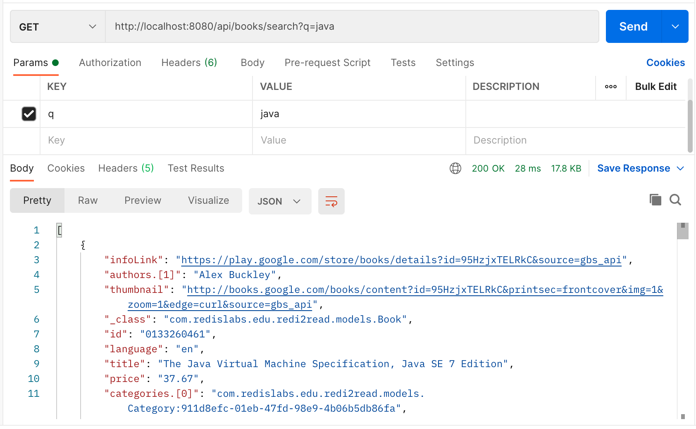

import RedisCard from '@site/src/theme/RedisCard';
import Tabs from '@theme/Tabs';
import TabItem from '@theme/TabItem';
import useBaseUrl from '@docusaurus/useBaseUrl';

### Objectives

Learn how easy it is to use Redis as a cache in your Spring applications

### Agenda

In this lesson, students will learn:

- The basics of Caching RESTful Services
- How to configure the Spring Data Redis `RedisCacheManager` using `RedisCacheConfiguration`
- How to use the `@Cacheable` annotation to mark a REST controller response as cacheable
  If you get stuck:
- The progress made in this lesson is available on the redi2read github repository at https://github.com/redis-developer/redi2read/tree/course/milestone-9

### Spring-Redis Caching Recipe

To implement caching in our Spring Boot application:

- Configure the Redis cache manager
- Enable application-wide caching with the `@EnableCaching` annotation

In the main application file (`src/main/java/com/redislabs/edu/redi2read/Redi2readApplication.java`), add the `cacheManager` method as shown:

```java
@SpringBootApplication
@EnableCaching
public class Redi2readApplication {

  // ...

  @Bean
  public RedisCacheManager cacheManager(RedisConnectionFactory connectionFactory) {
    RedisCacheConfiguration config = RedisCacheConfiguration.defaultCacheConfig() //
        .prefixCacheNameWith(this.getClass().getPackageName() + ".") //
        .entryTtl(Duration.ofHours(1)) //
        .disableCachingNullValues();

    return RedisCacheManager.builder(connectionFactory) //
        .cacheDefaults(config) //
        .build();
  }

  // ...
}
```

The `cacheManager` method takes an instance of the `RedisConnectionFactory`. In it we will configure our cache to use a Redis
key prefix equals to our application’s main package plus a period, that is `com.redislabs.edu.redi2read.`
We also set the TTL or “Time to Live” of our cache entries to 1 hour and make sure that we don’t cache nulls.
At the class level, we also use the annotation `@EnableCaching `to globally enable caching for our applications.
The changes above will need the import statements shown below:

```java
import org.springframework.cache.annotation.EnableCaching;
import org.springframework.data.redis.cache.RedisCacheConfiguration;
import org.springframework.data.redis.cache.RedisCacheManager;
import java.time.Duration;
```

### Using the @Cacheable annotation

In the context of a RESTful service, caching makes sense at the handoff between the application and the HTTP protocol.
It seems almost silly to think about caching anything in an application powered by Redis, but complex business logic
touching many data repositories and performing intense calculations can add to your response’s latency.
The ideal place to perform this caching is at the controller level. For example, let’s say that we wanted to cache
the responses of our book searches in the `BookController`. We could simple add the `@Cacheable` annotation as follows:

```java
@GetMapping("/search")
@Cacheable("book-search")
public SearchResults<String,String> search(@RequestParam(name="q")String query) {
  RediSearchCommands<String, String> commands = searchConnection.sync();
  SearchResults<String, String> results = commands.search(searchIndexName, query);
  return results;
}
```

Spring will now use Redis to create keys under the `com.redislabs.edu.redi2read.book-search` prefix to store cache entries for the search method.
There is no need to perform cache maintenance yourself. Spring will intercept the request and check the cache;
in the case of a cache hit, it will return its value. Otherwise, in case of a miss, it will store the cache’s search method’s return value,
allowing the method to execute as if there was no cache at all.
If we try the request `http://localhost:8080/api/books/search?q=java`:

```bash
curl --location --request GET 'http://localhost:8080/api/books/search?q=java'
```

On the first request we get a 28 ms response time:



Subsequent responses return in the range of 8 ms to 10 ms consistently:


