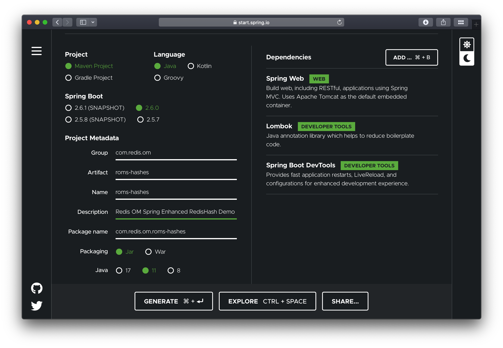

## Introduction

The Spring Data Redis (SDR) framework makes it easy to write Spring applications that use the Redis as a store
for Java objects (POJOs) by eliminating the redundant tasks and boilerplate code required for interacting with
the store through Spring’s excellent infrastructure support.

Redis OM Spring, builds on top of SDR to improve and optimize the interaction with Redis by leveraging
Redis' rich module ecosystem. For Java objects mapped with SDR's `@RedisHash` annotation we enhance the
object-mapping by:

- Eliminating the need for client-side maintained secondary indices and instead using Redis' native Search and Query engine.
- Implementing dynamic repository finders with fast and flexible querying
- Using ULIDs instead of traditional UUIDs for performance, readability and interoperability

## What You Will build

You will build an application that stores `User` POJOs (Plain Old Java Objects) as Redis Hashes.

## What You need

- About 15 minutes
- A favorite text editor or IDE
- [JDK 11](http://www.oracle.com/technetwork/java/javase/downloads/index.html) or later
- [Gradle 4+](http://www.gradle.org/downloads) or [Maven 3.2+](http://maven.apache.org/download.cgi)
- [Docker](https://www.docker.com) / [Docker Compose](https://docs.docker.com/compose/)

## Starting with Spring Initializr

We'll start by creating a base SpringBoot application using the [Spring Initializr](https://start.spring.io). You can use this
[pre-initialized project](https://start.spring.io/#!type=maven-project&language=java&platformVersion=2.6.0&packaging=jar&jvmVersion=11&groupId=com.redis.om&artifactId=roms-hashes&name=roms-hashes&description=Redis%20OM%20Spring%20Enhanced%20RedisHash%20Demo&packageName=com.redis.om.roms-hashes&dependencies=web,lombok,devtools)
and click Generate to download a ZIP file. This project is configured to fit the examples in this tutorial.



To configure the project:

- Navigate to https://start.spring.io. This service pulls in all the dependencies you need for an application and does most of the setup for you.
- Choose either Gradle or Maven and the language you want to use. This guide assumes that you chose Java.
- Click _Dependencies_ and select _Spring Web_, _Lombok_ and _Spring Boot DevTools_.
- Click _Generate_.
- Download the resulting ZIP file (`roms-hashes.zip`), which is an archive of a web application that is configured with your choices.

The dependencies included are:

- _Spring Web_: Build web/RESTful applications using Spring MVC. It will allow us to expose our app as a web service.
- _Lombok_: Java annotation library which helps to reduce boilerplate code.
- _Spring Boot DevTools_: Provides fast application restarts, LiveReload, and configurations for enhanced development experience.

:::note

If your IDE has the Spring Initializr integration, you can complete this process from your IDE.

:::

:::note

You can also fork the project from Github and open it in your IDE or other editor.

:::

## Adding Redis OM Spring

### Maven

To use Redis OM Spring, open the `pom.xml` file and add the Redis OM Spring Maven dependency to the pom.xml file `dependencies` element:

```xml
<dependency>
    <groupId>com.redis.om</groupId>
    <artifactId>redis-om-spring</artifactId>
    <version>0.5.2-SNAPSHOT</version>
</dependency>
```

:::note

Please check the official [Redis OM Spring GitHub repository](https://github.com/redis/redis-om-spring) for the latest version information

:::

### Gradle

If using gradle add the dependency as follows:

```groovy
dependencies {
  implementation 'com.redis.om.spring:redis-om-spring:0.1.0-SNAPSHOT'
}
```

## Enabling Redis Repositories

The generated application contains a single Java file, the `@SpringBootApplication` annotated main application.
To enable Spring Data Redis repositories, we also need to annotate the main or the configuration class with
`@EnableRedisEnhancedRepositories` as well as the `@Configuration` annotation.

```java
package com.redis.om;

import org.springframework.boot.SpringApplication;
import org.springframework.boot.autoconfigure.SpringBootApplication;
import com.redis.om.spring.annotations.EnableRedisEnhancedRepositories;

@SpringBootApplication
@EnableRedisEnhancedRepositories(basePackages = "com.redis.om.hashes.*")
public class RomsHashesApplication {

	public static void main(String[] args) {
		SpringApplication.run(RomsHashesApplication.class, args);
	}

}
```

## 🚀 Launch Redis

Redis OM Spring relies on the power of [Redis Stack](https://redis.io/docs/stack/).
The docker compose YAML file below can get started quickly. You can place at the root folder of your project and name it
`docker-compose.yml`:

```yaml
version: '3.9'
services:
  redis:
    image: 'redis/redis-stack:latest'
    ports:
      - '6379:6379'
    volumes:
      - ./data:/data
    environment:
      - REDIS_ARGS: --save 20 1
    deploy:
      replicas: 1
      restart_policy:
        condition: on-failure
```

To launch the docker compose application, on the command line (or via Docker Desktop), clone this repository
and run (from the root folder):

```bash
docker compose up
```

Let's also launch an instance of the Redis CLI so that we can spy on what ROMS is doing. To do so we'll
launch Redis in monitor mode:

```bash
redis-cli MONITOR
```

## Domain Entity

We'll have a single class in our application, the `User` class. We'll use lombok to avoid having to
create getters and setters. We'll use the lombok annotations `@Data`, `@RequiredArgsConstructor` and
`@AllArgsConstructor`.

Finally, to mark the class as a JSON document, we use the `@Document` annotation.

```java
package com.redis.om.hashes.domain;

import org.springframework.data.annotation.Id;
import org.springframework.data.annotation.Reference;
import org.springframework.data.redis.core.RedisHash;
import org.springframework.data.redis.core.index.Indexed;

import com.redis.om.spring.annotations.Bloom;

import lombok.AccessLevel;
import lombok.AllArgsConstructor;
import lombok.Data;
import lombok.NoArgsConstructor;
import lombok.NonNull;
import lombok.RequiredArgsConstructor;

@Data
@RequiredArgsConstructor(staticName = "of")
@AllArgsConstructor(access = AccessLevel.PROTECTED)
@NoArgsConstructor
@RedisHash
public class User {
  @Id
  private String id;

  @Indexed @NonNull
  private String firstName;

  @Indexed
  private String middleName;

  @Indexed @NonNull
  private String lastName;

  @NonNull
  @Indexed
  String email;
}
```

We use Spring Data Redis `@RedisHash` annotation. The property named `id` is annotated with `org.springframework.data.annotation.Id`.
Those two items are responsible for creating the actual key used to persist the Hash in Redis.

The `User` class has a `firstName`, `middleName` and `lastName`, as well as an `email` property.

## Creating a Repository

As with other Spring Data projects, Spring Data Redis provides the most common methods like `save`,
`delete`, or `findById` when you extend `CrudRepository` or `PagingAndSortingRepository`.

Let's create a basic repository under `src/main/java/com/redis/om/hashes/repositories` with the following contents:

```java
package com.redis.om.hashes.repositories;

import java.util.List;
import java.util.Optional;

import org.springframework.data.repository.CrudRepository;
import org.springframework.stereotype.Repository;

import com.redis.om.hashes.domain.User;

@Repository
public interface UserRepository extends CrudRepository<User, String> {
}
```

## Pre-populating the Database

Let's add a few `User` POJOs to Redis on application start-up by modify the `RomsHashesApplication` class
to include the newly created `UserRepository` using the `@Autowired`
annotation. Then we'll use a `CommandLineRunner` `@Bean` annotated method to create four `User` POJOs and
save them to the database.

In the `CommandLineRunner` we take the following steps:

- Use the repository `deleteAll` method to clear the database (be careful with this is production! 🙀)
- Create four `User` instances; we'll use the four band members of Rage Against the Machine.
- Use the repository `saveAll` method to save all `User` POJOs in bulk.

```java
package com.redis.om.hashes;

import java.util.List;

import org.springframework.beans.factory.annotation.Autowired;
import org.springframework.boot.CommandLineRunner;
import org.springframework.boot.SpringApplication;
import org.springframework.boot.autoconfigure.SpringBootApplication;
import org.springframework.context.annotation.Bean;
import org.springframework.context.annotation.Configuration;

import com.redis.om.hashes.domain.User;
import com.redis.om.hashes.repositories.UserRepository;
import com.redis.om.spring.annotations.EnableRedisEnhancedRepositories;

@SpringBootApplication
@Configuration
@EnableRedisEnhancedRepositories(basePackages = "com.redis.om.hashes.*")
public class RomsHashesApplication {

  @Autowired
  private UserRepository userRepo;

  @Bean
  CommandLineRunner loadTestData() {
    return args -> {
      userRepo.deleteAll();

      User john = User.of("Zack", "de la Rocha", "zack@ratm.com");
      User tim = User.of("Tim", "Commerford", "tim@ratm.com");
      User tom = User.of("Tom", "Morello", "tom@ratm.com");
      User brad = User.of("Brad", "Wilk", "brad@ratm.com");

      userRepo.saveAll(List.of(john, tim, tom, brad));
    };
  }

	public static void main(String[] args) {
		SpringApplication.run(RomsHashesApplication.class, args);
	}

}
```

Since we are using Spring Boot DevTools, if you already had the application running, it should have restarted/reloaded. If
not, use the `mvn` command to launch the application:

```bash
./mvnw spring-boot:run
```

If every goes as expected, you should see the familiar Spring Boot banner fly by:

```bash
[INFO] --- spring-boot-maven-plugin:2.6.0-M1:run (default-cli) @ roms-documents ---
[INFO] Attaching agents: []

  .   ____          _            __ _ _
 /\\ / ___'_ __ _ _(_)_ __  __ _ \ \ \ \
( ( )\___ | '_ | '_| | '_ \/ _` | \ \ \ \
 \\/  ___)| |_)| | | | | || (_| |  ) ) ) )
  '  |____| .__|_| |_|_| |_\__, | / / / /
 =========|_|==============|___/=/_/_/_/
 :: Spring Boot ::             (v2.6.0-M1)

2021-11-30 09:45:58.094  INFO 36380 --- [  restartedMain] c.r.o.d.RomsDocumentsApplication         : Starting RomsDocumentsApplication using Java 11.0.9 on BSB.lan with PID 36380 (/Users/bsb/Code/module-clients/java/high-level/redis-om/redis-om-spring/demos/roms-documents/target/classes started by briansam-bodden in /Users/bsb/Code/module-clients/java/high-level/redis-om/redis-om-spring/demos/roms-documents)
```

## Where's our data?

If you were watching the Redis CLI monitor you should have seen a barrage of output fly by. Let's break it down
and inspect it using another Redis CLI so as to understand the inner workings of the system.

### Redis Search Indices

At the top you should have seen the `FT.CREATE` command which using the annotations in our POJO determined an
index recipe. Since our POJO is annotated with `@Document` we get an index `ON JSON` against any keys starting
with `com.redis.om.documents.domain.Company:` (which is the default key prefix for Spring Data Redis and also for ROMS):

```bash
1638336613.156351 [0 172.19.0.1:63396] "FT.CREATE" "UserIdx" "ON" "HASH" "PREFIX" "1" "com.redis.om.hashes.domain.User:" "SCHEMA" "firstName" "AS" "firstName" "TAG" "middleName" "AS" "middleName" "TAG" "lastName" "AS" "lastName" "TAG" "email" "AS" "email" "TAG"
```

ROMS uses the POJO fields annotated with `@Indexed` or `@Searchable` to build the index schema. In the case of the `User` POJO
we have the fields `firstName`, `middleName`, `lastName` and `email` are all annotated as "indexable",
meaning that we can do exact searches over these fields.

Spring Data Redis creates a SET to maintain primary keys for our entities, ROMS inherits this functionality from SDR. The `DEL`
command following the index creation is triggered because of the call to `userRepo.deleteAll();` in our data loading method. If we
had any saved objects already we would also see calls to delete those individual instances.

For each of the `User` POJO we should see a sequence of REDIS commands like:

```bash
1638340447.180533 [0 172.19.0.1:63398] "SISMEMBER" "com.redis.om.hashes.domain.User" "01FNTB6JWTQHMK7NTEYA8725MP"
1638340447.198702 [0 172.19.0.1:63398] "DEL" "com.redis.om.hashes.domain.User:01FNTB6JWTQHMK7NTEYA8725MP"
1638340447.200874 [0 172.19.0.1:63398] "HMSET" "com.redis.om.hashes.domain.User:01FNTB6JWTQHMK7NTEYA8725MP" "_class" "com.redis.om.hashes.domain.User" "email" "zack@ratm.com" "firstName" "Zack" "id" "01FNTB6JWTQHMK7NTEYA8725MP" "lastName" "de la Rocha"
1638340447.203121 [0 172.19.0.1:63398] "SADD" "com.redis.om.hashes.domain.User" "01FNTB6JWTQHMK7NTEYA8725MP"
```

First SDR checks whether the object already exists in the Redis SET of primary keys using the `SISMEMBER` command. Then,
a `DEL` is issued to remove the Hash, following by a `HMSET` to write the new or udpated Hash. Finally, the `id` property
of the object is addded to the primary keys set using the `SADD` command.

Let's inspect the data using the Redis CLI. We'll start by listing the keys prefixed with `com.redis.om.hashes.domain.User`:

```bash
127.0.0.1:6379> SCAN 0 MATCH com.redis.om.hashes.domain.User*
1) "0"
2) 1) "com.redis.om.hashes.domain.User:01FNTB6JWTQHMK7NTEYA8725MP"
   2) "com.redis.om.hashes.domain.User:01FNTB6JZ2NSQNST3BBH1J1039"
   3) "com.redis.om.hashes.domain.User:01FNTB6JYP4X15EAF08YBK55WR"
   4) "com.redis.om.hashes.domain.User:01FNTB6JYXAZ6H7AJ9ZWHHW73H"
   5) "com.redis.om.hashes.domain.User"
```

We have 5 matches, one for each of the `User` POJOs created plus the Redis SET for the primary keys.
Let's inspect some of the values.

Let's check what type of data structure is stored in the `com.redis.om.documents.domain.Company` key:

```bash
127.0.0.1:6379> TYPE "com.redis.om.hashes.domain.User"
set
```

Knowing that it is a Redis SET, let inspect it's contents using the `SMEMBERS` command:

```bash
127.0.0.1:6379> SMEMBERS "com.redis.om.hashes.domain.User"
1) "01FNTB6JZ2NSQNST3BBH1J1039"
2) "01FNTB6JWTQHMK7NTEYA8725MP"
3) "01FNTB6JYXAZ6H7AJ9ZWHHW73H"
4) "01FNTB6JYP4X15EAF08YBK55WR"
```

The set contains all the Ids of our Users. Now, let's investigate the `com.redis.om.documents.domain.Company:01FNRW9V98CYQMV2YAB7M4KFGQ` key:

```bash
127.0.0.1:6379> TYPE "com.redis.om.hashes.domain.User:01FNTB6JWTQHMK7NTEYA8725MP"
hash
```

The Redis datatype stored is a `hash` (a Redis Hash). Let's check its contents using the `HGETALL` command:

```bash
127.0.0.1:6379> HGETALL "com.redis.om.hashes.domain.User:01FNTB6JWTQHMK7NTEYA8725MP"
 1) "_class"
 2) "com.redis.om.hashes.domain.User"
 3) "email"
 4) "zack@ratm.com"
 5) "firstName"
 6) "Zack"
 7) "id"
 8) "01FNTB6JWTQHMK7NTEYA8725MP"
 9) "lastName"
10) "de la Rocha"
```

### Querying

ROMS most compelling feature is the ability to create repository implementations automatically, at runtime,
from a repository interface.

Let's start with a simple method declaration in `UserRepository` that will find a unique instance of `User` given
their lastname.

```java
package com.redis.om.hashes.repositories;

import java.util.Optional;

import org.springframework.data.repository.CrudRepository;
import org.springframework.stereotype.Repository;

import com.redis.om.hashes.domain.User;

@Repository
public interface UserRepository extends CrudRepository<User, String> {
  Optional<User> findOneByLastName(String lastName);
}
```

ROMS uses the method name, parameters and return type to determine the correct query to generate and how to
package and return a result.

`findOneByLastName` return an `Optional` of `User` this tells ROMS to return a null payload if the entity is not found. The `findOne` part
also reinforces that even if there are multiple results we are only interested in getting one. ROMS parses the method name
to detemined the number of expected parameters, the `ByLastName` portion of the method tell us we expect 1 single parameter named `lastName`.

### Testing Controller

Let's create a REST controller to test the `findOneByLastName` method. Create the `UserController` under the package
`com.redis.om.hashes.controllers` as shown:

```java
package com.redis.om.hashes.controllers;

import java.util.Optional;

import org.springframework.beans.factory.annotation.Autowired;
import org.springframework.web.bind.annotation.GetMapping;
import org.springframework.web.bind.annotation.PathVariable;
import org.springframework.web.bind.annotation.RequestMapping;
import org.springframework.web.bind.annotation.RestController;

import com.redis.om.hashes.domain.User;
import com.redis.om.hashes.repositories.UserRepository;

@RestController
@RequestMapping("/api/users")
public class UserController {

  @Autowired
  private UserRepository userRepository;

  @GetMapping("name/{lastName}")
  Optional<User> byName(@PathVariable("lastName") String lastName) {
    return userRepository.findOneByLastName(lastName);
  }

}
```

In our controller, we include our `UserRepository` and create simple method to respond to a GET request at
`/api/users/name/{lastName}` where `{lastName}` would be the string parameter we are passing as the `lastName` to find.

Let's test the endpoint using CURL and passing the exact company name `Redis`:

```bash
➜ curl --location --request GET 'http://localhost:8080/api/users/name/Morello'
{"id":"01FNTB6JYXAZ6H7AJ9ZWHHW73H","firstName":"Tom","middleName":null,"lastName":"Morello","email":"tom@ratm.com"}
```

Let's format the resulting JSON:

```json
{
  "id": "01FNTB6JYXAZ6H7AJ9ZWHHW73H",
  "firstName": "Tom",
  "middleName": null,
  "lastName": "Morello",
  "email": "tom@ratm.com"
}
```

Inspecting the Redis CLI MONITOR we should see the query issued:

```bash
1638342334.137327 [0 172.19.0.1:63402] "FT.SEARCH" "UserIdx" "@lastName:{Morello} "
```

Let say that we wanted to find `Users` by the combination of `lastName` and `firstName`, we could add
a query declaration to the repository interface like:

```java
List<User> findByFirstNameAndLastName(String firstName, String lastName);
```

In this case method `findByFirstNameAndLastName` is parsed and the `And` keyword is used to determine that
the method is expecting 2 parameters; `firstName` and `lastName`.

To test it we could add the following to our controller:

```java
@GetMapping("/q")
public List<User> findByName(@RequestParam String firstName, @RequestParam String lastName) {
  return userRepository.findByFirstNameAndLastName(firstName, lastName);
}
```

Using CURL to test we

```bash
➜ curl --location --request GET 'http://localhost:8080/api/users/q?firstName=Brad&lastName=Wilk'
[{"id":"01FNTE5KWCZ5H438JGB4AZWE85","firstName":"Brad","middleName":null,"lastName":"Wilk","email":"brad@ratm.com"}]
```

Formatting the resulting JSON we can see the record for `Brad Wilk` is returned as the only element of the JSON Array result:

```json
[
  {
    "id": "01FNTE5KWCZ5H438JGB4AZWE85",
    "firstName": "Brad",
    "middleName": null,
    "lastName": "Wilk",
    "email": "brad@ratm.com"
  }
]
```

Back on the Redis CLI monitor we can see the query generated by our repository method:

```bash
1638343589.454213 [0 172.19.0.1:63406] "FT.SEARCH" "UserIdx" "@firstName:{Brad} @lastName:{Wilk} "
```

Redis OM Spring, extends Spring Data Redis with search capabilities that rival the flexibility of JPA
queries by using Redis' native Search and Query engine.
