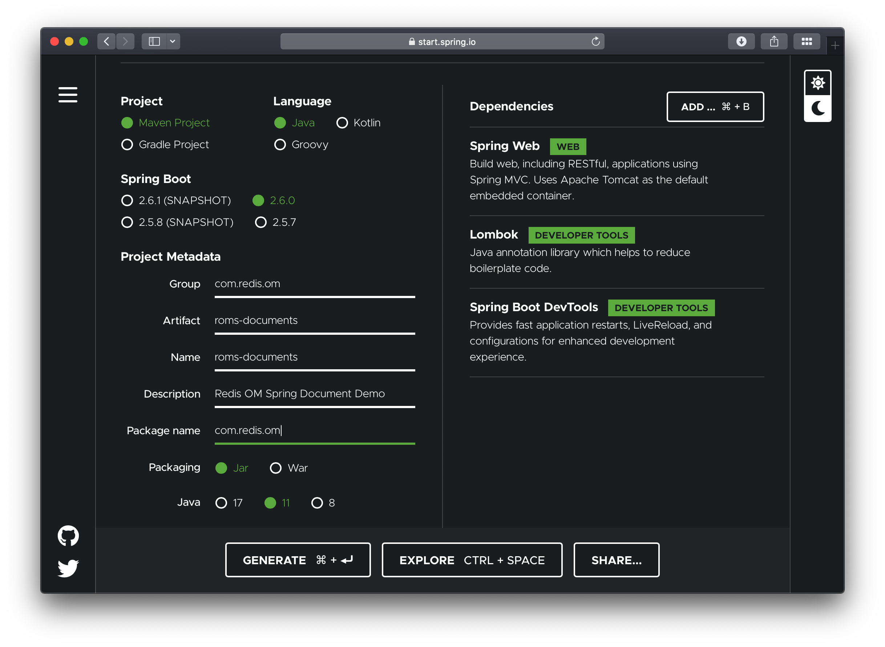

import Tabs from '@theme/Tabs';
import TabItem from '@theme/TabItem';
import useBaseUrl from '@docusaurus/useBaseUrl';
import RedisCard from '@site/src/theme/RedisCard';

## Introduction

The JSON format has become ubiquitous as a data exchange format as well as a storage format,
with many traditional relational databases now supporting JSON as a native format as well as
a several document-oriented databases like CouchDB and MongoDB gaining in popularity. JSON as
a dataformat eliminates the rigidity of relational database schemas, allow applications to
evolve more naturally.

But did you know that Redis is a full-fledge document database supporting JSON natively? The
RedisJSON module adds JSON as a native Redis datatype `ReJSON-RL` and it is seamlessly integrated
with Redis' Search Engine RediSearch. In this tutorial we'll build a simple Document application
using Redis OM Spring.

## What You Will build

You will build an application that stores `Company` POJOs (Plain Old Java Objects) a JSON documents in Redis.

## What You need

* About 15 minutes
* A favorite text editor or IDE
* [JDK 11](http://www.oracle.com/technetwork/java/javase/downloads/index.html) or later
* [Gradle 4+](http://www.gradle.org/downloads) or [Maven 3.2+](http://maven.apache.org/download.cgi)
* [Docker](https://www.docker.com) / [Docker Compose](https://docs.docker.com/compose/)

## Starting with Spring Initializr

We'll start by creating a base SpringBoot application using the [Spring Initializr](https://start.spring.io). You can use this
 [pre-initialized project](https://start.spring.io/#!type=maven-project&language=java&platformVersion=2.6.0&packaging=jar&jvmVersion=11&groupId=com.redis.om&artifactId=roms-documents&name=roms-documents&description=Redis%20OM%20Spring%20Document%20Demo&packageName=com.redis.om&dependencies=web,lombok,devtools)
 and click Generate to download a ZIP file. This project is configured to fit the examples in this tutorial.



To configure the project:

- Navigate to https://start.spring.io. This service pulls in all the dependencies you need for an application and does most of the setup for you.
- Choose either Gradle or Maven and the language you want to use. This guide assumes that you chose Java.
- Click *Dependencies* and select *Spring Web*, *Lombok* and *Spring Boot DevTools*.
- Click *Generate*.
- Download the resulting ZIP file (`roms-documents.zip`), which is an archive of a web application that is configured with your choices.

The dependencies included are:

- *Spring Web*: Build web/RESTful applications using Spring MVC. It will allow us to expose our app as a web service.
- *Lombok*: Java annotation library which helps to reduce boilerplate code.
- *Spring Boot DevTools*: Provides fast application restarts, LiveReload, and configurations for enhanced development experience.

*NOTE:* If your IDE has the Spring Initializr integration, you can complete this process from your IDE.

*NOTE:* You can also fork the project from Github and open it in your IDE or other editor.

## Adding Redis OM Spring

### Maven

To use Redis OM Spring, open the `pom.xml` file and add the Redis OM Spring Maven dependency to the pom.xml file `dependencies` element:

```xml
<dependency>
  <groupId>com.redis.om.spring</groupId>
  <artifactId>redis-om-spring</artifactId>
  <version>0.1.0-SNAPSHOT</version>
</dependency>
```

### Gradle

If using gradle add the dependency as follows:

```groovy
dependencies {
  implementation 'com.redis.om.spring:redis-om-spring:0.1.0-SNAPSHOT'
}
```

## Enabling Redis Document Repositories

The generated application contains a single file, the `@SpringBootApplications` annotated main application:

```java
package com.redis.om;

import org.springframework.boot.SpringApplication;
import org.springframework.boot.autoconfigure.SpringBootApplication;

@SpringBootApplication
public class RomsDocumentsApplication {

	public static void main(String[] args) {
		SpringApplication.run(RomsDocumentsApplication.class, args);
	}

}
```

To enable the Redis Document Repositories we add the `@EnableRedisDocumentRepositories` which will
allow us to use the `RedisDocumentRepository` class as the type of our Data Repositories.

```java
package com.redis.om;

import org.springframework.boot.SpringApplication;
import org.springframework.boot.autoconfigure.SpringBootApplication;
import com.redis.om.spring.annotations.EnableRedisDocumentRepositories;

@SpringBootApplication
@EnableRedisDocumentRepositories(basePackages = "com.redis.om.documents.*")
public class RomsDocumentsApplication {

	public static void main(String[] args) {
		SpringApplication.run(RomsDocumentsApplication.class, args);
	}

}
```

## 🚀 Launch Redis

Redis OM Spring relies on the power of the [RediSearch][redisearch-url] and [RedisJSON][redis-json-url] modules.
The docker compose YAML file below can get started quickly. You can place at the root folder of your project and name it
`docker-compose.yml`:

```yaml
version: "3.9"
services:
  redis:
    image: "redislabs/redismod:edge"
    ports:
      - "6379:6379"
    volumes:
      - ./data:/data
    entrypoint: >
      redis-server
        --loadmodule /usr/lib/redis/modules/redisai.so
        --loadmodule /usr/lib/redis/modules/redisearch.so
        --loadmodule /usr/lib/redis/modules/redisgraph.so
        --loadmodule /usr/lib/redis/modules/redistimeseries.so
        --loadmodule /usr/lib/redis/modules/rejson.so
        --loadmodule /usr/lib/redis/modules/redisbloom.so
        --loadmodule /var/opt/redislabs/lib/modules/redisgears.so
        --appendonly yes
    deploy:
      replicas: 1
      restart_policy:
        condition: on-failure
```

To launch the docker compose application, on the command line (or via Docker Desktop), clone this repository and run (from the root folder):

```bash
docker compose up
```

Let's also launch an instance of the Redis CLI so that we can spy on what ROMS is doing. To do so we'll
launch Redis in monitor mode:

```bash
redis-cli MONITOR
```

## Domain Entity

We'll have a single class in our application, the `Company` class. We'll use lombok to avoid having to
create getters and setters. We'll use the lombok annotations `@Data`, `@RequiredArgsConstructor` and
`@AllArgsConstructor`.

Finally, to mark the class as a JSON document, we use the `@Document` annotation.

```java
package com.redis.om.documents.domain;

import java.util.HashSet;
import java.util.Set;

import org.springframework.data.annotation.Id;
import org.springframework.data.geo.Point;
import org.springframework.data.redis.core.index.Indexed;

import com.redis.om.spring.annotations.Document;
import com.redis.om.spring.annotations.Searchable;

import lombok.AccessLevel;
import lombok.AllArgsConstructor;
import lombok.Data;
import lombok.NonNull;
import lombok.RequiredArgsConstructor;

@Data
@RequiredArgsConstructor(staticName = "of")
@AllArgsConstructor(access = AccessLevel.PROTECTED)
@Document
public class Company {
  @Id
  private String id;

  @NonNull
  @Searchable
  private String name;

  @Indexed
  private Set<String> tags = new HashSet<String>();

  @NonNull
  private String url;

  @NonNull
  @Indexed
  private Point location;

  @NonNull
  @Indexed
  private Integer numberOfEmployees;

  @NonNull
  @Indexed
  private Integer yearFounded;

  private boolean publiclyListed;
}
```

Note that it has a `@Document` annotation on its type and a property named `id` that is annotated with `org.springframework.data.annotation.Id`.
Those two items are responsible for creating the actual key used to persist the JSON document in Redis.

Our company POJO consists of a `name` and `url` `String` properties, a `Set` of `Strings` representing a set of `tags`, a
`org.springframework.data.geo.Point` representing a Geo `location` for our company's headquarters, two `Integer`s for the `numberOfEmployees`
and the `yearFounded` and a `boolean` as to whether the company is `publiclyListed`.

## Redis OM Spring Document Repositories

Working with Redis OM Spring Document Repositories lets you seamlessly convert and store domain objects in Redis JSON keys,
apply custom mapping strategies, and use secondary indexes maintained by RediSearch.

To create the component responsible for storage and retrieval, we need to define a repository interface.
The `RedisDocumentRepository` extends the familiar `PagingAndSortingRepository` from the core `org.springframework.data.repository` package.

Let's create a basic repository under `src/main/java/com/redis/om/documents/repositories` with the contents shown:

```java
package com.redis.om.documents.repositories;

import com.redis.om.documents.domain.Company;
import com.redis.om.spring.repository.RedisDocumentRepository;

public interface CompanyRepository extends RedisDocumentRepository<Company, String> {
}
```

The empty repository declaration is all we need to get basic CRUD functionality/pagination and sorting for our POJOs.

`CompanyRepository` extends the `RedisDocumentRepository` interface. The type of entity and ID that it works with,
`Company` and `String`, are specified in the generic parameters on `RedisDocumentRepository`. By extending
`PagingAndSortingRepository`, which itself extends `CrudRepository`, our `CompanyRepository` inherits several methods
for working with Company persistence, including methods for saving, deleting, and finding Company entities.

## Pre-populating the Database

Let's add a couple of `Company` POJOs to Redis so that we can have some data to play with and at the same time
get to undertstand how ROMS serializes POJOs to JSON.

Modify the `RomsDocumentsApplication` class to include the newly created `CompanyRepository` using the `@Autowired`
annotation. Then we'll use a `CommandLineRunner` `@Bean` annotated method to create two `Company` POJOs and
save them to the database.

In the `CommandLineRunner` we take the following steps:

- Use the repository `deleteAll` method to clear the database (be careful with this is production! 🙀)
- Create two `Company` instances; one for Redis and one for Microsoft. Including name, URL, Geo Location, number
  of employees, year established, as well a set of tags.
- Use the repository `save` method passing each of the created POJOs.

```java
package com.redis.om.documents;

import java.util.Set;

import org.springframework.beans.factory.annotation.Autowired;
import org.springframework.boot.CommandLineRunner;
import org.springframework.boot.SpringApplication;
import org.springframework.boot.autoconfigure.SpringBootApplication;
import org.springframework.context.annotation.Bean;
import org.springframework.context.annotation.Configuration;
import org.springframework.data.geo.Point;

import com.redis.om.documents.domain.Company;
import com.redis.om.documents.repositories.CompanyRepository;
import com.redis.om.spring.annotations.EnableRedisDocumentRepositories;

@SpringBootApplication
@Configuration
@EnableRedisDocumentRepositories(basePackages = "com.redis.om.documents.*")
public class RomsDocumentsApplication {

  @Autowired
  CompanyRepository companyRepo;

  @Bean
  CommandLineRunner loadTestData() {
    return args -> {
      companyRepo.deleteAll();
      Company redis = Company.of("Redis", "https://redis.com", new Point(-122.066540, 37.377690), 526, 2011);
      redis.setTags(Set.of("fast", "scalable", "reliable"));

      Company microsoft = Company.of("Microsoft", "https://microsoft.com", new Point(-122.124500, 47.640160), 182268, 1975);
      microsoft.setTags(Set.of("innovative", "reliable"));

      companyRepo.save(redis);
      companyRepo.save(microsoft);
    };
  }

  public static void main(String[] args) {
    SpringApplication.run(RomsDocumentsApplication.class, args);
  }

}
```

Since we are using Spring Boot DevTools, if you already had the application running, it should have restarted/reloaded. If
not, use the `mvn` command to launch the application:

```bash
./mvnw spring-boot:run
```

If every goes as expected, you should see the familiar Spring Boot banner fly by:

```bash
[INFO] --- spring-boot-maven-plugin:2.6.0-M1:run (default-cli) @ roms-documents ---
[INFO] Attaching agents: []

  .   ____          _            __ _ _
 /\\ / ___'_ __ _ _(_)_ __  __ _ \ \ \ \
( ( )\___ | '_ | '_| | '_ \/ _` | \ \ \ \
 \\/  ___)| |_)| | | | | || (_| |  ) ) ) )
  '  |____| .__|_| |_|_| |_\__, | / / / /
 =========|_|==============|___/=/_/_/_/
 :: Spring Boot ::             (v2.6.0-M1)

2021-11-30 09:45:58.094  INFO 36380 --- [  restartedMain] c.r.o.d.RomsDocumentsApplication         : Starting RomsDocumentsApplication using Java 11.0.9 on BSB.lan with PID 36380 (/Users/bsb/Code/module-clients/java/high-level/redis-om/redis-om-spring/demos/roms-documents/target/classes started by briansam-bodden in /Users/bsb/Code/module-clients/java/high-level/redis-om/redis-om-spring/demos/roms-documents)
```

## Where's our data?

If you were watching the Redis CLI monitor you should have seen a barrage of output fly by. Let's break it down
and inspect it using another Redis CLI so as to understand the inner workings of the system.

### RediSearch Indices

At the top you should have seen the `FT.CREATE` command which using the annotations in our POJO determined a RediSearch
index recipe. Since our POJO is annotated with `@Document` we get a RediSearch index `ON JSON` against any keys starting
with `com.redis.om.documents.domain.Company:` (which is the default key prefix for Spring Data Redis and also for ROMS):

```bash
1638291270.881079 [0 172.19.0.1:63378] "FT.CREATE" "CompanyIdx" "ON" "JSON" "PREFIX" "1" "com.redis.om.documents.domain.Company:" "SCHEMA" "$.name" "AS" "name" "TEXT" "$.tags[*]" "AS" "tags" "TAG" "$.location" "AS" "location" "GEO" "$.numberOfEmployees" "AS" "numberOfEmployees" "NUMERIC" "$.yearFounded" "AS" "yearFounded" "NUMERIC"
```

ROMS uses the POJO fields annotated with `@Indexed` or `@Searchable` to build the index schema. In the case of the `Company` POJO
we have name propery annotated as "searchable" which means we get full-text search capabilities over that field. This is reflected
in the schema field definition `$.name AS name TEXT`.

On the other hand the field `tags` is annotated as "indexable" which means we get an index field of type TAG, meaning
that we can search for Companies by the exact value of the field. This is again, reflected in the schema field definition: `$.tags[*] AS tags TAG`

Spring Data Redis creates a SET to maintain primary keys for our entities, ROMS inherits this functionality from SDR. The `DEL`
command following the index creation is triggered because of the call to `companyRepo.deleteAll();` in our data loading method. If we
had any saved objects already we would also see calls to delete those individual instances.

```bash
1638291270.936493 [0 172.19.0.1:63378] "DEL" "com.redis.om.documents.domain.Company"
```

Finally, for each of the `Company` POJOs we should see a sequence of REDIS commands like:

```bash
1638291270.958384 [0 172.19.0.1:63378] "SISMEMBER" "com.redis.om.documents.domain.Company" "01FNRW9V98CYQMV2YAB7M4KFGQ"
1638291270.966868 [0 172.19.0.1:63378] "JSON.SET" "com.redis.om.documents.domain.Company:01FNRW9V98CYQMV2YAB7M4KFGQ" "." "{\"id\":\"01FNRW9V98CYQMV2YAB7M4KFGQ\",\"name\":\"Redis\",\"tags\":[\"reliable\",\"fast\",\"scalable\"],\"url\":\"https://redis.com\",\"location\":\"-122.06654,37.37769\",\"numberOfEmployees\":526,\"yearFounded\":2011,\"publiclyListed\":false}"
1638291270.970030 [0 172.19.0.1:63378] "SADD" "com.redis.om.documents.domain.Company" "01FNRW9V98CYQMV2YAB7M4KFGQ"
```

The first line checks whether the object already exists in the Redis SET of primary keys using the `SISMEMBER` command. Then,
the RedisJSON `JSON.SET` commands is used to save the JSON serialization of the entity. Once that operation succeeds, the
`id` property of the object is addded to the primary keys set using the `SADD` command.

Let's inspect the data using the Redis CLI. We'll start by listing the keys prefixed with `com.redis.om.documents.domain.Company`:

```bash
127.0.0.1:6379> SCAN 0 MATCH com.redis.om.documents.domain.Company*
1) "0"
2) 1) "com.redis.om.documents.domain.Company:01FNRW9V98CYQMV2YAB7M4KFGQ"
   2) "com.redis.om.documents.domain.Company:01FNRW9V9VFNG0MQCJDXZPEG3H"
   3) "com.redis.om.documents.domain.Company"
```

We have 3 matches, one for each of the `Company` POJOs created plus the Redis SET for the primary keys.
Let's inspect some of the values.

Let's check what type of data structure is stored in the `com.redis.om.documents.domain.Company` key:

```bash
127.0.0.1:6379> TYPE "com.redis.om.documents.domain.Company"
set
```

Knowing that it is a Redis SET, let inspect it's contents using the `SMEMBERS` command:

```bash
127.0.0.1:6379> SMEMBERS "com.redis.om.documents.domain.Company"
1) "01FNRW9V9VFNG0MQCJDXZPEG3H"
2) "01FNRW9V98CYQMV2YAB7M4KFGQ"
```

The set contains all the Ids of our Companies. Now, let's investigate the  `com.redis.om.documents.domain.Company:01FNRW9V98CYQMV2YAB7M4KFGQ` key:

```bash
127.0.0.1:6379> TYPE "com.redis.om.documents.domain.Company:01FNRW9V98CYQMV2YAB7M4KFGQ"
ReJSON-RL
```

The Redis datatype stored is a `ReJSON-RL` (a Redis JSON document). Let's check its contents using the `JSON.GET` command:

```bash
127.0.0.1:6379> JSON.GET "com.redis.om.documents.domain.Company:01FNRW9V98CYQMV2YAB7M4KFGQ"
"{\"id\":\"01FNRW9V98CYQMV2YAB7M4KFGQ\",\"name\":\"Redis\",\"tags\":[\"reliable\",\"fast\",\"scalable\"],\"url\":\"https://redis.com\",\"location\":\"-122.06654,37.37769\",\"numberOfEmployees\":526,\"yearFounded\":2011,\"publiclyListed\":false}"
```

With our new gained understanding of how ROMS serialized our `Company` POJOs, let's move on to expanding the powers of
our `CompanyRepository` to go beyond CRUD.

### Create Simple Dynamic Queries

ROMS most compelling feature is the ability to create repository implementations automatically, at runtime,
from a repository interface.

Let's start with a simple method declaration in `CompanyRepository` that will find a unique instance of `Company` given
the company name.

```java
package com.redis.om.documents.repositories;

import java.util.Optional;
// ... other imports ommitted ...

public interface CompanyRepository extends RedisDocumentRepository<Company, String> {
  // find one by property
  Optional<Company> findOneByName(String name);
}
```

ROMS uses the method name, parameters and return type to determine the correct query to generate and how to
package and return a result.

`findOneByName` return an `Optional` of `Company` this tells ROMS to return a null payload if the entity is not found. The `findOne` part
also reinforces that even if there are multiple results we are only interested in getting one. ROMS parses the method name
to detemined the number of expected parameters, the `ByName` portion of the method tell us we expect 1 single parameter named `name`.

### Testing Controller

Let's create a REST controller to test the `findOneByName` method. Create the `CompanyController` under the package
`com.redis.om.documents.controllers` as shown:

```java
package com.redis.om.documents.controllers;

import java.util.Optional;
import java.util.Set;

import org.springframework.beans.factory.annotation.Autowired;
import org.springframework.web.bind.annotation.GetMapping;
import org.springframework.web.bind.annotation.PathVariable;
import org.springframework.web.bind.annotation.RequestMapping;
import org.springframework.web.bind.annotation.RestController;

import com.redis.om.documents.domain.Company;
import com.redis.om.documents.repositories.CompanyRepository;

@RestController
@RequestMapping("/api/companies")
public class CompanyController {
  @Autowired
  CompanyRepository repository;

  @GetMapping("name/{name}")
  Optional<Company> byName(@PathVariable("name") String name) {
    return repository.findOneByName(name);
  }
}
```

In our controller, we include our `CompanyRepository` and create simple method to respond to a GET request at
`/api/companies/name/{name}` where `{name}` would be the string parameter we are passing as the `name` to find.

Let's test the endpoint using CURL and passing the exact company name `Redis`:

```bash
➜ curl --location --request GET 'http://localhost:8080/api/companies/name/Redis'
{"id":"01FNRW9V98CYQMV2YAB7M4KFGQ","name":"Redis","tags":["reliable","fast","scalable"],"url":"https://redis.com","location":{"x":-122.06654,"y":37.37769},"numberOfEmployees":526,"yearFounded":2011,"publiclyListed":false}
```

Let's format the resulting JSON:

```json
{
  "id": "01FNRW9V98CYQMV2YAB7M4KFGQ",
  "name": "Redis",
  "tags": [
    "reliable",
    "fast",
    "scalable"
  ],
  "url": "https://redis.com",
  "location": {
    "x": -122.06654,
    "y": 37.37769
  },
  "numberOfEmployees": 526,
  "yearFounded": 2011,
  "publiclyListed": false
}
```

Inspecting the Redis CLI Monitor shows the resulting RediSearch query:

```bash
1638344903.218982 [0 172.19.0.1:63410] "FT.SEARCH" "CompanyIdx" "@name:Redis "
```

Notice that you can use `redis` (all lowercase) or `rEdI` and you will get a match for `Redis`, if you go below 4
characters, say you try `red` or `RED` you will get no hits. RediSearch limits the minimun string match size to 4
characters to prevent potentially millions of results being returned.

### Storing and Querying Geospatial Data

ROMS supports GeoJSON types to store geospatial data. By using the `near` keyword in our queries,
we tell ROMS to expect a `Point`  (`org.springframework.data.geo.Point`) and a
`Distance`  (`org.springframework.data.geo.Distance`) types as parameters.

```java
// geospatial query
Iterable<Company> findByLocationNear(Point point, Distance distance);
```

Let's add a testing end point to our controller for our Geo query:

```java
@GetMapping("near")
Iterable<Company> byLocationNear(//
    @RequestParam("lat") double lat, //
    @RequestParam("lon") double lon, //
    @RequestParam("d") double distance) {
  return repository.findByLocationNear(new Point(lon, lat), new Distance(distance, Metrics.MILES));
}
```

In our controller method we take 2 request parameters; latitude `lat`, longitude `lon` and a distance `d` (in miles).
We use these values to contruct the `Point` and `Distance` needed for the repository `findByLocationNear` method.

Let's test the method with CURL, using a location near Redis' Mountain View headquarters:

```bash
➜ curl --location --request GET 'http://localhost:8080/api/companies/near?lat=37.384&lon=-122.064&d=30'
[{"id":"01FNRW9V98CYQMV2YAB7M4KFGQ","name":"Redis","tags":["reliable","fast","scalable"],"url":"https://redis.com","location":{"x":-122.06654,"y":37.37769},"numberOfEmployees":526,"yearFounded":2011,"publiclyListed":false}]
```

Formatting the JSON result we get a JSON array containing one entry: `Redis`.

```json
[
  {
    "id": "01FNRW9V98CYQMV2YAB7M4KFGQ",
    "name": "Redis",
    "tags": [
      "reliable",
      "fast",
      "scalable"
    ],
    "url": "https://redis.com",
    "location": {
      "x": -122.06654,
      "y": 37.37769
    },
    "numberOfEmployees": 526,
    "yearFounded": 2011,
    "publiclyListed": false
  }
]
```

Inspecting the Redis CLI Monitor shows the resulting RediSearch query:

```bash
1638344951.451871 [0 172.19.0.1:63410] "FT.SEARCH" "CompanyIdx" "@location:[-122.064 37.384 30.0 mi] "
```

### Native RediSearch Queries

There might be occassions where you just need to reach for the raw querying power of RediSearch
(just like when you need raw SQL over JPA). For these scenario, we provide the `@Query`
(`com.redis.om.spring.annotations.Query`) and the `@Aggregation` (`com.redis.om.spring.annotations.Aggregation`)
annotations. These annotations expose the raw querying API provided by the `JRediSearch` library. ROMS adds parameter
parsing and results mapping so you can use raw RediSearch queries and aggregations in your repositories.

```java
// find by tag field, using JRediSearch "native" annotation
@Query("@tags:{$tags}")
Iterable<Company> findByTags(@Param("tags") Set<String> tags);
```

Let's test it with CURL:

```bash
➜ curl --location --request GET 'http://localhost:8080/api/companies/tags?tags=reliable'
[{"id":"01FNTF7QKAGCQYMWWBV3044DHW","name":"Redis","tags":["reliable","fast","scalable"],"url":"https://redis.com","location":{"x":-122.06654,"y":37.37769},"numberOfEmployees":526,"yearFounded":2011,"publiclyListed":false},{"id":"01FNTF7QKXJ1CNZERHADN91YBR","name":"Microsoft","tags":["reliable","innovative"],"url":"https://microsoft.com","location":{"x":-122.1245,"y":47.64016},"numberOfEmployees":182268,"yearFounded":1975,"publiclyListed":false}]
```

Formatting the JSON we can see that the results include companies with the tag `reliable`:

```json
[
  {
    "id": "01FNTF7QKAGCQYMWWBV3044DHW",
    "name": "Redis",
    "tags": [
      "reliable",
      "fast",
      "scalable"
    ],
    "url": "https://redis.com",
    "location": {
      "x": -122.06654,
      "y": 37.37769
    },
    "numberOfEmployees": 526,
    "yearFounded": 2011,
    "publiclyListed": false
  },
  {
    "id": "01FNTF7QKXJ1CNZERHADN91YBR",
    "name": "Microsoft",
    "tags": [
      "reliable",
      "innovative"
    ],
    "url": "https://microsoft.com",
    "location": {
      "x": -122.1245,
      "y": 47.64016
    },
    "numberOfEmployees": 182268,
    "yearFounded": 1975,
    "publiclyListed": false
  }
]
```

Inspecting the Redis CLI Monitor we see the RediSearch query that produced the results:

```bash
1638345120.384300 [0 172.19.0.1:63412] "FT.SEARCH" "CompanyIdx" "@tags:{reliable} "
```

### Numeric Queries

Just like other Spring Data based libraries, ROMS can handle a variety of queries using
logic and numerical operators like `between`, `startingWith`, `greaterThan`, `lessThanOrEquals` and many
more.

Below are some more examples of what's possible:

```java
// find by numeric property
Iterable<Company> findByNumberOfEmployees(int noe);

// find by numeric property range
Iterable<Company> findByNumberOfEmployeesBetween(int noeGT, int noeLT);

// starting with/ending with
Iterable<Company> findByNameStartingWith(String prefix);
```

### What's Next

This was but a brief tour of the capabilities of Redis OM Spring (ROMS). In the next installment we'll cover how
ROMS extends Spring Data Redis Redis Hash mapping to make it even better.

<!-- Links -->

[redisearch-url]: https://oss.redis.com/redisearch/
[redis-json-url]: https://oss.redis.com/redisjson/
