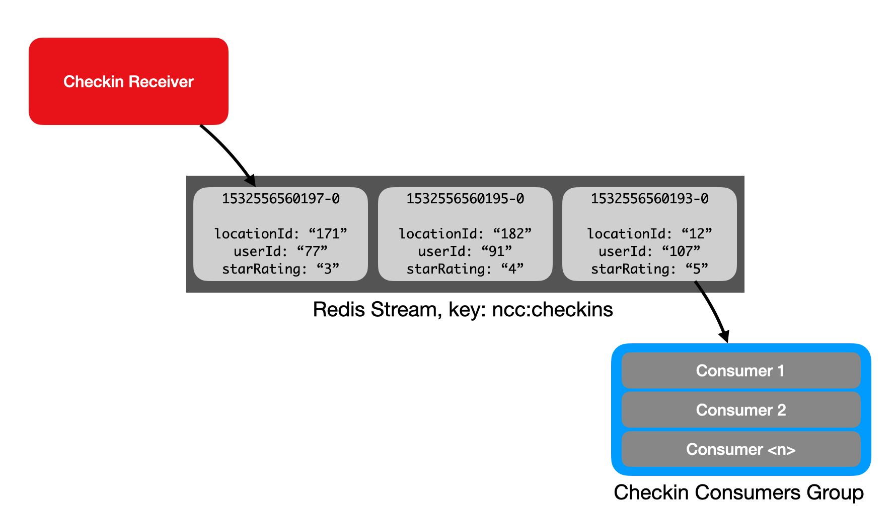
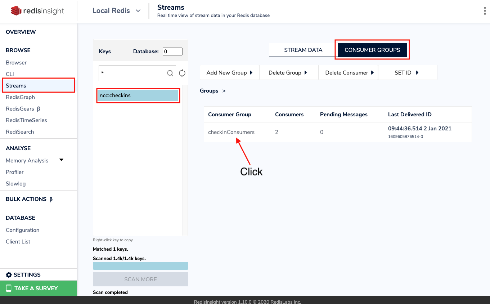

import useBaseUrl from '@docusaurus/useBaseUrl';

<div class="text--center">
<iframe width="560" height="315" src="https://www.youtube.com/embed/xdROBvMb4LE" frameborder="0" allow="accelerometer; autoplay; clipboard-write; encrypted-media; gyroscope; picture-in-picture" allowfullscreen></iframe>
</div>

As our application grows in popularity and our user base increases, we're receiving more and more checkins.  Recall that checkins are added to a Redis Stream by the Checkin Receiver, and read from that stream by the Checkin Processor.  The Stream acts as a buffer between these two components:


Unfortunately, our single Checkin Processor is struggling to keep up with the volume of new checkins.  This means that we're seeing longer and longer lag times between a checkin arriving in the Stream and its values being reflected in our user and location Hashes.

And, we can't run more than one instance of the Checkin Processor, as each instance will consume the whole Stream.  What we need is a way for multiple instances of the same consumer code to collaboratively process entries from a Stream.

Redis Streams offers consumer groups as a solution for this.  We can think of a consumer group as a single logical consumer that reads the entire Stream, spreading the work out between individual consumers in the group:



Redis tracks which messages have been delivered to which consumers in the group, ensuring that each consumer receives its own unique subset of the Stream to process.  This allows for parallel processing of the Stream by multiple consumer processes.  As you'll see in the video, this requires us to rethink our processing logic to allow Stream entries to be processed out of order,  and to avoid race conditions when updating user and location Hashes.  We'll use the Lua interpreter built into Redis to help here.

## Hands-on Exercise

In this exercise, you'll run multiple concurrent instances of the Checkin Group Processor so that you can see how they work together to collaboratively process the Stream.

If you're still running the Checkin Processor service, stop it with Ctrl-C.

Next, open up two terminal windows.  cd to the `node-js-crash-course` folder that you cloned the GitHub repo into in both windows.

In one terminal, start an instance of the Checkin Group Processor that we'll call consumer1:

```bash
$ npm run checkingroupprocessor consumer1

> js-crash-course@0.0.1 checkingroupprocessor 
> node ./src/checkingroupprocessor.js "consumer1"

info: consumer1: Starting up.
info: consumer1: Processing checkin 1609602085397-0.
debug: consumer1: Processing 1609602085397-0.
debug: consumer1: Updating user ncc:users:789 and location ncc:locations:171.
info: consumer1: Acknowledged processing of checkin 1609602085397-0.
info: consumer1: Pausing to simulate work.
info: consumer1: Processing checkin 1609604227545-0.
debug: consumer1: Processing 1609604227545-0.
debug: consumer1: Updating user ncc:users:752 and location ncc:locations:100.
info: consumer1: Acknowledged processing of checkin 1609604227545-0.
info: consumer1: Pausing to simulate work.
info: consumer1: Processing checkin 1609605397408-0.
debug: consumer1: Processing 1609605397408-0.
debug: consumer1: Updating user ncc:users:180 and location ncc:locations:13.
info: consumer1: Acknowledged processing of checkin 1609605397408-0.
info: consumer1: Pausing to simulate work.
info: consumer1: Processing checkin 1609605876514-0.
...
```

In the second terminal, start another instance of the Checkin Group Processor, consumer2:

```bash
$ npm run checkingroupprocessor consumer2

> js-crash-course@0.0.1 checkingroupprocessor 
> node ./src/checkingroupprocessor.js "consumer2"

info: consumer2: Starting up.
info: consumer2: Processing checkin 1609603711960-0.
debug: consumer2: Processing 1609603711960-0.
debug: consumer2: Updating user ncc:users:455 and location ncc:locations:181.
info: consumer2: Acknowledged processing of checkin 1609603711960-0.
info: consumer2: Pausing to simulate work.
info: consumer2: Processing checkin 1609604778689-0.
debug: consumer2: Processing 1609604778689-0.
debug: consumer2: Updating user ncc:users:102 and location ncc:locations:144.
info: consumer2: Acknowledged processing of checkin 1609604778689-0.
info: consumer2: Pausing to simulate work.
...
```

Look at the checkin IDs that each consumer processes.  Note that they don't receive the same checkins.  The Redis server gives each consumer in a group its own logical view of the Stream, each processing a subset of entries.  This speeds up checkin processing as now we can have more than one consumer running at the same time.

Let’s take a look at some of the information Redis is tracking about our consumer group.  Go ahead and stop both consumer processes by pressing Ctrl-C.

If you're using RedisInsight, open up the "Streams" browser, click the `ncc:checkins` key, and then select the "Consumer Groups" tab.  You should see something like this:



This shows the number of consumers that are in the group, how many pending messages each has (a pending message is one that has been read by a consumer but not yet acknowledged with `XACK`), and the consumer's idle time since it last read from the Stream.

Click on "checkinConsumers" in the Consumer Group table to see a breakdown of pending messages and idle time for each consumer:


In a real-world system, you could use this information to detect consumers that have encountered a problem processing entries.  Redis Streams provides commands to reassign messages that a consumer has read but not acknowledged, allowing you to build consumer recovery strategies that re-allocate those messages to healthy consumer instances in the same group.

If you're using redis-cli rather than RedisInsight, you can see the same information using the `XINFO` and `XPENDING` commands:

```bash
127.0.0.1:6379> xinfo groups ncc:checkins
1) 1) "name"
   2) "checkinConsumers"
   3) "consumers"
   4) (integer) 2
   5) "pending"
   6) (integer) 0
   7) "last-delivered-id"
   8) "1609605876514-0"
127.0.0.1:6379> xpending ncc:checkins checkinConsumers
1) (integer) 0
127.0.0.1:6379> xinfo consumers ncc:checkins checkinConsumers
1) 1) "name"
   2) "consumer1"
   3) "pending"
   4) (integer) 0
   5) "idle"
   6) (integer) 2262454
2) 1) "name"
   2) "consumer2"
   3) "pending"
   4) (integer) 0
   5) "idle"
   6) (integer) 2266244
```

## External Resources

* [RU202 Redis Streams](https://university.redis.com/courses/ru202/), a free online course at Redis University.
* [Introduction to Redis Streams](https://redis.io/topics/streams-intro) at redis.io.
* [XGROUP documentation](https://redis.io/commands/xgroup) at redis.io.
* [XREADGROUP documentation](https://redis.io/commands/xreadgroup) at redis.io.
* [XINFO documentation](https://redis.io/commands/xinfo) at redis.io.
* [XPENDING documentation](https://redis.io/commands/xpending) at redis.io.
* [Redis Lua Scripting documentation](https://redis.io/commands/eval) at redis.io.

