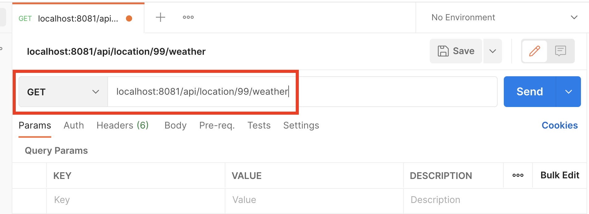
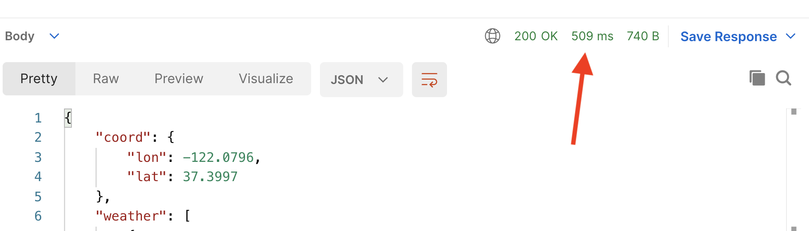
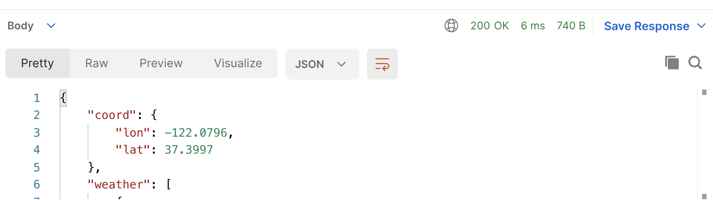

import Authors from '@site/src/theme/Authors';

<Authors frontMatter={frontMatter} />

<div class="text--center">
  <iframe
    width="896"
    height="509"
    src="https://www.youtube.com/embed/UtB_eHmnz1Y"
    frameborder="0"
    allow="accelerometer; autoplay; clipboard-write; encrypted-media; gyroscope; picture-in-picture"
    allowfullscreen></iframe>
</div>

We want to provide our users with up to date weather for each of our locations… so we've partnered with a company that provides a weather API.

Our use of this API is metered and rate limited, so ideally we don't want to keep making the same requests to it over and over again. This is wasteful, could cost us money, and will slow down responses to our users.

Redis can be used as a cache to help here. Keys in Redis can be given an expiry time, after which Redis will delete them. We'll use this capability to cache the results of weather API calls as Redis Strings, keeping them for an hour to achieve a balance between users seeing the absolute latest weather report for a location and the load we're placing on the API provider's servers.

We'll use an extra Express middleware function to check if we've got the weather for a location in the Redis cache, and only go get it from the API provider if necessary.

## Hands-on Exercise

In this exercise, you'll use Postman to see how caching with Redis makes an API call faster while also saving us from incurring costs associated with using a third-party service.

You'll be using the "/location/:locationId/weather" route for this exercise. The code for this route takes a location ID, retrieves that location's latitude and longitude from its Redis Hash, then calls the OpenWeather API with those coordinates to retrieve weather data as a JSON document.

This document is returned to the user and cached in Redis for an hour. Subsequent requests for the same location's weather within the hour are handled by the middleware function that sits in front of this route's logic. It returns the cached value without making a request to the OpenWeather servers.

To use OpenWeather's API, you'll first need to [sign up for a free API key on their website](https://home.openweathermap.org/users/sign_up).

Once you have your API key, stop the API server component (Ctrl-C), and set an environment variable containing your key as follows:

```bash
$ export WEATHER_API_KEY=my_api_key
```

Then start the server:

```bash
$ npm run dev
```

Now start Postman, and click the + button to create a new request:


Set the URL to `http://localhost:8081/api/location/99/weather` and make sure you have a GET request selected from the dropdown of available HTTP verbs:



Click "Send", and you should see the weather report JSON for location 99 appear in the "Response" panel. Make a note of the overall response time that Postman reports for this request (509 milliseconds here):



Take a look at the output from the API server in your terminal window, you should see that no value for location 99 was found in the cache, so the data was requested from OpenWeather and then added to the cache in Redis:

```bash
debug: Cache miss for location 99 weather.
```

Click "Send" in Postman again to repeat the request... This time the response will be served from Redis and will be noticeably faster. No call to the OpenWeather API was made. Note the difference in response times when the result comes from cache (just 6 milliseconds here!):



Checking the output from the API server's terminal window shows that this request was served from cache:

```bash
debug: Cache hit for location 99 weather.
```

Finally, take a look at the cached data in Redis. Use RedisInsight or redis-cli to take a look at the key `ncc:weather:99`. The `TTL` command shows the number of seconds remaining before Redis deletes this key from the cache:

```bash
$ redis-cli
127.0.0.1:6379> GET ncc:weather:99
127.0.0.1:6379> TTL ncc:weather:99
```

If you're using RedisInsight, you can see the remaining TTL (in seconds) in the browser view:


The key `ncc:weather:99` will be deleted an hour after it was originally written to Redis, causing the next request after that deletion for location 99's weather to be a cache miss. If you want to speed up this process, delete the key `ncc:weather:99` using the trash can icon in RedisInsight, or the `DEL` command in redis-cli:

```bash
127.0.0.1:6379> DEL ncc:weather:99
```

Then try your request in Postman again and see what happens.

## External Resources

If you'd like to learn more about caching API responses in a Node.js application with Redis, check out Justin's excellent video:

<div class="text--center">
  <iframe
    width="896"
    height="509"
    src="https://www.youtube.com/embed/hRecenOBYlE"
    frameborder="0"
    allow="accelerometer; autoplay; clipboard-write; encrypted-media; gyroscope; picture-in-picture"
    allowfullscreen></iframe>
</div>
