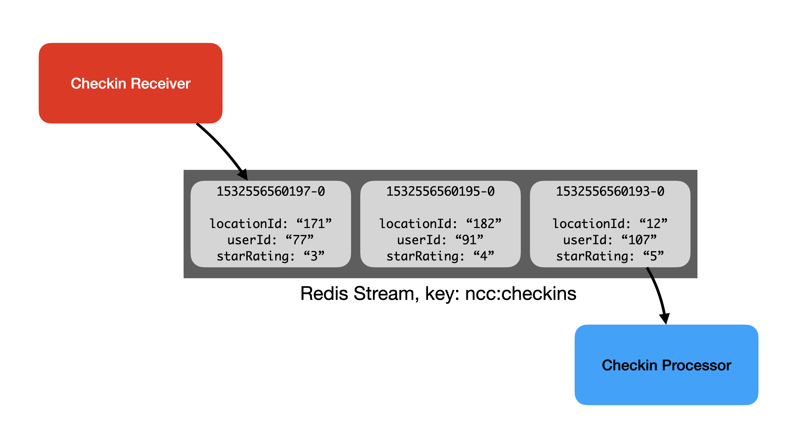
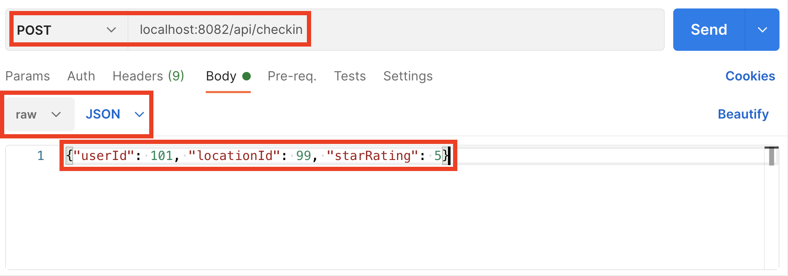

import Authors from '@theme/Authors';

<Authors frontMatter={frontMatter} />

<div class="text--center">
  <iframe
    width="896"
    height="509"
    src="https://www.youtube.com/embed/19gPDwmXNWc"
    frameborder="0"
    allow="accelerometer; autoplay; clipboard-write; encrypted-media; gyroscope; picture-in-picture"
    allowfullscreen></iframe>
</div>

The most common action that users perform with our system is checking in at a location. This part of the system needs to quickly capture checkins and scale independently of other components.

We decided to build a separate Express application just to receive checkin POST requests from users. This allows us to scale it separately from other API endpoints that deal with GET requests. To make our Checkin Receiver as fast as possible, we decided to do the actual work of processing checkins in a separate service. The Checkin Processor service reads checkins frmo the stream and updates the user and location Hashes in Redis.

Checkins are transient data in our system - as long as we process them all, we don't need to keep them around forever. It also makes sense to store them in the order that they arrive in the system.

Using a Redis Stream to store our checkin data is a natural fit for this use case. A Stream acts as a buffer between producer and consumer components. With Redis Streams, each entry in the stream is given a timestamp ID and the Stream is ordered by these IDs.

In our application, the Checkin Receiver Service is the _producer_ and the Checkin Processor the _consumer_. We can represent this in a diagram like so:



Using a Stream allows these components to operate at different speeds with no knowledge of each other. The Checkin Receiver simply adds a new entry to the Stream for each checkin it receives from a user, and the Checkin Processor reads the Stream and updates user and location Hashes at its own pace.

It's also possible to read a Redis Stream to find entries that were added in a specified time period between a start and end IDs. As our IDs are timestamps, this means that we can request data that was added in a given timeframe. We use this capability in the API Server component and in this module's coding exercise you'll get to extend this with new functionality.

## Hands-on exercise

Take a moment to run the Checkin Processor component which reads checkins from the stream and updates user and location Hashes.

The sample data contains 5000 unprocessed checkins which the Checkin Processor will consume. The Checkin Processor keeps track of how far it has gotten in the stream by storing the ID of the last processed checkin in Redis. This way, when it's stopped and restarted it picks up from where it left off.

In a terminal window, `cd` to the `node-js-crash-course` folder that you cloned the GitHub repo to, and start the Checkin Processor:

```bash
$ npm run checkinprocessor delay
```

Adding `delay` introduces an artificial random processing time for each checkin. This slows the Checkin Processor down so that you can examine its output more easily. You should see it start up and begin processing checkins from the start of the stream at ID 0, which is the lowest possible stream entry ID:

```bash
$ npm run checkinprocessor delay

> js-crash-course@0.0.1 checkinprocessor
> node ./src/checkinprocessor.js -- "delay"

info: Reading stream from last ID 0.
debug: Updating user ncc:users:789 and location ncc:locations:171.
info: Processed checkin 1609602085397-0.
debug: Updating user ncc:users:455 and location ncc:locations:181.
info: Processed checkin 1609603711960-0.
debug: Updating user ncc:users:752 and location ncc:locations:100.
info: Processed checkin 1609604227545-0.
debug: Updating user ncc:users:102 and location ncc:locations:144.
info: Processed checkin 1609604778689-0.
debug: Updating user ncc:users:180 and location ncc:locations:13.
info: Processed checkin 1609605397408-0.
...
```

Stop the Checkin Processor with Ctrl-C after it has processed a few checkins. Note the ID of the last checkin processed (this is `1609605397408-0` in the example above). Also note the user and location ID for the last checkin processed (user 180, location 13 in the example above).

Verify that the Checkin Processor stored this ID in Redis so that it knows where to start from when it's restarted. Using redis-cli or RedisInsight, take a look at the contents of the key `ncc:checkinprocessor:lastid`:

```bash
127.0.0.1:6379> get ncc:checkinprocessor:lastid
"1609605397408-0"
```

The value should match the last checkin ID that was processed.

Finally, let's verify that the Checkin Processor updated the user's Hash with details from that checkin. Use RedisInsight or the `HGETALL` command in redis-cli to look at the hash whose key is `ncc:users:<user-id>`, replacing `<user-id>` with the ID of the user that you noted earlier.

So for my example, let's look at user 180:

```bash
127.0.0.1:6379> hgetall ncc:users:180
 1) "id"
 2) "180"
 3) "firstName"
 4) "Sophia"
 5) "lastName"
 6) "Marshall"
 7) "email"
 8) "sophia.marshall@example.com"
 9) "password"
10) "$2b$05$DPSHjaW44H4fn9sudfz/5.f1WcuZMrA0OZIp0CALQf0MH8zH1SSda"
11) "numCheckins"
12) "2332"
13) "lastCheckin"
14) "1609605397408"
15) "lastSeenAt"
16) "13"
```

Verify that the value for `lastCheckin` is the timestamp from the last processed checkin's ID (`1609605397408`) in my case, and that the `lastSeenAt` value is the location ID from the last processed checkin (`13` in my case).

## Coding exercise

In this exercise, you'll implement a new route in the API Server component. This route will return only the most recent checkin from the checkins stream. You'll use the [XREVRANGE command](https://redis.io/commands/xrevrange) for this.

First, make sure the API Server is running:

```bash
$ npm run dev
```

(remember that this starts the server with nodemon, so as you modify the code and save your changes it will automatically restart and run the new code).

Open the `node-js-crash-course` folder with your IDE, and open the file `src/routes/checkin_routes.js`. Locate the function that handles the `/checkins/latest` route.

Using the [XREVRANGE documentation](https://redis.io/commands/xrevrange) as a guide, modify the following line to invoke `XREVRANGE` so that it returns just the most recent checkin:

```javascript
const latestCheckin = await redisClient.xrevrange(checkinStreamKey, 'TODO');
```

Remember: When using ioredis, each parameter to a Redis command needs to be passed as a separate value.

Test your code by visiting `http://localhost:8081/checkins/latest` - you should see a JSON representation of a checkin.

To make sure your code returns the latest checkin, you need to POST a checking using Postman. Start the Checkin Receiver component in a new terminal window:

```bash
$ npm run checkinreceiver
```

Then use Postman to POST a checkin. In Postman, open a new request, configure it as shown, and press Send:



Now when you refresh `http://localhost:8081/checkins/latest` in your browser, the values shown should match those that you supplied in Postman.

## External Resources

- [RU202, Redis Streams](https://university.redis.com/courses/ru202/) at Redis University provides a deep dive into Redis Streams.
- [Introduction to Redis Streams](https://redis.io/topics/streams-intro) at redis.io.

In this video, Justin introduces Redis Streams with an example application that's very similar to the one we're building in this course:

<div class="text--center">
  <iframe
    width="896"
    height="509"
    src="https://www.youtube.com/embed/7cvyluza00Q"
    frameborder="0"
    allow="accelerometer; autoplay; clipboard-write; encrypted-media; gyroscope; picture-in-picture"
    allowfullscreen></iframe>
</div>

In our example application, we process stream entries in Node.js using the array representation that ioredis returns by default. In this video, I look at using advanced features of ioredis to make it return JavaScript objects instead:

<div class="text--center">
  <iframe
    width="896"
    height="509"
    src="https://www.youtube.com/embed/dukkMLbzPfA"
    frameborder="0"
    allow="accelerometer; autoplay; clipboard-write; encrypted-media; gyroscope; picture-in-picture"
    allowfullscreen></iframe>
</div>
