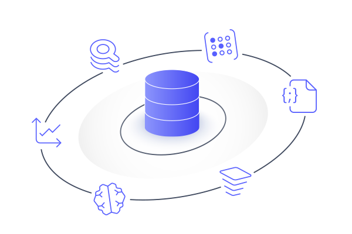

import Authors from '@site/src/theme/Authors';

<Authors frontMatter={frontMatter} />

## What are Redis Modules?

Redis has a Modules API that allows developers to extend its core functionality with new capabilities. Redis Modules are libraries that can be written in C or other languages (including Rust and Zig). Modules can add new commands and/or data structures to Redis. For example, through the addition of modules, Redis can be extended to become a Timeseries or Graph database, while retaining all of its original key/value store functionality.

Modules are loaded into the Redis server at startup by modifying the redis.conf configuration file. Application developers then make use of the extra functionality provided by a module simply by calling the module's commands in the same way they would any other Redis command. We'll see how to do this using the ioredis client for Node.js shortly.

## Where to Find Modules?

The redis.io website has a [catalog of available modules](https://redis.io/modules). Redis has developed a number of these that extend Redis in different ways, and we'll use some of them in our sample application.

One way to get started with Redis modules is to use the [redismod Docker container](https://registry.hub.docker.com/r/redislabs/redismod) from Docker Hub. This is the container that you're using on this course, and it includes all of the following modules:

- [RediSearch](https://redisearch.io/) - a full-featured search engine.
- [RedisGraph](https://redisgraph.io/) - a powerful graph database that uses the Cypher query language.
- [RedisTimeSeries](https://redistimeseries.io/) - a timeseries database.
- [RedisAI](https://redisai.io/) - a tensor storage and AI model server.
- [RedisJSON](https://redisjson.io/) - adds a native JSON data type to Redis.
- [RedisBloom](https://redisbloom.io/) - adds native Bloom and Cuckoo filter data types to Redis, plus other probabilistic data structures.
- [RedisGears](https://redisgears.io/) - a dynamic execution framework for running code on the Redis server.

Redis offers Redis Enterprise Cloud, a fully managed service for running and scaling Redis and Redis modules. [Sign up for Redis Enterprise Cloud](https://redis.com/try-free/) and use the full-featured free tier to try it out!

## Using Modules in our Application

Our social checkin application uses three Redis modules:

- We'll use **RediSearch** to index our user and location Hashes, giving us the ability to perform queries such as:
  - "Which user is associated with the email address `sara.olsen@example.com`?"
  - "Find me the users with the most recent checkins".
  - "Find all restaurants within a 3 mile radius of my location that have at least a 3 star rating"
- **RedisJSON** adds commands to store and manipulate JSON documents. We'll use those to retrieve extra detail about each of our locations.
- And finally, we'll take advantage of **RedisBloom**'s space efficient Bloom filter to stop users from posting duplicate checkins.

In the next section, we'll get to grips with RedisJSON...

## External Resources

Check out these links to learn more about which modules are available for Redis and how to use the modules API to create you own:

- [Modules in Redis Enterprise](https://redis.com/redis-enterprise/modules/)
- [List of Redis Modules at redis.io](https://redis.io/modules)
- [Introduction to the Redis Modules API at redis.io](https://redis.io/topics/modules-intro)
