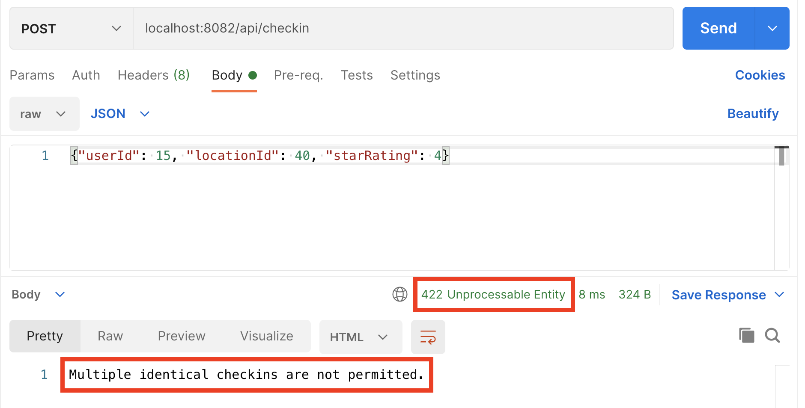

import useBaseUrl from '@docusaurus/useBaseUrl';

<div class="text--center">
<iframe width="560" height="315" src="https://www.youtube.com/embed/rzMugckhQss" frameborder="0" allow="accelerometer; autoplay; clipboard-write; encrypted-media; gyroscope; picture-in-picture" allowfullscreen></iframe>
</div>

As our application grows in popularity, we're getting more and more checkins from our expanding user base.  We've decided that we want to limit this a bit, and only allow each user to give each location a particular star rating once.  For example, if user 100 checks in at location 73 and rates it 3 stars, we want to reject any further 3 star checkins from them at that location.

In order to do this, we need a way of remembering each checkin, and to quickly determine if we've seen it before.  We can't do this by querying the data in our checkins stream, as streams don't allow that sort of access and are periodically trimmed, removing older checkins that have been processed and are no longer needed.

We can represent our checkins in the form `<userId>:<locationId>:<rating>`.  With this schema, the string 100733 would represent user 100's checkin at location 73 with a 3 star rating.

We then need to remember each checkin, so that we can ensure it's a unique combination of user ID, location ID, and star rating.  We could use a Redis Set for this.  Sets are great whenever we want to maintain a collection of unique members, as they don't allow duplicates.  With a Redis Set, adding a new member and checking whether a member is in the Set are both O(1) operations, meaning their performance doesn't degrade as the Set grows.

However, every new member of a Set that we add (in our case these are unique checkins) causes the Set to take up more memory on the Redis server. And this growth will become an issue as we continue to receive more and more checkins.

But what if there was a way to check if a potential new member was already in a set that didn't have this memory consumption issue?  A Bloom Filter is a space-efficient probabilistic data structure that can help here.  Bloom Filters store hashed representations of the members of a Set rather than the actual member data itself. Unlike a Set, we can't get members back out of the Bloom Filter, but we can test if something is already in there or not... with some false positives due to hash collisions.  When asked if something is a member of a Set, the Bloom Filter can tell us "no it isn't", or "it's likely that it is".

This hashing approach sacrifices the 100% accuracy we'd get with a Set to dramatically reduce the memory overhead.  Bloom Filters can be configured with a desired acceptable error rate, so for our application this seems like a good way to enforce our "no duplicate checkins" rule without having a runaway memory consumption problem.  Whenever the Bloom Filter tells us its maybe seen a checkin before it will mostly be correct, and we'll accept that sometimes we disallow a checkin that we actually haven't had before as a sensible tradeoff for keeping our memory usage under control.

[RedisBloom](https://redisbloom.io/) is a module from Redis that provides a Bloom Filter implementation for Redis, along with other useful probabilistic data structures.  In the video, you'll see how easy this is to use in a Node.js application, with no math skills required!

## Hands-on Exercise

In this exercise, you'll see the Bloom filter in action by attempting to submit the same checkin to the system more than once.

You'll need to be running the Checkin Receiver Service... stop it with Ctrl-C if it's still running from a previous exercise. Then, restart it using the following command. This command will disable the login requirement which we don't want  for this exercise:

```bash
$ npm run checkinreceiver

> js-crash-course@0.0.1 checkinreceiver 
> node ./src/checkinreceiver.js

info: Authentication disabled, checkins do not require a valid user session.
info: Checkin receiver listening on port 8082.
```

Now, open Postman and create a new request, selecting "POST" as the HTTP verb.

* Set the URL to `localhost:8082/api/checkin`
* In the "Body" tab, set the type dropdowns to "raw" and "JSON"
* In the body text area, enter the following JSON:

```json
{"userId": 100, "locationId": 73, "starRating": 3}
```

Your request should look like this:


Click "Send" to submit your checkin to the Checkin Receiver, which should respond with a 202 Accepted status and empty response body:


Click "Send" a second time and you should receive a 422 Unprocessable Entity response from the Checkin Receiver along with an error message:



With the Checkin Receiver service still running, start the Checkin Generator utility that generates random checkins:

```bash
node-js-crash-course $ npm run checkingenerator

> js-crash-course@0.0.1 checkingenerator 
> node ./src/checkingenerator.js

info: Started checkin generator.
```

Leave the Checkin Generator running. It will generate a new random checkin every few seconds.  Let it run and generate a few hundred checkins.  While it's doing that, periodically monitor the memory usage required by the Bloom Filter using redis-cli or the CLI tab in RedisInsight:

```bash
127.0.0.1:6379> bf.info ncc:checkinfilter
 1) Capacity
 2) (integer) 1000000
 3) Size
 4) (integer) 2576760
 5) Number of filters
 6) (integer) 1
 7) Number of items inserted
 8) (integer) 269
 9) Expansion rate
10) (integer) 2
```

Run this a few times as more checkins are generated, and note that the size required to store the Bloom Filter doesn't increase as the number of items inserted increases.  While sacrificing some accuracy, Bloom Filters are a storage efficient solution for this type of use case.

## External Resources

* Find out more about RedisBloom at its [official website](https://redisbloom.io/).
* Wikipedia: [Bloom Filters](https://en.wikipedia.org/wiki/Bloom_filter).

In this video, Guy Royse explains what Bloom Filters are and how to use them in Redis:

<div class="text--center">
<iframe width="560" height="315" src="https://www.youtube.com/embed/Z9_wrhdbSC4" frameborder="0" allow="accelerometer; autoplay; clipboard-write; encrypted-media; gyroscope; picture-in-picture" allowfullscreen></iframe>
</div>

Redis Sets are a powerful data type to know about, learn more with Andrew's two videos on the Redis University YouTube channel.  First, Redis Sets Explained:

<div class="text--center">
<iframe width="560" height="315" src="https://www.youtube.com/embed/6Pjz819sT7M" frameborder="0" allow="accelerometer; autoplay; clipboard-write; encrypted-media; gyroscope; picture-in-picture" allowfullscreen></iframe>
</div>

Followed by Redis Sets Elaborated:

<div class="text--center">
<iframe width="560" height="315" src="https://www.youtube.com/embed/N5i5QiYdyZU" frameborder="0" allow="accelerometer; autoplay; clipboard-write; encrypted-media; gyroscope; picture-in-picture" allowfullscreen></iframe>
</div>
