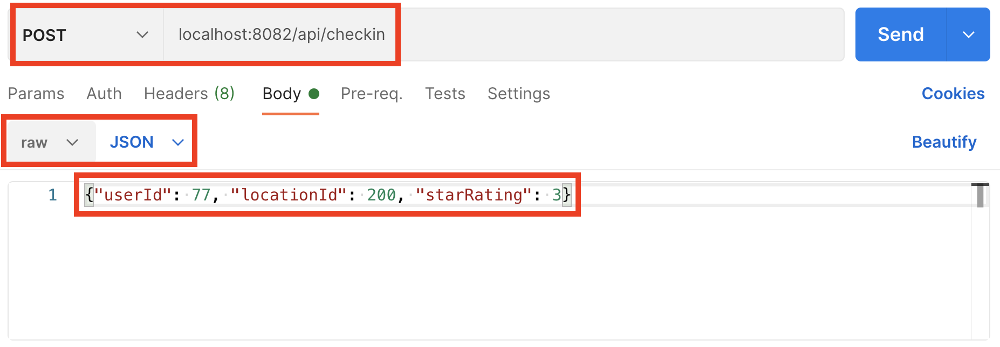
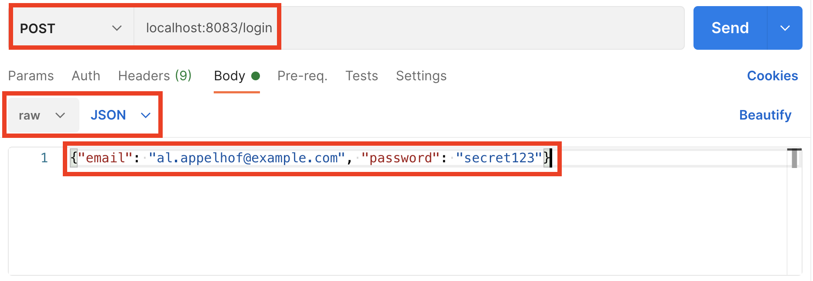
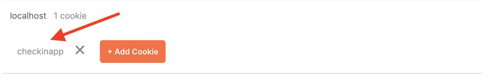
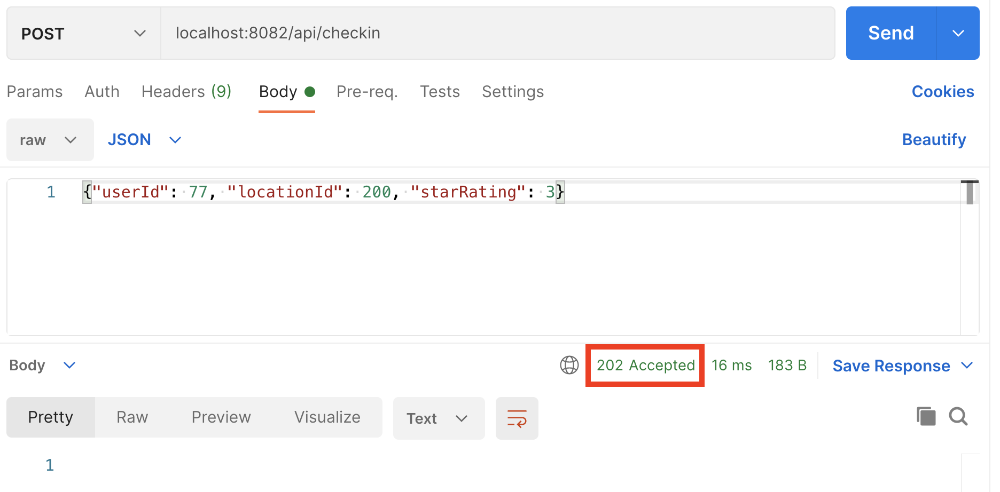

import Authors from '@theme/Authors';

<Authors frontMatter={frontMatter} />

<div class="text--center">
  <iframe
    width="896"
    height="509"
    src="https://www.youtube.com/embed/T8xay-l4HrM"
    frameborder="0"
    allow="accelerometer; autoplay; clipboard-write; encrypted-media; gyroscope; picture-in-picture"
    allowfullscreen></iframe>
</div>

We're building our application as a series of components, with Redis as a data store and cache. Most of these components talk to the user via the HTTP request / response cycle, which is inherently stateless. However, we want to maintain state, or remember things about the user from one request to the next in some circumstances.

We can identify users by having the application set a cookie in the response that is returned to the user - their browser will then attach this cookie to future requests. This can then be used to store information about the user in a server-side session object that Express keeps track of by means of the ID in the cookie.

You can think of the cookie as a sort of key, and the session object as a value. We could store these in memory in our server, but this approach limits us to a single server instance that would lose all of session data if it were to crash and restart.

Fortunately, Redis makes an excellent store for session data - it's fast and durable, and allows us to scale system components horizontally by adding more instances of them. We've used the npm package "connect-redis" to add Redis as a session store for the Authentication and Checkin Receiver services, with minimal code required.

## Hands-on Exercise

In this exercise, you'll enable the authentication functionality in the Checkin Receiver service, and use Postman to establish a session with the Authentication service in order to submit an authenticated checkin to the system.

First, stop the Checkin Receiver if you have it running. Press Ctrl-C in its terminal window.

Now, restart the Checkin Receiver with the optional authentication functionality enabled:

```bash
$ npm run checkinreceiver auth

> js-crash-course@0.0.1 checkinreceiver
> node ./src/checkinreceiver.js "auth"

info: Authentication enabled, checkins require a valid user session.
info: Checkin receiver listening on port 8082.
```

Note that the Checkin Receiver reports that authentication is now enabled.

In a second terminal window, cd to the node-js-crash-course directory that you cloned the project repo into, and start the Authentication Service which will listen on port 8083:

```bash
$ npm run auth

> js-crash-course@0.0.1 auth /Users/simonprickett/source/github/node-js-crash-course
> node ./src/auth.js

info: Authentication service listening on port 8083.
```

Open up a new request in Postman, and make a POST request to perform a checkin as follows:



Click "Send" - this time, the Checkin Receiver service should reject the request as you haven't authenticated with the system. You should see a 401 Unauthorized response:


And in the Checkin Receiver's terminal window, you should see that it rejected your request as it couldn't find your session:

```bash
debug: Rejecting checkin - no valid user session found.
```

The Checkin Receiver rejected your request because it couldn't find a value for 'user' in your request's session (check out the code in `src/checkinreceiver.js`).

Let's try again, but this time we'll login first. This will establish a session and we'll be able to see how that gets stored in Redis…

Keep your checkin request tab in Postman, and open a new tab to create a POST request to the Authentication service.

Set the URL to `localhost:8083/login` and the JSON body to:

```json
{ "email": "al.appelhof@example.com", "password": "secret123" }
```

Your request should look like this:



Click "Send" to login. The Authentication Service will check the supplied credentials against what's stored in Redis at key `ncc:user:77` and create a session object for that user, adding the email address to the "user" property in the session. Postman should show a 200 (success) response code and the text "OK".

Click the blue "Cookies" text in Postman, and you should see that a cookie was set for "checkinapp" on localhost. Click on the "checkinapp" text to see the contents of the cookie:




Now flip back to your tab in Postman that has the checkin request for user 77. Send the request again, and this time it should succeed, as Postman will also send the cookie containing your session ID and the Checkin Receiver will then be able to validate you have an authenticated session. This time, you should get a 202 Accepted response:



When the Checkin Receiver got your request, it used the value in your cookie to look up and load your session from Redis (connect-redis does this for us), then checked that the session had a "user" property set. Any system component that's running on a localhost URL can now access your session and query and store information in it.

Finally, let's see what the session looks like in Redis... using redis-cli or the RedisInsight browser, find all the session keys like this:

```bash
127.0.0.1:6379> keys ncc:session:*
1) "ncc:session:Blvc-93k2TckafgwS0IDAHfW-MPGhqyl"
```

Note that the key name contains the session ID that was in your cookie. connect-redis manages these keys for us as Redis Strings, all our application needs to do is manipulate the request's session object.

Let's see what's in our session and when it expires:

```bash
127.0.0.1:6379> get ncc:session:Blvc-93k2TckafgwS0IDAHfW-MPGhqyl
"{\"cookie\":{\"originalMaxAge\":null,\"expires\":null,\"httpOnly\":true,\"path\":\"/\"},\"user\":\"al.appelhof@example.com\"}"
127.0.0.1:6379> ttl ncc:session:Blvc-93k2TckafgwS0IDAHfW-MPGhqyl
(integer) 85693
```

We didn't specify a session length in our code when setting up connect-redis, so it's defaulted to expiring sessions after a day.

Finally, let's logout from the Authentication Service and ensure that our session data gets removed from Redis. In Postman, create a GET request as follows and click Send:


The code in the logout handler destroys your session, which should then disappear from Redis:

```bash
127.0.0.1:6379> get ncc:session:Blvc-93k2TckafgwS0IDAHfW-MPGhqyl
(nil)
```

Next, we'll move on to look at how to scale up our checkin processing to cope with all these new users!

## External Resources

- [connect-redis session store package on npm](https://www.npmjs.com/package/connect-redis)
- [Cache vs Session Store](https://redis.com/blog/cache-vs-session-store/) - a blog article from Redis
