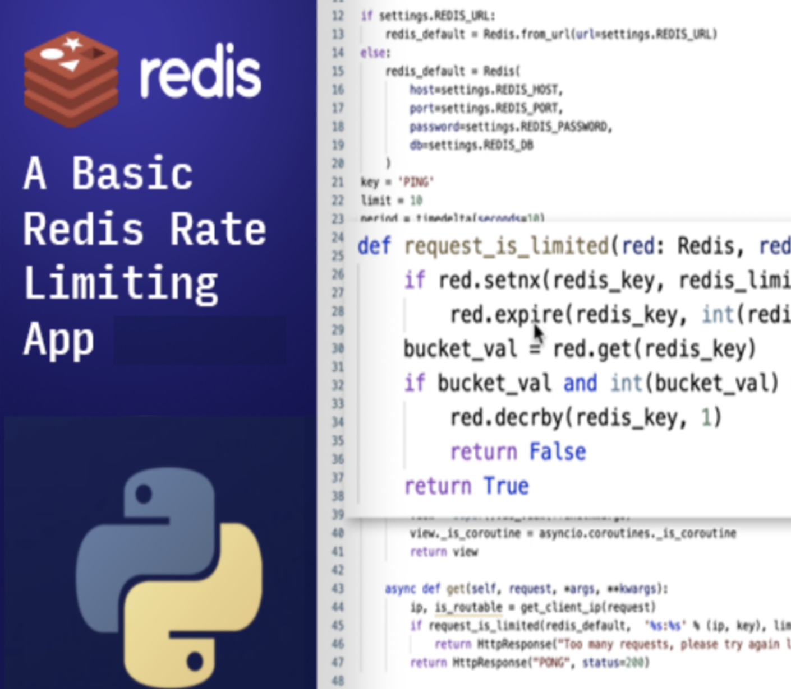
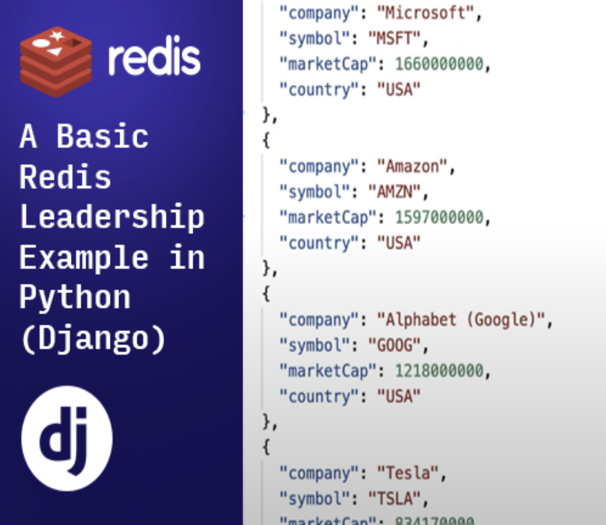

import Tabs from '@theme/Tabs';
import TabItem from '@theme/TabItem';
import useBaseUrl from '@docusaurus/useBaseUrl';
import RedisCard from '@site/src/theme/RedisCard';

Find tutorials, examples and technical articles that will help you to develop with Redis and Python.

### Getting Started

The Python community has built many client libraries that you can find here . For your first steps with Python and Redis, this article will show how to use the recommended library: [redis-py](https://github.com/redis/redis-py)


<Tabs
  defaultValue="redis-py"
  values={[
    {label: 'Redis Py', value: 'redis-py'},
  ]}>
  <TabItem value="redis-py">


#### Step 1. Run a Redis server

Redis is an open source, in-memory, key-value data store most commonly used as a primary database, cache, message broker, and queue. Unlike relational databases, Redis database delivers sub-millisecond response times, enabling fast and powerful real-time applications in industries such as gaming, fintech, ad-tech, social media, healthcare, and IoT.

Redis (also called remote dictionary server) is a multi-model database, and provides several built-in data structures/data type such as Lists, Hashes, Geospatial indexes, Strings, Sets etc.
You can either run Redis server in a Docker container or directly on your machine. Follow the below command line to setup a Redis server on Mac OS:


```
 brew tap redis-stack/redis-stack
 brew install --cask redis-stack
```

:::info INFO
Redis Stack unifies and simplifies the developer experience of the leading Redis modules and the capabilities they provide. Redis Stack bundles five Redis modules: RedisJSON, RedisSearch, RedisGraph, RedisTimeSeries, and RedisBloom
[Learn more](/create/redis-stack)
:::

Ensure that you are able to use the following Redis command to connect to the Redis instance.


```bash
 redis-cli
 127.0.0.1:6379>
```

Now, you should be able to get Redis data by using Redis commands.

### Step 2. Install the Redis client library using `pip`

The following Python code allows you to connect to the default Redis server instance .


   ```bash
    pip3 install redis
   ```


### Step 2. Write your application code

   ```python
    import redis

    redis = redis.Redis(
        host= 'localhost',
        port= '6379')

    redis.set('mykey', 'Hello from Python!')
    value = redis.get('mykey') 
    print(value)

    redis.zadd('vehicles', {'car' : 0})
    redis.zadd('vehicles', {'bike' : 0})
    vehicles = redis.zrange('vehicles', 0, -1)
    print(vehicles)
   ```

Find more information about Redis database instances & Redis connections in the "[Redis Connect](https://github.com/redis-developer/redis-connect/tree/master/python/redispy)".

 </TabItem>
</Tabs>
  


### More developer resources

<div class="row">

<div class="col">

#### Sample Code

**[Flask Simple Rate limiting Example   ](https://github.com/redis-developer/basic-caching-demo-nodejs)**
Application that shows how to do rate limiting using various Redis datastructure.


</div>

<div class="col">

#### Technical Articles & Videos

**[Beyond the Cache with Python](https://redis.com/blog/beyond-the-cache-with-python/)**


</div>
</div>

  ---

###  Redis Launchpad

Redis Launchpad is like an “App Store” for Redis sample apps. You can easily find apps for your preferred frameworks and languages.
Check out a few of these apps below, or [click here to access the complete list](https://launchpad.redis.com).

<div class="row text--center">

<div class="col ">
<div className="ri-container">

#### Rate-Limiting app in Python & Django




[Rate Limiting app](https://launchpad.redis.com/?id=project%3Abasic-rate-limiting-demo-python) built in Python & Django
</div>
</div>

<div class="col">
<div className="ri-container">

#### Leaderboard app in Python & Django



[How to implement leaderboard app](https://launchpad.redis.com/?id=project%3Abasic-redis-leaderboard-demo-python) in Python & Django
</div>
</div>
</div>

## Redis University

### [Redis for Python Developers](https://university.redis.com/courses/ru102py/)

A complete introduction to Redis for Python developers.


<div class="text--center">
<iframe width="560" height="315" src="https://www.youtube.com/embed/BxRJRNt7Qwc" frameborder="0" allow="accelerometer; autoplay; clipboard-write; encrypted-media; gyroscope; picture-in-picture" allowfullscreen></iframe>
</div>

### References

- [How to store JSON documents in Redis with Python](/howtos/redisjson/using-python)
- [Python based application on Heroku using Redis](/howtos/herokupython/)
- [How to build a Rate Limiter using Redis](/howtos/ratelimiting/)
- [Writing Your Serverless function using RedisGears Browser Tool](/explore/redisinsight/redisgears/)

##

<div>
<a href="https://launchpad.redis.com" target="_blank" rel="noopener" className="link"> </a>
</div>
