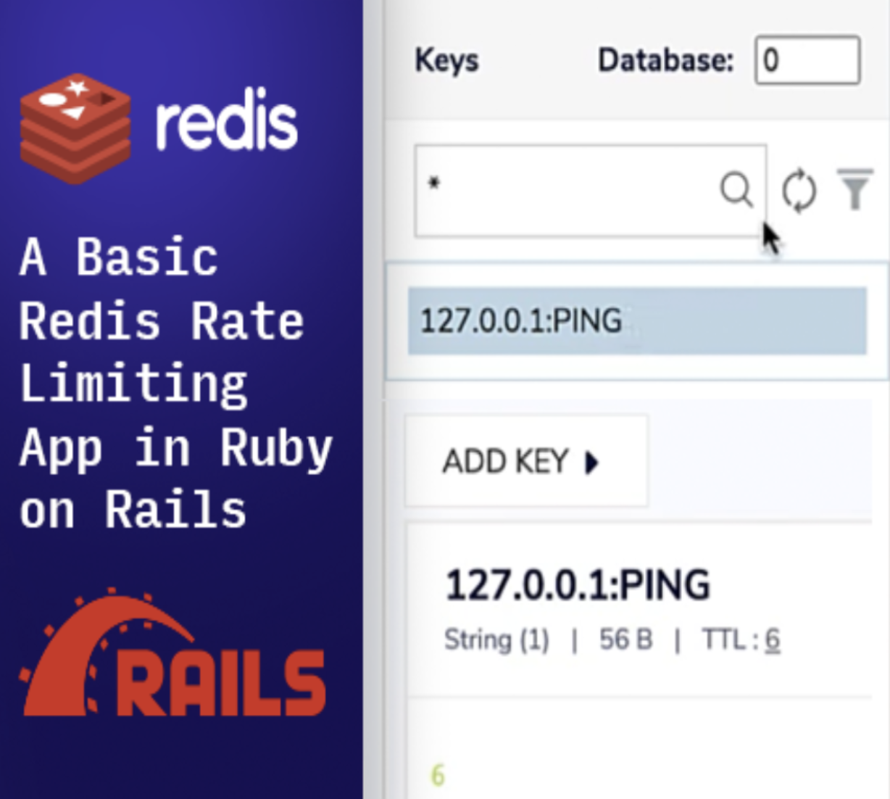
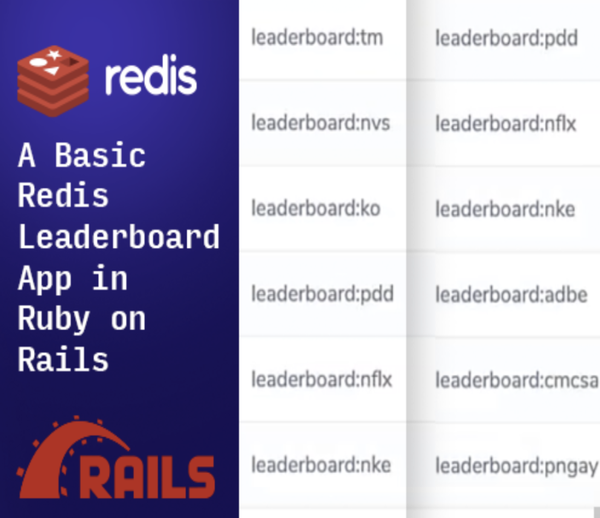

import Tabs from '@theme/Tabs';
import TabItem from '@theme/TabItem';
import useBaseUrl from '@docusaurus/useBaseUrl';
import RedisCard from '@site/src/theme/RedisCard';

Find tutorials, examples and technical articles that will help you to develop with Redis and Ruby.

### Getting Started

In order to use Redis with Ruby you will need a Ruby Redis client. In the following sections, we will demonstrate the use of redis-rb, a Ruby client library for Redis.
Additional Ruby clients for Redis can be found under the Ruby section of the Redis Clients page.

<Tabs
  defaultValue="redis-rb"
  values={[
    {label: 'Redis-rb', value: 'redis-rb'},
  ]}>
  <TabItem value="redis-rb">

Redis is an open source, in-memory, key-value data store most commonly used as a primary database, cache, message broker, and queue. Redis cache delivers sub-millisecond response times, enabling fast and powerful real-time applications in industries such as gaming, fintech, ad-tech, social media, healthcare, and IoT.

#### Step 1. Run a Redis server

You can either run Redis in a Docker container or directly on your machine.
Follow the below commands to setup a Redis server on Mac OS:

```
 brew tap redis-stack/redis-stack
 brew install --cask redis-stack
```

:::info INFO
Redis Stack unifies and simplifies the developer experience of the leading Redis modules and the capabilities they provide. Redis Stack bundles five Redis modules: RedisJSON, RedisSearch, RedisGraph, RedisTimeSeries, and RedisBloom.
[Learn more](/create/redis-stack)
:::

Ensure that you are able to use the following Redis command to connect to the Redis instance.

```bash
 redis-cli
 127.0.0.1:6379>
```

Now you should be able to perform CRUD operations with Redis commands. For example, you can insert data to Redis with the `SET` command and the fetch it with the `GET` command. The above Redis client command might require a password if you have setup authentication in your Redis configuration file. By default, Redis listens on port 6379. This can be modified in the Redis configuration file.

### Step 2. Clone the repository

```
git clone https://github.com/redis-developer/redis-ruby-getting-started
```

### Step 3. Install redis-rb:

```
$ gem install redis
```

OR

### Step 4. Use Gemfile

```
$cat Gemfile
gem 'redis'
```

### Step 5. Execute

```
$ bundle install
```

```
Resolving dependencies...
Using bundler 2.2.6
Using redis 4.2.5
Following files may not be writable, so sudo is needed:
  /Library/Ruby/Gems/2.6.0
  /Library/Ruby/Gems/2.6.0/build_info
  /Library/Ruby/Gems/2.6.0/cache
  /Library/Ruby/Gems/2.6.0/doc
  /Library/Ruby/Gems/2.6.0/extensions
  /Library/Ruby/Gems/2.6.0/gems
  /Library/Ruby/Gems/2.6.0/specifications
Bundle complete! 1 Gemfile dependency, 2 gems now installed.
Use `bundle info [gemname]` to see where a bundled gem is installed.
```

### Step 6. Verifying

```
bundle info redis
  * redis (4.2.5)
	Summary: A Ruby client library for Redis
	Homepage: https://github.com/redis/redis-rb
	Documentation: https://www.rubydoc.info/gems/redis/4.2.5
	Source Code: https://github.com/redis/redis-rb/tree/v4.2.5
	Changelog: https://github.com/redis/redis-rb/blob/master/CHANGELOG.md
	Bug Tracker: https://github.com/redis/redis-rb/issues
	Path: /Library/Ruby/Gems/2.6.0/gems/redis-4.2.5
```

### Step 7. Opening a Connection to Redis Using redis-rb

The following code creates a connection to Redis using redis-rb:

```ruby
require 'redis'
redis = Redis.new(host: "localhost", port: 6379, db: 11)
redis.set("mykey", "hello world")
redis.get("mykey")
```

To adapt this example to your code, make sure that you replace the following values with those of your database:

You can find connect.rb under this directory which you can directly use to test it.

Just execute the below command:

```
ruby connect.rb
```

### Step 8. Verifying

```
127.0.0.1:6379> monitor
OK
1614684665.728109 [0 [::1]:50918] "select" "11"
1614684665.728294 [11 [::1]:50918] "set" "mykey" "hello world"
1614684665.728435 [11 [::1]:50918] "get" "mykey"

```

### Redis Launchpad

Redis Launchpad is like an “App Store” for Redis sample apps. You can easily find apps for your preferred frameworks and languages.
Check out a few of these apps below, or [click here to access the complete list](https://launchpad.redis.com).

<div class="row text--center">

<div class="col ">
<div className="ri-container">

#### Rate-Limiting app in Ruby on Rails



[Rate Limiting app](http://Launchpad.redis.com/?id=project%3Abasic-redis-rate-limiting-demo-ruby) built in Ruby on Rails

</div>
</div>

<div class="col">
<div className="ri-container">

#### Leaderboard app in Ruby on Rails



[How to implement leaderboard app](https://Launchpad.redis.com/?id=project%3Abasic-redis-leaderboard-demo-ruby) in Ruby on Rails

</div>
</div>
</div>

### Further References

- [A Ruby client library for Redis](https://github.com/redis/redis-rb/)
- [Async::Redis - An asynchronous client for Redis including TLS](https://github.com/socketry/async-redis)

</TabItem>
</Tabs>
