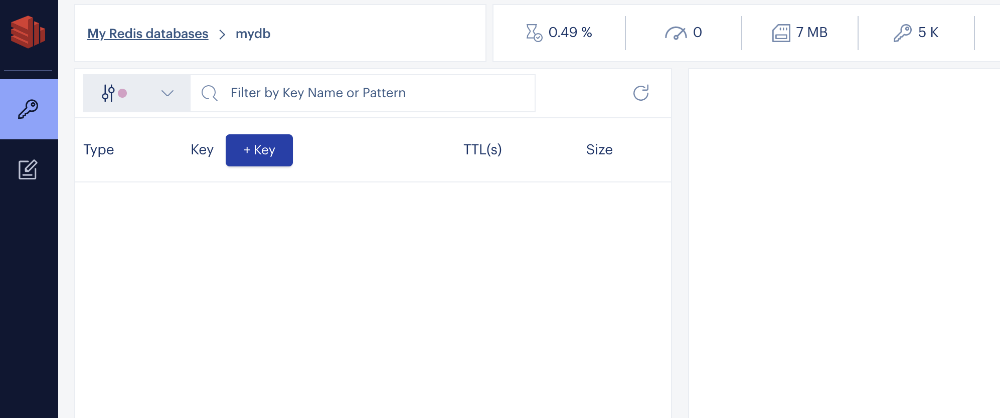
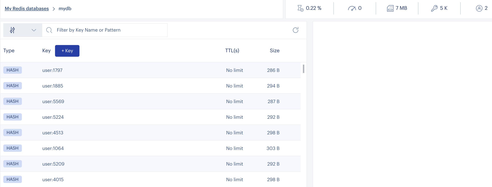

import Authors from '@theme/Authors';

<Authors frontMatter={frontMatter} />


RedisInsight is a 100% free Redis GUI that allows you to visualise, monitor, and optimize while developing your applications with Redis. It provides an intuitive and efficient GUI for Redis allowing developers like you to interact with your databases and manage your data. RedisInsight v2.0 now incorporates a completely new tech stack based on the popular Electron and Elastic UI frameworks. You can run the application locally along with your favorite IDE, and it remains cross-platform, supported on Linux, Windows, and MacOS.

## What's New in the RedisInsight v2.0 Browser Tool?

RedisInsight Browser lets you explore keys in your Redis server. You can add, edit and delete a key. You can even update the key expiry and copy the key name to be used in different parts of the application. Below are the list of features available under the browser tool:

- Browse, filter and visualize key-value Redis data structures
- Visual cues per data type
- Quick view of size and ttl in the main browser view
- Ability to filter by pattern and/or data type
- Ability to change the number of keys to scan through during filtering
- CRUD support for Lists, Hashes, Strings, Sets, Sorted Sets
- Search within the data structure (except for Strings)
- CRUD support for Redis JSON

In order to understand the capabilities of the browser tool, let us take a simple example and demonstrate each of the browser tool's options:

### Step 1. Install RedisInsight

To use RedisInsight on a local Mac, you can install Redis Stack by running the following commands:

First, tap the Redis Stack Homebrew tap and then run `brew install` as shown below:

```bash
 brew tap redis-stack/redis-stack
 brew install --cask redis-stack
```

This will install all Redis and Redis Stack binaries. How you run these binaries depends on whether you already have Redis installed on your system.

```
 ==> Installing Cask redis-stack-redisinsight
 ==> Moving App 'RedisInsight-preview.app' to '/Applications/RedisInsight-preview.app'
 🍺  redis-stack-redisinsight was successfully installed!
 ==> Installing Cask redis-stack
 🍺  redis-stack was successfully installed!
```

:::tip

If this is the first time you’ve installed Redis on your system, then all Redis Stack binaries be installed and accessible on your path. On M1 Macs, this assumes that `/opt/homebrew/bin` is in your path. On Intel-based Macs, `/usr/local/bin` should be in the $PATH.

To check this, run:

```bash
 echo $PATH
```

Then, confirm that the output contains `/opt/homebrew/bin` (M1 Mac) or `/usr/local/bin` (Intel Mac). If these directories are not in the output, see the “Existing Redis installation” instructions below.
:::

### Step 2. Start Redis Stack Server

You can now start Redis Stack Server as follows:

```bash
 redis-stack-server
```

### Existing Redis installation

If you have an existing Redis installation on your system, then you’ll need to modify your path to ensure that you’re using the latest Redis Stack binaries.

Open the file `~/.bashrc` or `~/zshrc` (depending on your shell), and add the following lines.

```bash
  export PATH=/usr/local/Caskroom/redis-stack-server/<VERSION>/bin:$PATH
```

Go to Applications and click "RedisInsight-v2" to bring up the Redis Desktop GUI tool.

### Step 3. Add Redis database


### Step 4. Enter Redis database details

Add the local Redis database endpoint and port.


### Step 5: Open "Browser Tool"

Click on the "Key" icon on the left sidebar to open up the browser tool.



### Step 6: Importing keys

Let us import a user database (6k keys). This dataset contains users stored as Redis Hashes.

###

**Users**

The user hashes contain the following fields:

- `user:id` : The key of the hash.
- `first_name` : First Name.
- `last_name` : Last name.
- `email` : email address.
- `gender` : Gender (male/female).
- `ip_address` : IP address.
- `country` : Country Name.
- `country_code` : Country Code.
- `city` : City of the user.
- `longitude` : Longitude of the user.
- `latitude` : Latitude of the user.
- `last_login` : Epoch time of the last login.

### Step 7: Cloning the repository

Open up the CLI terminal and run the following command:

```bash
 git clone https://github.com/redis-developer/redis-datasets
 cd redis-datasets/user-database
```

### Importing the user database:

```bash
 redis-cli -h localhost -p 6379 < ./import_users.redis
```

Refresh the keys view by clicking as shown below:



You can get a real-time view of the data in your Redis database as shown below:

Select any key in the keys view and the key's value gets displayed in the right hand side that includes Fields and values.

### Step 8. Modifying a key


Enter key name, field and value.

### Step 9: Using CLI

RedisInsight CLI lets you run commands against a Redis server. You don’t need to remember the syntax - the integrated help shows you all the arguments and validates your command as you type.


## Further References

- [Slowlog Configuration using RedisInsight](/explore/redisinsight/slowlog)
- [Explore Redis keys using RedisInsight browser tool](/explore/redisinsight/browser)
- [Memory Analysis using RedisInsight](/explore/redisinsight/memoryanalyzer)

<div>
  <a
    href="https://launchpad.redis.com"
    target="_blank"
    rel="noopener"
    className="link">
    
  </a>
</div>
