Devops and SRE practitioners are already keenly aware of the importance of system reliability, as it’s one of the shared goals in every high performing organization. Defining clear reliability targets based on solid data is crucial for productive collaboration between developers and SREs. This need spans the entire infrastructure from application to backend database services.

Service Level Objectives (SLOs) provide a power interface for all teams to set clear performance and reliability goals based on Service Level Indicators (SLIs) or data points. A good model is to think of the SLIs as the data and the SLO as the information one uses to make critical decisions.

Further Read: [https://cloud.google.com/blog/products/devops-sre/sre-fundamentals-slis-slas-and-slos](https://cloud.google.com/blog/products/devops-sre/sre-fundamentals-slis-slas-and-slos) 

#### Redis


Redis is a popular multi-model NoSQL database server that provides in-memory data access speeds for search, messaging, streaming, caching, and graph—amongst other capabilities. Highly performant sites such as Twitter, Snapchat, Freshworks, GitHub, Docker, Pinterest, and Stack Overflow all look to Redis to move data in real time.

Redis SLOs can be broken down into three main categories:

| Category   | Definition     | Example SLO       | Example SLI  |
| ---------- | -------------- | ----------------- | ------------ |
| Throughput | Number of operations being pushed through the service in a given time period | System should be capable of performing 200M  operations per second | redisenterprise.total_req |        
| Latency    | Elapsed time it takes for an operation | Average write latency should not exceed 1 millisecond | redis_enterprise.avg_latency |
| Capacity   | Memory/storage/network limits of the underlying data source | Database should have 20% memory overhead available to handle bursts |redisenterprise.used_memory_percent |


### Why Datadog?


Running your own performance data platform is time consuming and difficult. Datadog provides an excellent platform with an open source agent to collect metrics and allows them to be displayed easily and alerted up when necessary.

Datadog allows you to:

- Collect metrics from various infrastructure components out of the box
- Display that data in easy to read dashboards
- Monitor performance metrics and alert accordingly
- Correlate log entries with metrics to quickly drill down to root causes

### Key Performance Indicators


### 1. Latency

#### Definition
##### redis_enterprise.avg_latency (unit: microseconds)

This is the average amount of time that a request takes to return from the time that it first hits the Redis Enterprise proxy until the response is returned. It does not include the full time from the remote client’s perspective.

##### Characteristics


Since Redis is popular due to performance, generally you would expect most operations to return in single digit milliseconds. Tune any alerts to match your SLA. It’s generally recommended that you also measure Redis operation latency at the client side to make it easier to determine if a server slow down or an increase in network latency is the culprit in any performance issues.

##### Possible Causes

|   Cause    | Factors     |
| ---------- | ----------- | 
| Spike in requests | Check both the Network Traffic and Operations Per Second metrics to determine if there is a corresponding increase |
| Slow-running queries | Check the slow log in the Redis Enterprise UI for the database |
| Insufficient compute resources | Check to see if the CPU Usage, Memory Usage Percentage, or Evictions are increasing |


##### Remediation


|   Action   | Method     |
| ---------- | ----------- | 
| Increase resources | The database can be scaled up online by going to the Web UI and enabling clustering on the database. In extreme cases, more nodes can be added to the cluster and resources rebalanced |
| Inefficient queries | Redis allows you to view a slow log with a tunable threshold. It can be viewed either in the Redis Enterprise UI or by running:   redis-cli -h HOST -p PORT -a PASSWORD SLOWLOG GET 100 |


### 2. Memory Usage Percentage

#### Definition

##### redis_enterprise.memory_usage_percent (unit: percentage)

This is the percentage of used memory over the memory limit set for the database.

##### Characteristics


In Redis Enterprise, all databases have a maximum memory limit set to ensure isolation in a multi-tenant environment. This is also highly recommended when running open source Redis. Be aware that Redis does not immediately free memory upon key deletion. Depending on the size of the database, generally between 80-95% is a safe threshold.

##### Possible Causes

|   Cause    | Factors     |
| ---------- | ----------- | 
| Possible spike in activity | Check both the Network Traffic and Operations Per Second metrics to determine if there is a corresponding increase |
| Database sized incorrectly | View the Memory Usage raw bytes over time to see if a usage pattern has changed |
| Incorrect retention policies | Check to see if keys are being Evicted or Expired |


##### Remediation

|   Action    | Method     |
| ---------- | ----------- |
| Increase resources | The database memory limit can be raised online with no downtime through either the Redis Enterprise UI or the API |
| Retention Policy | In a caching use case, setting a TTL for unused data to expire is often helpful. In addition, Eviction policies can be set, however, these may often not be able to keep up in extremely high throughput environments with very tight resource constraints |


### 3. Cache Hit Rate

##### Definition

#####  redis_enterprise.cache_hit_rate (unit: percent)

This is the percentage of time that Redis is accessing a key that already exists.

##### Characteristics


This metric is useful only in the caching use case and should be ignored for all other use cases. There are tradeoffs between the freshness of the data in the cache and efficacy of the cache mitigating traffic to any backend data service. These tradeoffs should be considered carefully when determining the threshold for alerting.

##### Possible Causes

This is highly specific to the application caching with no general rules that are applicable in the majority of cases.

##### Remediation

Note that Redis commands return information on whether or not a key or field already exists. For example, the [HSET](https://redis.io/commands/hset) command returns the number of fields in the hash that were added.


### 4. Evictions

##### Definition


##### redis_enterprise.evicted_objects (unit: count)

This is the count of items that have been evicted from the database.

##### Characteristics


Eviction occurs when the database is close to capacity. In this condition, the [eviction policy](https://docs.redis.com/latest/rs/administering/database-operations/eviction-policy/) starts to take effect. While [Expiration](https://redis.io/commands/expire) is fairly common in the caching use case, Eviction from the cache should generally be a matter of concern. At very high throughput and very restricted resource use cases, sometimes the eviction sweeps cannot keep up with memory pressure. Relying on Eviction as a memory management technique should be considered carefully.

##### Possible Causes


See Memory Usage Percentage Possible Causes

##### Remediation

See Memory Usage Percentage Remediation

### Secondary Indicators


### 1. Network Traffic

##### Definition


##### redis_enterprise.ingress_bytes/redis_enterprise.egress_bytes (unit: bytes)

Counters for the network traffic coming into the database and out from the database.

##### Characteristics


While these two metrics will not help you pinpoint a root cause, network traffic is an excellent leading indicator of trouble. Changes in network traffic patterns indicate corresponding changes in database behavior and further investigation is usually warranted.


### 2. Connection Count

##### Definition

##### redis_enterprise.conns (unit: count)

The count of current client connections to the database.

##### Characteristics

This metric should be monitored with both a minimum and maximum number of connections. The minimum number of connections not being met is an excellent indicator of either networking or application configuration errors. The maximum number of connections being exceeded may indicate a need to tune the database.

##### Possible Causes

| Cause      |  Factors    |
|------------|-------------|
| Minimum clients not met | Incorrect client configuration, network firewall, or network issues |
| Maximum connections exceeded | Client library is not releasing connections or an increase in the number of clients |


##### Remediation

| Action      |  Method    |
|-------------|-------------|
| Clients Misconfigured | Confirm client configurations |
| Networking issue | Issue the PING command from a client node TELNET to the endpoint |
| Too many connections |Be sure that you are using pooling on your client library and that your pools are sized accordingly |
| Too many connections | Using rladmin, run: tune proxy PROXY_NUMBER threads VALUE threads VALUE |


You can access the complete list of metrics [under this link.](https://github.com/DataDog/integrations-extras/blob/master/redisenterprise/metadata.csv)

## Getting Started

Follow the below steps to set up the Datadog agent to monitor your Redis Enterprise cluster, as well as database metrics:

### Quickstart Guide:


#### Prerequisite:


- [Follow this link](https://docs.redis.com/latest/rs/installing-upgrading/) to setup your Redis Enterprise cluster and database
- Setup a Read-only user account by logging into your Redis Enterprise instance and visiting “Access Control” section


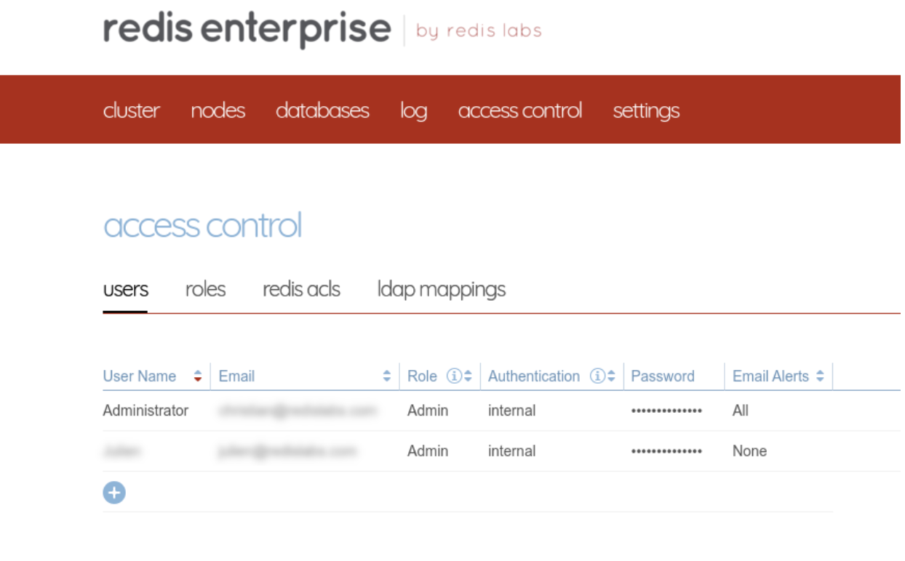


- Add a new user account with Cluster View Permissions.


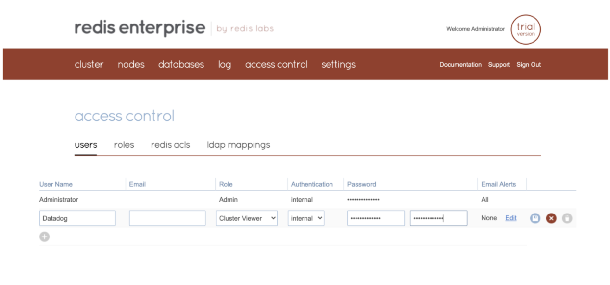


### Step 1. Set Up a Datadog Agent

Before we jump into the installation, let’s look at the various modes that you can run the datadog agent in:


- External Monitor Mode
- Localhost Mode 

#### External Monitor Mode


In external monitor mode, a Datadog agent running outside of the cluster can monitor multiple Redis Enterprise clusters, as shown in the diagram above.

#### Localhost Mode


Using localhost mode, the integration can be installed on every node of a Redis Enterprise cluster. This allows the user to correlate OS level metrics with Redis-specific metrics for faster root cause analysis. Only the  Redis Enterprise cluster leader will submit metrics and events to Datadog. In the event of a migration of the cluster leader, the new cluster leader will begin to submit data to Datadog.


For this demo, we will be leveraging localhost mode as we just have two nodes to configure.


### Step 2. Launch the Datadog agent on the Master node

Pick up your preferred OS distribution and install the Datadog agent


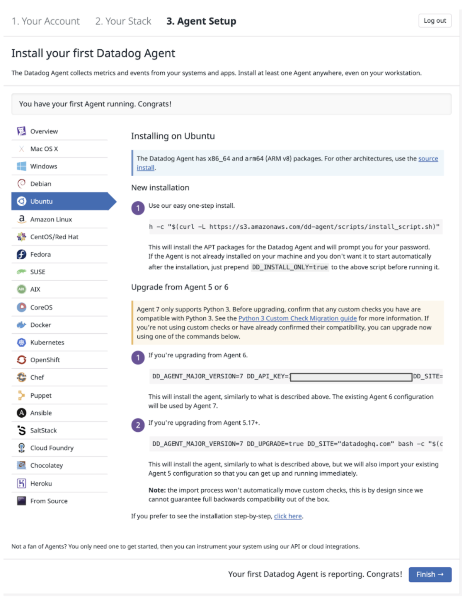


Run the following command to install the integration wheel with the Agent. Replace the integration version with 1.0.1.


### Step 3. Configuring Datadog configuration file

Copy the [sample configuration](https://github.com/DataDog/integrations-extras/blob/master/redisenterprise/datadog_checks/redisenterprise/data/conf.yaml.example) and update the required sections to collect data from your Redis Enterprise cluster:

#### For Localhost Mode

The below minimal configuration should be added to the Enterprise Master node.


```
 sudo vim /etc/datadog-agent/conf.d/redisenterprise.d/conf.yaml
```

```bash
 #################################################################
 #  Base configuration
 init_config:

 instances:
  - host: localhost
    username: user@example.com
    password: secretPassword
    port: 9443
 ```


Similarly, you need to add the below content into the configuration file for the Enterprise Follower:


 ```bash
  sudo vim /etc/datadog-agent/conf.d/redisenterprise.d/conf.yaml
 ```

 ```bash
   #################################################################
   #  Base configuration
   init_config:

   instances:
     - host: localhost
       username: user@example.com
       password: secretPassword
       port: 9443
  ```


#### For External Monitor Mode

The below configuration should be added to the Monitor node


```
#  Base configuration
init_config:

instances:
  - host: cluster1.fqdn
    username: user@example.com
    password: secretPassword
    port: 9443

  - host: cluster2.fqdn
    username: user@example.com
    password: secretPassword
    port: 9443
```


### Step 4. Restart the datadog Agent service


```
 sudo service datadog-agent restart
```


### Step 5. Viewing the Datadog Dashboard UI

Find the Redis Enterprise Integration under the Integration Menu

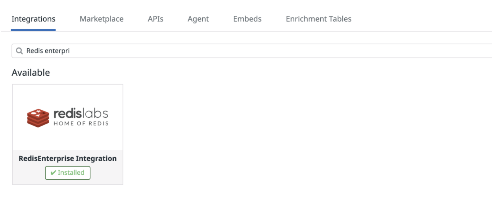

Displaying the host reporting data to Datadog:

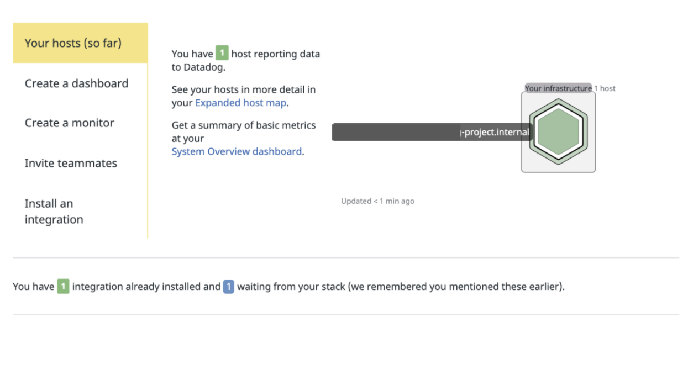

Listing the Redis Enterprise dashboards:

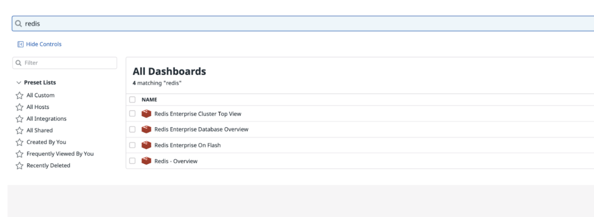

Host details under Datadog Infrastructure list:


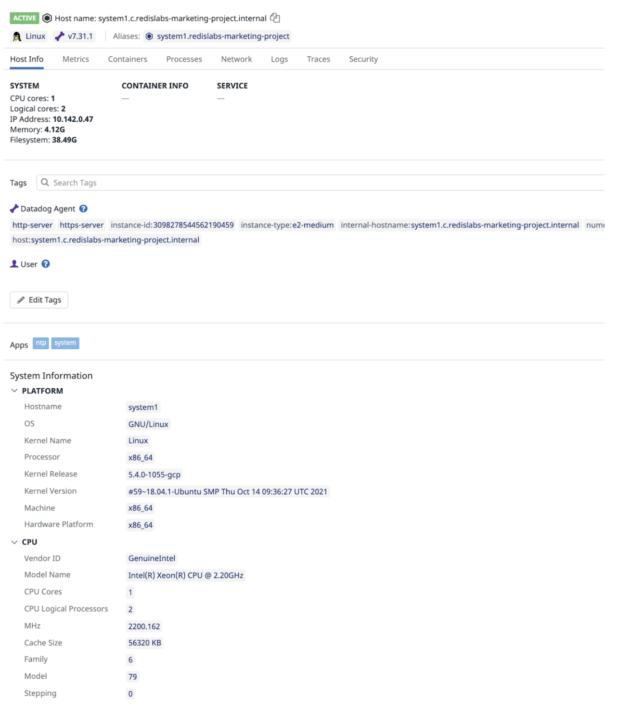

Datadog dashboard displaying host metrics of the 1st host (CPU, Memory Usage, Load Average etc):

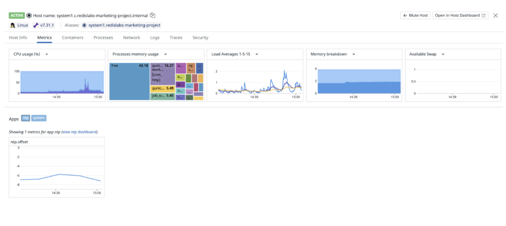

Datadog dashboard displaying host metrics of the 2nd host:

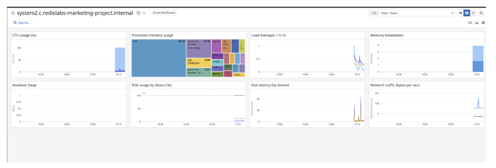


### Step 6. Verifying the Datadog Agent Status

The below snippet of the result shows that Redis Enterprise integrator is working without any issue.


```
 sudo datadog-agent status
```


 ```bash
  redisenterprise (1.0.1)
   -----------------------
     Instance ID: redisenterprise:ef4cd60aadac5744 [OK]
     Configuration Source: file:/etc/datadog-agent/conf.d/redisenterprise.d/conf.yaml
     Total Runs: 2
     Metric Samples: Last Run: 0, Total: 0
     Events: Last Run: 0, Total: 0
     Service Checks: Last Run: 0, Total: 0
     Average Execution Time : 46ms
     Last Execution Date : 2021-10-28 17:27:10 UTC (1635442030000)
     Last Successful Execution Date : 2021-10-28 17:27:10 UTC (1635442030000)

 ```


### Redis Enterprise Cluster Top View


Let’s run a memory benchmark tool called redis-benchmark to simulate an arbitrary number of clients connecting at the same time and performing actions on the server, measuring how long it takes for the requests to be completed.


```bash
 memtier_benchmark --server localhost -p 19701 -a password
 [RUN #1] Preparing benchmark client...
 [RUN #1] Launching threads now...
```


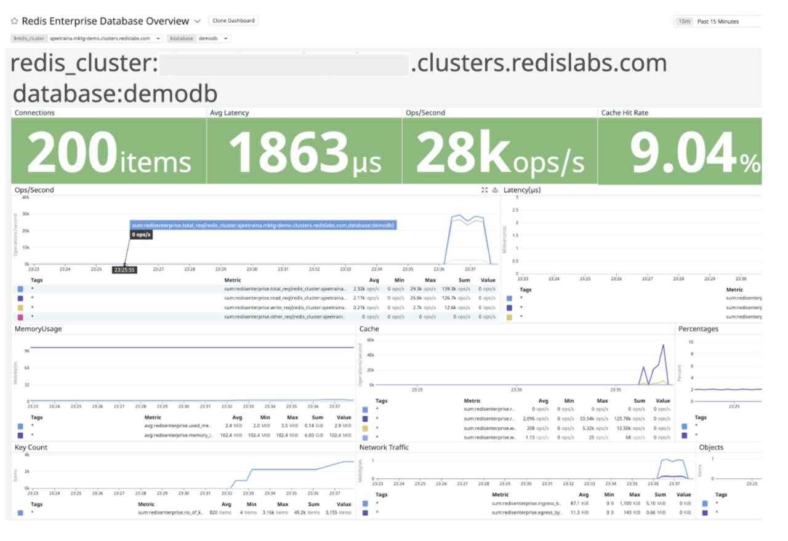


This command instructs memtier_benchmark to connect to your Redis Enterprise database and generates a load doing the following:


- Write objects only, no reads
- Each object is 500 bytes
- Each object has random data in the value
- Each key has a random pattern, then a colon, followed by a random pattern.

Run this command until it fills up your database to where you want it for testing. The easiest way to check is on the database metrics page.


```
 memtier_benchmark --server localhost -p 19701 -a Oracle9ias12# -R -n allkeys -d 500 --key-pattern=P:P --ratio=1:0
 setting requests to 50001
 [RUN #1] Preparing benchmark client...
 [RUN #1] Launching threads now...
```


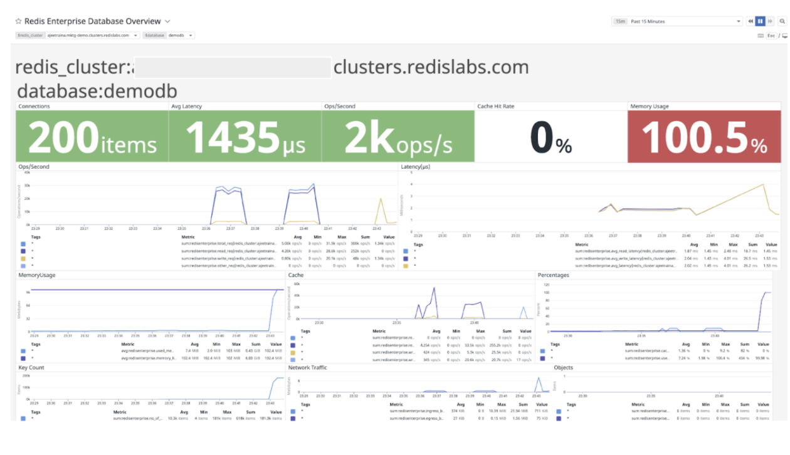


The Datadog Events Stream shows an instant view of your infrastructure and services events to help you troubleshoot issues happening now or in the past. The event stream displays the most recent events generated by your infrastructure and the associated monitors, as shown in the diagram below.


### References:


- [https://docs.datadoghq.com/integrations/redisenterprise/](https://docs.datadoghq.com/integrations/redisenterprise/)
- [Datadog Sample Configuration](https://github.com/DataDog/integrations-extras/blob/master/redisenterprise/datadog_checks/redisenterprise/data/conf.yaml.example) for Redis Enterprise 
- [Complete List of Performance Metrics](https://github.com/DataDog/integrations-extras/blob/master/redisenterprise/metadata.csv)
