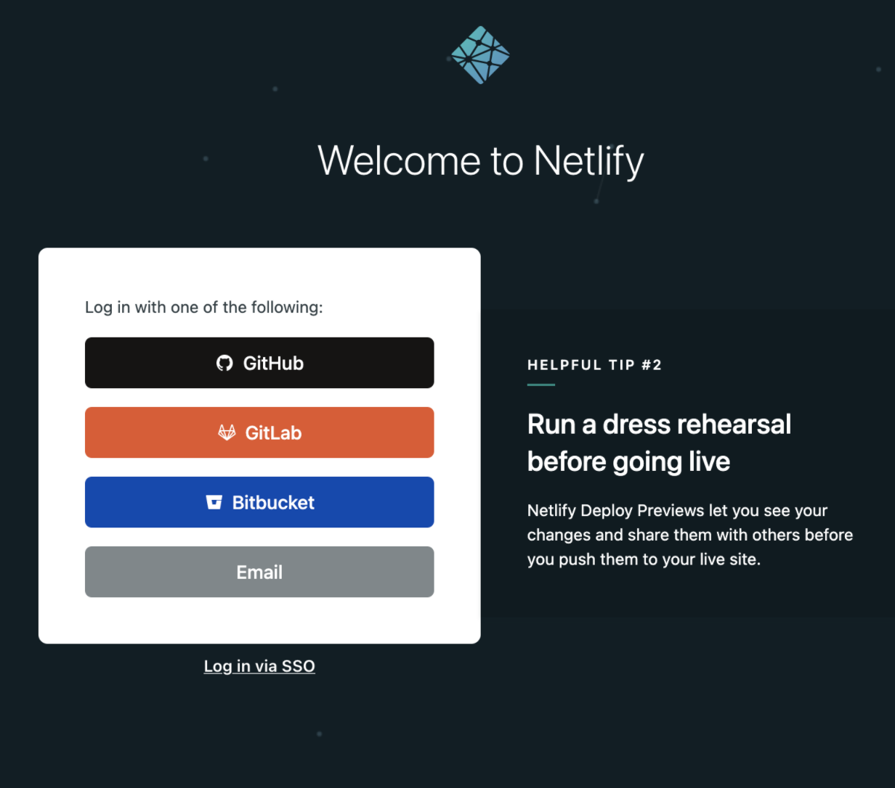
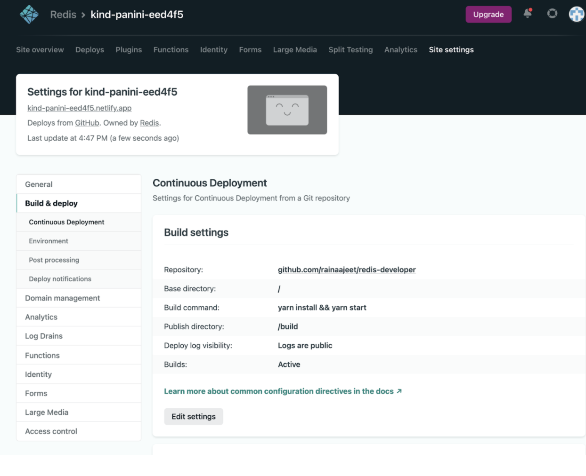

import RedisCard from '@site/src/theme/RedisCard';


Millions of developers use Netlify to instantly build, deploy and scale their modern web applications. The platform comes with the first class-support for every popular framework like JAMstack, React, VueJS, NextJS, Gatsby, AngularJS, Nuxt, Eleventy, Svelte, Hugo, Astro and so on.


The Netlify platform allows developers to build and deploy their site to the global network(CDN) from Git. It delivers out-of-the-box continous integration and continuous deployment. Developers love Netlify because it allows them to focus on building and deploying apps by abstracting all the maintenance work away from them. Features like free SSL, Custom Domain, deploy previews, functions and workflows etc makes Netlify the most comprehensive platform for web projects.

<div class="row">
 <div class="col">
     <RedisCard
        title="How to get started with Netlify"
        description="Learn how to deploy and host React app using Netlify "
        page="/explore/netlify/getting-started-with-netlify"
        />
 </div>
</div>


[In the last tutorial](/explore/netlify/getting-started-with-netlify), we leveraged [Netlify CLI](https://docs.netlify.com/cli/get-started/) to build a simple React application.Under this tutorial, you will see how to deploy and host Redis developer Hub clone using Netlify Dashboard UI in 5 minutes.
 
Let's get started..

### Table of Contents

- Step 1. Sign-in for a new Netlify Account
- Step 2. Connect your Netlify to one or more Git providers
- Step 3. Import the Redis Developer Hub GitHub repository to your GitHub account
- Step 4. Allow Netlify to access Your New GitHub repository
- Step 5. Perform site settings under Netlify
- Step 6. Deploy your site
- Step 7. Access the Redis Developer Hub cloned site


### Step 1. Sign-in for a new Netlify Account

Visit [https://app.netlify.com/](https://app.netlify.com/) and sign in for Netlify account.



### Step 2. Connect your Netlify to Git Provider

Netlify provides you to sign-in using various ways - GitHub, GitLab, Bitbucket, Email and SSO.
For this demo, let us choose GitHub. Sign-in to GitHub to continue to Netlify Auth.
It will ask you for two-factor athentication.


### Step 3. Import the project files to your GitHub account

Once you connect your Netlify account to GitHub, you can start logging in and collaborating with your other team members.
But before that, let us try to import Redis Dev Hub repository project files to your GitHub repository.


### Step 4. Allow Netlify to access the GitHub repository

Next, Netlify will allow you to import an existing project from a GitHub repository as shown below:


### Step 5. Perform site settings 

There are two essential settings that needs to be performed. 
First, change the URL under docusaurus.config.js to any other random URL as shown below:

```javascript title="docusaurus.config.js"
....
module.exports = {
  title: 'Redis Developer Hub',
  tagline: 'The Home of Redis Developers',
  url: 'https://docusaurus-2.netlify.app',
  baseUrl: '/',
  onBrokenLinks: 'throw',
...
...
```

Secondly, you will need to add a Build command as shown below:




### Step 6. Deploy your site

Click "Deploys" on the top navigation, you will see an option "Trigger Deploy" on the right-side.
Choose "Deploy site". If you are performing it for the second time, then choose "Clear cache and deploy site" option.


Monitor the "Deploy Log" carefully to see if there is no serious error message appear in the log.


By now, you should be able to see Docusaurus site hosted over 3000 port. 


### Step 7. Access the Redis Developer Hub cloned site

Go to "Sites" on the top navigation menu and click on the latest preview build.


You will able to see that Netlify upload sites assets to a content delivery network and makes your site available.


### References

- [Netlify Build - A Modern CI-CD Infrastructure for Frontend Teams](https://www.netlify.com/products/build/)
- [Netlify Functions](https://www.netlify.com/products/functions/)
- [Netlify Edge](https://www.netlify.com/products/edge/)
- [Netlify WorkFlow](https://www.netlify.com/products/workflow/)
- [Netlify Analytics](https://www.netlify.com/products/analytics/)
