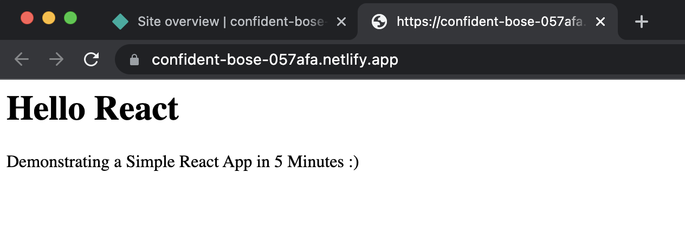

Netlify is a popular static site hosting serverless platform. It is a popular way to build, deploy, and scale modern web applications in a much more scalable and secure way.  


Netlify helps developers to launch websites and campaigns in minutes with no-ops. The hosting platform is built on top of JAMstack and unifies JavaScript and APIs,strong enough to create an infrastructure that’s well suited for both developers and content editors.


### Features of Netlify

- It delivers out-of-the-box continuous integration.
- The platform allows continuous deployment through its support for Git repository deployment.
- It allows developers to focus on building and deploying apps by asbtracting all the maintenance work away from the developers.
- The platform provides free SSL, CDN, and continuous integration.
- It has built-in DNS management & SSL certificates.

### How does Netlify work?


1. The developer writes a code and store it in a version control repository(say, GitHub)
2. When a new change is merged into the master branch of GitHub repo, Github triggers a webhook that Netlify is listening for. 
3. Netlify pulls the latest version of the app from GitHub and then start building the static version of the site
4. Netlify then uses Plugins and internal code to make adjustments to your site, pre-render all of your pages in static HTML and improves it further
5. Once the build process gets completed, Netlify then pushes the contents of the  directory to its global CDN

Let us see how Netlify deploys a simple React app flawlessly.

### Table of Contents

- Step 1. Install Netlify CLI
- Step 2. Clone a GitHub repository 
- Step 3. A Look at the Project directory structure
- Step 4. Login to Netlify via CLI
- Step 5. Deploy the React app

### Step 1. Install Netlify CLI


[Netlify’s command line interface (CLI)](https://cli.netlify.com/commands)  lets you configure continuous deployment directly from the command line.
Run the below command to install Netlify CLI on your local laptop:


```bash

npm install netlify-cli -g
```

Verify if Netlify is installed or not by running the below command:

```bash
 netlify version
 netlify-cli/8.15.3 darwin-x64 node-v14.17.3
```

### Step 2. Clone the repository

```bash
 git clone https://github.com/rainaajeet/simple-react-demo
```


### Step 3. A Look at the project directory structure

Here's a quick look at the overall project directory structure:

```
tree
.
├── README.md
├── package.json
├── public
│   └── index.html
└── src
    ├── App.js
    ├── index.js
    └── style.css

2 directories, 6 files
```

#### File: src/App.js


```javascript title="App.js"
import React from "react";
import "./style.css";

export default function App() {
  return (
    <div>
      <h1>Hello React </h1>
      <p>Demonstrating a Simple React App in 5 Minutes :)</p>
    </div>
  );
}
```

#### File: src/index.js

```javascript title="index.js"
import React from "react";
import ReactDOM from "react-dom";

import App from "./App";

ReactDOM.render(<App />, document.getElementById("demo"));
```

#### File: src/style.css

```css title="style.css"
h1, p {
  font-family: Lato;
}
```

#### File: public/index.html

```css title="index.html"
<div id="demo"></div>
```

#### File: package.json

```json title="package.json"
{
  "name": "react",
  "version": "0.0.0",
  "private": true,
  "dependencies": {
    "react": "^17.0.2",
    "react-dom": "^17.0.2"
  },
  "scripts": {
    "start": "react-scripts start",
    "build": "react-scripts build",
    "test": "react-scripts test --env=jsdom",
    "eject": "react-scripts eject"
  },
  "devDependencies": {
    "react-scripts": "latest"
  }
}
```


### Step 4. Login to Netlify via CLI

To authenticate and obtain an access token using the command line, run the following command to login to your Netlify account:


 ```bash
  netlify login
 ```
This will open a browser window, asking you to log in with Netlify and grant access to Netlify CLI.
Once you authenticate, it will ask you to close the window and display the below results:

<details><summary markdown="span"><strong>Result</strong></summary>

```
  Already logged in via netlify config on your machine

  Run netlify status for account details

  To see all available commands run: netlify help
```
</details>

### Step 5. Configure continuous deployent 

The ```netlify init``` command allows you to configure continuous deployment for a new or existing site. 
It will also allow you to create netlify.toml file if it doesn't exists.

```
netlify init  
```


<details><summary markdown="span"><strong>Result</strong></summary>

```
netlify init
? What would you like to do? +  Create & configure a new site
? Team: Redis
Choose a unique site name (e.g. the-awesome-rainaajeet-site.netlify.app) or leave it blank for a random name. You can update the site name later.
? Site name (optional): undefined

Site Created

Admin URL: https://app.netlify.com/sites/confident-bose-057afa
URL:       https://confident-bose-057afa.netlify.app
Site ID:   48d063c6-aa38-4bd3-9322-1669cec3daa9

Linked to confident-bose-057afa in /Users/ajeetraina/projects/netlifydemos/final/simple-react-demo/.netlify/state.json
? Your build command (hugo build/yarn run build/etc): react-scripts build
? Directory to deploy (blank for current dir): build
? Netlify functions folder: netlify/functions
? No netlify.toml detected. Would you like to create one with these build settings? Yes
Adding deploy key to repository...
Deploy key added!

Creating Netlify GitHub Notification Hooks...
Netlify Notification Hooks configured!

Success! Netlify CI/CD Configured!

This site is now configured to automatically deploy from github branches & pull requests

Next steps:

  git push       Push to your git repository to trigger new site builds
  netlify open   Open the Netlify admin URL of your site
```
</details>


### Step 6. Open the Netlify admin URL

It's time to open the Nelify admin URL directly from the CLI.


```
netlify open --admin
```

<details><summary markdown="span"><strong>Result</strong></summary>

```
Opening "confident-bose-057afa" site admin UI:
> https://app.netlify.com/sites/confident-bose-057afa
```
</details>


### Step 7. Accessing the app

Your demo site is available. You can visit the demo project's URL after Netlify uploads sites aasets to a conten delivery network(CDN).


You will see a new window displaying React app up and running.




### Step 8. Checking the Netlify Status

With ```netlify status``` command, you can print the current status information about netlify user, admin URL, site info etc.

```bash
 netlify status
```

<details><summary markdown="span"><strong>Result</strong></summary>

```
netlify status
──────────────────────┐
 Current Netlify User │
──────────────────────┘
Email:  xx@xx.com
GitHub: xxx
Teams: 
  Redis: Collaborator
────────────────────┐
 Netlify Site Info  │
────────────────────┘
Current site: confident-bose-057afa
Netlify TOML: /Users/ajeetraina/projects/netlifydemos/final/simple-react-demo/netlify.toml
Admin URL:    https://app.netlify.com/sites/confident-bose-057afa
Site URL:     https://confident-bose-057afa.netlify.app
Site Id:      48d063c6-aa38-4bd3-9322-1669cec3daa9


```
</details>

### Try it Yourself

[](https://app.netlify.com/start/deploy?repository=https://github.com/rainaajeet/simple-react-demo)
