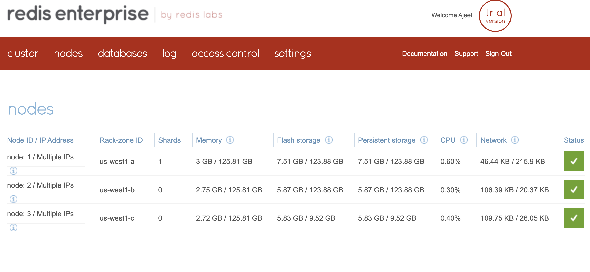
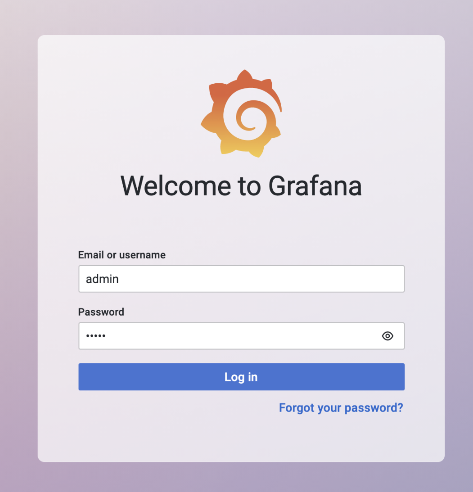
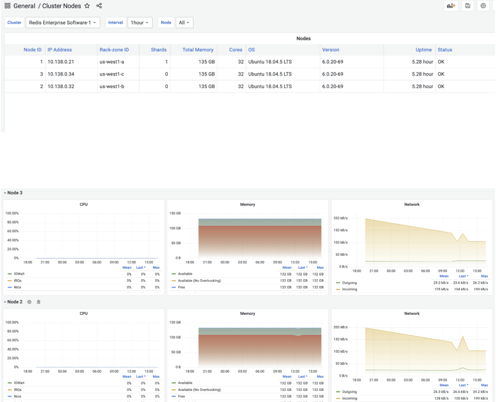

import Tabs from '@theme/Tabs';
import TabItem from '@theme/TabItem';
import useBaseUrl from '@docusaurus/useBaseUrl';
import RedisCard from '@site/src/theme/RedisCard';

Author: [Ajeet Singh Raina](https://twitter.com/ajeetsraina)


Redis Enterprise clusters are a set of nodes, typically two or more, providing database services. Clusters are inherently multi-tenant, and a single cluster can manage multiple databases accessed through individual endpoints. Redis Enterprise software provides REST API to retrieve information about cluster, database , nodes and metrics.

Redis Explorer plugin is the latest plugin in the Grafana Labs that adds support for Redis Enterprise software.It is a plugin for Grafana that connects to Redis Enterprise software clusters using REST API. It provides application pages to add Redis Data Sources for managed databases and dashboards to see cluster configuration.


Redis Explorer allows you to create the below dashboard over Grafana:

#### Enterprise Clusters Dashboard 

Enterprise Clusters dashboard provides basic information about the cluster, license, and displays most important metrics.


#### Cluster Overview Dashboard

Cluster Overview dashboard provides the most important information and metrics for the selected cluster.


#### Cluster Nodes Dashboard

Cluster Nodes dashboard provides information and metrics for each node participating in the cluster.


#### Cluster Databases Dashboard

Cluster Databases dashboard provides information and metrics for each databases managed by cluster.


### Getting Started

### Pre-requisite

- Grafana 8.0+ is required for Redis Explorer 2.X.
- Grafana 7.1+ is required for Redis Explorer 1.X.
- Docker
- Redis Enterprise Cluster

### Step 1. Setup Redis Enterprise Cluster

[Follow these steps](/create/docker/) to setup Redis Enterprise cluster nodes




### Step 2. Install Grafana

 ```bash
  brew install grafana
 ```


### Step 3. Install redis-explorer-app

Use the grafana-cli tool to install from the command line:
Redis Application plugin and Redis Data Source will be auto-installed as dependencies.


 ```bash
  grafana-cli plugins install redis-explorer-app
 ```


### Step 4. Using Docker 

You can even run Redis Explorer plugin using Docker

 ```bash
  docker run -p 3000:3000 --name=grafana -e "GF_INSTALL_PLUGINS=redis-explorer-app" grafana/grafana
 ```

Open https://IP:3000 to access grafana. The default username/password is admin/admin.


### Step 5. Log in to Grafana




### Step 6. Choose Redis Explorer in the sidebar

Once you add the datasource, you should be able to choose the right option


### Step 7. Getting the Redis Enterprise Cluster Overview


### Step 8. Displaying the Redis Enterprise Cluster Nodes




### Further References 

- [Redis Explorer plugin for Grafana](https://grafana.com/grafana/plugins/redis-explorer-app/)
- [Redis Plugins for Grafana Quickstart Guide](https://redisgrafana.github.io/quickstart/)
- [Introducing the Redis Data Source Plug-in for Grafana](https://redislabs.com/blog/introducing-the-redis-data-source-plug-in-for-grafana/)
- [How to Use the New Redis Data Source for Grafana Plug-in](https://redislabs.com/blog/how-to-use-the-new-redis-data-source-for-grafana-plug-in/)
- [3 Real-Life Apps Built with Redis Data Source for Grafana](https://redislabs.com/blog/3-real-life-apps-built-with-redis-data-source-for-grafana/)
- [How to Manage Real-Time IoT Sensor Data in Redis](https://redislabs.com/blog/how-to-manage-real-time-iot-sensor-data-in-redis/)
- [Real-time observability with Redis and Grafana](https://grafana.com/go/observabilitycon/real-time-observability-with-redis-and-grafana/)


##

<div>
<a href="https://launchpad.redis.com" target="_blank" rel="noopener" className="link"> </a>
</div>
