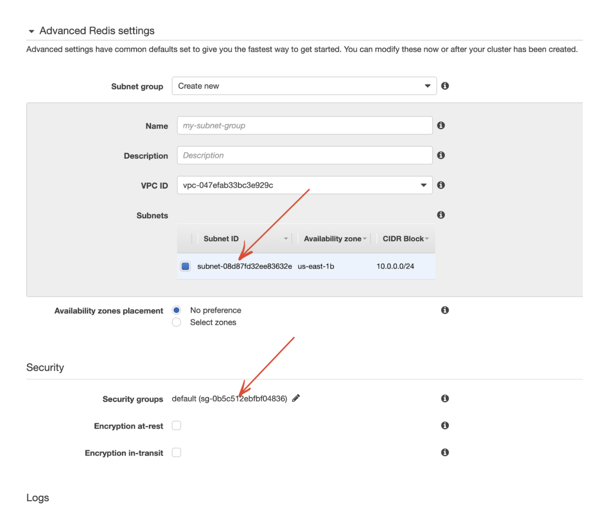
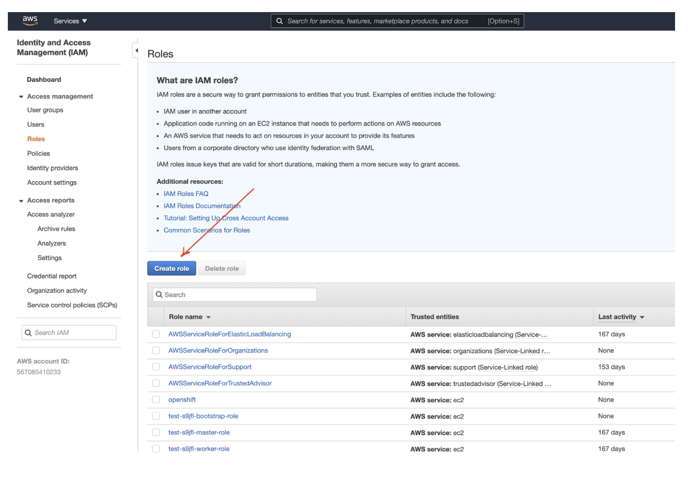
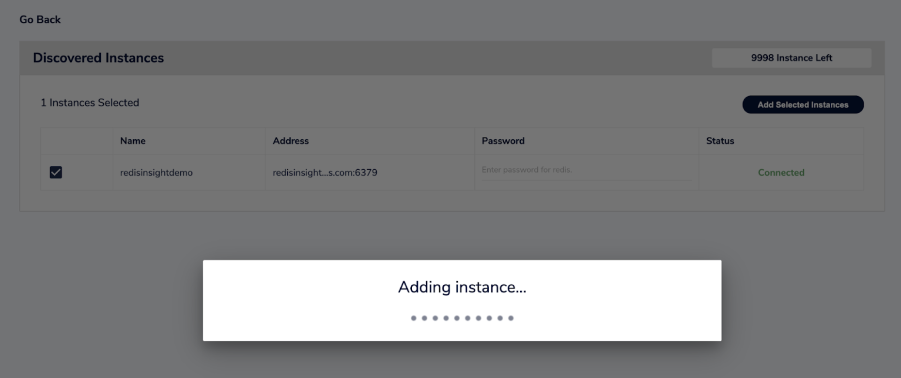

import Tabs from '@theme/Tabs';
import TabItem from '@theme/TabItem';
import useBaseUrl from '@docusaurus/useBaseUrl';
import RedisCard from '@site/src/theme/RedisCard';


RedisInsight is a 100% free Redis GUI that allows you to visualise, monitor, and optimize while developing your applications with Redis. It provides an intuitive and efficient GUI for Redis allowing developers like you to interact with your databases and manage your data.  RedisInsight comes with the compatibility to connect to your database through the Sentinel instance too. Please note that RedisInsight v2.0 is an open source visual tool built by Redis that lets you do both GUI- and CLI-based interactions with your Redis database.

RedisInsight lets you automatically add Redis Enterprise Software and Redis Enterprise Cloud databases. RedisInsight also allows you to automatically discover Elasticache Redis caches.


:::important

ElastiCache Redis caches cannot be accessed from outside the VPC, as they don’t have public IP addresses assigned to them.If you want to work with ElastiCache Redis caches with RedisInsight, you can either setup an SSH tunnel between RedisInsight and your Elasticache instance, in case you're not using Redis Cluster.
:::


This tutorial shows how to:

- Setup and configure Amazon Elasticache
- Configure the VPC
- Configuring the security groups
- Configure and setup Amazon EC2
- Create and configure IAM role
- Assign the permissions
- Connect to Elasticache from EC2 instance
- Setup RedisInsight
- Access RedisInsight
- Autodiscover Elasticache Instance

### Step 1. Setup and configure Amazon Elasticache

Login to [AWS Management Console]( https://aws.amazon.com) and click "Get Started now"


Choose "Redis" as the cluster engine


Configure Redis settings:




Copy and save the Elasticache primary endpoint URL:


### Step 2. Configure the VPC 

Configure and chose VPC that has your ElastiCache instances


### Step 3. Configure the Security Groups


Configure inbound and outbound rules to allow RedisInsight and Redis ports:


### Step 4. Configure and setup Amazon EC2 


### Step 5. Create and configure IAM role

You can use the AWS Management Console to create a role that an IAM user can assume



Under Select type of trusted entity, choose EC2. In other words, the role is used by an EC2 instance


Click “Next”.

### Step 6. Assign the permissions

Assign the below permissions:

- AmazonS3ReadOnlyAccess
- AmazonElastiCacheReadOnlyAccess


### Step 7. Connect to Elasticache from EC2 instance

Use the `redis-cli` command to connect to the remote Amazon Elasticache for Redis server endpoint URL.


 ```bash
  ubuntu@ip-10-0-0-254:~$ redis-cli -h redisinsightdemo.8cfnjo.ng.0001.use1.cache.amazonaws.com -p 6379
  redisinsightdemo.8cfnjo.ng.0001.use1.cache.amazonaws.com:6379>
 ```


### Step 8. Setup RedisInsight

In order to access the RedisInsight GUI, run the following Docker command:

 ```bash
  ubuntu@ip-10-0-0-254:~$ sudo docker run -v redisinsight:/db -p 8001:8001 redislabs/redisinsight:latest
  Unable to find image 'redislabs/redisinsight:latest' locally
  latest: Pulling from redislabs/redisinsight
 ```

 ```bash
  sudo docker ps
  CONTAINER ID   IMAGE                           COMMAND                  CREATED         STATUS         PORTS                                       NAMES
  caf3d674fb81   redislabs/redisinsight:latest   "bash ./docker-entry…"   4 seconds ago   Up 3 seconds   0.0.0.0:8001->8001/tcp, :::8001->8001/tcp   cool_pascal
 ```

### Step 9. Access RedisInsight

To access the Redis GUI, open your preferred browser and access https://localhost:8001


### Step 10. Autodiscover Elasticache Instance

:::important
In case you encounter the below error message:

This EC2 instance does not have permissions to discover your ElastiCache instances. To grant permission, create an IAM role  with the DescribeCacheClusters permission and attach the role  to this EC2 instance.

You might have to attach IAM role to the instance as shown below:


::: 

Now you can should be able to autodiscover Elasticache


Add the selected instance:



Add the discovered instance:


### References

- [Explore Redis keys using RedisInsight browser tool](/explore/redisinsight/browser)
- [Memory Analysis using RedisInsight](/explore/redisinsight/memoryanalyzer)
- [Unified Search and Analytics using RediSearch Browser Tool](/explore/redisinsight/redisearch)
- [Managing time-series data using RedisTimeSeries Browser Tool](/explore/redisinsight/redistimeseries)
- [Analyze Your Redis commands using RedisInsight Profiler tool](/explore/redisinsight/profiler)
- [Debugging Redis using RedisInsight Slowlog Tool](/explore/redisinsight/slowlog)
- [Using Redis Streams with RedisInsight](/explore/redisinsight/streams)

##

<div>
<a href="https://launchpad.redis.com" target="_blank" rel="noopener" className="link"> </a>
</div>
