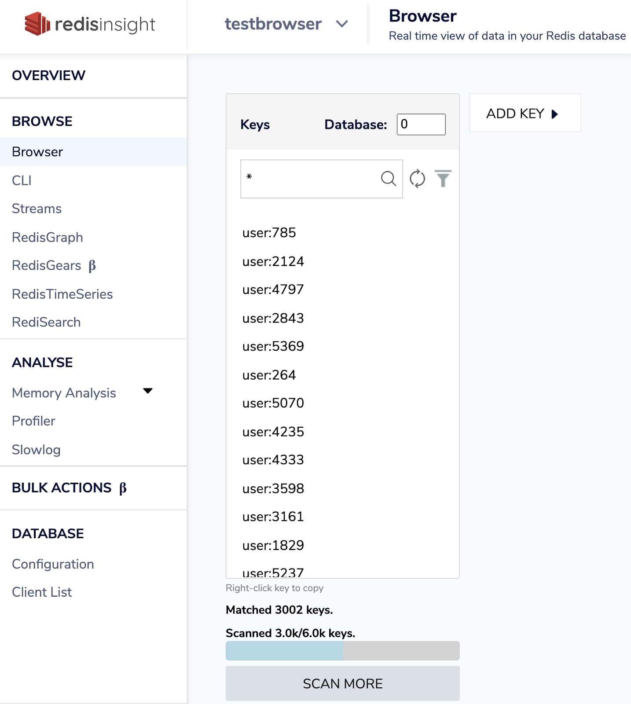

import Tabs from '@theme/Tabs';
import TabItem from '@theme/TabItem';
import useBaseUrl from '@docusaurus/useBaseUrl';
import RedisCard from '@site/src/theme/RedisCard';

RedisInsight is a 100% free Redis GUI that allows you to visualise, monitor, and optimize while developing your applications with Redis. It provides an intuitive and efficient GUI for Redis allowing developers like you to interact with your databases and manage your data.

RedisInsight Browser lets you explore keys in your redis server. You can add, edit and delete a key. You can even update the key expiry and copy the key name to be used in different places of the application.

In order to understand the capabilities of the browser tool, let us take a simple example and demonstrate capabilities of each of browse tool options:

## Step 1: Create a Redis Database

[Follow this link ](https://developer.redis.com/create)to create Redis database

## Step 2: Download RedisInsight

To install RedisInsight on your local system, you need to first download the software from the Redis website.

[Click this link ](https://redis.com/redis-enterprise/redis-insight/#insight-form) to access a form that allows you to select the operating system of your choice.


Run the installer. After the web server starts, open http://YOUR_HOST_IP:8001 and add a Redis database connection.

Select "Connect to a Redis database"


Enter the requested details, including Name, Host (endpoint), Port, and Password. Then click “ADD REDIS DATABASE”.

## Step 3: Open "Browser Tool"


## Step 4: Importing keys

Let us import a user database( 6k keys). This dataset contains users stored as Redis Hash.

###

**Users**

The user hashes contain the following fields:

- `user:id` : The key of the hash.
- `first_name` : First Name.
- `last_name` : Last name.
- `email` : email address.
- `gender` : Gender (male/female).
- `ip_address` : IP address.
- `country` : Country Name.
- `country_code` : Country Code.
- `city` : City of the user.
- `longitude` : Longitude of the user.
- `latitude` : Latitude of the user.
- `last_login` : EPOC time of the last login.

## Step 5: Cloning the repository

```bash
 git clone https://github.com/redis-developer/redis-datasets
 cd redis-datasets/user-database
```

Importing the user database:

```bash
 redis-cli -h localhost -p 6379 < ./import_users.redis
```

Refresh the keys database by clicking as shown below:

Click on “Scan More” to scan all 6k keys


You can get a real-time view of the data in your Redis database as shown below:



Select any key in the key database and the results gets displayed in the right hand side that includes Fields and values.


## Step 6. Adding a new key


Enter key name, field and value.


## Step 7. Searching the hash key

You can search the key by “user:9999” and you will see the result.


Let us add fields for user:9999 as shown below:

You can even search by adding “\*” and typing the first few letters.


## Step 8: Filter keys by Data Type


## Step 9: Setting up the Expiry value

Let us set it to 2 seconds and you won’t be able to search for the same key as it gets expired.


## Step 10: Using CLI

RedisInsight CLI lets you run commands against a redis server. You don’t need to remember the syntax - the integrated help shows you all the arguments and validates your command as you type.

```
> HMGET user:3333 first_name last_name city

1) "Myrlene"
2) "McGrane"
3) "Qinghu"
```


## Further References

- [Slowlog Configuration using RedisInsight](/explore/redisinsight/slowlog)
- [Explore Redis keys using RedisInsight browser tool](/explore/redisinsight/browser)
- [Memory Analysis using RedisInsight](/explore/redisinsight/memoryanalyzer)

##

<div>
  <a
    href="https://launchpad.redis.com"
    target="_blank"
    rel="noopener"
    className="link">

    

  </a>
</div>
