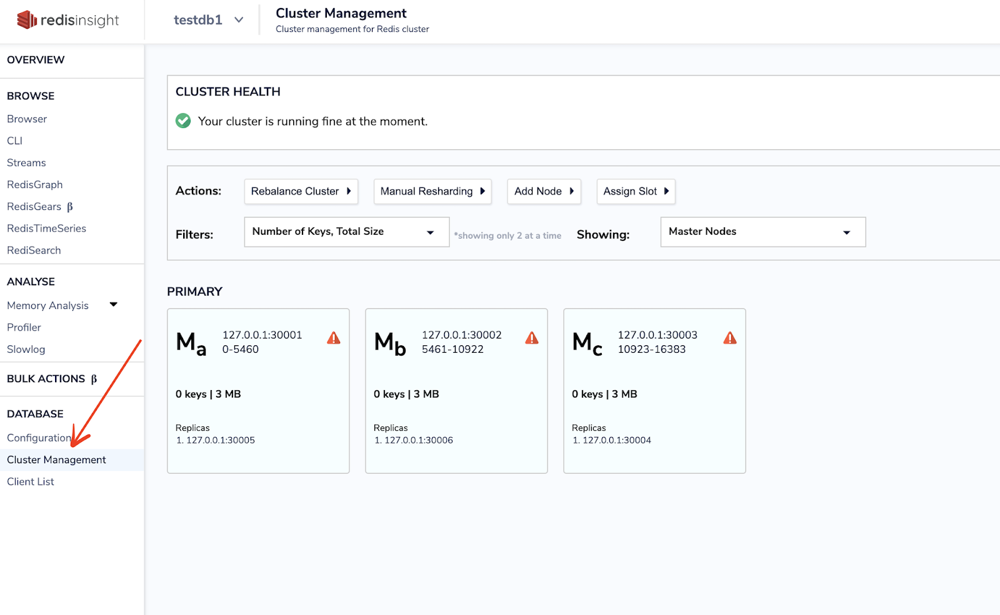
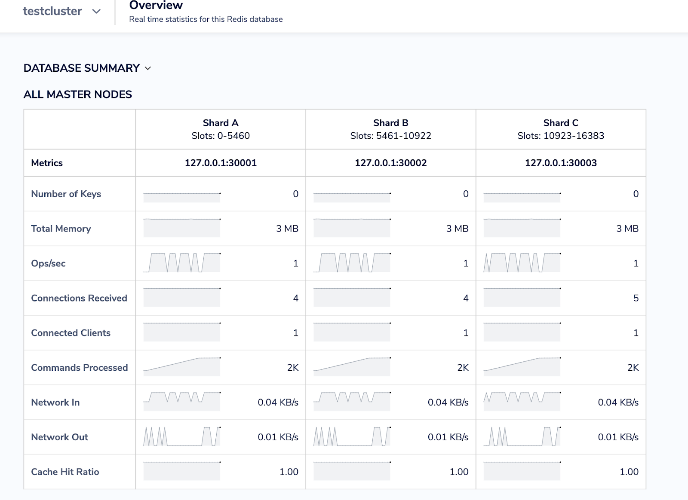
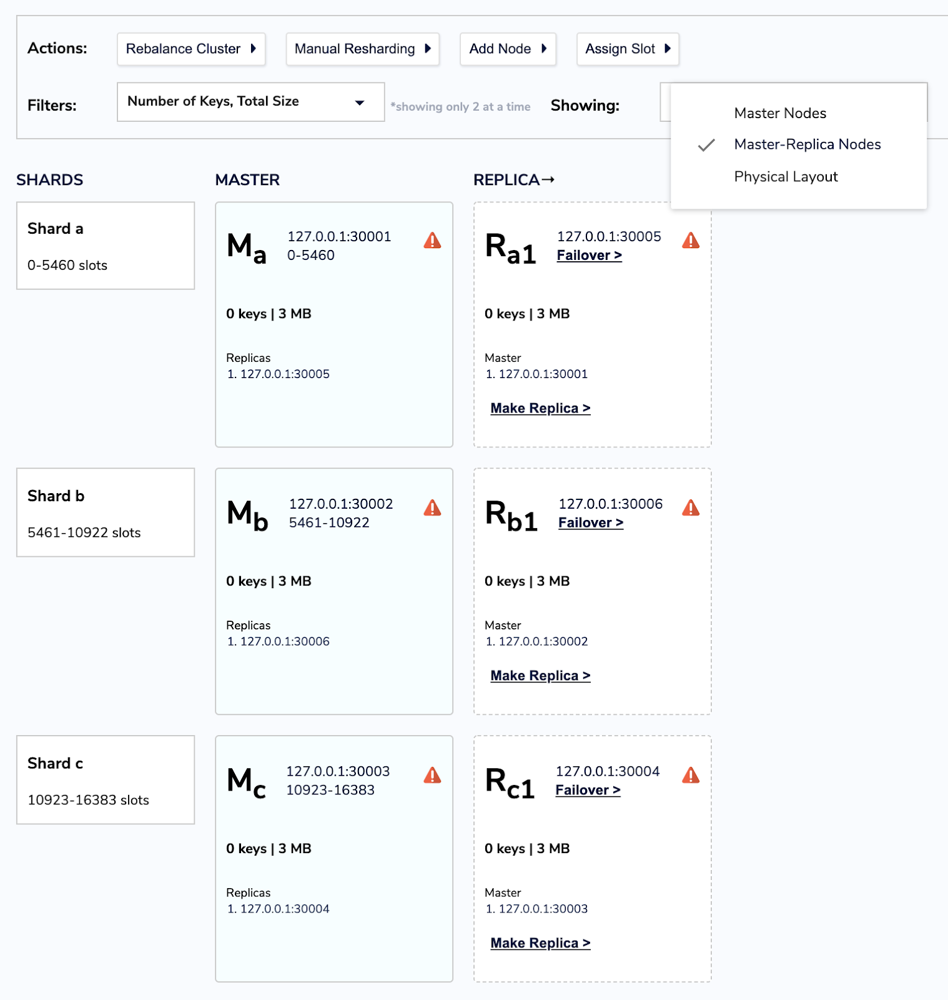
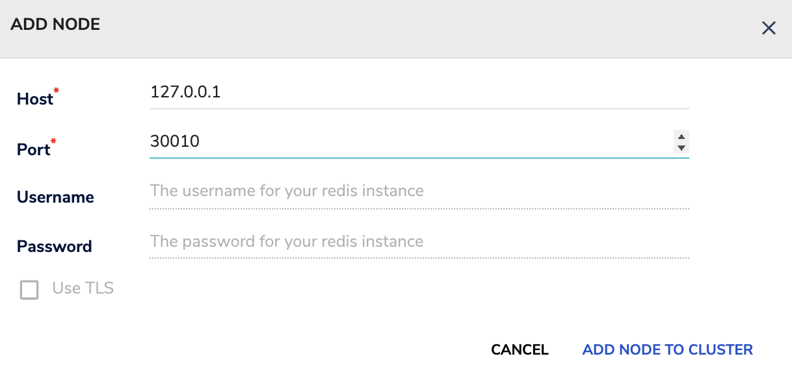
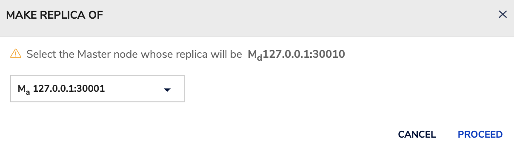
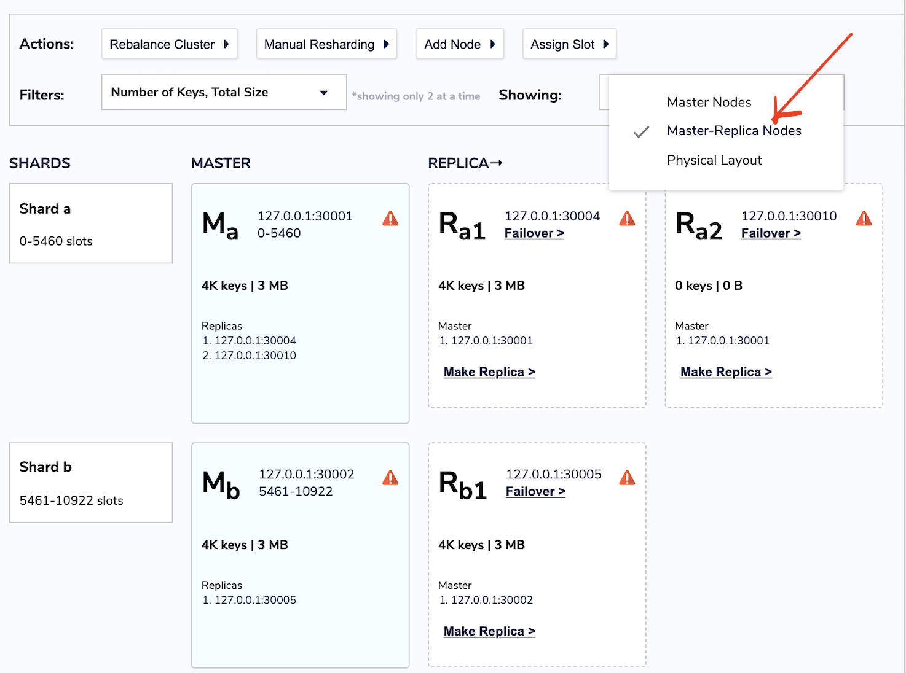

import Authors from '@theme/Authors';

<Authors frontMatter={frontMatter} />

A full-featured desktop GUI client, RedisInsight is an essential tool for Redis developers. It is a lightweight multi-platform management visualization tool that helps you design, develop, and optimize your application capabilities in a single easy-to-use environment. RedisInsight not just makes it easier to interact with your databases and manage your data, but also helps in managing Redis Cluster with ease.

## Getting Started

Redis Cluster is an active-passive cluster implementation that consists of master and replicas nodes.
There are two kinds of nodes: master and replicas nodes. To get started with Redis Cluster, follow the below steps to build 3 Master and 3 Replicas.

:::note

In Redis, slave nodes are generally called replicas as they hold the replicated slots that their masters have.

:::

## Step 1. Install Redis from source

[Follow this link](/create/from-source/) to build Redis from source in your local system.

## Step 2: Executing the create-cluster script

By default, if you compile Redis from source, you will find a simple bash script called create-cluster under /utils/ directory.
In order to start a 6 nodes cluster with 3 masters and 3 replicas, just type the following commands:

```bash
 cd /utils/create-cluster
 ./create-cluster start
```

```bash
 Starting 30001
 Starting 30002
 Starting 30003
 Starting 30004
 Starting 30005
 Starting 30006
```

## Step 3. Access Redis Instance

```bash
 redis-cli -c -p 30001
 127.0.0.1:30001> set foo bar
 -> Redirected to slot [12182] located at 127.0.0.1:30003
 OK
 127.0.0.1:30003>
```

## Step 4. Verify the cluster nodes

```
 cluster nodes
 b37c153b7cb63a863b51fa08bdde46bfda9c6a98 127.0.0.1:30005@40005 slave 3e85f061bebd9b566e1cbf7f03cbe3e1859babbc 0 1620304753134 3 connected
 8a1a0ba49e1845feff5314fbb8b73a2ec99e3647 127.0.0.1:30001@40001 master - 0 1620304753033 1 connected 0-5460
 bd7326d7b907a04214372fe41189e41763a1e1df 127.0.0.1:30006@40006 slave 8a1a0ba49e1845feff5314fbb8b73a2ec99e3647 0 1620304753033 1 connected
 3e85f061bebd9b566e1cbf7f03cbe3e1859babbc 127.0.0.1:30003@40003 myself,master - 0 1620304753000 3 connected 10923-16383
 67bbe43901031fa4bfe4cee6105d284f4fe7733b 127.0.0.1:30002@40002 master - 0 1620304753033 2 connected 5461-10922
 0e3fb1de10b722458c959b35f1468275c34ba49f 127.0.0.1:30004@40004 slave 67bbe43901031fa4bfe4cee6105d284f4fe7733b 0 1620304753134 2 connected
```

## Step 5. Set Protected mode off

```bash
 redis-cli -c -p 30001
 127.0.0.1:30001> CONFIG SET protected-mode no
 OK
 127.0.0.1:30001> exit
```

## Step 6: Download RedisInsight

To install RedisInsight on your local system, you need to first download the software from the Redis website.

[Click this link ](https://redis.com/redis-enterprise/redis-insight/#insight-form) to access a form that allows you to select the operating system of your choice.


Run the installer. After the web server starts, open http://YOUR_HOST_IP:8001 and add a Redis database connection.

Select "Connect to a Redis database"


Enter the requested details, including Name, Host (endpoint), Port, and Password. Then click “ADD REDIS DATABASE”.


Enter the details - host IP, port and name of the database of your choice.


## Step 7. Select the seed nodes of your cluster


## Step 8. Choose the database


## Step 9. Click "Cluster Management"

On the left menu of the RedisInsight, click 'Cluster Management' option to check the cluster health and cluster nodes.



## Step 10. Choose "Master Layout View"

This view only contains information about the masters present in the Redis Cluster. The information present is - slot ranges, host, port and few metrics gathered from redis INFO Command.



Cluster Management comes with three different views to analyze your cluster architecture(as shown above).

- Master Layout - This view only contains information about the masters present in the Redis Cluster. The information present is - slot ranges, host, port and few metrics gathered from redis INFO Command.
- Master-Replica Layout - This view contains masters along with their replicas. This view contains information about slots ranges, host, port, etc for both master and replicas.
- Physical Layout - This view gives you a representation of your server i.e. it groups all nodes according to the physical server they reside in.

## Step 11. Resharding

Resharding basically means to move hash slots from a set of nodes to another set of nodes, and like cluster creation it is accomplished using the redis-cli utility.

Typically, to start a resharding, you pass “--cluster reshard” option to the redis client CLI as shown below:

```bash
 redis-cli --cluster reshard 127.0.0.1:7000
```

You only need to specify a single node, redis-cli will find the other nodes automatically.

With RedisInsight, it can be performed over the GUI. Open Cluster Management > Manual Resharding option > Destination node > Source Nodes and enter the slot range.
Before we perform resharding, let us try to insert real-time keys into the cluster. You need to have ruby installed on your system

```ruby

 require './cluster'

 if ARGV.length != 2
   startup_nodes = [
       {:host => "127.0.0.1", :port => 30001},
       {:host => "127.0.0.1", :port => 30003}
    ]
  else
   startup_nodes = [
       {:host => ARGV[0], :port => ARGV[1].to_i}
   ]
  end

 rc = RedisCluster.new(startup_nodes,32,:timeout => 0.1)

 last = false

 while not last
   begin
       last = rc.get("__last__")
       last = 0 if !last
   rescue => e
       puts "error #{e.to_s}"
       sleep 1
   end
 end

 ((last.to_i+1)..1000000000).each{|x|
   begin
       rc.set("foo#{x}",x)
       puts rc.get("foo#{x}")
       rc.set("__last__",x)
   rescue => e
       puts "error #{e.to_s}"
   end
   sleep 0.1
 }
```

Save the above content in a file called testing.rb as shown below:

```bash
 ruby testing.rb
```

The above script will insert keys into the Redis cluster.


You can check the real-time logs via MONITOR command:

```bash

 1620718356.267791 [0 127.0.0.1:56056] "set" "foo2124" "2124"
 1620718356.268153 [0 127.0.0.1:56056] "get" "foo2124"
 1620718356.683092 [0 127.0.0.1:56056] "set" "foo2128" "2128"
 1620718356.683403 [0 127.0.0.1:56056] "get" "foo2128"
 1620718357.208191 [0 127.0.0.1:56056] "set" "foo2133" "2133"
 1620718357.208636 [0 127.0.0.1:56056] "get" "foo2133"
 1620718357.625524 [0 127.0.0.1:56056] "set" "foo2137" "2137"
 1620718357.625961 [0 127.0.0.1:56056] "get" "foo2137"
 1620718358.248578 [0 127.0.0.1:56056] "set" "foo2143" "2143"
```

Let us perform a manual sharding. Select "Manual Sharding" under Actions tab.
It will ask to select destination and source nodes. It allows to enter slot range too as shown below.


Click "Next".

The resharding process begins instantly.


Finally, you can view the changes under the Cluster Management section as shown below:



## Step 12. Viewing Physical Layout

This view gives you a representation of your Cluster nodes i.e. it groups all nodes according to the physical server they reside in.


## Step 13. Adding keys Manually

Let us try to add a key against the cluster nodes


```bash

 Connecting...

 Pinging Redis server on 127.0.0.1:30003...
 Connected.
 Ready to execute commands.

 >> set hello world

 -> Redirected to slot [866] located at 127.0.0.1:30001
"OK"
```

```bash

 >> set lang python

 127.0.0.1:30001 [master]
 "OK"

 127.0.0.1:30003 [master]
 (error) MOVED 3807 127.0.0.1:30001

 127.0.0.1:30002 [master]
 (error) MOVED 3807 127.0.0.1:30001
```

Once you set up a cluster, a cluster will have a sharding.

```bash
 > set a1 100
```

Once you add a key to Redis, hashes slot is calculated.Redis calculates the slot where the key is going to land by taking CRC16 of the key modulo 16384.

## Step 14. Cyclic redundancy checkpoint

By Finding the hashes slot for the keys, your data will automatically be spread across the nodes.


In a Redis cluster, there are 16,384 slots available. The first master node in a cluster contain 0 to 5500, 5501 to 11000 and 3rd 11001 to 16,385

## Step 15. Adding a New Node

Let us add a new node in the Redis configuration file:

```bash
  % tree
 .
 ├── 30010
 │   ├── appendonly.aof
 │   ├── dump.rdb
 │   ├── nodes.conf
 │   └── redis.conf
 └── redis.conf

 1 directory, 5 files

 % cat 30010/redis.conf
 port 30011
 cluster-enabled yes
 cluster-config-file nodes.conf
 cluster-node-timeout 5000
 appendonly yes
```

It's time to run the new Redis instance.

````bash
 redis-server ./redis.conf
 34168:C 10 May 2021 15:49:04.251 # oO0OoO0OoO0Oo Redis is starting oO0OoO0OoO0Oo
 34168:C 10 May 2021 15:49:04.251 # Redis version=6.1.241, bits=64, commit=00000000, modified=0, pid=34168, just started
 34168:C 10 May 2021 15:49:04.251 # Configuration loaded
 34168:M 10 May 2021 15:49:04.252 * Increased maximum number of open files to 10032 (it was originally set to 2560).
 34168:M 10 May 2021 15:49:04.252 * monotonic clock: POSIX clock_gettime
 34168:M 10 May 2021 15:49:04.253 * No cluster configuration found, I'm d3c15d55a60a4cdf9c1f4de8b0c637dda3500ca0
                _._
           _.-``__ ''-._
      _.-``    `.  `_.  ''-._           Redis 6.1.241 (00000000/0) 64 bit
  .-`` .-```.  ```\/    _.,_ ''-._
 (    '      ,       .-`  | `,    )     Running in cluster mode
 |`-._`-...-` __...-.``-._|'` _.-'|     Port: 30010
 |    `-._   `._    /     _.-'    |     PID: 34168
  `-._    `-._  `-./  _.-'    _.-'
 |`-._`-._    `-.__.-'    _.-'_.-'|
 |    `-._`-._        _.-'_.-'    |           http://redis.io
  `-._    `-._`-.__.-'_.-'    _.-'
 |`-._`-._    `-.__.-'    _.-'_.-'|
 |    `-._`-._        _.-'_.-'    |
  `-._    `-._`-.__.-'_.-'    _.-'
      `-._    `-.__.-'    _.-'
          `-._        _.-'
              `-.__.-'

 34168:M 10 May 2021 15:49:04.254 # Server initialized
 34168:M 10 May 2021 15:49:04.254 * Ready to accept connections
````

Enter the host and port details of the new node:



Now, you can view the nodes layout as shown below:


You can also view it via CLI on your local system if you want to verify the new node entry.

```bash
 redis-cli -p 30001
127.0.0.1:30001> cluster nodes
1a959116fb6c32726b8513668149c8a27dc61613 127.0.0.1:30006@40006 replicas 7ac14c8345df91640bc7174de903f0dd8683a1d2 0 1620642235140 7 connected
5d2ce263fb025d38c2d7626d48422d0e28280aa7 127.0.0.1:30004@40004 replicas 6f0096be6248834c0f3237192020d12ff6496f74 0 1620642235343 1 connected
7ac14c8345df91640bc7174de903f0dd8683a1d2 127.0.0.1:30003@40003 master - 0 1620642235039 7 connected 0-1000 10923-16383
e0daeb42432323b587b281f26b26b90e9e6f2482 127.0.0.1:30005@40005 replicas 011209ddc3577e8ec15efbcb12e38a405bda20f9 0 1620642235241 2 connected
6f0096be6248834c0f3237192020d12ff6496f74 127.0.0.1:30001@40001 myself,master - 0 1620642235000 1 connected 1001-5460
011209ddc3577e8ec15efbcb12e38a405bda20f9 127.0.0.1:30002@40002 master - 0 1620642235039 2 connected 5461-10922
d3c15d55a60a4cdf9c1f4de8b0c637dda3500ca0 127.0.0.1:30010@40010 master - 0 1620642235140 0 connected
127.0.0.1:30001>
```

## Step 16. Make Replica Of

Whenever you add a new node, Redis allows you to rebalance your cluster as shown below:


You can select the master that will be replicas of the specific node:


Choose the right master node of your choice and click "Proceed".




## Step 17. Deleting a Node

To delete a node, select “Master-Replica Nodes” option and you will see all the replicas nodes





## Step 18. Removing the node from the Cluster


## Step 19. Failover

In order to upgrade the Redis process of one of the master nodes it is a good idea to failover it in order to turn it into a replicas with minimal impact on availability.


Also, RedisInsight Cluster Management tool allows you to rebalance your cluster by manually defining the slot coverage as shown below:


## Addition Links

- [Slowlog Configuration using RedisInsight](/explore/redisinsight/slowlog)
- [Memory Analysis using RedisInsight](/explore/redisinsight/memoryanalyzer)
- [Visualize Redis database keys using RedisInsight Browser Tool](/explore/redisinsight/browser)
- [Using Redis Streams with RedisInsight](/explore/redisinsight/streams)
