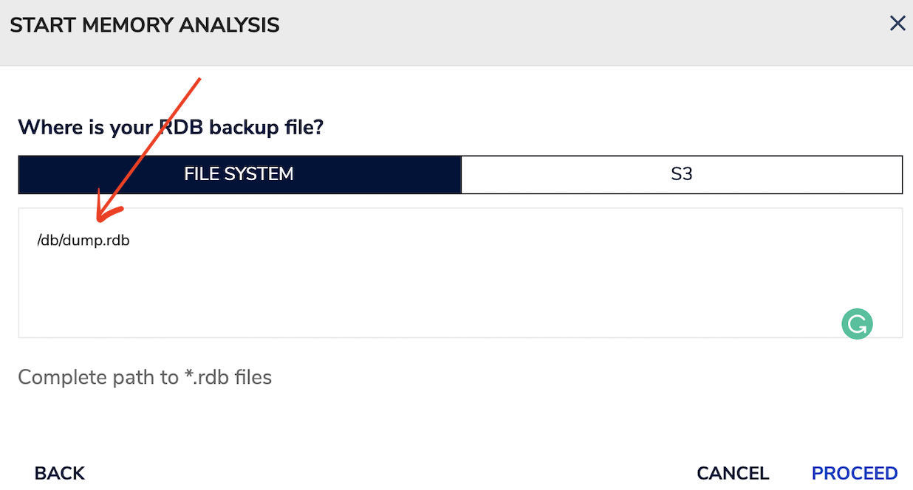
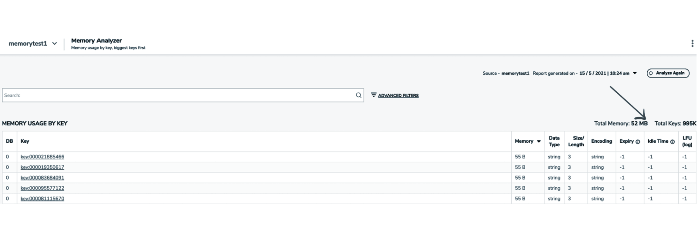

import Tabs from '@theme/Tabs';
import TabItem from '@theme/TabItem';
import useBaseUrl from '@docusaurus/useBaseUrl';
import RedisCard from '@site/src/theme/RedisCard';

RedisInsight, a free web-based GUI management interface for Redis, offers several tools to manage and optimize Redis, with the main focus on memory optimization. RedisInsight Memory analysis helps you analyze your redis instance and helps in reducing memory usage and improving application performance.

Let’s assume that you noticed high memory usage out of your redis instance and you want to analyze if there is any specific cache/key pattern which is consuming most of the memory or not using the redis in a very efficient way. RedisInsight is a great tool that can help you analyze memory used by redis by keys or key patterns, by expiry, by data types or or the internal encoding. Analysis can be done in two ways: online and offline mode.(discussed later in the tutorial).

This tutorial demonstrates the below list of features under RedisInsight:


-   Memory Overview
-   Keyspace Summary
-   Recommendations
-   Memory Analyzer

Follow the below steps to see how Memory analysis can be performed over Redis Database(RDB) dumps using RedisInsight.

## Step 1: Create a Redis database 

[Follow this link ](https://developer.redislabs.com/create)to create Redis database

## Step 2: Setup RedisInsight

I assume that Docker is already installed in your local system.
As we will be analysing the *.rdb dumps, it’s recommended to add a mount point using the -”v” parameter as shown below:


 ```bash
  mkdir memorytest
  docker run -d -v /temp/memorytest:/db -p 8001:8001 redislabs/redisinsight:latest
 ```


## Step 3: Connect to Redis database


## Step 4: Importing user sample datasets


 ```bash
  git clone https://github.com/redis-developer/redis-datasets
  cd redis-datasets/user-database
 ```


Execute the below command to import users database


 ```bash
  redis-cli -h 192.168.1.9 -p 6379 < ./import_users.redis
  ..
  ..
  "5996 Users Created"
 ```


Under RedisInsight GUI, click on “Memory Analysis” under Browser.
Before you click on “Analyze Now”, ensure that you store dump.rdb at the right location.
If you’re on Mac, redis dump file is located under /usr/local/var/db/redis


 ```bash
  tree /usr/local/var/db 
  /usr/local/var/db
  └── redis
    └── dump.rdb

  1 directory, 1 file

 ```


Copy the dump.rdb to /memorytest/ location. You can also verify if that file is available in the container by using docker exec command.


 ```bash
  ls
  bulk_operation		dump.rdb		queries.log		redisinsight.log
  dropbox			profiler_logs		redisinsight.db		rsnaps
 ```


Memory analysis in RedisInsight is done in two different ways:


-  **Online mode** - In this mode, RedisInsight downloads a rdb file from your connected redis instance and analyzes it to create a temp file with all the keys and meta data required for analysis. 
-  **Offline mode** - In this mode, RedisInsight analyzes your redis backup files. These files can either be present in your system or on s3. RedisInsight accepts a list of rdb files given to it and analyzes all the information required from these files instead of downloading it from your redis instance. 

Choose the offline analysis approach if you have a RDB Backup file that you want to analyze. 


Enter the right location of the RDB backup file as shown below:





Click “Proceed”.


## Keyspace Summary

Keyspace Summary identifies the top key patterns from the set of keys in descending order of memory. This helps you identify which key patterns are consuming most of your memory and what are the top keys for that pattern. You can add your own key patterns in order to identify their memory usage and the top keys for that key pattern.

Click “Keyspace” and you will see the total memory consumed by each of the top key patterns as shown below:


You can click on each of these keys patterns(as shown above) and check the memory usage.


## Recommendations

RedisInsight provides recommendations on how you can save your memory. The recommendations are specially curated according to your Redis instance. These recommendations have been formed based on industry standards.


:::important

Combine Small Strings to Hash

Small key value pairs in redis consume a lot of memory because a top level key has several overheads. If you do not need an expiry on these keys, you can combine multiple keys into a larger hash. As long as the hash has less than 512 elements and the size of each element is within 64 bytes, you will save a significant amount of memory.
Read Instagram's blog post on how they used this technique to save memory
Once you combine strings into a larger hash, evaluate hash-max-ziplist-entries and hash-max-ziplist-value settings. You may want to increase them to save even more memory.

Performance comes with a cost. By converting the strings to hash, we will be saving on a lot of memory because it saves only the string value and no extra information like: idle time, expiration, object reference count, and encoding related to it. But if we want the key with the expiration value, we can't associate it with a hash structure as expiration is not available. Read More
:::


Let us add 1 million keys using redis-benchmark tool:

Fill 127.0.0.1:6379 with about 1 million keys only using the SET test:


 ```bash
  redis-benchmark -t set -n 1000000 -r 100000000
  …
  100.000% <= 1011.199 milliseconds (cumulative count 1000000)

 Summary:
  throughput summary: 13451.89 requests per second
  latency summary (msec):
          avg       min       p50       p95       p99       max
        3.600     0.616     3.007     5.591     7.567  1011.199

 ```


Click on Recommendations and you will see the below messages


:::important

Avoid unnecessary Long Keys 

You can save some memory by avoiding large keys. In general, you should always prefer descriptive keys. This recommendation only applies if you have millions of very large keys. In a well written application, switching to shorter keys usually involves updating a few constant strings in the application code.
The trade off of converting large keys to smaller keys is that large Keys were more descriptive then shortened keys, hence when reading through your database you may find the keys less relatable. Read More
Key patterns that need to be modified:
key:*

:::


## Memory Analyser

Memory Analyzer lets you search a key or key patterns and get related information regarding it with other stats. You can apply various filters and aggregations using our advance filters feature.

When the `analyze-memory` button is clicked, it connects to the redis instance and takes a point-in-time snapshot of the database. [Here’s a link](https://docs.redislabs.com/latest/ri/using-redisinsight/memory-analysis/#how-memory-analysis-works) that deep dive into SYNC and DUMP approach

Considering 1 million keys only using the SET command, you can view the memory analyzer section and click “Advanced Filters”.





The advanced filters allow you to choose data type, encoding, memory, group by data types, encoding, aggregate etc.


You can check memory usage by key:


## Additional Links

- [Slowlog Configuration using RedisInsight](/explore/redisinsight/slowlog)
- [Explore Redis keys using RedisInsight browser tool](/explore/redisinsight/browser)
- [Cluster Management with ease using RedisInsight](/explore/redisinsight/cluster)


