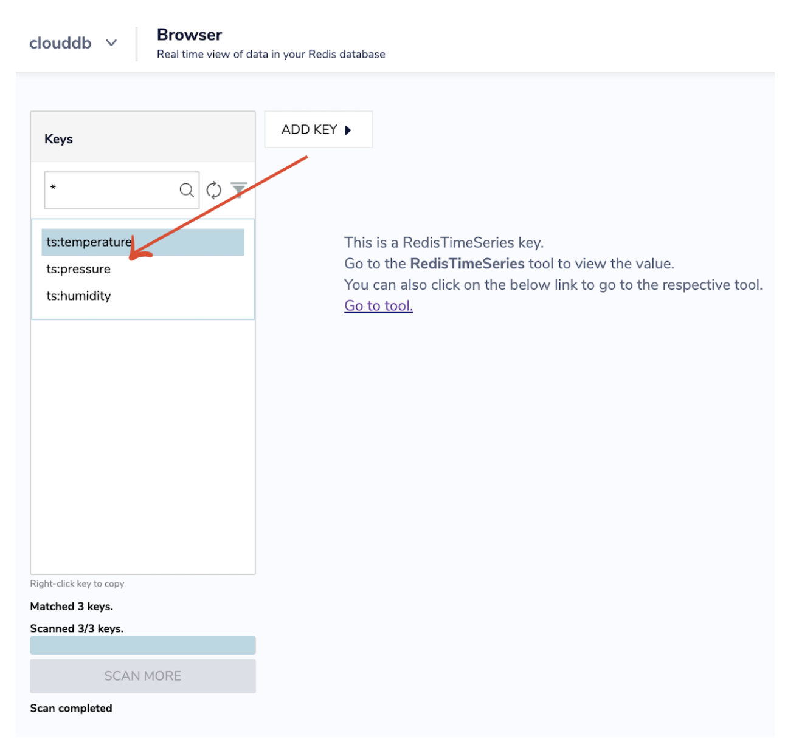

import Tabs from '@theme/Tabs';
import TabItem from '@theme/TabItem';
import useBaseUrl from '@docusaurus/useBaseUrl';
import RedisCard from '@site/src/theme/RedisCard';


RedisInsight profiler analyzes your Redis commands that are being run on the Redis server in real-time. The tool provides you detailed  information about the number of commands processed, commands/second and number of connected clients. It also gives information about top prefixes, top keys and top commands. 

It basically runs the Redis MONITOR command and generates a summarized view. MONITOR is a debugging command that streams back every command processed by the Redis server. It can help in understanding what is happening to the database. This command can both be used via `redis-cli` and via `telnet`.All the commands sent to the redis instance are monitored for the duration of the profiling. The ability to see all the requests processed by the server is useful in order to spot bugs in an application both when using Redis as a database and as a distributed caching system.


:::important

Because MONITOR streams back all commands, its use comes at a cost.Running monitor command is dangerous to the performance of your production server, hence the profiler is run for a maximum time of 5 minutes, if the user has not stopped it in between. This is to avoid overload on the Redis server.

:::

Follow the below instructions to test drive RedisInsight profiler tool:


## Step 1.  Create Redis database with RedisTimeSeries module enabled

Visit [https://developer.redis.com/create/rediscloud](https://developer.redis.com/create/rediscloud) and create a Redis database. [Follow these steps to enable RedisTimeSeries module ](https://developer.redis.com/howtos/redistimeseries)on Redis Enterprise Cloud


You can use redis cli client to connect to the remote Redis Enterprise cloud database. You can check memory usage  via Redis INFO command.

:::info TIP
RedisInsight allows you to add Redis Sentinel database too. Refer  [this link ](https://docs.redis.com/latest/ri/using-redisinsight/add-instance/#add-a-redis-sentinel-database) to learn more
:::


## Step 2: Download RedisInsight

:::note TIP
RedisInsight v2.0 is an open source visual tool that lets you do both GUI- and CLI-based interactions with your Redis database.
It is an open source visual tool that lets you do both GUI- and CLI-based interactions with your Redis database . It is a desktop manager that provides an intuitive and efficient GUI for Redis, allowing you to interact with your databases, monitor, and manage your data.

[Refer these tutorials](/explore/redisinsightv2/) to learn more about this latest release.
:::
To install RedisInsight on your local system, you need to first download the software from the Redis website.

[Click this link ](https://redis.com/redis-enterprise/redis-insight/#insight-form) to access a form that allows you to select the operating system of your choice.


Run the installer. After the web server starts, open http://YOUR_HOST_IP:8001 and add a Redis database connection.

Select "Connect to a Redis database"


Enter the requested details, including Name, Host (endpoint), Port, and Password.  Then click “ADD REDIS DATABASE”.


## Step 3. Cloning the GITHUB repo 

We will be using a python script to fetch sensor data from one of the IoT Edge sensor devices (such as  BME680 sensors) and then push the sensor values to the Redis Cloud database.


```
$ git clone https://github.com/redis-developer/redis-datasets/tree/master/redistimeseries
cd redistimeseries/realtime-sensor-jetson
```


```
import bme680
import time
import datetime
import csv
import argparse
import redis


print("""read-sensor.py - Displays temperature, pressure, humidity, and gas.
Press Ctrl+C to exit!
""")

try:
    sensor = bme680.BME680(bme680.I2C_ADDR_PRIMARY)
except IOError:
    sensor = bme680.BME680(bme680.I2C_ADDR_SECONDARY)

# These calibration data can safely be commented
# out, if desired.

print('Calibration data:')
for name in dir(sensor.calibration_data):

    if not name.startswith('_'):
        value = getattr(sensor.calibration_data, name)

        if isinstance(value, int):
            print('{}: {}'.format(name, value))

# These oversampling settings can be tweaked to
# change the balance between accuracy and noise in
# the data.

sensor.set_humidity_oversample(bme680.OS_2X)
sensor.set_pressure_oversample(bme680.OS_4X)
sensor.set_temperature_oversample(bme680.OS_8X)
sensor.set_filter(bme680.FILTER_SIZE_3)
sensor.set_gas_status(bme680.ENABLE_GAS_MEAS)

print('\n\nInitial reading:')
for name in dir(sensor.data):
    value = getattr(sensor.data, name)

    if not name.startswith('_'):
        print('{}: {}'.format(name, value))

sensor.set_gas_heater_temperature(320)
sensor.set_gas_heater_duration(150)
sensor.select_gas_heater_profile(0)

# Up to 10 heater profiles can be configured, each
# with their own temperature and duration.
# sensor.set_gas_heater_profile(200, 150, nb_profile=1)
# sensor.select_gas_heater_profile(1)


parser = argparse.ArgumentParser()
parser.add_argument("--port", type=int,
                    help="redis instance port", default=6379)
parser.add_argument(
    "--password", type=int, help="redis instance password", default=None
)
parser.add_argument(
    "--verbose", help="enable verbose output", action="store_true")
parser.add_argument("--host", type=str,
                    help="redis instance host", default="127.0.0.1")


args = parser.parse_args()

# redis setup
redis_obj = redis.Redis(host=args.host, port=args.port, password=args.password)
temperature_key = "ts:temperature"
pressure_key = "ts:pressure"
humidity_key = "ts:humidity"

print('\n\nPolling:')
try:
    while True:
        if not sensor.get_sensor_data():
            print('Can not access sensor data')
            continue

        output = '{0:.2f} C,{1:.2f} hPa,{2:.2f} %RH'.format(
            sensor.data.temperature,
            sensor.data.pressure,
            sensor.data.humidity)

        if not sensor.data.heat_stable:
            print('Heat unstable: ' + output)
            continue

        print('{0},{1} Ohms'.format(
            output,
            sensor.data.gas_resistance))

        date = datetime.datetime.now()
        timestamp = int(date.timestamp() * 1000)

        # Create pipeline
        pipe = redis_obj.pipeline()

        pipe.execute_command(
            "ts.add", temperature_key, timestamp, sensor.data.temperature
        )

        pipe.execute_command(
            "ts.add", pressure_key, timestamp, sensor.data.pressure
        )

        pipe.execute_command("ts.add", humidity_key,
                             timestamp, sensor.data.humidity)

        # Execute pipeline
        pipe.execute()

        time.sleep(1)

except KeyboardInterrupt:
    pass

```


The complete walkthrough of this python script is explained [here](https://redis.com/blog/how-to-manage-real-time-iot-sensor-data-in-redis/).

## Step 4: Execute the sensor script

Let us execute the script using the command line: 


```
$ sudo python3 sensorloader2.py --host Endpoint_of_Redis_enterprise_Cloud --port port
```


Run the monitor command to verify if sensor values are being fetched or not.(Don’t run this command in the production environment)


```
redis-17316.c251.east-us-mz.azure.cloud.redislabs.com:17316> monitor
OK
1622212328.833139 [0 122.171.186.213:59471] "monitor"
1622212329.865158 [0 70.167.220.160:50378] "MULTI"
1622212329.865158 [0 70.167.220.160:50378] "ts.add" "ts:temperature" "1622212329847" "35.67"
1622212329.865158 [0 70.167.220.160:50378] "ts.add" "ts:pressure" "1622212329847" "957.52"
1622212329.865158 [0 70.167.220.160:50378] "ts.add" "ts:humidity" "1622212329847" "11.111"
1622212329.865158 [0 70.167.220.160:50378] "EXEC"
1622212330.941178 [0 70.167.220.160:50378] "MULTI"
1622212330.941178 [0 70.167.220.160:50378] "ts.add" "ts:temperature" "1622212330920" "35.68"
1622212330.941178 [0 70.167.220.160:50378] "ts.add" "ts:pressure" "1622212330920" "957.51"
1622212330.941178 [0 70.167.220.160:50378] "ts.add" "ts:humidity" "1622212330920" "11.111"
1622212330.941178 [0 70.167.220.160:50378] "EXEC"

```


## Step 5: Accessing the RedisTimeSeries Keys 

[Follow these steps to connect to the database](https://developer.redis.com/explore/redisinsight/getting-started) using RedisInsight. Once you are connected to RedisInsight GUI, you can verify the 3 RedisTimeSeries keys:


*   ts:temperature
*   ts:pressure
*   ts:humidity


## Step 6: Running RedisTimeSeries specific queries**





Please note that In RedisTimeSeries, only [TS.RANGE ](https://oss.redis.com/redistimeseries/commands/#tsrangetsrevrange)and [TS.MRANGE](https://oss.redis.com/redistimeseries/commands/#tsmrangetsmrevrange) are supported as of the current release. In the next release, TS.REVRANGE and TS.MREVRANGE will be supported too.


## Step 7. Initiate the Profiler

Click “Start Profiler” while sensor data is continuously being pushed to Redis database.


Let the profiler tool run for next 1-2 minutes. 


Stop the profiler to see the results as shown below:


Hence, the profiler provides the below statistical details:


*   How many commands were processed
*   Number of connected clients
*   Rate at which the commands were executed
*   Top key patterns (key patterns followed by number of commands)
*   Top Keys
*   Top Commands & their frequency


## Additional Links

- [Explore Redis keys using RedisInsight browser tool](/explore/redisinsight/browser)
- [Memory Usage and Analysis using RedisInsight](/explore/redisinsight/memoryanalyzer)
- [Using Redis Streams with RedisInsight](/explore/redisinsight/streams)
- [RedisInsight Release Notes](https://docs.redis.com/latest/ri/release-notes/)
- [Debug Redis using RedisInsight Slow log Debugging Tool](https://developer.redis.com/explore/redisinsight/slowlog)
##

<div>
<a href="https://launchpad.redis.com" target="_blank" rel="noopener" className="link"> </a>
</div>
