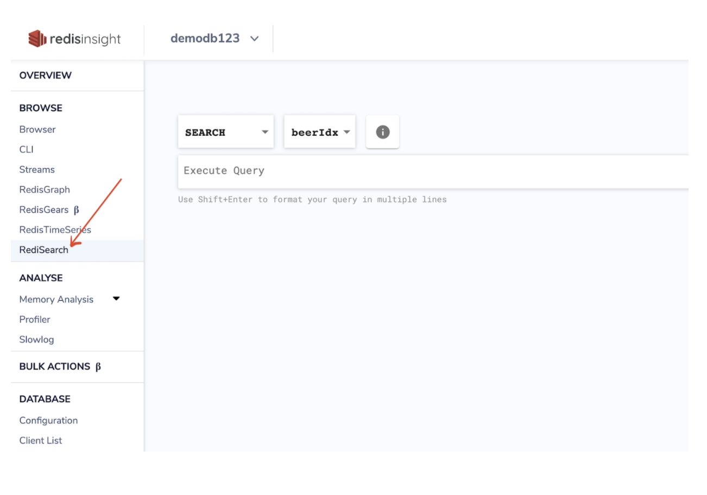
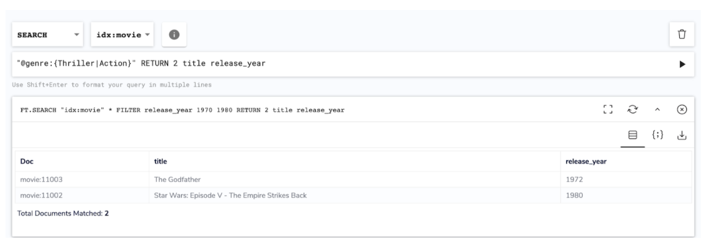

import Tabs from '@theme/Tabs';
import TabItem from '@theme/TabItem';
import useBaseUrl from '@docusaurus/useBaseUrl';
import RedisCard from '@site/src/theme/RedisCard';


A full-featured pure desktop GUI client, RedisInsight supports RediSearch. [RediSearch](https://oss.redislabs.com/redisearch/)  is a powerful indexing, querying, and full-text search engine for Redis. It is one of the most mature and feature-rich Redis modules.With RedisInsight, the below functionalities are possible


*   Multi-line for building queries
*   Added ability to submit query with ‘ctrl + enter’ in single line mode
*   Better handling of long index names in index selector dropdown
*   Fixed bug with pagination on queries with whitespace in the query string
*   Support Aggregation
*   Support Fuzzy logic
*   Simple and complex conditions
*   Sorting
*   Pagination
*   Counting

RediSearch allows you to quickly create indexes on datasets (Hashes), and uses an incremental indexing approach for rapid index creation and deletion. The indexes let you query your data at lightning speed, perform complex aggregations, and filter by properties, numeric ranges, and geographical distance.


### Step 1. Create Redis database

[Follow this link to create Redis database using Docker container ](/explore/redismod)that comes with RediSearch module enabled

## Step 2: Download RedisInsight


To install RedisInsight on your local system, you need to first download the software from Redis Labs website.

[Click this link ](https://redislabs.com/redis-enterprise/redis-insight/#insight-form) to access a form that allows you to select the operating system of your choice.


Run the installer. After the web server starts, open http://YOUR_HOST_IP:8001 and add a Redis database connection.

Select "Connect to a Redis database"


Enter the requested details, including Name, Host (endpoint), Port, and Password.  Then click “ADD REDIS DATABASE”.


We will look at 2 datasets - one is OpenBeerDB and other is Movie datasets.
Let us begin with OpenBeerDB sample dataset.


### Step 3. OpenBeerDB sample dataset

To demonstrate RediSearch, we will use OpenbeerDB dataset. The dataset is available publicly for general public under [openbeerdb.com](https://openbeerdb.com) 


Let us clone the repository to access the dataset:

```
$ git clone https://github.com/redis-developer/redis-datasets
cd redis-datasets/redisearch/openbeerdb
```


### Step 4. Installing prerequisite packages


```
$ brew install python3
$ pip3 install -r requirements.txt
```

### Step 5. Importing the data


```
$ python3 import.py --url redis://localhost:6379
Importing categories…
Importing styles...
Importing breweries...
Adding beer data to RediSearch..

```


### Step 6: Choose “RediSearch” under RedisInsight browser tool





Run the below query:


```
"@abv:[5 6]"
```


You can click on “{:} “ to get a JSON view as shown below:


You can download the data in CSV format.


#### Query: All beers with ABV higher than 5% but lower than 6%

The beers are added to the RediSearch index weighted by ABV. So by default, the results will be ordered by ABV highest to lowest. Both ABV and IBU are sortable, so you can order results by either of these fields using sortby in the query


#### Query: All beers with ABV higher than 5% but lower than 6% within the specified limits

```
"@abv:[5 6]" limit 0 100
```


#### Query: Find out Irish Ale and German Ale beers with ABV greater than 9%:


### Step 7. Using AGGREGATION

Aggregations are a way to process the results of a search query, group, sort and transform them - and extract analytic insights from them. Much like aggregation queries in other databases and search engines, they can be used to create analytics reports, or perform Faceted Search style queries.

For example, indexing a web-server's logs, we can create a report for unique users by hour, country or any other breakdown; or create different reports for errors, warnings, etc.


Let's run the aggregation query

```
FT.AGGREGATE "beerIdx" "@abv:[5 6]" limit 0 1060 GROUPBY 1 @breweryid
```


Let us look at Movie sample dataset too.


### Step 8. Create Redis database

[Follow this link to create Redis database using Docker container ](/explore/redismod)that comes with RediSearch module enabled

### Step 9. Install RedisInsight

[Follow this link](/explore/redisinsight/getting-started) to setup RedisInsight locally in your system


### Step 10. Movie Sample Database

In this project you will use a simple dataset describing movies, for now, all records are in English. You will learn more about other languages in another tutorial.

A movie is represented by the following attributes:

* **`movie_id`** : The unique ID of the movie, internal to this database
* **`title`** : The title of the movie.
* **`plot`** : A summary of the movie.
* **`genre`** : The genre of the movie, for now a movie will only have a single genre.
* **`release_year`** : The year the movie was released as a numerical value.
* **`rating`** : A numeric value representing the public's rating for this movie.
* **`votes`** : Number of votes.
* **`poster`** : Link to the movie poster.
* **`imdb_id`** : id of the movie in the [IMDB](https://imdb.com) database.


#### Key and Data structure

As a Redis developer, one of the first things to look when building your application is to define the structure of the key and data (data design/data modeling).

A common way of defining the keys in Redis is to use specific patterns in them. For example in this application where the database will probably deal with various business objects: movies, actors, theaters, users, ... we can use the following pattern:

* `business_object:key`

For example:
* `movie:001` for the movie with the id 001
* `user:001` the user with the id 001


and for the movies information you should use a Redis [Hash](https://redis.io/topics/data-types#hashes). 

A Redis Hash allows the application to structure all the movie attributes in individual fields; also RediSearch will index the fields based on the index definition.

### Step 11. Insert Movies


It is time now to add some data into your database, let's insert a few movies, using `redis-cli` or [Redis Insight](https://redislabs.com/redisinsight/).

Once you are connected to your Redis instance run the following commands:

```
> HSET movie:11002 title "Star Wars: Episode V - The Empire Strikes Back" plot "After the Rebels are brutally overpowered by the Empire on the ice planet Hoth, Luke Skywalker begins Jedi training with Yoda, while his friends are pursued by Darth Vader and a bounty hunter named Boba Fett all over the galaxy." release_year 1980 genre "Action" rating 8.7 votes 1127635 imdb_id tt0080684


> HSET movie:11003 title "The Godfather" plot "The aging patriarch of an organized crime dynasty transfers control of his clandestine empire to his reluctant son." release_year 1972 genre "Drama" rating 9.2 votes 1563839 imdb_id tt0068646


> HSET movie:11004 title "Heat" plot "A group of professional bank robbers start to feel the heat from police when they unknowingly leave a clue at their latest heist." release_year 1995 genre "Thriller" rating 8.2 votes 559490 imdb_id tt0113277


> HSET "movie:11005" title "Star Wars: Episode VI - Return of the Jedi" genre "Action" votes 906260 rating 8.3 release_year 1983  plot "The Rebels dispatch to Endor to destroy the second Empire's Death Star." ibmdb_id "tt0086190"


```


Now it is possible to get information from the hash using the movie ID. For example if you want to get the title, and rating execute the following command:

```
>> HMGET movie:11002 title rating

1) "Star Wars: Episode V - The Empire Strikes Back"
2) "8.7"


```

And you can increment the rating of this movie using:


```
HINCRBYFLOAT movie:11002 rating 0.1
```

But how do you get a movie or list of movies by year of release, rating or title?

One option, would be to read all the movies, check all fields and then return only matching movies; no need to say that this is a really bad idea.

Nevertheless this is where Redis developers often create custom secondary indexes using SET/SORTED SET structures that point back to the movie hash. This needs some heavy design and implementation.

This is where the RediSearch module can help, and why it was created.


### Step 12. RediSearch & Indexing


RediSearch greatly simplifies this by offering a simple and automatic way to create secondary indices on Redis Hashes. (more datastructure will eventually come)


Using RediSearch if you want to query on a field, you must first index that field. Let's start by indexing the following fields for our movies:

* Title
* Release Year
* Rating
* Genre

When creating a index you define:

* which data you want to index: all *hashes* with a key starting with `movies` 
* which fields in the hashes you want to index using a Schema definition.

> ***Warning: Do not index all fields***
>
> Indexes take space in memory, and must be updated when the primary data is updated. So create the index carefully and keep the definition up to date with your needs.

### Step 13. Create the Index


```
>> FT.CREATE idx:movie ON hash PREFIX 1 "movie:" SCHEMA title TEXT SORTABLE release_year NUMERIC SORTABLE rating NUMERIC SORTABLE genre TAG SORTABLE

"OK"
```


The database contains a few movies, and an index, it is now possible to execute some queries.

#### Query: All the movies that contains the string "`war`"


#### Query: Limit the list of fields returned by the query using the RETURN parameter


The FT.SEARCH commands returns a list of results starting with the number of results, then the list of elements (keys & fields).

As you can see the movie *Star Wars: Episode V - The Empire Strikes Back* is found, even though you used only the word “war” to match “Wars” in the title. This is because the title has been indexed as text, so the field is [tokenized](https://oss.redislabs.com/redisearch/Escaping/) and [stemmed](https://oss.redislabs.com/redisearch/Stemming/).

Later when looking at the query syntax in more detail you will learn more about the search capabilities.

It is also possible to limit the list of fields returned by the query using the `RETURN` parameter, let's run the same query, and return only the title and release_year:


#### Query: All the movies that contains the string "war but NOT the jedi one"

Adding the string `-jedi` (minus) will ask the query engine not to return values that contain `jedi`.


```
_"war -jedi" RETURN 2 title release_year_
```


### Step 14: Fuzzy Search

All the movies that contains the string "gdfather using fuzzy search"


#### Query: All Thriller movies


```
@genre:{Thriller}" RETURN 2 title release_year
```


#### Query: All Thriller or Action movies

```
@genre:{Thriller|Action}" RETURN 2 title release_year
````


#### Query : All the movies released between 1970 and 1980 (included)

The FT.SEARCH syntax has two ways to query numeric fields:


*   using the FILTER parameter

* FILTER release_year 1970 1980 RETURN 2 title release_year





### Step 15. AGGREGATION

#### Query: Number of movies by year


```
"*" GROUPBY 1 @release_year REDUCE COUNT 0 AS nb_of_movies

1
```


#### Query: Number of movies by year from the most recent to the oldest


```
"*" GROUPBY 1 @release_year REDUCE COUNT 0 AS nb_of_movies SORTBY 2 @release_year DESC

1
```


### Additional Links

- [RediSearch Project](https://oss.redislabs.com/redisearch/)
- [RediSearch Tutorial](/howtos/redisearch)
- [Getting Started with Movie Database](/howtos/moviesdatabase/getting-started)
- [Slowlog Configuration using RedisInsight](/explore/redisinsight/slowlog)
- [Memory Analysis using RedisInsight](/explore/redisinsight/memoryanalyzer)
- [Visualize Redis database keys using RedisInsight Browser Tool](/explore/redisinsight/browser)
- [Using Redis Streams with RedisInsight](/explore/redisinsight/streams)

##

<div>
<a href="https://launchpad.redis.com" target="_blank" rel="noopener" className="link"> </a>
</div>
