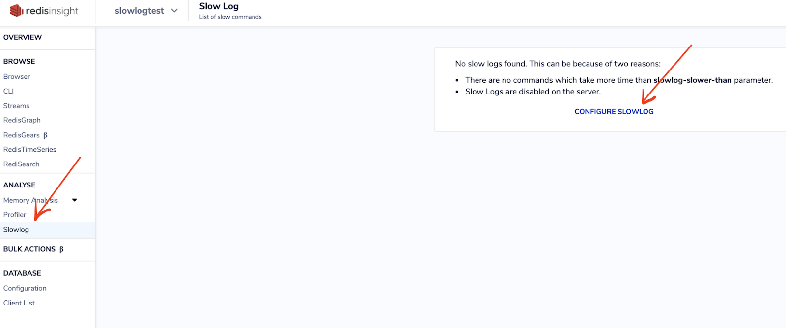
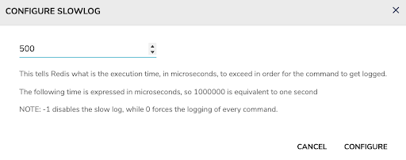
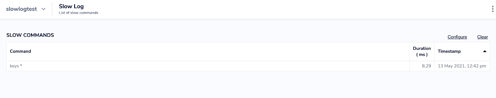
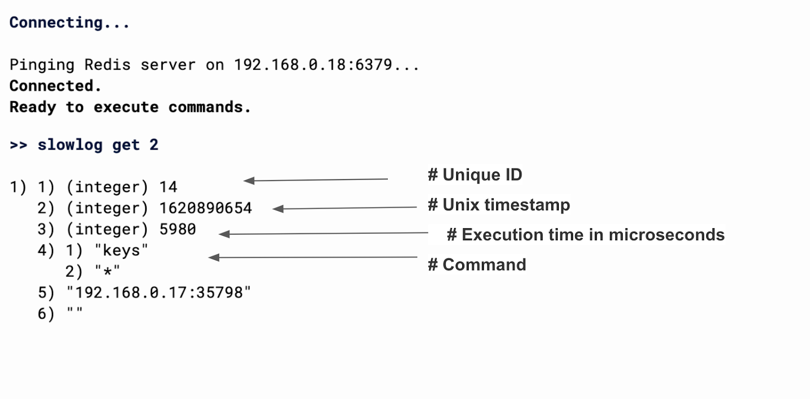

import Tabs from '@theme/Tabs';
import TabItem from '@theme/TabItem';
import useBaseUrl from '@docusaurus/useBaseUrl';
import RedisCard from '@site/src/theme/RedisCard';


RedisInsight, a free GUI for Redis, allows you to identify and troubleshoot bottlenecks with the Slowlog analysis tool. If you are experiencing high latency and high CPU usage with Redis operations and are looking for a tool for debugging and tracing your Redis database, RedisInsight Slow Log is a perfect tool for you.

Redis Slow Log is highly effective at showing the actual processing time of each slow command. The Redis slowlog is a log of all commands which exceed a specified run time. Please note that the network latency is not included in the measurement, just the time taken to actually execute the command. Redis Slow Log is a list of slow operations for your Redis instance.

Follow the below steps to see how Slowlog is leveraged to troubleshoot performance issues.

## Step 1. Create a Redis database

Follow [https://developer.redislabs.com/create](https://developer.redislabs.com/create) to install and create Redis database

## Step 2: Install RedisInsight

[Follow this link](https://developer.redislabs.com/explore/redisinsight) to install RedisInsight

## Step 3. Connect to the database using RedisInsight GUI


## Step 4: Click “Slowlog” and then “Configure Slowlog”





## Step 5. Configure Slowlog

There are two configurations related to slow log query - 


- slowlog-log-slower-than: Used to set the evaluation time of slow query, that is to say, commands that exceed this configuration item will be treated as slow operations and recorded in the slow query log. Its execution unit is microseconds (1 second equals 1000000 microseconds);
- slowlog-max-len: Used to configure the maximum number of records in the slow query log.

Please note that a negative number disables the slow log, while a value of zero forces the logging of every command. Slowlog-max-len is the length of the slow log. The minimum value is zero. When a new command is logged and the slow log is already at its maximum length, the oldest one is removed from the queue of logged commands in order to make space. The configuration can be done by editing redis.conf or while the server is running using the CONFIG GET and CONFIG SET commands.

Slowlog will log the last X amount queries which took more time than Y microseconds to run. You can set this either in redis.conf or at runtime using CONFIG command


 ```bash
  CONFIG SET slowlog-log-slower-than 500
  CONFIG SET slowlog-max-len 50
 ```




## Step 6. Prepare a script to simulate the slowlog

To see slowlog in action, let us pick up a large dataset. Create a file called importcities.py and add the below content:


 ```python
  import csv
  import config
  from redis import Redis

  # Database Connection
  host = config.REDIS_CFG["host"]
  port = config.REDIS_CFG["port"]
  pwd = config.REDIS_CFG["password"]
  redis = Redis(host=host, port=port, password=pwd, charset="utf-8", decode_responses=True)

  # Import Cities
  print("Importing ...")

  count = 0

  with open("data/worldcities.csv", 'r') as cities:
     reader = csv.DictReader(cities)
     for row in reader:
         id = row["id"]
         name = row["city_ascii"]
         lng = row["lng"]
         lat = row["lat"]
         country = row["country"]
         pop = row["population"]

         print("id = {}, name = {}, lng = {}, lat = {}".format(id, name, lng, lat))
         count += 1

         redis.hmset("ct:{}".format(id), { "_id" : id, "name" : name, "country" : country, "population" : pop })
         redis.geoadd("idx:cities", lng, lat, id)
         redis.hset("idx:city_by_name", name, id)

 ```


Create a file called config.py as shown below:


 ```python
  REDIS_CFG = {
         "host" : "localhost",
         "port" : 6379,
         "password" : ""
  }

 ```


Ensure that you provide the right host and port details.

Execute the script:


 ```bash
  python3 importcities.py
 ```


You will see the below results:


 ```bash
  id = 762, name = Labatt Ontario Breweries, lng = -81.2467, lat = 42.9778
  id = 915, name = Ninkasi Brewing, lng = -123.11, lat = 44.0569
  id = 930, name = Oaken Barrel Brewing, lng = -86.0901, lat = 39.615
  Import of 16790 records completed

 ```


If you want to simulate slow logs, then consider using KEYS command. It is always recommended NOT TO USE [KEYS](https://redis.io/commands/keys) in your regular application code. If you're looking for a way to find keys in a subset of your keyspace, consider using [SCAN](https://redis.io/commands/scan) or [sets](https://redis.io/topics/data-types#sets).

The KEYS command may ruin performance when it is executed against large databases

Let us try to run KEYS * in RedisInsight CLI and see if it generates slow log as shown below:





Run it one more time and you will notice below:


Try decreasing the execution time(50 ms), and you will notice that the below run query also gets logged into the slowlog 


## Configuring the execution time 


Each entry in the slowlog contains four fields: a slowlog entry ID, the Unix timestamp of when the command was run, the execution time in microseconds, and an array with the command itself, along with any arguments. See the example output below:

In order to retrieve the slow log queries, you have to use SLOWLOG GET X. Where X is the number of slow queries you want to retrieve.





As shown above, the result displays a unique id, timestamp, time taken to execute the query in microseconds, and the actual command + parameter executed. It is important to note that  the Slow log is transient; there's no persistence for it so in the case of failover, the slow log is lost. If you are looking to rely on a persistent slow log, you'll be wanting to reconsider your design choices

Please note: If I choose “0” it forces the logging of every command while “1” disabled the slow log.


:::Important:::

In a clustered database, each node can have different values for slow log.  You will need to use the configuration tool in order to configure slow log for clustered databases.


## Additional Links

- [Slowlog Configuration using RedisInsight](/explore/redisinsight/slowlog)
- [Explore Redis keys using RedisInsight browser tool](/explore/redisinsight/browser)
- [Memory Analysis using RedisInsight](/explore/redisinsight/memoryanalyzer)

